# C/C++数据结构

## 第一章：线性表

### 1.1 顺序表

**什么是顺序表？**

**通俗理解**：
顺序表就像一排**连续的车位**，每个车位都有编号（0,1,2,3...），你可以把车（数据）停进去。

**特点**：

- 车位是连续的，挨在一起的
- 知道编号就能直接找到那个车位（比如我说"第3个车位"，你直接走过去）
- 但是车位总数是固定的（比如最多停100辆车）

------

**1. 头文件和宏定义**

```c
#include <stdio.h>   // 标准输入输出库，用于printf等函数
#include <stdlib.h>  // 标准库，虽然这个程序没用到，但通常保留

#define MAXSIZE 100  // 定义顺序表的最大容量为100
```

- `#include`：预处理指令，意思是"包含某个头文件"
- `<stdio.h>`：Standard Input Output Header，提供输入输出功能
- `#define`：定义常量，MAXSIZE就代表100，以后想改容量只改这里就行

**2. 结构体定义**

```c
typedef struct {
    int data[MAXSIZE];  // 车位数组，每个车位能停一个整数
    int length;         // 当前停了多少辆车
} SeqList;
```

- `typedef`：类型定义关键字
- `struct`：结构体，可以把多个变量打包成一个新类型
- `SeqList`：新类型的名字，以后可以用`SeqList L`来定义变量
- `data[MAXSIZE]`：整型数组，真正存储数据的地方
- `length`：记录当前有多少个元素，初始为0

**内存示意图**：

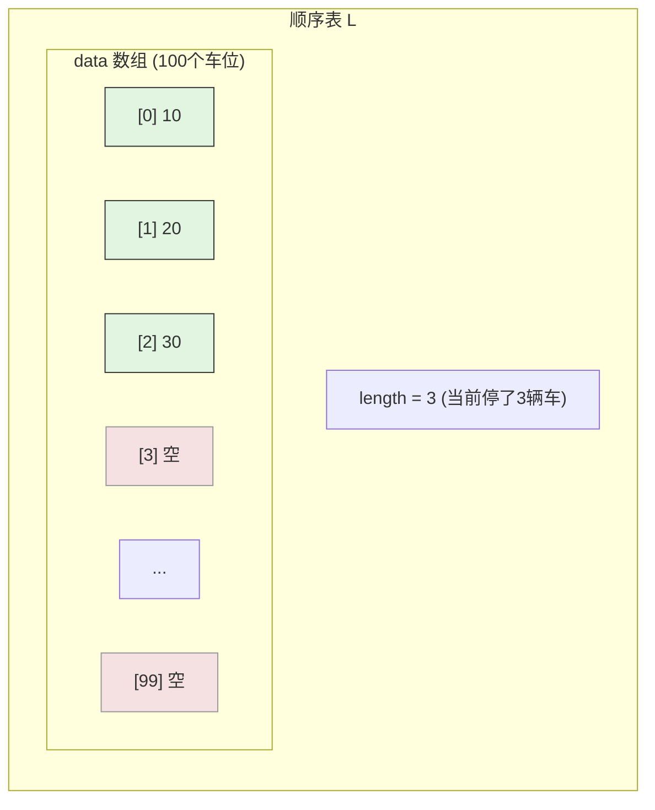
```mermaid
graph TD
    subgraph SeqList L ["顺序表 L"]
        direction TB
        subgraph data_array ["data 数组 (100个车位)"]
            direction LR
            D0["[0] 10"]
            D1["[1] 20"]
            D2["[2] 30"]
            D3["[3] 空"]
            Ddots["..."]
            D99["[99] 空"]
        end
        length_info["length = 3 (当前停了3辆车)"]
    end
    
    style D0 fill:#e1f5e1,stroke:#333
    style D1 fill:#e1f5e1,stroke:#333
    style D2 fill:#e1f5e1,stroke:#333
    style D3 fill:#f5e1e1,stroke:#999
    style D99 fill:#f5e1e1,stroke:#999
```

**3. 初始化函数**

```c
void initSeqList(SeqList *L) {
    L->length = 0;
    printf("顺序表初始化成功！\n");
}
```

- `void`：函数没有返回值
- `initSeqList`：函数名，Initialize Sequence List的缩写
- `SeqList *L`：参数是指针类型，`*`表示这是一个地址
- `L->length`：箭头运算符，通过指针访问结构体成员
- 为什么要用指针？因为要在函数内部修改L的值，必须传地址

**通俗理解**：就像买了个100格子的收纳盒，现在一个东西都没放，所以长度是0。

**为什么用指针？**
因为要在函数内部修改 `length` 的值，必须传地址。就像你要让别人帮你打扫你家，你得给他你家钥匙（地址）。

**4. 辅助判断函数**

**判断是否为空**

```c
int isEmpty(SeqList *L) {
    return L->length == 0;
}
```

- `int`：返回整型，1表示真（空），0表示假（非空）
- `L->length == 0`：比较运算符，相等返回1，不等返回0

**判断是否已满**

```c
int isFull(SeqList *L) {
    return L->length == MAXSIZE;
}
```

- 长度等于最大容量100时，说明满了，不能再加元素。

**5. 获取长度**

```c
int getLength(SeqList *L) {
    return L->length;
}
```

- 返回长度值。

**6. 查找函数**

**按位置查找（位置从1开始）**

```c
int getElem(SeqList *L, int pos) {
    if (pos < 1 || pos > L->length) {
        printf("查找位置无效！\n");
        return -1;
    }
    return L->data[pos - 1];
}
```

- `pos`：位置，比如第3个元素，pos=3
- `if (pos < 1 || pos > L->length)`：检查位置是否合法
  - `pos < 1`：位置不能小于1
  - `pos > L->length`：位置不能超过实际长度
- `return -1`：位置无效时返回-1作为错误标志
- `return L->data[pos - 1]`：数组下标从0开始，所以要减1

**图示**：

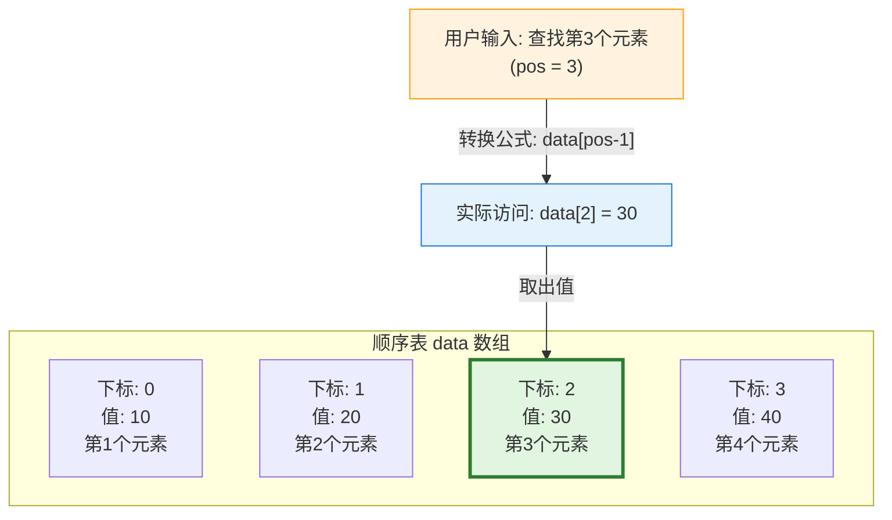
```mermaid
graph TD
    subgraph 顺序表数组["顺序表 data 数组"]
        direction LR
        A["下标: 0<br>值: 10<br>第1个元素"]
        B["下标: 1<br>值: 20<br>第2个元素"]
        C["下标: 2<br>值: 30<br>第3个元素"]
        D["下标: 3<br>值: 40<br>第4个元素"]
    end
    
    E["用户输入: 查找第3个元素<br>(pos = 3)"]
    
    F["实际访问: data[2] = 30"]
    
    E -->|"转换公式: data[pos-1]"| F
    F -->|"取出值"| C
    
    style C fill:#e1f5e1,stroke:#2e7d32,stroke-width:3px
    style E fill:#fff3e0,stroke:#ff9800
    style F fill:#e3f2fd,stroke:#1976d2
```

**边界检查**：

- `pos < 1`：不能找第0个或负数位置
- `pos > L->length`：不能找超出实际数量的位置（比如只有3辆车，不能找第5辆）

**按值查找**

```c
int locateElem(SeqList *L, int value) {
    for (int i = 0; i < L->length; i++) {
        if (L->data[i] == value) {
            return i + 1;  // 返回位置（从1开始）
        }
    }
    return 0;  // 未找到返回0
}
```

- `value`：要查找的值
- `for`循环：遍历整个数组
- `if (L->data[i] == value)`：找到匹配的值
- `return i + 1`：返回位置（+1是因为位置从1开始）
- `return 0`：循环结束都没找到，返回0

**举例**：找20

```text
data[0]=10 → 10==20? 否
data[1]=20 → 20==20? 是 → 返回 1+1=2，表示第2个位置
```

**7. 插入函数**

```c
void insertElem(SeqList *L, int pos, int value) {
    // 检查1：插入位置是否有效（1到length+1之间）
    if (pos < 1 || pos > L->length + 1) {
        printf("插入位置无效！\n");
        return;
    }
    
    // 检查2：顺序表是否已满
    if (isFull(L)) {
        printf("顺序表已满，无法插入！\n");
        return;
    }
    
    // 移动元素（从后往前移）
    for (int i = L->length; i >= pos; i--) {
        L->data[i] = L->data[i - 1];
    }
    
    // 插入新元素
    L->data[pos - 1] = value;
    L->length++;
    
    printf("成功在位置%d插入元素%d\n", pos, value);
}
```

**第1步：检查位置合法性**

- `pos > L->length + 1`：比如当前有5个元素，可以在第6个位置插入（末尾），但不能在第7个位置

**第2步：检查是否已满**

- 如果满了就报错，不能再插

**第3步：移动元素（最关键的一步）**

```text
例子：原数据 [10, 20, 30, 40, 50]，length=5
要在pos=3插入25

移动前：
下标:  0    1    2    3    4
data: 10   20   30   40   50

移动过程（从后往前）：
i=5: data[5]=data[4]=50
i=4: data[4]=data[3]=40  
i=3: data[3]=data[2]=30

移动后：
下标:  0    1    2    3    4    5
data: 10   20   30   30   40   50
[2]这个位置空了
           
然后：data[2]=25（因为pos=3，下标=pos-1=2）

最终：[10, 20, 25, 30, 40, 50]
```

**为什么从后往前移动？**

- 如果从前往后移动，前面的数据会覆盖后面的数据
- 就像排队插队，后面的人要一个一个往后退

**8. 末尾添加**

```c
void appendElem(SeqList *L, int value) {
    insertElem(L, L->length + 1, value);
}
```

- 直接在最后一个位置后面插入
- 比如当前长度是5，就在第6个位置插入
- 这样新元素就在末尾了

**9. 删除函数**

**按位置删除**

```c
void deleteByPos(SeqList *L, int pos) {
    if (pos < 1 || pos > L->length) {
        printf("删除位置无效！\n");
        return;
    }
    
    int deletedValue = L->data[pos - 1];
    
    // 移动元素（从前往后移）
    for (int i = pos; i < L->length; i++) {
        L->data[i - 1] = L->data[i];
    }
    
    L->length--;
    printf("成功删除位置%d的元素%d\n", pos, deletedValue);
}
```

**图解：**

```text
原数据：[10, 20, 30, 40, 50]，删除pos=3的元素

删除前：
下标:  0    1    2    3    4
data: 10   20   30   40   50
要删除[3]

移动过程（从前往后）：
i=3: data[2]=data[3]=40
i=4: data[3]=data[4]=50

移动后：
下标:  0    1    2    3    4
data: 10   20   40   50   50
(最后这个还留着，但length减1了)

length从5变成4，所以实际数据是：[10, 20, 40, 50]
最后一个50不会被访问到
```

**按值删除（只删第一个）**

```c
void deleteByValue(SeqList *L, int value) {
    int pos = locateElem(L, value);  // 先找位置
    if (pos != 0) {
        deleteByPos(L, pos);  // 找到就删除
    } else {
        printf("未找到值为%d的元素\n", value);
    }
}
```

- 先查找，再删除，组合使用已有函数。

**删除所有匹配的值**

```c
void deleteAllByValue(SeqList *L, int value) {
    int count = 0;
    int i = 0;
    while (i < L->length) {
        if (L->data[i] == value) {
            // 移动后续元素
            for (int j = i; j < L->length - 1; j++) {
                L->data[j] = L->data[j + 1];
            }
            L->length--;
            count++;
            // 注意：这里i不增加，因为新的元素移到了当前位置
        } else {
            i++;
        }
    }
    
    if (count > 0) {
        printf("成功删除%d个值为%d的元素\n", count, value);
    } else {
        printf("未找到值为%d的元素\n", value);
    }
}
```

```txt
例子：数据 [38, 25, 38, 42]，删除所有38

i=0: data[0]=38 → 删除
     删除后：[25, 38, 42]，length=3
     i保持0，检查新的data[0]=25

i=0: data[0]=25 → 不是38，i++，i=1

i=1: data[1]=38 → 删除
     删除后：[25, 42]，length=2
     i保持1，但length=2，循环结束

总共删除2个38
```

**10. 打印函数**

```c
void printSeqList(SeqList *L) {
    if (isEmpty(L)) {
        printf("顺序表为空\n");
        return;
    }
    
    printf("顺序表内容：");
    for (int i = 0; i < L->length; i++) {
        printf("%d ", L->data[i]);
    }
    printf("(长度：%d，最大容量：%d)\n", L->length, MAXSIZE);
}
```

- 先判断是否为空
- 用循环遍历前length个元素（不是MAXSIZE个）
- 打印所有元素、长度、容量

**11. 主函数演示**

```c
int main() {
    SeqList list;  // 定义顺序表变量（在栈上分配内存）
    
    // 1. 初始化
    initSeqList(&list);  // &取地址，传指针
    
    // 2. 创建
    int arr[] = {12, 25, 38, 42, 56, 38, 79, 38};
    int n = sizeof(arr) / sizeof(arr[0]);  // 计算数组长度
    createSeqList(&list, arr, n);
    
    // 3. 插入
    insertElem(&list, 3, 30);  // 在第3个位置插30
    
    // 4. 打印
    printSeqList(&list);
    
    return 0;  // 程序正常结束
}
```

- `&list`：取地址，传递给需要修改list的函数
- `sizeof(arr)/sizeof(arr[0])`：计算数组元素个数的标准写法

---

### 1.2 单链表

**什么是链表？**

**通俗理解**：
链表就像**寻宝游戏**，每个宝藏（结点）都藏着一个线索（指针），告诉你下一个宝藏在哪里。宝藏可以放在任何地方（不连续的内存），通过线索串起来。

**特点**：

- 不连续：每个结点可以放在内存的任何位置
- 通过指针连接：每个结点知道下一个结点在哪
- 动态：需要多少就创建多少，不会浪费空间

---

**1. 结构体定义**

```c
#include <stdio.h>
#include <stdlib.h>

// 结点结构体
typedef struct Node {
    int data;           // 数据域
    struct Node* next;  // 指针域
} Node;

// 链表结构体
typedef struct {
    Node* head;   // 头指针，指向头结点（头结点不存数据）
    int length;   // 链表长度（不包含头结点）
} LinkedList;
```

**内存示意图**：

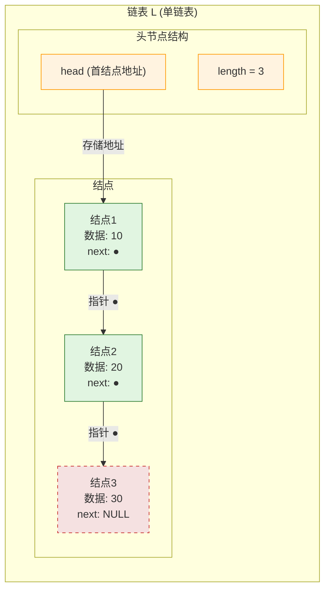
```mermaid
graph LR
    subgraph LinkedList L ["链表 L (单链表)"]
        direction TB
        
        subgraph header ["头节点结构"]
            direction LR
            H1["head (首结点地址)"]
            H2["length = 3"]
        end
        
        subgraph nodes ["结点"]
            direction LR
            N1["结点1<br>数据: 10<br>next: ●"]
            N2["结点2<br>数据: 20<br>next: ●"]
            N3["结点3<br>数据: 30<br>next: NULL"]
        end
    end

    H1 -- "存储地址" --> N1
    N1 -- "指针 ●" --> N2
    N2 -- "指针 ●" --> N3
    
    style H1 fill:#fff3e0,stroke:#ff9800
    style H2 fill:#fff3e0,stroke:#ff9800
    style N1 fill:#e1f5e1,stroke:#2e7d32
    style N2 fill:#e1f5e1,stroke:#2e7d32
    style N3 fill:#e1f5e1,stroke:#2e7d32,stroke-dasharray: 5 5
    style N3 fill:#f5e1e1,stroke:#c62828
```

**2. 初始化函数**

```c
void initLinkedList(LinkedList* L) {
    // 创建头结点（不存数据）
    L->head = (Node*)malloc(sizeof(Node));
    L->head->next = NULL;  // 头结点的next指向NULL
    L->length = 0;
    printf("链表初始化成功（带头结点）！\n");
}
```

- 初始化时**一定要创建头结点**
- 头结点的 `data` 不用（可以随便放个值，或者不管它）
- 头结点的 `next = NULL`，表示后面还没有数据结点
- `length = 0`，因为还没有数据结点

**3. 辅助函数**

```c
int isEmpty(LinkedList* L) {
    return L->head->next == NULL;
}// 判断是否为空

int getLength(LinkedList* L) {
    return L->length;
}// 获取长度
```

和顺序表一样，不多解释。

**4. 创建结点函数**

```c
// 创建一个新结点，并赋值
Node* createNode(int value) {
    Node* newNode = (Node*)malloc(sizeof(Node));  // 分配内存
    newNode->data = value;                            // 存入数据
    newNode->next = NULL;                         // 指针先指向NULL
    return newNode;                               // 返回新结点的地址
}
```

- 这个函数专门负责"生产"新结点
- 传入一个整数 `a`，创建一个结点，把 `a` 放进去
- 新结点的 `next` 先指向 `NULL`（还没连接）
- 返回这个新结点的地址（指针）
- 其他函数要用新结点时，直接调用这个函数就行了

**5. 尾插法**

```c
void appendElem(LinkedList* L, int value) {
    Node* newNode = createNode(value);  // 直接调用创建结点函数
    
    // 找到最后一个结点（从头结点开始找）
    Node* p = L->head;
    while (p->next != NULL) {
        p = p->next;
    }
    p->next = newNode;
    L->length++;
    printf("成功在末尾添加元素%d\n", value);
}
```

**图解**：

```text
原链表：head→[头]→[10]→[20]→[30]→NULL

添加40：

步骤1：创建新结点 [40]→NULL

步骤2：找最后一个结点
p=head，指向[10]
p->next不是NULL，p=p->next，指向[20]
p->next不是NULL，p=p->next，指向[30]
p->next是NULL，停止，p就是最后一个结点

步骤3：连接
p->next = newNode → [30]→[40]

步骤4：结果
head→[头]→[10]→[20]→[30]→[40]→NULL
```

**为什么要遍历到末尾？**

- 因为没有记录尾指针，只能从头开始找
- 就像寻宝，要从头开始一个一个找，直到找到最后一个

**6. 头插法**

```c
void prependElem(LinkedList* L, int value) {
    Node* newNode = createNode(value);  // 直接调用创建结点函数
    newNode->next = L->head->next;      // 新结点指向原来的第一个数据结点
    L->head->next = newNode;            // 头结点指向新结点
    L->length++;
    printf("成功在头部添加元素%d\n", value);
}
```

**图解**：

```text
插入前：head→[头]→[10]→[20]→NULL

插入5：
步骤1：newNode->next = head->next → [5]→[10]
步骤2：head->next = newNode → [头]→[5]

结果：head→[头]→[5]→[10]→[20]→NULL
```

**头插法的特点**：

- 不需要遍历，速度很快（O(1)）
- 新元素总是在最前面

**7. 按位置插入**

```c
void insertElem(LinkedList* L, int pos, int value) {
    if (pos < 1 || pos > L->length + 1) {
        printf("插入位置无效！\n");
        return;
    }
    
    Node* newNode = createNode(value);  // 直接调用创建结点函数
    
    // 找到第pos-1个结点（从头结点开始找）
    Node* p = L->head;
    for (int i = 1; i < pos; i++) {
        p = p->next;
    }
    // 此时p就是要插入位置的前一个结点
    newNode->next = p->next;
    p->next = newNode;
    L->length++;
    printf("成功在位置%d插入元素%d\n", pos, value);
}
```

**图解**（在位置3插入25）：

```text
插入前：head→[头]→[10]→[20]→[30]→[40]→NULL

找到前驱（pos=3，找第2个结点）：
p = [20]

步骤：
newNode->next = p->next → [25]→[30]
p->next = newNode → [20]→[25]

结果：head→[头]→[10]→[20]→[25]→[30]→[40]→NULL
```

**8. 按位置删除**

```c
void deleteByPos(LinkedList* L, int pos) {
    if (pos < 1 || pos > L->length) {
        printf("删除位置无效！\n");
        return;
    }
    
    // 找到第pos-1个结点（从头结点开始找）
    Node* p = L->head;
    for (int i = 1; i < pos; i++) {
        p = p->next;
    }
    
    Node* temp = p->next;  // 要删除的结点
    p->next = temp->next;
    
    int deletedValue = temp->data;
    free(temp);  // 释放内存
    L->length--;
    printf("成功删除位置%d的元素%d\n", pos, deletedValue);
}
```

**图解**（删除位置3）：

```text
删除前：head→[头]→[10]→[20]→[25]→[30]→NULL

找到前驱（pos=3，找第2个结点）：
p = [20]

temp = p->next → temp指向[25]
p->next = temp->next → [20]→[30]
free(temp) 释放[25]

结果：head→[头]→[10]→[20]→[30]→NULL
```

**9. 按值删除**

```c
void deleteByValue(LinkedList* L, int value) {
    if (isEmpty(L)) {
        printf("链表为空\n");
        return;
    }
    
    Node* p = L->head;      // 从头结点开始
    Node* q = p->next;       // 第一个数据结点
    
    while (q != NULL && q->data != value) {
        p = q;
        q = q->next;
    }
    
    if (q == NULL) {
        printf("未找到值为%d的元素\n", value);
        return;
    }
    
    p->next = q->next;
    free(p);
    L->length--;
    printf("成功删除值为%d的元素\n", value);
}
```

- 删除时需要让前一个结点跳过被删结点，指向被删结点的下一个

**图解**（删除20）：

```text
查找过程：
prev=NULL, p=[10] → 10≠20，继续
prev=[10], p=[20] → 20==20，找到

删除：
prev不为NULL，所以 prev->next = p->next
[10]→[30]

结果：head→[头]→[10]→[30]→[40]→NULL
```

**10. 按位置查找**

```c
int getElem(LinkedList* L, int pos) {
    if (pos < 1 || pos > L->length) {
        printf("查找位置无效！\n");
        return -1;
    }
    
    Node* p = L->head;   // 第一个数据结点
    for (int i = 1; i < pos; i++) {
        p = p->next;
    }
    return p->data;
}
```

- 从head开始，走 `pos-1` 步
- 比如找第3个：走2步，从第1个到第2个到第3个

**11. 按值查找**

```c
int locateElem(LinkedList* L, int value) {
    Node* p = L->head;
    int pos = 1;
    
    while (p != NULL && p->data != value) {
        p = p->next;
        pos++;
    }
    
    if (p == NULL) {
        return 0;
    }
    return pos;
}
```

- 一个一个找，同时记录位置
- 找到了返回位置
- 走到头都没找到返回0

**12. 打印链表**

```c
void printLinkedList(LinkedList* L) {
    if (isEmpty(L)) {
        printf("链表为空\n");
        return;
    }
    
    printf("链表内容：");
    Node* p = L->head->next;
    while (p != NULL) {
        printf("%d -> ", p->data);
        p = p->next;
    }
    printf("NULL\n");
    printf("链表长度：%d\n", L->length);
}
```

- 从head开始，一个一个往后走
- 打印每个结点的数据
- 用 `->` 表示指向关系

**13. 清空链表**

```c
void destroyLinkedList(LinkedList* L) {
    clearLinkedList(L);     // 先清空数据结点
    free(L->head);          // 释放头结点
    L->head = NULL;
    printf("链表已销毁\n");
}
```

**为什么必须释放内存？**

- 链表的内存是动态分配的（malloc）
- 不用时要还给系统，否则会造成"内存泄漏"

---

## 第二章：栈和队列

**什么是栈？**

**通俗理解**：
栈就像**一摞盘子**，你只能：

- 把新盘子放在**最上面**（压栈，Push）
- 从**最上面**拿走盘子（出栈，Pop）

**特点**：**后进先出**（LIFO：Last In First Out）

---

### 2.1 顺序栈

**1. 结构体定义**

```c
#include <stdio.h>
#include <stdlib.h>

#define MAXSIZE 100  // 栈的最大容量

// 顺序栈结构体
typedef struct {
    int data[MAXSIZE];  // 存储数据的数组
    int top;            // 栈顶指针（指向栈顶元素的位置）
} SeqStack;
```

- `data[MAXSIZE]`：和顺序表一样，数组存放数据
- `top`：栈顶指针，表示当前栈顶元素在数组中的下标
- 约定：`top = -1` 表示空栈

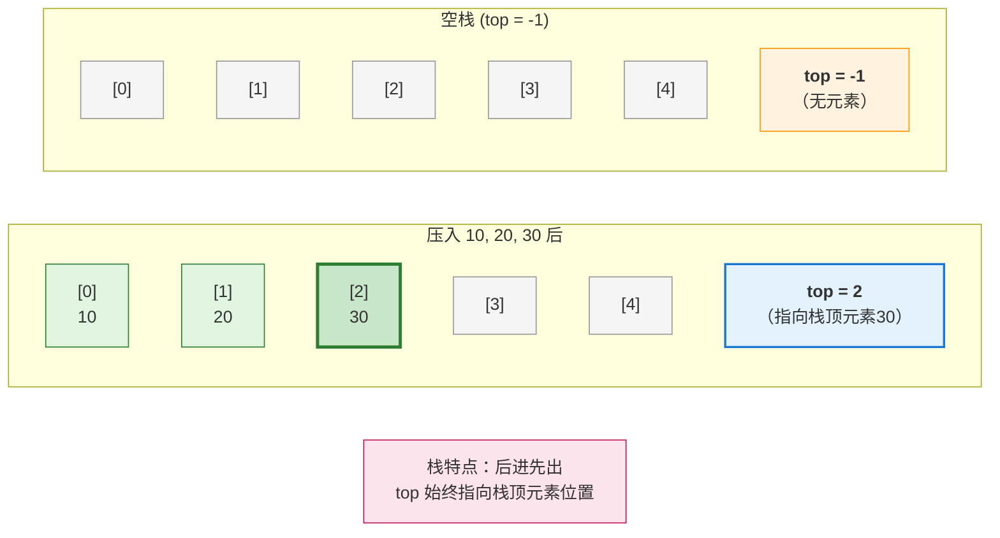
```mermaid
graph LR
	subgraph 压栈后状态 ["压入 10, 20, 30 后"]
        direction TB
        B1["[0]<br>10"]
        B2["[1]<br>20"]
        B3["[2]<br>30"]
        B4["[3]<br>"]
        B5["[4]<br>"]
        B_top["<b>top = 2</b><br>（指向栈顶元素30）"]
    end

    subgraph 空栈状态 ["空栈 (top = -1)"]
        direction TB
        A1["[0]"]
        A2["[1]"]
        A3["[2]"]
        A4["[3]"]
        A5["[4]"]
        A_null["<b>top = -1</b><br>（无元素）"]
    end

    style A1 fill:#f5f5f5,stroke:#999
    style A2 fill:#f5f5f5,stroke:#999
    style A3 fill:#f5f5f5,stroke:#999
    style A4 fill:#f5f5f5,stroke:#999
    style A5 fill:#f5f5f5,stroke:#999
    style A_null fill:#fff3e0,stroke:#ff9800
    
    style B1 fill:#e1f5e1,stroke:#2e7d32
    style B2 fill:#e1f5e1,stroke:#2e7d32
    style B3 fill:#c8e6c9,stroke:#2e7d32,stroke-width:3px
    style B4 fill:#f5f5f5,stroke:#999
    style B5 fill:#f5f5f5,stroke:#999
    style B_top fill:#e3f2fd,stroke:#1976d2,stroke-width:2px

    Note1["栈特点：后进先出<br>top 始终指向栈顶元素位置"]
    style Note1 fill:#fce4ec,stroke:#c2185b
```

**2. 初始化栈**

```c
void initStack(SeqStack* S) {
    S->top = -1;  // 栈顶指针设为-1，表示空栈
    printf("顺序栈初始化成功！\n");
}
```

**为什么 top = -1？**

- 数组下标从0开始
- -1 表示"没有元素"，是个无效下标
- 压入第一个元素时，`top` 变成 0

**3. 判断栈空/栈满**

```c
// 判断栈是否为空
int isEmpty(SeqStack* S) {
    return S->top == -1;
}

// 判断栈是否已满
int isFull(SeqStack* S) {
    return S->top == MAXSIZE - 1;  // 因为下标从0开始，最大是99
}
```

**4. 获取栈顶元素（不弹出）**

```c
// 获取栈顶元素（只看不拿）
int getTop(SeqStack* S) {
    if (isEmpty(S)) {
        printf("栈为空，无法获取栈顶元素！\n");
        return -1;
    }
    return S->data[S->top];
}
```

**5. 压栈（Push）**

```c
// 压栈：把元素放入栈顶
void push(SeqStack* S, int value) {
    if (isFull(S)) {
        printf("栈已满，无法压入%d！\n", value);
        return;
    }
    
    S->top++;                // 栈顶指针上移
    S->data[S->top] = value; // 放入元素
    printf("成功压入：%d\n", value);
}
```

**图解**：

```text
压入10前：top=-1（空栈）
压入10：top变成0，data[0]=10

压入20前：top=0
压入20：top变成1，data[1]=20

压入30前：top=1
压入30：top变成2，data[2]=30

最终：
data[0]=10, data[1]=20, data[2]=30, top=2
```

**6. 出栈（Pop）**

```c
// 出栈：弹出栈顶元素并返回
int pop(SeqStack* S) {
    if (isEmpty(S)) {
        printf("栈为空，无法出栈！\n");
        return -1;
    }
    
    int value = S->data[S->top];  // 取出栈顶元素
    S->top--;                      // 栈顶指针下移
    printf("成功弹出：%d\n", value);
    return value;
}
```

**图解**：

```text
当前：data[0]=10, data[1]=20, data[2]=30, top=2

弹出：value = data[2]=30, top变成1
现在：data[0]=10, data[1]=20, top=1（30还在数组里，但访问不到了）

再弹出：value = data[1]=20, top变成0
```

**7. 打印栈（从栈底到栈顶）**

```c
// 打印栈（从底到顶）
void printStack(SeqStack* S) {
    if (isEmpty(S)) {
        printf("栈为空\n");
        return;
    }
    
    printf("栈内容（从底到顶）：");
    for (int i = 0; i <= S->top; i++) {
        printf("%d ", S->data[i]);
    }
    printf("(栈顶)\n");
}
```

---

### 2.2 链表栈

**1. 结构体定义**

```c
#include <stdio.h>
#include <stdlib.h>

// 结点结构体
typedef struct Node {
    int data;           // 数据域
    struct Node* next;  // 指针域
} Node;

// 栈结构体
typedef struct {
    Node* top;   // 栈顶指针
    int size;    // 栈的大小
} LinkedStack;
```

**图示**：

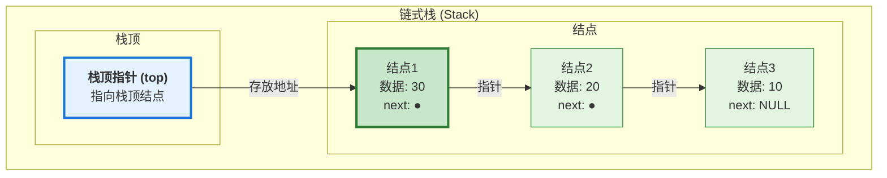
```mermaid
graph LR
    subgraph 链式栈 ["链式栈 (Stack)"]
        direction LR
        
        subgraph 栈顶
            TOP["<b>栈顶指针 (top)</b><br>指向栈顶结点"]
        end
        
        subgraph 结点
            N1["结点1<br>数据: 30<br>next: ●"]
            N2["结点2<br>数据: 20<br>next: ●"]
            N3["结点3<br>数据: 10<br>next: NULL"]
        end
    end

    TOP -- "存放地址" --> N1
    N1 -- "指针" --> N2
    N2 -- "指针" --> N3
    
    style TOP fill:#e3f2fd,stroke:#1976d2,stroke-width:3px
    style N1 fill:#c8e6c9,stroke:#2e7d32,stroke-width:3px
    style N2 fill:#e1f5e1,stroke:#2e7d32
    style N3 fill:#e1f5e1,stroke:#2e7d32
```

**2. 初始化**

```c
void initStack(LinkedStack* s) {
    s->top = NULL;
    s->size = 0;
    printf("链表栈初始化成功！\n");
}
```

**3. 判断栈空**

```c
int isEmpty(LinkedStack* s) {
    return s->top == NULL;
}
```

**4. 创建新结点**

```c
Node* createNode(int value) {
    Node* newNode = (Node*)malloc(sizeof(Node));
    if (!newNode) {
        printf("内存分配失败！\n");
        exit(1);
    }
    newNode->data = value;
    newNode->next = NULL;
    return newNode;
}
```

**5. 压栈（Push）**

```c
void push(LinkedStack* s, int value) {
    Node* newNode = createNode(value);
    
    newNode->next = s->top;  // 新结点指向当前栈顶
    s->top = newNode;        // 栈顶指向新结点
    s->size++;
    
    printf("成功压栈：%d\n", value);
}
```

**图解**：

```text
压栈前：top → [20] → [10] → NULL

压入30：
步骤1：newNode→next = top → [30]→[20]
步骤2：top = newNode → top→[30]→[20]→[10]→NULL
```

**6. 出栈（Pop）**

```c
int pop(LinkedStack* s) {
    if (isEmpty(s)) {
        printf("栈为空，无法出栈！\n");
        return -1;
    }
    
    Node* temp = s->top;
    int value = temp->data;
    
    s->top = s->top->next;  // 栈顶下移
    free(temp);              // 释放原栈顶
    s->size--;
    
    printf("成功出栈：%d\n", value);
    return value;
}
```

**图解**：

```text
出栈前：top → [30] → [20] → [10] → NULL

弹出30：
步骤1：temp = top（指向[30]）
步骤2：top = top->next（指向[20]）
步骤3：free(temp) 释放[30]

结果：top → [20] → [10] → NULL
```

**7. 查看栈顶元素**

```c
int getTop(LinkedStack* s) {
    if (isEmpty(s)) {
        printf("栈为空！\n");
        return -1;
    }
    return s->top->data;
}
```

**8. 获取栈的大小**

```c
int getSize(LinkedStack* s) {
    return s->size;
}
```

**9. 打印栈（从栈顶到栈底）**

```c
void printStack(LinkedStack* s) {
    if (isEmpty(s)) {
        printf("栈为空\n");
        return;
    }
    
    printf("栈内容（顶→底）：");
    Node* p = s->top;
    while (p != NULL) {
        printf("%d ", p->data);
        p = p->next;
    }
    printf("(栈底)\n");
    printf("栈大小：%d\n", s->size);
}
```

**10. 清空栈**

```c

void clearStack(LinkedStack* s) {
    Node* p = s->top;
    Node* temp;
    
    while (p != NULL) {
        temp = p;
        p = p->next;
        free(temp);
    }
    
    s->top = NULL;
    s->size = 0;
    printf("栈已清空\n");
}
```

---

### 2.3顺序循环队列

**什么是队列？**

**通俗理解**：
队列就像**排队买票**：

- 新来的人站在**队尾**（入队）
- 最前面的人先买到票离开（出队）

**特点**：**先进先出**（FIFO：First In First Out）

**什么是循环队列？**

用数组实现队列时，出队后前面的位置就空出来了，但无法重复使用，造成"假溢出"。

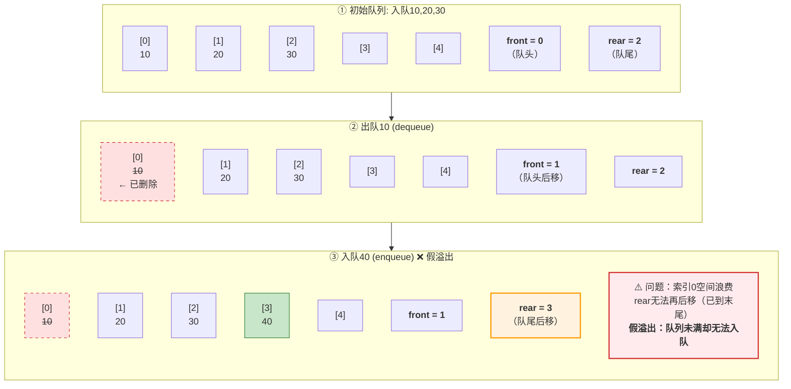
```mermaid
graph TD
    subgraph 步骤1 ["① 初始队列: 入队10,20,30"]
        direction TB
        Q1_0["[0]<br>10"]
        Q1_1["[1]<br>20"]
        Q1_2["[2]<br>30"]
        Q1_3["[3]<br>"]
        Q1_4["[4]<br>"]
        
        Q1_front["<b>front = 0</b><br>（队头）"]
        Q1_rear["<b>rear = 2</b><br>（队尾）"]
    end

    subgraph 步骤2 ["② 出队10 (dequeue)"]
        direction TB
        Q2_0["[0]<br><s>10</s><br>← 已删除"]
        Q2_1["[1]<br>20"]
        Q2_2["[2]<br>30"]
        Q2_3["[3]<br>"]
        Q2_4["[4]<br>"]
        
        Q2_front["<b>front = 1</b><br>（队头后移）"]
        Q2_rear["<b>rear = 2</b>"]
    end

    subgraph 步骤3 ["③ 入队40 (enqueue) ❌ 假溢出"]
        direction TB
        Q3_0["[0]<br><s>10</s>"]
        Q3_1["[1]<br>20"]
        Q3_2["[2]<br>30"]
        Q3_3["[3]<br>40"]
        Q3_4["[4]<br>"]
        
        Q3_front["<b>front = 1</b>"]
        Q3_rear["<b>rear = 3</b><br>（队尾后移）"]
        
        NOTE["⚠️ 问题：索引0空间浪费<br>rear无法再后移（已到末尾）<br><b>假溢出：队列未满却无法入队</b>"]
    end

    步骤1 --> 步骤2 --> 步骤3
    
    style Q2_0 fill:#ffe0e0,stroke:#c62828,stroke-dasharray: 5 5
    style Q3_0 fill:#ffe0e0,stroke:#c62828,stroke-dasharray: 5 5
    style Q3_3 fill:#c8e6c9,stroke:#2e7d32
    style Q3_rear fill:#fff3e0,stroke:#ff9800,stroke-width:2px
    style NOTE fill:#ffebee,stroke:#d32f2f,stroke-width:2px
```

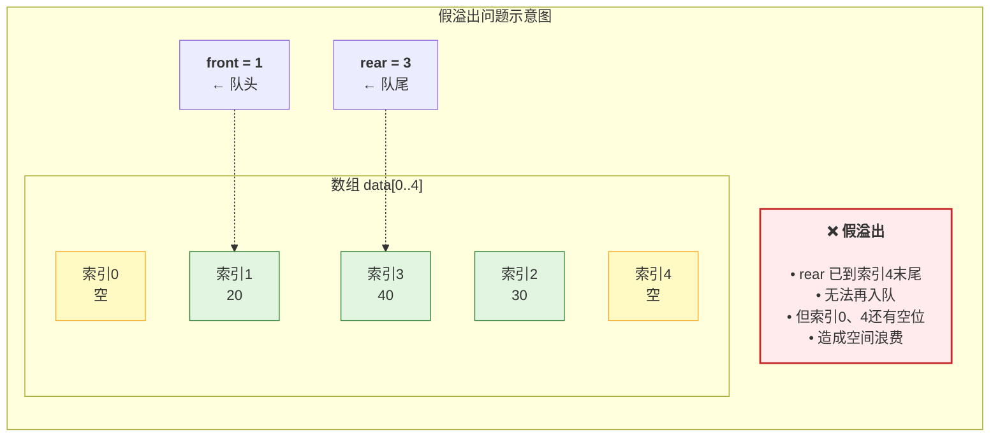
```mermaid
graph LR
    subgraph 假溢出示意图 ["假溢出问题示意图"]
        direction TB
        
        subgraph 数组状态 ["数组 data[0..4]"]
            direction LR
            I0["索引0<br>空"]
            I1["索引1<br>20"]
            I2["索引2<br>30"]
            I3["索引3<br>40"]
            I4["索引4<br>空"]
        end
        
        Front["<b>front = 1</b><br>← 队头"]
        Rear["<b>rear = 3</b><br>← 队尾"]
        
        Problem["<b>❌ 假溢出</b><br><br>• rear 已到索引4末尾<br>• 无法再入队<br>• 但索引0、4还有空位<br>• 造成空间浪费"]
    end
    
    Front -.-> I1
    Rear -.-> I3
    
    style I0 fill:#fff9c4,stroke:#f9a825
    style I1 fill:#e1f5e1,stroke:#2e7d32
    style I2 fill:#e1f5e1,stroke:#2e7d32
    style I3 fill:#e1f5e1,stroke:#2e7d32
    style I4 fill:#fff9c4,stroke:#f9a825
    style Problem fill:#ffebee,stroke:#c62828,stroke-width:2px
```

**✅ 解决方案: 循环队列**

把数组想象成一个**圆环**，队尾到末尾后可以绕回开头，重复利用空间。

---

**1. 结构体定义**

```c
#include <stdio.h>
#include <stdlib.h>

#define MAXSIZE 5  // 队列最大容量（实际只能存4个，因为要空一个位置判断满）

// 循环队列结构体
typedef struct {
    int data[MAXSIZE];  // 存储数据的数组
    int front;          // 队头指针（指向队头元素的位置）
    int rear;           // 队尾指针（指向队尾元素的下一个位置）
} CirQueue;
```

- `front`：指向队头元素的位置
- `rear`：指向队尾元素的**下一个位置**（空位置）
- 队列空：`front == rear`
- 队列满：`(rear + 1) % MAXSIZE == front`（留一个空位判断满）

**为什么要留一个空位？**
如果不留空位，队列满时 `front == rear` 和队列空时一样，无法区分。

**2. 初始化队列**

```c
void initQueue(CirQueue* Q) {
    Q->front = 0;
    Q->rear = 0;
    printf("循环队列初始化成功！\n");
}
```

- `front = 0, rear = 0`，表示队列为空
- 注意：不是 `-1`，因为要用取模运算

**3. 判断队列空/满**

```c
// 判断队列是否为空
int isEmpty(CirQueue* Q) {
    return Q->front == Q->rear;
}

// 判断队列是否已满
int isFull(CirQueue* Q) {
    return (Q->rear + 1) % MAXSIZE == Q->front;
}
```

**图解满队列**（MAXSIZE=5）：

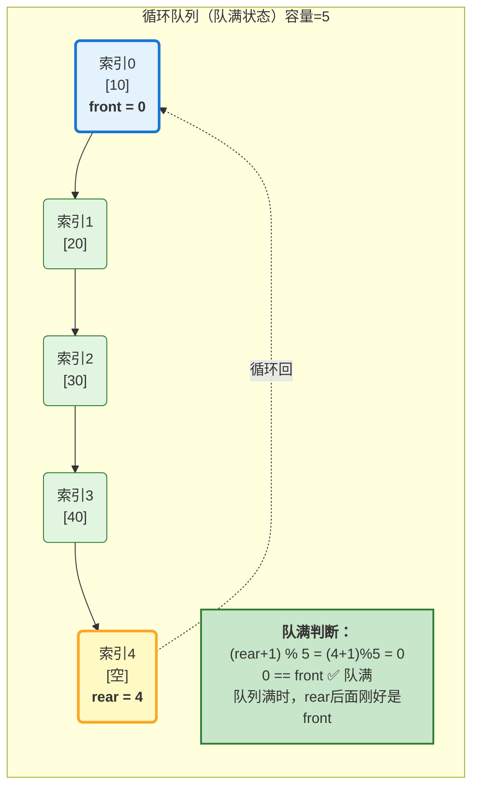
```mermaid
graph LR
    subgraph 环形队列满状态 ["循环队列（队满状态）容量=5"]
        direction TB
        
        C0("索引0<br>[10]<br><b>front = 0</b>")
        C1("索引1<br>[20]")
        C2("索引2<br>[30]")
        C3("索引3<br>[40]")
        C4("索引4<br>[空]<br><b>rear = 4</b>")
        
        C0 --> C1 --> C2 --> C3 --> C4
        C4 -.->|"循环回"| C0
        
        Condition["<b>队满判断：</b><br>(rear+1) % 5 = (4+1)%5 = 0<br>0 == front ✅ 队满<br>队列满时，rear后面刚好是front"]
    end
    
    style C0 fill:#e3f2fd,stroke:#1976d2,stroke-width:3px
    style C1 fill:#e1f5e1,stroke:#2e7d32
    style C2 fill:#e1f5e1,stroke:#2e7d32
    style C3 fill:#e1f5e1,stroke:#2e7d32
    style C4 fill:#fff9c4,stroke:#f9a825,stroke-width:3px
    style Condition fill:#c8e6c9,stroke:#2e7d32,stroke-width:2px
```

**4. 获取队列长度**

```c
// 获取队列长度
int getLength(CirQueue* Q) {
    return (Q->rear - Q->front + MAXSIZE) % MAXSIZE;
}
```

- 普通队列：`rear - front`
- 循环队列：因为可能绕圈，所以 `(rear - front + MAXSIZE) % MAXSIZE`

**举例**：

```text
情况1：rear=3, front=0，长度 = (3-0+5)%5 = 3
情况2：rear=2, front=4（绕圈了），长度 = (2-4+5)%5 = 3
```

**5. 入队（EnQueue）**

```c
// 入队：在队尾添加元素
void enQueue(CirQueue* Q, int value) {
    if (isFull(Q)) {
        printf("队列已满，无法入队%d！\n", value);
        return;
    }
    
    Q->data[Q->rear] = value;      // 在rear位置放入元素
    Q->rear = (Q->rear + 1) % MAXSIZE;  // rear后移一位（循环）
    printf("成功入队：%d\n", value);
}
```

**图解**：

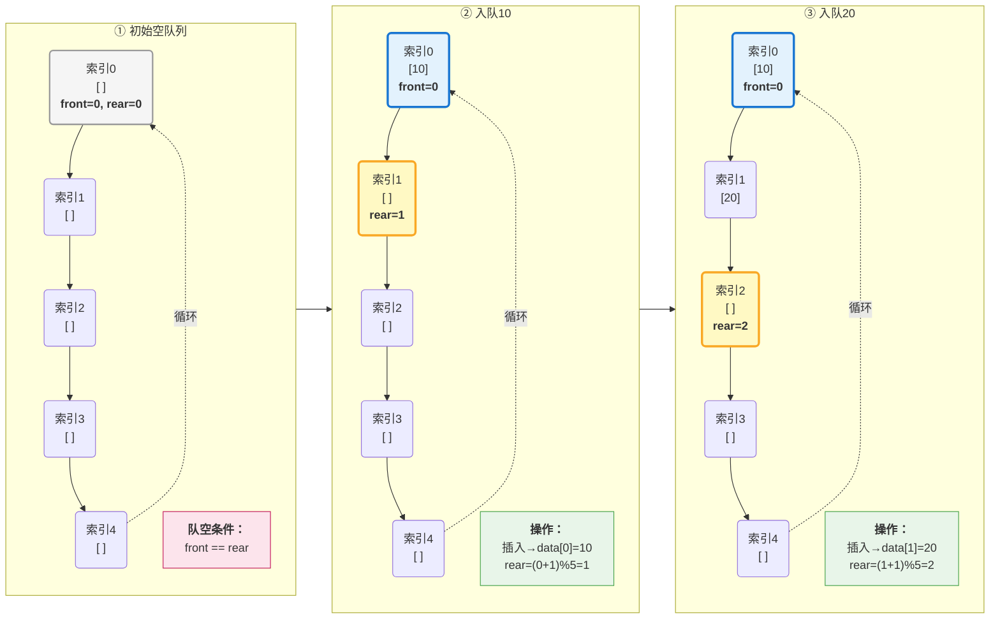
```mermaid
graph LR
    subgraph 步骤1 ["① 初始空队列"]
        direction TB
        S1_0("索引0<br>[ ]<br><b>front=0, rear=0</b>")
        S1_1("索引1<br>[ ]")
        S1_2("索引2<br>[ ]")
        S1_3("索引3<br>[ ]")
        S1_4("索引4<br>[ ]")
        
        S1_0 --> S1_1 --> S1_2 --> S1_3 --> S1_4
        S1_4 -.->|"循环"| S1_0
        
        Note1["<b>队空条件：<br></b>front == rear"]
    end

    subgraph 步骤2 ["② 入队10"]
        direction TB
        S2_0("索引0<br>[10]<br><b>front=0</b>")
        S2_1("索引1<br>[ ]<br><b>rear=1</b>")
        S2_2("索引2<br>[ ]")
        S2_3("索引3<br>[ ]")
        S2_4("索引4<br>[ ]")
        
        S2_0 --> S2_1 --> S2_2 --> S2_3 --> S2_4
        S2_4 -.->|"循环"| S2_0
        
        Note2["<b>操作：<br></b>插入→data[0]=10<br>rear=(0+1)%5=1"]
    end

    subgraph 步骤3 ["③ 入队20"]
        direction TB
        S3_0("索引0<br>[10]<br><b>front=0</b>")
        S3_1("索引1<br>[20]")
        S3_2("索引2<br>[ ]<br><b>rear=2</b>")
        S3_3("索引3<br>[ ]")
        S3_4("索引4<br>[ ]")
        
        S3_0 --> S3_1 --> S3_2 --> S3_3 --> S3_4
        S3_4 -.->|"循环"| S3_0
        
        Note3["<b>操作：<br></b>插入→data[1]=20<br>rear=(1+1)%5=2"]
    end

    步骤1 --> 步骤2 --> 步骤3

    style S1_0 fill:#f5f5f5,stroke:#999,stroke-width:2px
    style S2_0 fill:#e3f2fd,stroke:#1976d2,stroke-width:3px
    style S2_1 fill:#fff9c4,stroke:#f9a825,stroke-width:3px
    style S3_0 fill:#e3f2fd,stroke:#1976d2,stroke-width:3px
    style S3_2 fill:#fff9c4,stroke:#f9a825,stroke-width:3px
    style Note1 fill:#fce4ec,stroke:#c2185b
    style Note2 fill:#e8f5e9,stroke:#43a047
    style Note3 fill:#e8f5e9,stroke:#43a047
```

**6. 出队（DeQueue）**

```c
// 出队：从队头取出元素
int deQueue(CirQueue* Q) {
    if (isEmpty(Q)) {
        printf("队列为空，无法出队！\n");
        return -1;
    }
    
    int value = Q->data[Q->front];  // 取出队头元素
    Q->front = (Q->front + 1) % MAXSIZE;  // front后移一位（循环）
    printf("成功出队：%d\n", value);
    return value;
}
```

**图解**：

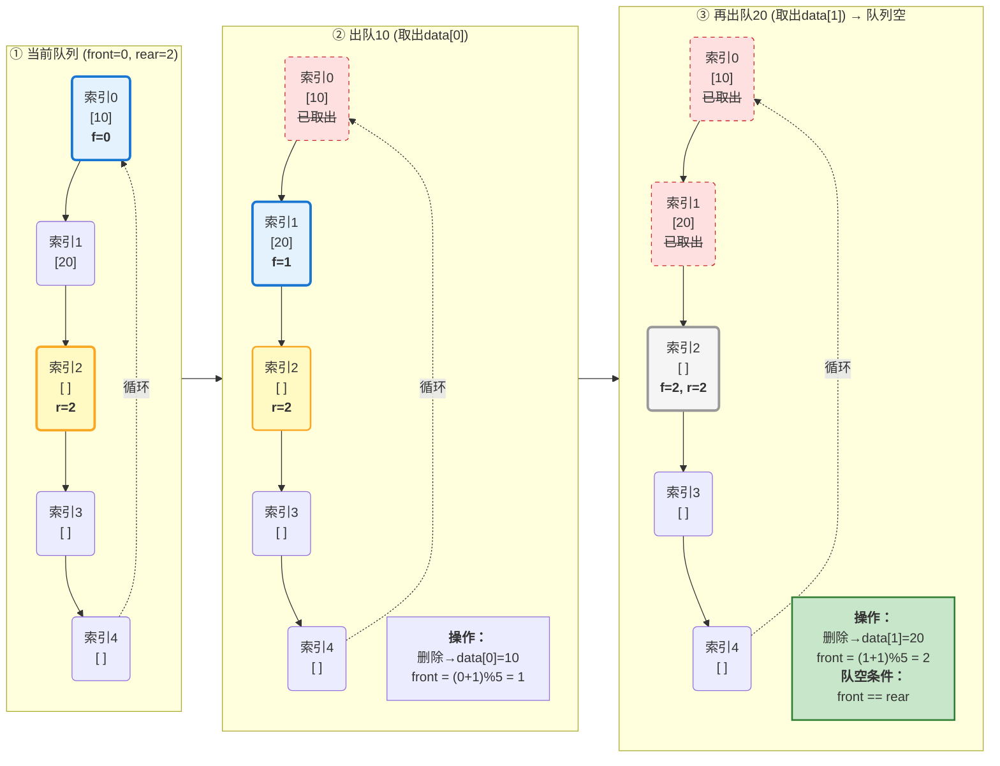
```mermaid
graph LR
    subgraph 步骤1 ["① 当前队列 (front=0, rear=2)"]
        direction TB
        S1_0("索引0<br>[10]<br><b>f=0</b>")
        S1_1("索引1<br>[20]")
        S1_2("索引2<br>[ ]<br><b>r=2</b>")
        S1_3("索引3<br>[ ]")
        S1_4("索引4<br>[ ]")
        
        S1_0 --> S1_1 --> S1_2 --> S1_3 --> S1_4
        S1_4 -.->|"循环"| S1_0
    end

    subgraph 步骤2 ["② 出队10 (取出data[0])"]
        direction TB
        S2_0("索引0<br>[10]<br><s>已取出</s>")
        S2_1("索引1<br>[20]<br><b>f=1</b>")
        S2_2("索引2<br>[ ]<br><b>r=2</b>")
        S2_3("索引3<br>[ ]")
        S2_4("索引4<br>[ ]")
        
        S2_0 --> S2_1 --> S2_2 --> S2_3 --> S2_4
        S2_4 -.->|"循环"| S2_0
        
        Note2["<b>操作：<br></b>删除→data[0]=10<br></b>front = (0+1)%5 = 1"]
    end

    subgraph 步骤3 ["③ 再出队20 (取出data[1]) → 队列空"]
        direction TB
        S3_0("索引0<br>[10]<br><s>已取出</s>")
        S3_1("索引1<br>[20]<br><s>已取出</s>")
        S3_2("索引2<br>[ ]<br><b>f=2, r=2</b>")
        S3_3("索引3<br>[ ]")
        S3_4("索引4<br>[ ]")
        
        S3_0 --> S3_1 --> S3_2 --> S3_3 --> S3_4
        S3_4 -.->|"循环"| S3_0
        
        Note3["<b>操作：<br></b>删除→data[1]=20<br></b>front = (1+1)%5 = 2<br><b>队空条件：<br></b>front == rear "]
    end

    步骤1 --> 步骤2 --> 步骤3

    style S1_0 fill:#e3f2fd,stroke:#1976d2,stroke-width:3px
    style S1_2 fill:#fff9c4,stroke:#f9a825,stroke-width:3px
    style S2_0 fill:#ffe0e0,stroke:#c62828,stroke-dasharray:5 5
    style S2_1 fill:#e3f2fd,stroke:#1976d2,stroke-width:3px
    style S2_2 fill:#fff9c4,stroke:#f9a825,stroke-width:2px
    style S3_0 fill:#ffe0e0,stroke:#c62828,stroke-dasharray:5 5
    style S3_1 fill:#ffe0e0,stroke:#c62828,stroke-dasharray:5 5
    style S3_2 fill:#f5f5f5,stroke:#999,stroke-width:3px
    style Note3 fill:#c8e6c9,stroke:#2e7d32,stroke-width:2px
```

**7. 获取队头元素（不弹出）**

```c
int getFront(CirQueue* Q) {
    if (isEmpty(Q)) {
        printf("队列为空！\n");
        return -1;
    }
    return Q->data[Q->front];
}
```

**8. 打印队列**

```c
void printQueue(CirQueue* Q) {
    if (isEmpty(Q)) {
        printf("队列为空\n");
        return;
    }
    
    printf("队列内容（队头→队尾）：");
    int i = Q->front;
    while (i != Q->rear) {
        printf("%d ", Q->data[i]);
        i = (i + 1) % MAXSIZE;
    }
    printf("\n");
}
```

**9. 清空队列**

```c
void clearQueue(CirQueue* Q) {
    int i = Q->front;
    while (i != Q->rear) {
        Q->data[i] = 0;  // 数据清零
        i = (i + 1) % MAXSIZE;
    }
    Q->front = 0;
    Q->rear = 0;
    printf("队列已清空（数据已清零）\n");
}
```

---

### 2.4 链表循环队列

**什么是链式循环队列？**

**通俗理解**：

- 用**链表**实现的队列，队尾的 `next` 指向队头，形成一个**圆环**
- 和顺序循环队列不同：没有"假溢出"，不需要留空位
- 可以无限添加（只要内存够）

**图示**：

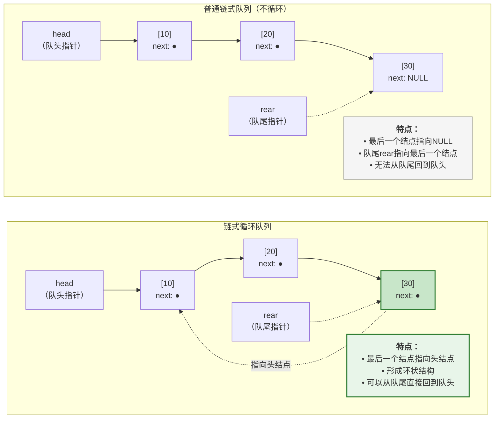
```mermaid
graph LR
    subgraph 循环队列 ["链式循环队列"]
        direction LR
        Head2["head<br>（队头指针）"]
        N2_1["[10]<br>next: ●"]
        N2_2["[20]<br>next: ●"]
        N2_3["[30]<br>next: ●"]
        Rear2["rear<br>（队尾指针）"]
        
        Head2 --> N2_1
        N2_1 --> N2_2
        N2_2 --> N2_3
        N2_3 -.->|"指向头结点"| N2_1
        Rear2 -.-> N2_3
        
        Note2["<b>特点：</b><br>• 最后一个结点指向头结点<br>• 形成环状结构<br>• 可以从队尾直接回到队头"]
    end

    subgraph 普通队列 ["普通链式队列（不循环）"]
        direction LR
        Head1["head<br>（队头指针）"]
        N1_1["[10]<br>next: ●"]
        N1_2["[20]<br>next: ●"]
        N1_3["[30]<br>next: NULL"]
        Rear1["rear<br>（队尾指针）"]
        
        Head1 --> N1_1
        N1_1 --> N1_2
        N1_2 --> N1_3
        Rear1 -.-> N1_3
        
        Note1["<b>特点：</b><br>• 最后一个结点指向NULL<br>• 队尾rear指向最后一个结点<br>• 无法从队尾回到队头"]
    end

    style Note1 fill:#f5f5f5,stroke:#999
    style Note2 fill:#e8f5e9,stroke:#2e7d32,stroke-width:2px
    style N2_3 fill:#c8e6c9,stroke:#2e7d32,stroke-width:2px
```

---

**1. 结构体定义**

```c
#include <stdio.h>
#include <stdlib.h>

// 结点结构体
typedef struct Node {
    int data;           // 数据域
    struct Node* next;  // 指针域
} Node;

// 链式循环队列结构体
typedef struct {
    Node* front;   // 队头指针（指向队头结点）
    Node* rear;    // 队尾指针（指向队尾结点）
    int length;    // 队列长度（元素个数）
} LinkedCircularQueue;
```

**解释**：

- `front`：指向队头结点（第一个元素）
- `rear`：指向队尾结点（最后一个元素）
- `length`：记录元素个数
- 空队列：`front = NULL, rear = NULL, length = 0`
- 循环：`rear->next = front`

**2. 初始化**

```c
// 初始化队列
void initQueue(LinkedCircularQueue* Q) {
    Q->front = NULL;
    Q->rear = NULL;
    Q->length = 0;
    printf("链式循环队列初始化成功！\n");
}
```

**图解**：

```text
初始化后：
front = NULL
rear = NULL
没有结点
```

**3. 判断空/满**

```c
// 判断是否为空
int isEmpty(LinkedCircularQueue* Q) {
    return Q->length == 0;
    // 或者 return Q->front == NULL;
}

// 链式队列没有"满"的概念（除非内存不够）
int isFull(LinkedCircularQueue* Q) {
    return 0;  // 永远不满
}
```

**4. 创建新结点**

```c
// 创建新结点
Node* createNode(int value) {
    Node* newNode = (Node*)malloc(sizeof(Node));
    if (!newNode) {
        printf("内存分配失败！\n");
        exit(1);
    }
    newNode->data = value;
    newNode->next = NULL;
    return newNode;
}
```

**5. 入队（EnQueue）**

```c
// 入队：在队尾添加元素
void enQueue(LinkedCircularQueue* Q, int value) {
    Node* newNode = createNode(value);
    
    if (isEmpty(Q)) {
        // 空队列：新结点既是头也是尾
        Q->front = newNode;
        Q->rear = newNode;
        newNode->next = newNode;  // 指向自己，形成循环
    } else {
        // 非空队列：新结点插在队尾后面
        newNode->next = Q->front;   // 新结点指向队头
        Q->rear->next = newNode;    // 原队尾指向新结点
        Q->rear = newNode;          // 更新队尾
    }
    
    Q->length++;
    printf("成功入队：%d\n", value);
}
```

**图解**：

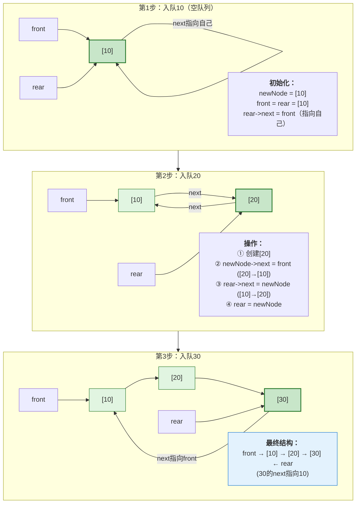
```mermaid
graph TD
    subgraph 步骤1 ["第1步：入队10（空队列）"]
        direction LR
        N1["[10]"]
        F1["front"]
        R1["rear"]
        
        F1 --> N1
        R1 --> N1
        N1 -->|"next指向自己"| N1
        
        Note1["<b>初始化：</b><br>newNode = [10]<br>front = rear = [10]<br>rear->next = front（指向自己）"]
    end

    subgraph 步骤2 ["第2步：入队20"]
        direction LR
        N2_10["[10]"]
        N2_20["[20]"]
        F2["front"]
        R2["rear"]
        
        F2 --> N2_10
        N2_20 -->|"next"| N2_10
        N2_10 -->|"next"| N2_20
        R2 --> N2_20
        
        Note2["<b>操作：</b><br>① 创建[20]<br>② newNode->next = front ([20]→[10])<br>③ rear->next = newNode ([10]→[20])<br>④ rear = newNode"]
    end

    subgraph 步骤3 ["第3步：入队30"]
        direction LR
        N3_10["[10]"]
        N3_20["[20]"]
        N3_30["[30]"]
        F3["front"]
        R3["rear"]
        
        F3 --> N3_10
        N3_10 --> N3_20
        N3_20 --> N3_30
        N3_30 -->|"next指向front"| N3_10
        R3 --> N3_30
        
        Note3["<b>最终结构：</b><br>front → [10] → [20] → [30] ← rear<br>(30的next指向10)"]
    end

    步骤1 --> 步骤2 --> 步骤3

    style N1 fill:#c8e6c9,stroke:#2e7d32,stroke-width:2px
    style N2_10 fill:#e1f5e1,stroke:#2e7d32
    style N2_20 fill:#c8e6c9,stroke:#2e7d32,stroke-width:2px
    style N3_10 fill:#e1f5e1,stroke:#2e7d32
    style N3_20 fill:#e1f5e1,stroke:#2e7d32
    style N3_30 fill:#c8e6c9,stroke:#2e7d32,stroke-width:2px
    style Note3 fill:#e3f2fd,stroke:#1976d2
```

**6. 出队（DeQueue）**

```c
// 出队：从队头取出元素
int deQueue(LinkedCircularQueue* Q) {
    if (isEmpty(Q)) {
        printf("队列为空，无法出队！\n");
        return -1;
    }
    
    Node* temp = Q->front;
    int value = temp->data;
    
    if (Q->length == 1) {
        // 只有一个结点：删除后队列变空
        Q->front = NULL;
        Q->rear = NULL;
    } else {
        // 多个结点：队头后移
        Q->front = Q->front->next;   // 新队头
        Q->rear->next = Q->front;    // 队尾指向新队头（保持循环）
    }
    
    free(temp);
    Q->length--;
    printf("成功出队：%d\n", value);
    return value;
}
```

**图解**：

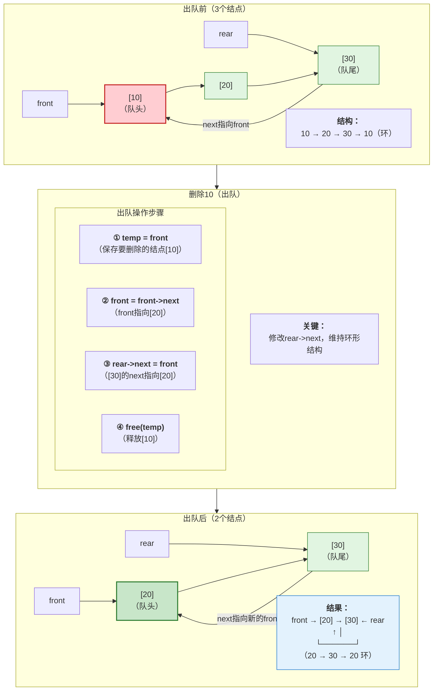
```mermaid
graph TD
    subgraph 步骤1 ["出队前（3个结点）"]
        direction LR
        N1_before["[10]<br>（队头）"]
        N2_before["[20]"]
        N3_before["[30]<br>（队尾）"]
        F_before["front"]
        R_before["rear"]
        
        F_before --> N1_before
        R_before --> N3_before
        N1_before --> N2_before
        N2_before --> N3_before
        N3_before -->|"next指向front"| N1_before
        
        Note1["<b>结构：</b><br>10 → 20 → 30 → 10（环）"]
    end

    subgraph 步骤2 ["删除10（出队）"]
        direction TB
        
        subgraph 操作 ["出队操作步骤"]
            O1["<b>① temp = front</b><br>（保存要删除的结点[10]）"]
            O2["<b>② front = front->next</b><br>（front指向[20]）"]
            O3["<b>③ rear->next = front</b><br>（[30]的next指向[20]）"]
            O4["<b>④ free(temp)</b><br>（释放[10]）"]
        end
        
        Note2["<b>关键：</b><br>修改rear->next，维持环形结构"]
    end

    subgraph 步骤3 ["出队后（2个结点）"]
        direction LR
        N2_after["[20]<br>（队头）"]
        N3_after["[30]<br>（队尾）"]
        F_after["front"]
        R_after["rear"]
        
        F_after --> N2_after
        R_after --> N3_after
        N2_after --> N3_after
        N3_after -->|"next指向新的front"| N2_after
        
        Note3["<b>结果：</b><br>front → [20] → [30] ← rear<br>         ↑      │<br>         └──────┘<br>（20 → 30 → 20 环）"]
    end

    步骤1 --> 步骤2 --> 步骤3

    style N1_before fill:#ffcdd2,stroke:#c62828,stroke-width:2px
    style N2_before fill:#e1f5e1,stroke:#2e7d32
    style N3_before fill:#e1f5e1,stroke:#2e7d32
    style N2_after fill:#c8e6c9,stroke:#2e7d32,stroke-width:2px
    style N3_after fill:#e1f5e1,stroke:#2e7d32
    style Note3 fill:#e3f2fd,stroke:#1976d2
```

**7. 获取队头元素**

```c
// 获取队头元素（不弹出）
int getFront(LinkedCircularQueue* Q) {
    if (isEmpty(Q)) {
        printf("队列为空！\n");
        return -1;
    }
    return Q->front->data;
}
```

**8. 获取队列长度**

```c
// 获取队列长度
int getLength(LinkedCircularQueue* Q) {
    return Q->length;
}
```

**9. 打印队列**

```c
// 打印队列（从队头到队尾）
void printQueue(LinkedCircularQueue* Q) {
    if (isEmpty(Q)) {
        printf("队列为空\n");
        return;
    }
    
    printf("队列内容（队头→队尾）：");
    Node* p = Q->front;
    for (int i = 0; i < Q->length; i++) {
        printf("%d ", p->data);
        p = p->next;
    }
    printf("(循环回到队头)\n");
    printf("队头：%d，队尾：%d，长度：%d\n", 
           Q->front->data, Q->rear->data, Q->length);
}
```

**注意**：不能直接用 `while (p != Q->front)` 判断结束，因为循环队列永远走不完。要用 `length` 控制。

**10. 销毁队列**

```c
// 销毁队列（释放所有结点）
void destroyQueue(LinkedCircularQueue* Q) {
    if (isEmpty(Q)) {
        printf("队列已空\n");
        return;
    }
    
    Node* p = Q->front;
    Node* temp;
    
    for (int i = 0; i < Q->length; i++) {
        temp = p;
        p = p->next;
        free(temp);
    }
    
    Q->front = NULL;
    Q->rear = NULL;
    Q->length = 0;
    printf("队列已销毁\n");
}
```

---

## 第三章：树和二叉树

### 3.1 树（Tree）

**树的基本概念**

**树**是 n 个结点的有限集。

- **空树**：n = 0
- **非空树**：有且仅有一个根结点

**结点的分类**：

| 类型     | 含义                      |
| :------- | :------------------------ |
| 根结点   | 最顶层，没有父结点        |
| 分支结点 | 有子结点的结点            |
| 叶子结点 | 没有子结点的结点（度为0） |

**子树**：树中某个结点和它的所有后代构成的子结构。

------

**1. 基本术语**

**结点之间的关系**

| 术语 | 含义                         |
| :--- | :--------------------------- |
| 祖先 | 从根到该结点路径上的所有结点 |
| 子孙 | 某结点下的所有结点           |
| 双亲 | 直接上级结点                 |
| 兄弟 | 同一个双亲的结点             |

**结点的属性**

| 属性               | 含义               | 方向        |
| :----------------- | :----------------- | :---------- |
| 结点的层次（深度） | 从上往下数         | 根为第1层   |
| 结点的高度         | 从下往上数         | 叶子为第1层 |
| 树的高度           | 整棵树的最大层数   |             |
| 结点的度           | 有几个孩子         |             |
| 树的度             | 所有结点度的最大值 |             |

**图示**：

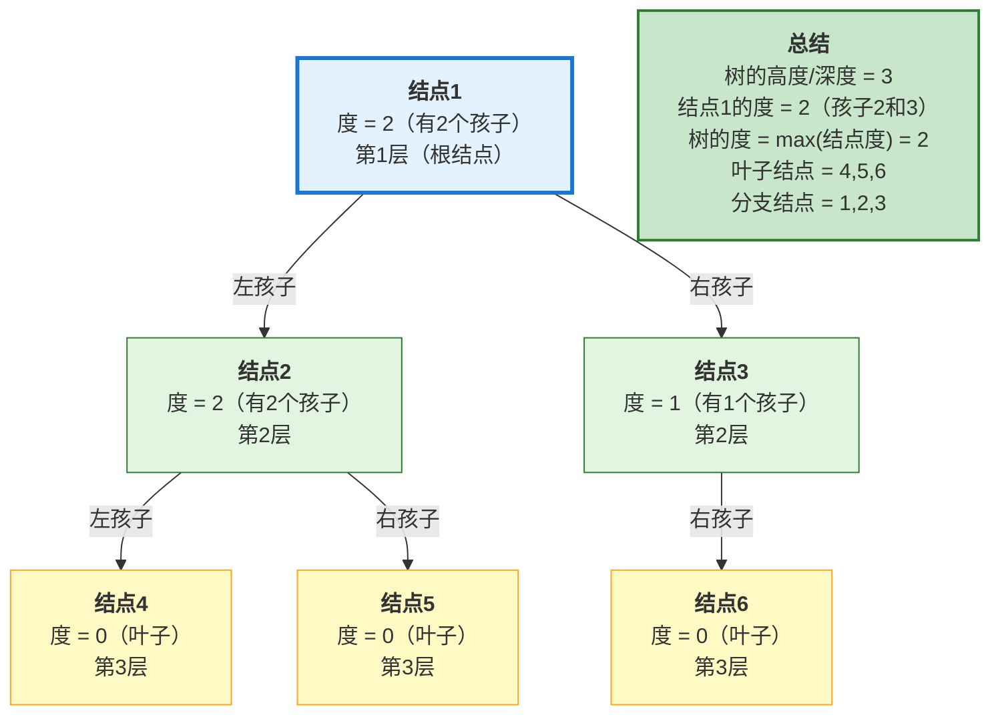
```mermaid
graph TD
    1["<b>结点1</b><br>度 = 2（有2个孩子）<br>第1层（根结点）"]
    2["<b>结点2</b><br>度 = 2（有2个孩子）<br>第2层"]
    3["<b>结点3</b><br>度 = 1（有1个孩子）<br>第2层"]
    4["<b>结点4</b><br>度 = 0（叶子）<br>第3层"]
    5["<b>结点5</b><br>度 = 0（叶子）<br>第3层"]
    6["<b>结点6</b><br>度 = 0（叶子）<br>第3层"]
    
    1 -->|左孩子| 2
    1 -->|右孩子| 3
    2 -->|左孩子| 4
    2 -->|右孩子| 5
    3 -->|右孩子| 6
    
    Info["<b>总结</b><br>树的高度/深度 = 3<br>结点1的度 = 2（孩子2和3）<br>树的度 = max(结点度) = 2<br>叶子结点 = 4,5,6<br>分支结点 = 1,2,3"]
    
    style 1 fill:#e3f2fd,stroke:#1976d2,stroke-width:3px
    style 2 fill:#e1f5e1,stroke:#2e7d32
    style 3 fill:#e1f5e1,stroke:#2e7d32
    style 4 fill:#fff9c4,stroke:#f9a825
    style 5 fill:#fff9c4,stroke:#f9a825
    style 6 fill:#fff9c4,stroke:#f9a825
    style Info fill:#c8e6c9,stroke:#2e7d32,stroke-width:2px
```

**2. 树的性质**

**性质1：结点数 = 边数 + 1**

```text
总边数 = 所有结点的度数之和
总结点数 = 总边数 + 1
```

> **例题**：一棵树有 123 个结点，其中 80 个是叶子结点（度为0），度为1的有 10 个，度为2的有 15 个，求度为3的有几个？

解：

```text
N = N0 + N1 + N2 + N3
123 = 80 + 10 + 15 + N3
N3 = 123 - 105 = 18
```

**性质2：度为 m 的树，第 i 层最多有 m^(i-1) 个结点**。

例：度为3的树，第2层最多有 3^(2-1) = 3 个结点。

**性质3：高度为 h 的 m 叉树，最多有 (m^h - 1)/(m - 1) 个结点**。

------

### 3.2 二叉树

**1. 二叉树的遍历（三种顺序）**

以这棵树为例：

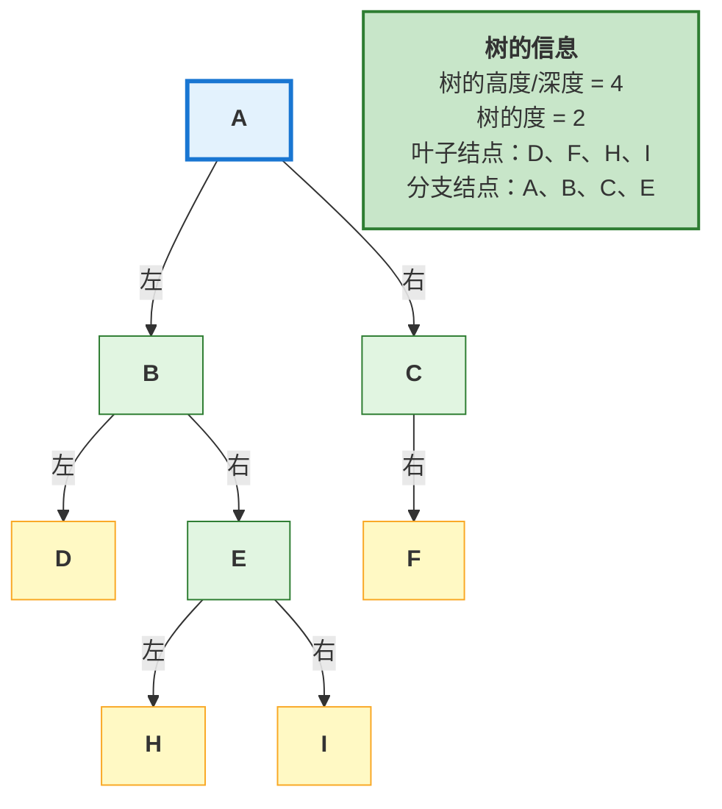
```mermaid
graph TD
    A["<b>A</b>"]
    B["<b>B</b>"]
    C["<b>C</b>"]
    D["<b>D</b>"]
    E["<b>E</b>"]
    F["<b>F</b>"]
    H["<b>H</b>"]
    I["<b>I</b>"]
    
    A -->|左| B
    A -->|右| C
    B -->|左| D
    B -->|右| E
    C -->|右| F
    E -->|左| H
    E -->|右| I
    
    Info["<b>树的信息</b><br>树的高度/深度 = 4<br>树的度 = 2<br>叶子结点：D、F、H、I<br>分支结点：A、B、C、E"]
    
    style A fill:#e3f2fd,stroke:#1976d2,stroke-width:3px
    style B fill:#e1f5e1,stroke:#2e7d32
    style C fill:#e1f5e1,stroke:#2e7d32
    style D fill:#fff9c4,stroke:#f9a825
    style E fill:#e1f5e1,stroke:#2e7d32
    style F fill:#fff9c4,stroke:#f9a825
    style H fill:#fff9c4,stroke:#f9a825
    style I fill:#fff9c4,stroke:#f9a825
    style Info fill:#c8e6c9,stroke:#2e7d32,stroke-width:2px
```

| 遍历方式               | 顺序                 | 结果              |
| :--------------------- | :------------------- | :---------------- |
| **前序遍历**（根左右） | 根 → 左子树 → 右子树 | A B D H E I C F G |
| **中序遍历**（左根右） | 左子树 → 根 → 右子树 | H D I B E A F C G |
| **后序遍历**（左右根） | 左子树 → 右子树 → 根 | H I D E B F G C A |

**记忆口诀**：前根左右，中左根右，后左右根

**2. 二叉树的遍历性质（重要！）**

**已知前序+中序，可以唯一确定二叉树**。
**已知后序+中序，可以唯一确定二叉树**。
**已知前序+后序，不能唯一确定二叉树**。

**推理技巧**：

- 前序第一个 = 根
- 后序最后一个 = 根
- 中序找到根，左边是左子树，右边是右子树

**3. 线索二叉树**

**是什么**：把空指针利用起来，指向某种遍历顺序的前驱和后继。

| 指针     | 含义              |
| :------- | :---------------- |
| ltag = 0 | lchild 指向左孩子 |
| ltag = 1 | lchild 指向前驱   |
| rtag = 0 | rchild 指向右孩子 |
| rtag = 1 | rchild 指向后继   |

**作用**：加快遍历速度，不用递归也能遍历。

**4. 树/森林与二叉树的转换**

**树 → 二叉树（三步）**

  1\. **连兄弟**：同一层的兄弟结点用线连起来。
  2\. **去右孩子**：只保留第一个孩子，其他孩子作为右子树。
  3\. **旋转**：整理成二叉树形状。

**二叉树 → 树（三步）**

  1\. **连右孩子**：把右孩子链上的结点都连回来。
  2\. **去右孩子**：断开原来的右指针。
  3\. 整理。

---

## 第四章：图

### 4.1 图

**到底什么是“图”？**

你想象一下**地铁线路图**。地铁图就是最经典、最好理解的“图结构”。

- 每一个**站点**，就是一个 **顶点**。
- 站点之间的**铁轨**，就是一条 **边**。

所以，图 = 顶点 + 边。

---

**1. 无向图（Undirected Graph）**

**边没有箭头，关系是双向的。**

就像两个人握手：

- A 握了 B 的手，B 自然也就握了 A 的手。

**2. 有向图（Directed Graph）**

**边有箭头，关系是单向的。**

就像微博关注：

- 你关注了某个明星，但明星不一定关注你。

**简单图**：

- 没有“重复的边”。
- 没有“自己指自己”的边。

**多重图**：

- 允许两站之间有多条铁轨。
- 允许一个站有环形地铁线（自环）。

**3. 完全图（Complete Graph）**

每两个顶点之间**都直接连一条边**。

- 5 个同学组队，要求**任意两个人**都加了好友。这就是无向完全图。

| 图类型     | 边数公式 | 为什么？                                        |
| :--------- | :------- | :---------------------------------------------- |
| 无向完全图 | n(n-1)/2 | 每对人一条边，除 2 是因为 A-B 和 B-A 是同一件事 |
| 有向完全图 | n(n-1)   | 每对人要两条边：A→B 和 B→A                      |

**4. 子图（Subgraph）**

在原图里**删掉一些顶点或边**，剩下的就是子图。

**5. 连通分量（Connectivity）**

如果一个无向图里，**任意两个站都能互相走到**叫**连通图**。

连通分量是把整个图切开，每个**最大的、内部完全连通的子图**，叫一个连通分量。

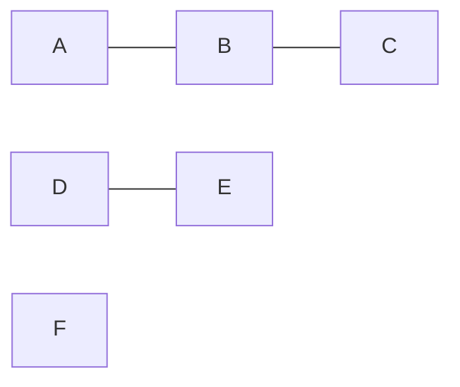
```mermaid
graph LR
    A --- B
    B --- C

    D --- E

    F
```

连通分量 1：{A, B, C}

连通分量 2：{D, E}

连通分量 3：{F}

**6. 强连通（Strongly Connected）**

有向图里，不但 A 能到 B，B 也能到 A。

- 互关：你关注我，我也关注你 → 强连通
- 单向关注：你关注我，我不关注你 → **不是**强连通

**强连通分量**就是有向图里，最大的、内部所有点**强连通**的子图。

**7. 生成树（Spanning Tree）**

第一步：先保证所有点都能连起来（连通）。

第二步：删掉多余的边，直到**刚好没有环**。

生成树 = 包含全部顶点 + 边数最少 + 仍然连通

图：

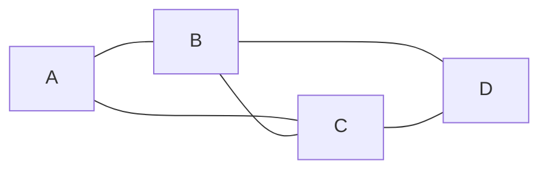
```mermaid
graph LR
    A --- B
    A --- C
    B --- C
    B --- D
    C --- D
```

树：

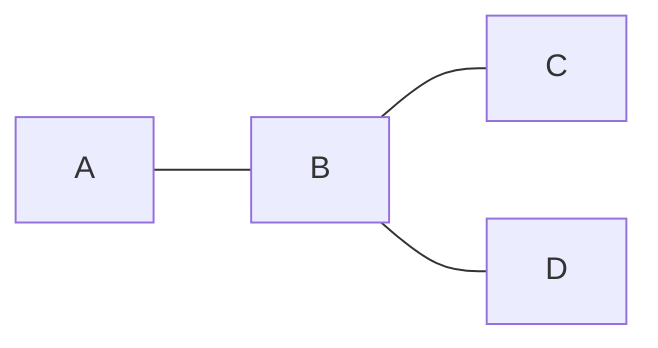
```mermaid
graph LR
    A --- B
    B --- C
    B --- D
```

另外一棵同样合法的生成树

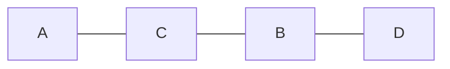
```mermaid
graph LR
    A --- C
    C --- B
    B --- D
```

**特点（可以当口诀记）**：

- 顶点数：n
- 边数：n - 1
- 加一条边 → 立即出现环
- 减一条边 → 立刻有人落单（不连通）

**8. 权 & 网（Weight & Network）**

给边加上“代价”。

这时图就变成了 **`网`**。

很多现实问题：找最便宜 / 时间最短 / 距离最近 都是**带权图**的经典问题。

**9. 图的存储方式（核心两种）**

**方式一：邻接矩阵（二维数组）**

用一个**方阵**表示哪两个站之间有边。

```c
int G[5][5];
G[0][2] = 1; // 0站 → 2站有边
```

| 优点                      | 缺点             |
| :------------------------ | :--------------- |
| 瞬间知道“A 到 B 有没有边” | 耗内存（很多 0） |
| 写代码极其简单            | 加/删顶点很麻烦  |

适合：顶点不多、边很密集的图。

**方式二：邻接表（链表数组）**

每个站只记录“它可以直接到哪些站”。

像“每个人的好友列表”。

| 优点         | 缺点                        |
| :----------- | :-------------------------- |
| 省内存       | 判断 A→B 有没有边，要翻列表 |
| 加顶点不麻烦 | 比矩阵复杂一点              |

适合：顶点多、边比较稀疏的图。

---

### 4.2 图的遍历

遍历 = 从某个顶点出发，按某种规则**走遍所有顶点**，不重复、不遗漏。

图的遍历有两种经典方式：

- **DFS**（深度优先搜索）
- **BFS**（广度优先搜索）

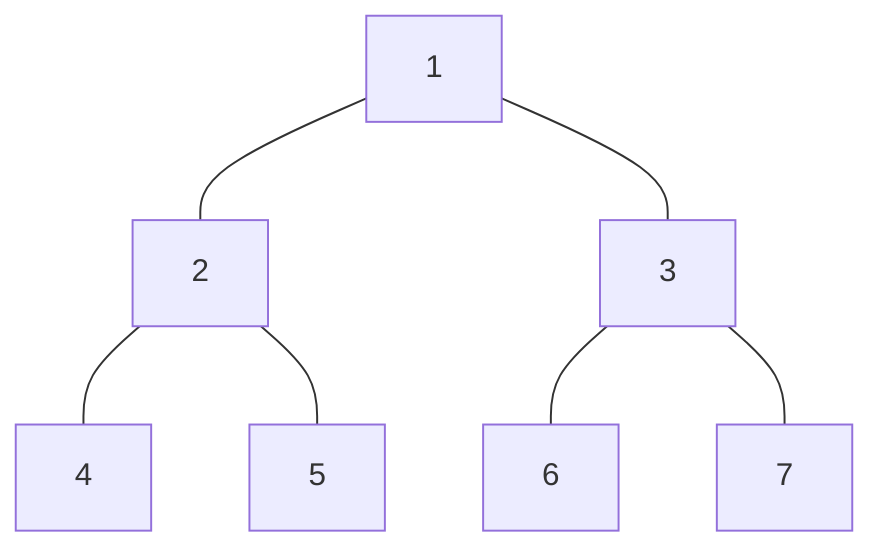
```mermaid
graph TD
    1 --- 2
    1 --- 3
    2 --- 4
    2 --- 5
    3 --- 6
    3 --- 7
```

我们**从顶点 1 出发**，分别用 DFS 和 BFS 遍历。

**1. DFS（深度优先搜索）**

像走迷宫：**一条路走到黑**，走不动了再回头。

**规则**：

1\. 从当前顶点出发，选一个没走过的邻居走进去。
2\. 重复第 1 步，直到走投无路。
3\. 回退到上一个顶点，找下一个没走过的邻居。
4\. 直到所有顶点都走完。

```text
1（起点）
├─ 先去 2
│  ├─ 2 的邻居：1（已走）、4、5
│  ├─ 先去 4
│  │  └─ 4 没有未走过的邻居 → 回 2
│  └─ 再去 5
│     └─ 5 没有未走过的邻居 → 回 2
│     └─ 2 走完 → 回 1
└─ 再去 3
   ├─ 3 的邻居：1（已走）、6、7
   ├─ 先去 6
   │  └─ 6 没有未走过的邻居 → 回 3
   └─ 再去 7
      └─ 7 没有未走过的邻居 → 结束
```

**DFS 访问顺序**：1 → 2 → 4 → 5 → 3 → 6 → 7

代码实现（邻接表 + 递归）

```c
int visited[MAX];  // 标记是否访问过

void DFS(ALGraph* G, int v) {
    visited[v] = 1;
    printf("%d ", v);

    ArcNode* p = G->vertices[v].first;
    while (p != NULL) {
        if (!visited[p->adjvex]) {
            DFS(G, p->adjvex); // 递归算法
        }
        p = p->next;
    }
}
```

**2. BFS（广度优先搜索）**

像水面投石：**一层一层往外扩**，先走完所有直接邻居，再走邻居的邻居。

**规则**：

1\. 从起点开始，把它的所有未访问邻居加入“待办清单”。
2\. 从清单里按顺序取出一个顶点。
3\. 重复第 2 步（把它的未访问邻居继续加入清单）。

```text
第1层：1
第2层：1 的邻居 → 2、3
第3层：2 的邻居 → 4、5
       3 的邻居 → 6、7
第4层：都没有未访问了
```

**BFS 访问顺序**：1 → 2 → 3 → 4 → 5 → 6 → 7

代码实现（邻接表 + 队列）

```c
void BFS(ALGraph* G, int v, int visited[]) {
    Queue q;
    initQueue(&q);
    
    visited[v] = 1;
    enqueue(&q, v);
    
    while (!isEmpty(&q)) {
        int u = dequeue(&q);
        printf("%d ", u);
        
        ArcNode* p = G->vertices[u].first;
        while (p != NULL) {
            if (!visited[p->adjvex]) {
                visited[p->adjvex] = 1;
                enqueue(&q, p->adjvex);
            }
            p = p->next;
        }
    }
}
```

**3. 非连通图的遍历**

如果图有多个连通分量，一次 DFS/BFS 走不完。

**解决方法**：对每个顶点都检查一次，没访问过就从它开始新的遍历。

```c
for (int i = 0; i < n; i++) {
    if (!visited[i]) {
        DFS(G, i);   // 或 BFS(G, i)
    }
}
```

### 4.3 最小生成树（MST）

在**带权无向图**中，找一个**包含所有顶点**的树，且**所有边的权值之和最小**。

**通俗理解**：有 n 个城市，要修路让它们都连通，且**总造价最低**。这就是“最小生成树”问题。

- 包含所有顶点
- 是树 → n 个顶点，n-1 条边，无环
- 权值和最小

是否有唯一性：✅ 当**所有权值互不相同**时有唯一性。❌ 在**存在权值相同的边**时可能不唯一。

**1. Prim 算法（加点法）**

核心思想：**从点出发**。任选一个起点，每次找**离当前树最近**的顶点加入，直到所有顶点都在树中。

```mermaid
graph LR
    A --- |4| B
    A --- |2| C
    B --- |5| C
    B --- |1| D
    C --- |8| D
```

**步骤**：

**第一步**：从 A 出发
当前树：{A}
候选边：A-B(4)、A-C(2) → 选最小的 A-C(2)，加入 C

**第二步**：当前树 {A, C}，树外 {B, D}
候选边：

- A-B(4)
- C-B(5)
- C-D(8)
  最小值是 A-B(4) → 加入 B

**第三步**：当前树 {A, B, C}，树外 {D}
候选边：

- B-D(1)
- C-D(8)
  最小值是 B-D(1) → 加入 D

**结果**：A-C(2)、A-B(4)、B-D(1)
**总权值** = 7

```mermaid
graph LR
    A --- |4| B
    A --- |2| C
    B --- |1| D
```

```mermaid
graph
    subgraph Prim过程
        step1["第1步：选A-C(2)"]
        step2["第2步：选A-B(4)"]
        step3["第3步：选B-D(1)"]
    end
    step1 --> step2 --> step3
```

**2. Kruskal 算法（加边法）**

核心思想：**从边出发**。把边按权值从小到大排序，依次选边，**不形成环就加**，直到有 n-1 条边。

```mermaid
graph LR
    A --- |4| B
    A --- |2| C
    B --- |5| C
    B --- |1| D
    C --- |8| D
```

**边排序**：
B-D(1)、A-C(2)、A-B(4)、B-C(5)、C-D(8)

**步骤**：

1\. 选 B-D(1) → {B, D}。
2\. 选 A-C(2) → {A, C}。
3\. 选 A-B(4) → {A, B, C, D}（合并两个集合）。
4\. B-C(5) 会形成环，跳过。
5\. C-D(8) 会形成环，跳过。

**结果**：B-D(1)、A-C(2)、A-B(4)
**总权值** = 7（和 Prim 一样）

**判断环的工具：并查集**

```c
int parent[MAX];

int find(int x) {
    return parent[x] == x ? x : parent[x] = find(parent[x]);
}

void unionSet(int a, int b) {
    int pa = find(a), pb = find(b);
    if (pa != pb) parent[pa] = pb;
}
```

选边前，先判断两个顶点是否已经在同一集合。
是 → 会形成环，跳过
否 → 可以加入，合并两个集合

| 对比项       | Prim               | Kruskal            |
| :----------- | :----------------- | :----------------- |
| 策略         | **加点**           | **加边**           |
| 起点         | 任意顶点           | 不需要             |
| 核心数据结构 | 数组 / 堆          | 并查集 + 排序      |
| 时间复杂度   | O(n²) / O(m log n) | O(m log m)         |
| 适合         | **稠密图**（边多） | **稀疏图**（边少） |
| 直观理解     | 树向外“生长”       | 边从小到大“筛选”   |

当最小生成树唯一时，两种算法结果一样。

> **Prim 贪心点，Kruskal 贪心边，结果一样都是最小生成树。**

---

### 4.4 最短路径（Shortest Path）

在**带权图**中，找两个顶点之间**权值之和最小**的路径。

**最短路径的两种经典问题**

| 问题类型         | 说明                                 | 算法                   |
| :--------------- | :----------------------------------- | :--------------------- |
| **单源最短路径** | 从一个起点到**所有其他点**的最短路径 | Dijkstra、Bellman-Ford |
| **多源最短路径** | **任意两点之间**的最短路径           | Floyd-Warshall         |

**1. Dijkstra 算法（单源，权值非负）**

核心思想：**贪心**。从起点出发，每次找**离起点最近**的顶点，用它去更新其他顶点的距离。

**规则**：

1\. `dist[i]`：起点到 i 的当前最短距离（初始：起点=0，其他=∞）。
2\. 从**未确定**的顶点中选 `dist` 最小的顶点 u，标记 u 为“已确定”。
3\. 用 u 更新它的邻居：`dist[v] = min(dist[v], dist[u] + w(u,v))`。
4\. 重复 2-3，直到所有顶点都确定。

```mermaid
graph LR
    A -- 4 --> B
    A -- 2 --> C
    B -- 5 --> C
    B -- 1 --> D
    C -- 8 --> D
```

**初始化**：

```text
dist[A]=0, dist[B]=∞, dist[C]=∞, dist[D]=∞
```

**第1步**：选 A（dist 最小=0），标记 A 已确定。
更新邻居：

- dist[B] = min(∞, 0+4) = 4
- dist[C] = min(∞, 0+2) = 2

当前 dist：A✅, B(4), C(2), D(∞)

**第2步**：未确定中最小的 C（2），标记 C 已确定。
更新邻居（C 到 D 有边 8）：

- dist[D] = min(∞, 2+8) = 10

当前 dist：A✅, B(4), C✅, D(10)

**第3步**：未确定中最小的 B（4），标记 B 已确定。
更新邻居（B 到 D 有边 1）：

- dist[D] = min(10, 4+1) = 5

当前 dist：A✅, B✅, C✅, D(5)

**第4步**：只剩下 D，标记确定

```text
A→B: 4  (A→B)
A→C: 2  (A→C)
A→D: 5  (A→B→D)
```

⚠️ Dijkstra 算法不能有负权边

因为贪心假设：当前选的最小 `dist` 不会再被更新。负权边可能让一个已经确定的路由变得更短 → 算法失效。

**2. Floyd 算法（多源，可负权，无负环）**

核心思想：**动态规划**。逐个顶点作为“中间点”，看能不能让两点之间的距离变短。

**状态定义**：`dist[k][i][j]` = 从 i 到 j，**中间只经过前 k 个顶点**的最短路径。

**压缩后**：`dist[i][j]` 直接更新。

**核心公式**：

```text
dist[i][j] = min(dist[i][j], dist[i][k] + dist[k][j])
```

```c
#define INF 0x3f3f3f3f

void floyd(int n, int dist[MAX][MAX]) {
    for (int k = 0; k < n; k++) {			// 中间点
        for (int i = 0; i < n; i++) {		// 起点
            for (int j = 0; j < n; j++) {	// 终点
                if (dist[i][k] + dist[k][j] < dist[i][j]) {
                    dist[i][j] = dist[i][k] + dist[k][j];
                }
            }
        }
    }
}
```

简例：

```mermaid
graph LR
    A -- 3 --> B
    A -- 8 --> C
    B -- 2 --> C
```

初始化：

```text
    A   B   C
A   0   3   8
B   ∞   0   2
C   ∞   ∞   0
```

**k = 0（A 做中间点）**：
i=1(B) → j=2(C)：dist\[B\]\[A\]+dist\[A\]\[C\] = ∞+8 = ∞，不变

**k = 1（B 做中间点）**：
i=0(A) → j=2(C)：dist\[A\]\[B\]+dist\[B\]\[C\] = 3+2 = 5 < 8 → 更新 dist\[A\]\[C\]=5

**k = 2（C 做中间点）**：无更新

**最终**：A→C 最短 = 5（A→B→C），不是直接 8。

| 算法         | 解决的问题     | 支持负权       | 时间复杂度         | 结构     |
| :----------- | :------------- | :------------- | :----------------- | :------- |
| Dijkstra     | 单源           | ❌ 不能         | O(n²) / O(m log n) | 贪心     |
| Floyd        | 多源           | ✅ 可（无负环） | O(n³)              | 动态规划 |
| Bellman-Ford | 单源（含负权） | ✅ 可           | O(nm)              | 松弛     |

*Bellman-Ford 了解即可，主要掌握 Dijkstra + Floyd。*

**3. 路径还原（记录走法）**

Dijkstra 路径还原

```c
int prev[MAX];  // 记录前驱

// 更新距离时
if (newDist < dist[v]) {
    dist[v] = newDist;
    prev[v] = u;   // 记录：到 v 的上一个点是 u
}

// 打印从起点到 t 的路径
void printPath(int t) {
    if (t == -1) return;
    printPath(prev[t]);
    printf("%d ", t);
}
```

Floyd 路径还原

```c
int path[MAX][MAX];  // path[i][j] = 从 i 到 j 的第一个中间点

// 初始化
if (有边) path[i][j] = j;
else path[i][j] = -1;

// 更新时
if (dist[i][k] + dist[k][j] < dist[i][j]) {
    dist[i][j] = dist[i][k] + dist[k][j];
    path[i][j] = path[i][k];  // 先到 k，再到 j
}
```

**4. 常见问题**

> 1\. Dijkstra 为什么用优先队列（堆）优化？

普通写法每次找最小值 O(n)，用堆可以降到 O(log n)，总复杂度 O(m log n)。

> 2\. Dijkstra 能处理有环图吗？

**能**。它只是不能处理**负权边**，有正权环没问题。

> 3\. 负权环怎么办？

Floyd 和 Bellman-Ford 可以检测负权环。负权环存在时，最短路径无解（可以无限小）。

---

### 4.5 拓扑排序（Topological Sort）

**定义**：对一个**有向无环图（DAG）** 的所有顶点进行线性排序，使得对于每条边 `u → v`，**u 都排在 v 的前面**。（任务 A 完成后才能做 B）

```mermaid
graph LR
    1 --> 2
    1 --> 3
    2 --> 4
    3 --> 4
```

**拓扑排序**：`1 → 2 → 3 → 4` 或 `1 → 3 → 2 → 4`

**方法一：Kahn 算法（BFS*（广度优先）* / 贪心）**

**核心思想**：不断找**入度为 0** 的顶点，删掉它和它的出边。

代码思路：

1\. 统计所有顶点的**入度**。
2\. 把所有入度为 0 的顶点入队。
3\. 取出队首顶点 u，输出。
4\. 对于 u 的每个邻居 v，把 v 的入度减 1。
5\. 如果 v 的入度变成 0，把 v 入队。
6\. 重复 3-5，直到队列为空。

举例理解：

如上图初始入度：

```text
顶点: 1  2  3  4
入度: 0  1  1  2
```

- 入度为 0 的顶点：{1} → 输出 1，删掉 1 的出边（1→2, 1→3）
  更新入度：2(1→0)，3(1→0)，4(2→2)
- 入度为 0 的顶点：{2, 3} → 输出 2，删掉 2 的出边（2→4）
  更新入度：4(2→1)
- 入度为 0 的顶点：{3} → 输出 3，删掉 3 的出边（3→4）
  更新入度：4(1→0)
- 入度为 0 的顶点：{4} → 输出 4

**结果**：`1 2 3 4`

代码实现：

```c
#include <stdio.h>
#include <stdlib.h>

#define MAX 100

// 邻接表结点
typedef struct ArcNode {
    int adjvex;
    struct ArcNode* next;
} ArcNode;

// 顶点结点
typedef struct VNode {
    int data;
    ArcNode* first;
} VNode, AdjList[MAX];

typedef struct {
    AdjList vertices;
    int vexnum, arcnum;
} ALGraph;

// 简单队列
typedef struct {
    int data[MAX];
    int front, rear;
} Queue;

void initQueue(Queue* q) {
    q->front = q->rear = 0;
}

int isEmpty(Queue* q) {
    return q->front == q->rear;
}

void enqueue(Queue* q, int v) {
    q->data[q->rear++] = v;
}

int dequeue(Queue* q) {
    return q->data[q->front++];
}

// 拓扑排序（Kahn算法）
int topologicalSort(ALGraph* G, int result[]) {
    int indegree[MAX] = {0};
    Queue q;
    initQueue(&q);
    int count = 0;  // 已输出的顶点数

    // 1. 统计入度
    for (int i = 0; i < G->vexnum; i++) {
        ArcNode* p = G->vertices[i].first;
        while (p != NULL) {
            indegree[p->adjvex]++;
            p = p->next;
        }
    }

    // 2. 入度为0的顶点入队
    for (int i = 0; i < G->vexnum; i++) {
        if (indegree[i] == 0) {
            enqueue(&q, i);
        }
    }

    // 3. 处理队列
    while (!isEmpty(&q)) {
        int u = dequeue(&q);
        result[count++] = u;

        ArcNode* p = G->vertices[u].first;
        while (p != NULL) {
            int v = p->adjvex;
            indegree[v]--;
            if (indegree[v] == 0) {
                enqueue(&q, v);
            }
            p = p->next;
        }
    }

    // 4. 判断是否有环
    if (count != G->vexnum) {
        printf("图中有环，无法拓扑排序！\n");
        return 0;
    }
    return 1;
}
```

**方法二：DFS 方法（深度优先）**

**核心思想**：用 DFS 遍历，在**回溯时**把顶点加入结果栈，最后反转。

**步骤**：

1\. 对每个未访问的顶点调用 DFS。
2\. 在 DFS 中，先递归访问所有邻居。
3\. 回溯时把当前顶点压入栈。
4\. 最后栈顶到栈底就是拓扑排序‘。

**拓扑排序的检测环功能**

如果最后输出的顶点数 **≠ 总顶点数**，说明图中有环。

```mermaid
graph LR
    1 --> 2
    2 --> 3
    3 --> 1
```

这个图有环 → 没有入度为 0 的顶点 → 拓扑排序失败。

**✅ 有向无环图（DAG）的拓扑排序不一定唯一。**

### 4.6 关键路径（Critical Path）

在**有向无环图** 中，从起点到终点的**最长路径**叫关键路径（按权值计算）。

**关键点**：基于**拓扑排序**（先有拓扑序，才能算关键路径）的**最长路径**（不是最短）。

**1. AOE 网（Activity On Edge）**

在关键路径问题中，我们通常用 **AOE 网**

```mermaid
graph LR
    v1 -->|6| v2
    v1 -->|4| v3
    v2 -->|1| v5
    v3 -->|1| v5
    v5 -->|2| v6
```

| 图形元素         | 含义               | 例子               |
| :--------------- | :----------------- | :----------------- |
| **顶点**（圆圈） | 事件（某个时间点） | 任务开始、任务完成 |
| **边**（箭头）   | 活动（具体任务）   | 写代码、做测试     |
| **边上的数字**   | 活动耗时           | 6 天、4 天、1 天   |

*与 AOV 网对比：*
*AOV 网（Activity On Vertex）：顶点是活动，边表示依赖关系，用于**拓扑排序**。*
*AOE 网（Activity On Edge）：边是活动，用于**关键路径**。*

| 术语             | 含义                                                       |
| :--------------- | :--------------------------------------------------------- |
| 事件最早发生时间 | 从起点到该顶点的**最长路径长度**（从前往后算）             |
| 事件最迟发生时间 | 不影响工期的前提下，该顶点**最晚**发生的时间（从后往前算） |
| 活动最早开始时间 | 活动可以开始的最早时间 = 起点的 ve                         |
| 活动最迟开始时间 | 活动必须开始的最晚时间 = 终点的 vl - 边权                  |
| 活动的时间余量   | 活动可以拖延的时间                                         |
| **关键活动**     | **l - e == 0** 的活动，一天都不能拖                        |
| **关键路径**     | 由关键活动组成的路径                                       |

例子：

```mermaid
graph LR
    v1 -->|6| v2
    v1 -->|4| v3
    v1 -->|5| v4
    v2 -->|1| v5
    v3 -->|1| v5
    v4 -->|2| v5
    v5 -->|2| v6
```

**顶点**：v1(起点), v2, v3, v4, v5, v6(终点)
**边上的数字**：活动耗时

1\. 拓扑排序：先确定顺序：v1 → v2/v3/v4 → v5 → v6

2\. 求 ve（事件最早发生时间）—— 从前往后

规则：`ve[j] = max(ve[i] + w(i, j))`

```text
ve[v1] = 0

v2: ve[v2] = ve[v1] + 6 = 6
v3: ve[v3] = ve[v1] + 4 = 4
v4: ve[v4] = ve[v1] + 5 = 5

v5: 有三个前驱
  - 从 v2: 6 + 1 = 7
  - 从 v3: 4 + 1 = 5
  - 从 v4: 5 + 2 = 7
  → ve[v5] = max(7, 5, 7) = 7

v6: 只有一个前驱 v5: 7 + 2 = 9
  → ve[v6] = 9
```

ve = [v1=0, v2=6, v3=4, v4=5, v5=7, v6=9]

总工期 = ve[v6] = 9

3\. 求 vl（事件最迟发生时间）—— 从后往前

规则：`vl[i] = min(vl[j] - w(i, j))`
初始化：`vl[终点] = ve[终点] = 9`

```text
vl[v6] = 9

v5: 只有一个后继 v6: 9 - 2 = 7
  → vl[v5] = 7

v2: 后继 v5: 7 - 1 = 6
  → vl[v2] = 6

v3: 后继 v5: 7 - 1 = 6
  → vl[v3] = 6

v4: 后继 v5: 7 - 2 = 5
  → vl[v4] = 5

v1: 三个后继
  - 到 v2: 6 - 6 = 0
  - 到 v3: 6 - 4 = 2
  - 到 v4: 5 - 5 = 0
  → vl[v1] = min(0, 2, 0) = 0
```

vl = [v1=0, v2=6, v3=6, v4=5, v5=7, v6=9]

4\. 求 e 和 l（活动的最早/最迟开始时间）

活动 = 边 `u → v`

- **e** = ve[u]
- **l** = vl[v] - w

| 活动 | 边       | e    | l     | 余量(l-e) | 是否关键 |
| :--- | :------- | :--- | :---- | :-------- | :------- |
| a1   | v1→v2(6) | 0    | 6-6=0 | 0         | 是✅      |
| a2   | v1→v3(4) | 0    | 6-4=2 | 2         | 否❌      |
| a3   | v1→v4(5) | 0    | 5-5=0 | 0         | 是✅      |
| a4   | v2→v5(1) | 6    | 7-1=6 | 0         | 是✅      |
| a5   | v3→v5(1) | 4    | 7-1=6 | 2         | 否❌      |
| a6   | v4→v5(2) | 5    | 7-2=5 | 0         | 是✅      |
| a7   | v5→v6(2) | 7    | 9-2=7 | 0         | 是✅      |

5\. 找出关键路径

关键活动：a1, a3, a4, a6, a7

**关键路径**：v1 → v2 → v5 → v6 和 v1 → v4 → v5 → v6

```mermaid
graph LR
    v1 -->|6| v2
    v1 -->|5| v4
    v2 -->|1| v5
    v4 -->|2| v5
    v5 -->|2| v6
```

项目最短工期 = 9

*这破玩意不学考试是真挂科啊，谁家好人有STL不用还手写数据结构，没错就是苦b的大学生😭*
*下面是简单说说STL的数据结构，感兴趣的可以去《C++速查参考》看看*

---

## 线性表（STL）

**STL是什么？**

STL = Standard Template Library（标准模板库），是C++自带的一套"现成的工具"，里面有很多常用的数据结构，比如：

- `vector`：动态数组（类似顺序表）
- `list`：双向链表（类似链表）

**优点**：不用自己写，直接用，代码更简单、更安全。

---

### 5.1 vector（顺序表/动态数组）

**1. 头文件**

```c++
#include <vector>
```

**2. 常用操作**

| 操作       | 代码                               | 说明                   |
| :--------- | :--------------------------------- | :--------------------- |
| 定义       | `vector<int> v;`                   | 创建一个空的整型vector |
| 末尾添加   | `v.push_back(10);`                 | 在末尾加元素           |
| 插入       | `v.insert(v.begin()+2, 25);`       | 在第3个位置插入25      |
| 删除       | `v.erase(v.begin()+1);`            | 删除第2个元素          |
| 按位置访问 | `int x = v[2];`                    | 获取第3个元素          |
| 获取长度   | `int len = v.size();`              | 当前元素个数           |
| 判断空     | `v.empty();`                       | 空返回true             |
| 清空       | `v.clear();`                       | 删除所有元素           |
| 遍历       | `for(int x : v) cout << x << " ";` | 打印所有元素           |

### 5.2 list（双向链表）

**1. 头文件**

```c++
#include <list>
```

**2. 常用操作**

| 操作     | 代码                               | 说明                 |
| :------- | :--------------------------------- | :------------------- |
| 定义     | `list<int> L;`                     | 创建一个空的整型链表 |
| 末尾添加 | `L.push_back(10);`                 | 尾插法               |
| 头部添加 | `L.push_front(5);`                 | 头插法               |
| 末尾删除 | `L.pop_back();`                    | 删除最后一个         |
| 头部删除 | `L.pop_front();`                   | 删除第一个           |
| 插入     | `L.insert(it, 25);`                | 在迭代器位置插入     |
| 删除     | `L.erase(it);`                     | 删除迭代器位置的元素 |
| 获取长度 | `int len = L.size();`              | 当前元素个数         |
| 判断空   | `L.empty();`                       | 空返回true           |
| 清空     | `L.clear();`                       | 删除所有元素         |
| 遍历     | `for(int x : L) cout << x << " ";` | 打印所有元素         |

**vector vs list 对比**

| 操作             | vector                 | list                     |
| :--------------- | :--------------------- | :----------------------- |
| 随机访问（下标） | ✅ `v[3]`               | ❌ 不支持                 |
| 头部插入/删除    | ❌ 慢                   | ✅ `push_front/pop_front` |
| 尾部插入/删除    | ✅ `push_back/pop_back` | ✅ `push_back/pop_back`   |
| 中间插入/删除    | ❌ 慢（O(n)）           | ✅ 快（O(1)）             |
| 内存             | 连续                   | 不连续                   |

## 栈和队列（STL）

### 6.1 stack（栈）

**1. 头文件**

```c++
#include <stack>
```

**特点**

- **后进先出**（LIFO）
- 只能从顶部操作

**2. 常用操作**

| 操作     | 代码            | 说明                   |
| :------- | :-------------- | :--------------------- |
| 定义     | `stack<int> s;` | 创建一个空栈           |
| 压栈     | `s.push(10);`   | 放入元素               |
| 出栈     | `s.pop();`      | 移除顶部元素（不返回） |
| 查看栈顶 | `s.top();`      | 返回顶部元素           |
| 判断空   | `s.empty();`    | 空返回true             |
| 获取大小 | `s.size();`     | 返回元素个数           |

### 6.2queue（队列）

**1. 头文件**

```c++
#include <queue>
```

**特点**

- **先进先出**（FIFO）
- 队尾入队，队头出队

**2. 常用操作**

| 操作     | 代码            | 说明                   |
| :------- | :-------------- | :--------------------- |
| 定义     | `queue<int> q;` | 创建一个空队列         |
| 入队     | `q.push(10);`   | 队尾添加元素           |
| 出队     | `q.pop();`      | 移除队头元素（不返回） |
| 查看队头 | `q.front();`    | 返回队头元素           |
| 查看队尾 | `q.back();`     | 返回队尾元素           |
| 判断空   | `q.empty();`    | 空返回true             |
| 获取大小 | `q.size();`     | 返回元素个数           |

**注意事项**

1\. pop() 不返回值

```c++
// 错误写法
int x = s.pop();  // ❌ 编译错误

// 正确写法
int x = s.top();  // 先获取
s.pop();          // 再删除
```

2\. 使用前要判空

```c++
if (!s.empty()) {
    cout << s.top() << endl;
}
```

3\. 遍历方式

stack 和 queue **没有迭代器**，不能这样遍历：

```c++
// ❌ 错误
for (auto it = s.begin(); it != s.end(); it++) 

// ✅ 正确：只能边pop边遍历
while (!s.empty()) {
    cout << s.top() << " ";
    s.pop();
}
```