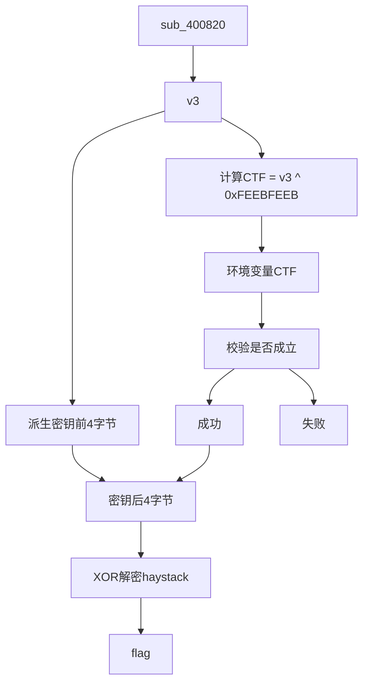
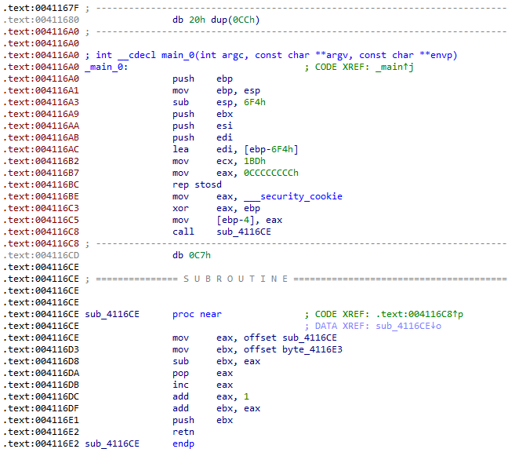
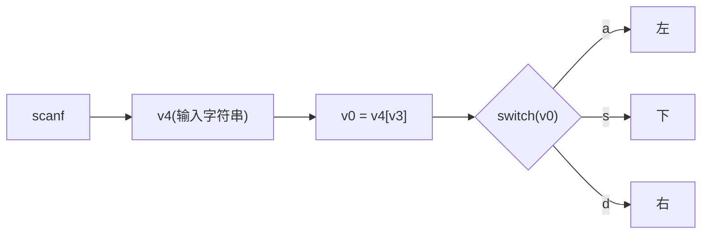

---
layout: post
title: "攻防世界 reverse"
toc: true
date: 2026-07-27
categories: 分类名称
tags: [逆向工程]
---

# 攻防世界 reverse

## ReverseMe-120

**1.1 题目概述**

exe可执行文件，无壳。

---

**1.2 静态分析**

**1. 定位成功条件**

首先，使用IDA打开程序，定位到验证逻辑部分。观察到程序的关键伪代码：

```c
  v9 = strcmp(v12, "you_know_how_to_remove_junk_code");
  if ( v9 )
    v9 = v9 < 0 ? -1 : 1;
  if ( v9 )
    printf("wrong\n");
  else
    printf("correct\n");
  system("pause");
  return 0;
```

**关键发现**: 成功条件是`v9`，而`v9`是`v13`与字符串`"you_know_how_to_remove_junk_code"`比较的结果。

**2. 追踪数据流**

继续追踪`v13`的数据流，查看它是如何生成的：

```c
  printf("please input your flah:");
  memset(v11, 0, sizeof(v11));
  scanf("%s", v11);  // 输入
  memset(v12, 0, sizeof(v12));
  sub_401000(v11, strlen(v11)); // 输入处理
```

**关键发现**: `sub_401000`是关键函数，因为它同时包含了：
- **刚定义的**`v13`（作为输出参数）
- **用户输入**`v11`（作为输入参数）

**3. 函数参数追踪**

进入`sub_401000`函数内部，注意我们想知道的是`v13`是怎么得到的。`v13`作为第二个参数，在函数中标记为`a2`，顺着`a2`追踪：

```c
  if ( a1 && *a2 >= v13 )
  {
    v21 = 3;
    v14 = 0;
    for ( i = 0; v5; --v5 )
    {
      v15 = *v7;
      if ( *v7 != 13 && v15 != 10 && v15 != 32 )
      {
        v16 = byte_414E40[v15];        // byte_414E40就是base64_suffix_map
        v21 -= v16 == 64;
        v14 = v16 & 0x3F | (v14 << 6); // 将其依次放入一个int型中，占3字节
        if ( ++i == 4 )                // 输入4个字节
        {
          i = 0;                       // 输出3个字节
          if ( v21 )
            *v12++ = BYTE2(v14);
          if ( v21 > 1 )
            *v12++ = BYTE1(v14);
          if ( v21 > 2 )
            *v12++ = v14;
        }
      }
      ++v7;
    }
```

**4. 识别Base64解码表**

在`sub_401000`函数中，发现一个关键数组`byte_414E40`，其内容如下：

```python
byte_414E40[] = {
    'A', 'B', 'C', 'D', 'E', 'F', 'G', 'H', 'I', 'J', 'K', 'L', 'M',
    'N', 'O', 'P', 'Q', 'R', 'S', 'T', 'U', 'V', 'W', 'X', 'Y', 'Z',
    'a', 'b', 'c', 'd', 'e', 'f', 'g', 'h', 'i', 'j', 'k', 'l', 'm',
    'n', 'o', 'p', 'q', 'r', 's', 't', 'u', 'v', 'w', 'x', 'y', 'z',
    '0', '1', '2', '3', '4', '5', '6', '7', '8', '9', '+', '/'
};
```

**关键识别**: 一眼看出这是标准Base64解码表。

> 💡 **知识点补充**: Base64编码原理
> - 将每3个字节（24位）分为一组
> - 每组再细分为4个6位块
> - 每个6位块对应0-63的索引
> - 索引映射到上述64个字符表中的对应字符
> - 如果最后不足3字节，用`=`填充

**5. 确认函数功能**

**结论**: `sub_401000`是**Base64解码函数**。`你的输入`---->`base64解码`---->`得到v13`。

然后继续往下分析。一个if语句中，有个for循环

```c
  if ( v13 )
  {
    if ( v13 >= 0x10 )
    {
      si128 = _mm_load_si128(&xmmword_414F20);
      v6 = v13 - (v13 & 0xF);
      v7 = v12;
      do
      {
        v8 = _mm_loadu_si128(v7);
        v4 += 16;
        ++v7;
        v7[-1] = _mm_xor_si128(v8, si128);
      }
      while ( v4 < v6 );
    }
    for ( ; v4 < v3; ++v4 )
      v12[v4] ^= 0x25u;
  }
```

就是把v13所指的字符串挨个与0x25异或

**6. 整理数据流**

将所有发现的线索整合，得到完整的数据流：

```text
用户输入 (v11)
    ↓
Base64解码 (sub_401000)
    ↓
得到 v13
    ↓
v13[i] XOR 0x25 (逐字节异或)
    ↓
得到 v15
    ↓
strcmp(v15, "you_know_how_to_remove_junk_code")
    ↓
结果为0则 v9 = 1，成功！
```

**7. 逆向思路**

根据正向流程，反向推导：

```text
目标字符串: "you_know_how_to_remove_junk_code"
    ↓
步骤1: 逆向XOR操作（与0x25异或）
    ↓
中间结果: "\JPzNKJRzMJRzQJzW@HJS@zOPKNzFJA@"
    ↓
步骤2: 逆向Base64解码（改为Base64编码）
    ↓
正确输入: "XEpQek5LSlJ6TUpSelFKeldASEpTQHpPUEtOekZKQUA="
```

逆向操作的数学表达：

```text
正向: result = Base64Decode(input)
逆向: input = Base64Encode(result)

正向: result[i] = v13[i] XOR 0x25
逆向: v13[i] = result[i] XOR 0x25
```

---

**1.3 Python解题脚本**

```python
import base64

def solve():
    """
    逆向推导正确输入
    """
    # 目标字符串（程序中硬编码）
    target = "you_know_how_to_remove_junk_code"
    print(f"目标字符串: {target}")
    print(f"长度: {len(target)}")

    # 步骤1: 逆向XOR操作
    # v13[i] = target[i] XOR 0x25
    v13 = ''.join([chr(ord(c) ^ 0x25) for c in target])
    print(f"\n步骤1 - 逆向XOR 0x25:")
    print(f"v13 = {repr(v13)}")

    # 步骤2: Base64编码（逆向Base64解码）
    # input = Base64Encode(v13)
    user_input = base64.b64encode(v13.encode()).decode()
    print(f"\n步骤2 - Base64编码:")
    print(f"正确输入 = {user_input}")

    return user_input

if __name__ == "__main__":
    print("ReverseMe-120 逆向解题")
    print("="*60 + "\n")

    # 解题
    user_input = solve()
```

flag

```text
XEpQek5LSlJ6TUpSelFKeldASEpTQHpPUEtOekZKQUA=
```

---

**1.4 知识点总结**

**Base64编码原理**

| 概念 | 说明 |
|------|------|
| 编码表 | 64个字符（A-Z, a-z, 0-9, +, /） |
| 编码过程 | 3字节 → 4字符 |
| 填充规则 | 不足3字节用`=`填充 |
| 解码过程 | 4字符 → 3字节 |

**XOR加密特点**

- **可逆性**: `A XOR B = C` → `C XOR B = A`
- **对称性**: 加密和解密使用相同操作
- **常用场景**: 简单加密、混淆、校验

**逆向分析思路**

```text
1. 定位关键字符串
2. 追踪数据流
3. 识别算法特征
4. 逆向推导逻辑
5. 编写解题脚本
```

---

## getit

**题目描述**

```text
菜鸡发现这个程序偷偷摸摸在自己的机器上搞事情，它决定一探究竟
```

**文件信息**

```text
file: e3dd9674429f4ce1a25c08ea799fc027
类型: ELF 64-bit LSB executable, x86-64, 无壳
```

---

**方法一：静态分析**

**1. IDA Pro 分析 main 函数**

反编译 main 函数得到：

```c
int __cdecl main(int argc, const char **argv, const char **envp)
{
  char v3; // al
  int i; // [rsp+0h] [rbp-40h]
  int j; // [rsp+4h] [rbp-3Ch]
  FILE *stream; // [rsp+8h] [rbp-38h]
  char filename[24]; // [rsp+10h] [rbp-30h]
  unsigned __int64 v9; // [rsp+28h] [rbp-18h]

  v9 = __readfsqword(0x28u);
  for ( i = 0; i < strlen(s); ++i )
  {
    if ( (i & 1) != 0 )
      v3 = 1;
    else
      v3 = -1;
    *(&t + i + 10) = s[i] + v3;  // 关键：解密操作
  }
  strcpy(filename, "/tmp/flag.txt");
  stream = fopen(filename, "w");
  fprintf(stream, "%s\n", u);
  for ( j = 0; j < strlen(&t); ++j )
  {
    fseek(stream, p[j], 0);
    fputc(*(&t + p[j]), stream);  // 用 p 数组指定的偏移写入 t 中的字符
    fseek(stream, 0LL, 0);
    fprintf(stream, "%s\n", u);
  }
  fclose(stream);
  remove(filename);
  return 0;
}
```

**2. 提取关键数据**

从二进制文件的数据段提取：

- **s** (加密字符串): `c61b68366edeb7bdce3c6820314b7498`
- **t** (模板字符串): `SharifCTF{????????????????????????????????}`
- **u** (星号字符串): `*******************************************`

**3. 分析解密逻辑**

```c
for ( i = 0; i < strlen(s); ++i )
{
    if ( (i & 1) != 0 )
      v3 = 1;      // i 为奇数时 +1
    else
      v3 = -1;     // i 为偶数时 -1
    *(&t + i + 10) = s[i] + v3;  // 写入 t[10+i]
}
```

解密规则：
- 偶数索引：字符 - 1
- 奇数索引：字符 + 1

**4. Python 计算 flag**

```python
s = "c61b68366edeb7bdce3c6820314b7498"

result = []
for i, c in enumerate(s):
    v3 = 1 if (i & 1) != 0 else -1
    new_char = chr(ord(c) + v3)
    result.append(new_char)

flag = ''.join(result)
print(f"SharifCTF{{{flag}}}")
```

输出：
```text
SharifCTF{b70c59275fcfa8aebf2d5911223c6589}
```

---

**方法二：动态调试 (pwndbg)**

**1. 运行程序**

```bash
./e3dd9674429f4ce1a25c08ea799fc027
```

**2. 下断点并调试**

在 `remove` 函数处下断点，此时 flag 已在内存中：

```bash
b remove
r
```

**3. 搜索 flag**

```bash
pwndbg> search CTF
e3dd9674429f4ce1a25c08ea799fc027 0x6010e6 'CTF{b70c59275fcfa8aebf2d5911223c6589}'
```

**4. 查看完整 flag**

```bash
pwndbg> x/s 0x6010e0
0x6010e0 <t>:   "SharifCTF{b70c59275fcfa8aebf2d5911223c6589}"
```

---

**程序行为分析**

文件写入流程

```text
1. fopen("/tmp/flag.txt", "w")    // 创建空文件
2. fprintf(stream, "%s\n", u)     // 写入42个星号 + 换行
3. for循环:                       // 逐字符覆盖
   - fseek(stream, p[j], 0)       // 跳到指定偏移
   - fputc(t[p[j]], stream)       // 写入字符
   - fseek(stream, 0, 0)         // 回到开头
   - fprintf(stream, "%s\n", u)   // 再次写入星号
4. fclose(stream)                 // 关闭文件
5. remove("/tmp/flag.txt")         // 删除文件
```

> 为什么 cat 看不到 flag？

因为 flag 被写入文件的**中间位置**，而 `cat` 默认只显示文件开头，所以看不到隐藏在星号中间的 flag。

```text
初始打开文件 (fopen "w")：
[空文件]

第1步 fprintf (写入星号)：
*******************************************

第2步 for循环 (逐字符覆盖特定位置)：
*******************************************
          ↑用 t[p[0]] 覆盖
*********************************F*********  ← 用 F 覆盖第27个位置
*********************************TF********  ← 用 TF 覆盖第26-27个位置
...
最终变成：
*******************************************
CTF{b70c59275fcfa8aebf2d5911223c6589}
*******************************************

第3步 fprintf (再写入星号)：
*******************************************
CTF{b70c59275fcfa8aebf2d5911223c6589}
*******************************************

最终 fclose + remove
```

> 为什么 search 能找到？

`search` 命令搜索的是**进程运行时内存**，而不是磁盘文件。此时 flag 已在 `t` 数组（地址 `0x6010e0`）中解密完成。

---

## happyCTF

**题目概述**

这是一个典型的密码验证程序（无壳），用户需要输入24字符的flag，程序通过加密后与预存的密文比较来验证正确性。

---

**方法一：静态分析**

**1. 程序结构**

使用 IDA Pro 打开 `happyCTF.exe`，查看主函数 `_main`（地址 `0x4067b0`）：

```c++
int __cdecl main(int argc, const char **argv, const char **envp)
{
    // 输入验证
    if (std::string::length(&str) == 24)
    {
        qmemcpy(v6, "rxusoCqxw{yqK`{KZqag{r`i", 24);
        // 加密和比较逻辑
    }
    else
    {
        std::cout << "not enought";
        return 0;
    }
}
```

**结论**：输入必须是 **24 个字符**。

**2. 加密算法分析**

找到 lambda 加密函数（地址 `0x403b70`）：

```c++
void operator()(unsigned __int8 bytee) {
    _Val[0] = bytee ^ 0x14;  // 核心加密：XOR 0x14
    std::vector<unsigned char>::push_back(this->v, _Val);
}
```

**加密公式**：`加密后 = 明文 XOR 0x14`

**3. 密文提取**

从主函数中提取密文：

```c++
qmemcpy(key, "rxusoCqxw{yqK`{KZqag{r`i", sizeof(key));
```

**4. 静态解密脚本**

```python
# 密文
ciphertext = b"rxusoCqxw{yqK`{KZqag{r`i"

# 密钥
key = 0x14

# 解密
flag = bytes([b ^ key for b in ciphertext])
print(flag.decode())
```

运行结果：
```text
happyCTF{y0u_4r3_4_h4ck3r}
```

---

方法二：动态调试

**1. 调试环境**

- **工具**：x64dbg / IDA Debugger
- **目标**：在加密后下断点，获取加密结果

**2. 关键断点位置**

| 断点位置 | 地址       | 目的                    |
| -------- | ---------- | ----------------------- |
| 加密后   | `0x4068c2` | 查看单个字符加密结果    |
| 比较前   | `0x406974` | 查看完整加密后的 vector |

**3. 调试步骤**

```text
1. 在 lambda operator() 处下断点（0x403b70）
2. 运行程序，输入任意24字符（如 "aaaaaaaaaaaaaaaaaaaaaaaa"）
3. 每次断点时查看加密结果：
   - 输入 'a' (0x61)
   - 加密后 = 0x61 ^ 0x14 = 0x75 ('u')
4. 确认密钥是 0x14
5. 用密钥解密预存密文
```

**4. 调试分析**

输入 24 个 'a' 后，加密结果为：

```text
uuuuuuuuuuuuuuuuuuuuuuuu
```

把下面的密文异或解密就得到flag。

```text
rxusoCqxw{yqK`{KZqag{r`i
```

---

**加密流程总结**

```text
输入 (24字符)
    ↓
每个字符 XOR 0x14
    ↓
加密后的字符串
    ↓
与密文 "rxusoCqxw{yqK`{KZqag{r`i" 比较
    ↓
全部匹配 → "good job"
```

---

**关键要点**

**1. XOR 加密的数学性质**

```text
加密：E = P XOR K
解密：P = E XOR K
```
因为 `(P XOR K) XOR K = P`，所以知道密文和密钥就能直接解密。

**2. 常见陷阱**

- **不要假设是加法**：看到字符变化不要想当然认为是加减运算
- **注意密钥提取**：密钥可能是常量、变量或动态生成
- **验证结果**：解密后检查是否符合 flag 格式（如 `happyCTF{...}`）

---

**附录：完整解密脚本**

```python
#!/usr/bin/env python3

# 从程序中提取的密文
ciphertext = b"rxusoCqxw{yqK`{KZqag{r`i"

# 通过静态分析或动态调试确定的密钥
key = 0x14

# XOR 解密
flag = bytes([byte ^ key for byte in ciphertext])

print("Flag:", flag.decode())
```

---

## xxxorrr

**题目信息**

```text
程序：xor
类型：ELF 64-bit 无壳
特点：ptrace 反调试 + PIE + 双重 XOR 加密
```

---

**方法一：静态分析**

**1. 提取字符串**

```bash
strings xor
```

输出：
```text
ptrace
Congratulations!
Wrong!
qasxcytgsasxcvrefghnrfghnjedfgbhn
VNWXQQ  F
FTZYY
```

**2. IDA 分析 main 函数**

```c
__int64 __fastcall main(int a1, char **a2, char **a3)
{
  int i; // [rsp+Ch] [rbp-34h]
  char s[40]; // [rsp+10h] [rbp-30h] BYREF
  unsigned __int64 v6; // [rsp+38h] [rbp-8h]

  v6 = __readfsqword(0x28u);
  sub_A90(sub_916, a2, a3);
  fgets(s, 35, stdin);
  for ( i = 0; i <= 33; ++i )
    s1[i] ^= s[i];
  return 0;
}
```

**3. 查找交叉引用**

选中 `s1` 变量，按 `Ctrl+X` 查看交叉引用，发现另一个函数 `sub_84A`：

```c
unsigned __int64 sub_84A()
{
  int i; // [rsp+Ch] [rbp-14h]
  unsigned __int64 v2; // [rsp+18h] [rbp-8h]

  v2 = __readfsqword(0x28u);
  for ( i = 0; i <= 33; ++i )
    s1[i] ^= 2 * i + 65;
  return __readfsqword(0x28u) ^ v2;
}
```

**4. 提取关键数据**

从二进制中提取：
- `s1_init` = `"qasxcytgsasxcvrefghnrfghnjedfgbhn"`
- `v2` = `[0x56, 0x4e, 0x57, 0x58, 0x51, 0x51, 0x09, 0x46, ..., 0x89, 0xfe]`

**5. 编写解密脚本**

```python
s1_init = "qasxcytgsasxcvrefghnrfghnjedfgbhn"
v2 = [0x56, 0x4e, 0x57, 0x58, 0x51, 0x51, 0x09, 0x46,
      0x17, 0x46, 0x54, 0x5a, 0x59, 0x59, 0x1f, 0x48,
      0x32, 0x5b, 0x6b, 0x7c, 0x75, 0x6e, 0x7e, 0x6e,
      0x2f, 0x77, 0x4f, 0x7a, 0x71, 0x43, 0x2b, 0x26,
      0x89, 0xfe]

flag = ''
for i in range(len(s1_init)):
    # 解密公式
    decrypted = chr(ord(s1_init[i]) ^ v2[i] ^ (2 * i + 65))
    flag += decrypted

print(flag)
```

运行输出：
```text
flag{c0n5truct0r5_functi0n_in_41f}
```

---

**方法二：动态调试**

**1. 准备环境**

```bash
# 安装 pwndbg（可选，提供更多功能）
git clone https://github.com/pwndbg/pwndbg
cd pwndbg
./setup.sh
```

**2. 启动 gdb**

```bash
gdb ./xor
```

**3. 处理反调试**

```bash
# （可选但推荐）关掉地址随机化
(gdb) set disable-randomization on

# 在 ptrace 函数处下断点
(gdb) b ptrace

# 运行程序
(gdb) r

# 程序停在 ptrace 处，修改返回值为 0（表示没有被调试）
(gdb) set $rax=0

# 继续运行
(gdb) c
```

**4. 输入测试数据**

程序等待输入时，随便输入 34 个字符：
```text
aaaaaaaaaaaaaaaaaaaaaaaaaaaaaaaaaa
```

**5. 查看内存**

```bash
# 原生 gdb 搜索
(gdb) find /0x600000, /0x700000, "flag"

# 或者查看 main 函数附近的数据段
(gdb) info files
```

---

**加密流程总结**

```text
步骤 1：sub_84A 先运行
  s1[i] = s1_init[i] ^ (2*i + 65)

步骤 2：用户输入
  s = 用户输入的 flag

步骤 3：main 函数处理
  s1[i] = s1[i] ^ s[i]

步骤 4：最终比较
  比较 s1[i] 与 v2[i]
  如果全部相等，输出 Congratulations!
```

**解密公式推导：**

已知：
- `s1_final[i] = v2[i]`
- `s1_final[i] = s1_mid[i] ^ s[i]`
- `s1_mid[i] = s1_init[i] ^ (2*i + 65)`

联立得：
- `v2[i] = s1_init[i] ^ (2*i + 65) ^ s[i]`

所以：
- `s[i] = s1_init[i] ^ (2*i + 65) ^ v2[i]`

---

**关键点复盘**

1\. **反调试绕过**

- **问题**：程序调用 `ptrace` 检测调试器
- **解决**：在 ptrace 返回前修改 `$rax` 为 0

2\. **PIE 地址随机化**

- **问题**：程序每次加载地址不一样
- **解决**：不要用硬编码偏移，用符号名或相对地址

3\. **二次加密陷阱**

- **问题**：只看到 main 里的一次加密，得到乱码
- **解决**：查看交叉引用（Ctrl+X），发现 `sub_84A` 函数

---

## luck_guy

**题目分析**

这是一个经典的 CTF 逆向题目，目标是通过逆向程序逻辑获取 `flag`。程序的主要流程如下：

1. 程序欢迎用户，并提示输入一个“幸运数字”。
2. 用户输入数字后，调用 `patch_me()`。
3. 根据输入数字的奇偶性：
   - **奇数** → 程序直接结束。
   - **偶数** → 进入 `get_flag()` 函数，可能输出 flag。

------

**静态分析**

**1. 程序主流程**

```c
int main(int argc, const char **argv, const char **envp)
{
    unsigned int lucky_num;
    welcome(argc, argv, envp);
    puts("_________________");
    puts("try to patch me and find flag");
    puts("please input a lucky number");
    scanf("%d", &lucky_num);
    patch_me(lucky_num);
    puts("OK,see you again");
    return 0;
}
```

- 输入奇数 → `patch_me()` 打印 "just finished" 后结束。
- 输入偶数 → `patch_me()` 调用 `get_flag()`，尝试输出 flag。

**2. patch_me() 分析**

```c
int patch_me(int a1)
{
    if (a1 % 2 == 1)
        return puts("just finished");
    else
        return get_flag();
}
```

- 核心逻辑：奇偶判断
  - 奇数 → 直接结束
  - 偶数 → 进入 `get_flag()` 获取 flag

**3. get_flag() 分析**

```c
unsigned __int64 get_flag()
{
    srand(time(0));
    for (i = 0; i <= 4; ++i)
    {
        switch(rand() % 200)
        {
            case 1:
                // 打印 flag
                strcat(s, f1); 
                strcat(s, f2);
                printf("%s", s);
                break;
            case 4:
                // 初始化 f2
                s = 0x7F666F6067756369LL;
                strcat(f2, s);
                break;
            case 5:
                // 对 f2 进行处理
                for (j = 0; j <= 7; ++j)
                {
                    if (j % 2 == 1)
                        f2[j] -= 2;
                    else
                        f2[j]--;
                }
                break;
            default:
                puts("emmm,you can't find flag 23333");
                break;
        }
    }
}
```

**4. 核心分析**

1. `f1` 和 `f2`

    是 flag 的组成部分：

   - `f1 = "GXY{do_not_"`
   - `f2` 经过了一系列操作，需要恢复原值。

2. `case 4` 初始化 `f2`

3. `case 5` 对 `f2` 进行“解码”

4. `case 1` 最终拼接 `f1 + f2` 并打印 flag

5. 顺序依赖：

   - `case4 → case5 → case1`

**5. 还原 flag 的 Python 代码**

逻辑是将 `f2` 的处理逆向回去：

```python
f1 = "GXY{do_not_"
f2 = list("icug`of\x7F")  # 转成列表方便修改每个字符

# 逆向处理 f2
for j in range(8):
    if j % 2 == 1:
        f2[j] = chr(ord(f2[j]) - 2)  # 奇数位置 -2
    else:
        f2[j] = chr(ord(f2[j]) - 1)  # 偶数位置 -1

f2 = ''.join(f2)  # 列表转换回字符串

print("f1 =", f1)
print("f2 =", f2)
print("flag =", f1 + f2)
```

------

**总结**

- 这是一个典型的**随机 case + 处理 flag 的逆向题**。
- 题目考点：
  1. 了解奇偶分支 (`patch_me`)
  2. 理解 `switch-case` 流程
  3. 处理加密/混淆字符串
  4. 能够手动还原 flag
- 获取 flag 的方法：
  1. 输入偶数 → 触发 `get_flag()`
  2. 逆向 `f2` 的处理逻辑
  3. 拼接 `f1 + f2` → 得到完整 flag

---

## catch-me

**题目概述**

程序接收两个环境变量 `ASIS` 和 `CTF`，通过一系列变换（掩码、XOR、SSE 校验）最终输出 Flag 或假串。
核心目标是**恢复正确的环境变量值**，使程序通过校验，输出 `ASIS{...}` 格式的 flag。

------

**程序分析**

**1. SSE 指令集简介**

**SSE (Streaming SIMD Extensions)** 是 Intel 引入的 SIMD 指令集，允许一条指令同时处理多个数据。

| 指令类型     | 示例                | 作用                                             |
| :----------- | :------------------ | :----------------------------------------------- |
| 普通标量     | `add eax, ebx`      | 两个 32 位整数相加                               |
| SSE 向量     | `addps xmm0, xmm1`  | 同时做 4 组 32 位浮点加法                        |
| 本例中用到的 | `_mm_add_epi32`     | 两个 128 位寄存器中对应的 4 个 32 位整数分别相加 |
|              | `_mm_srli_si128`    | 将 128 位寄存器逻辑右移若干字节                  |
|              | `_mm_cvtsi128_si32` | 提取低 32 位（最低的一个 int）                   |

*注：`__m128i` 类型对应 16 字节（128 位）数据，可视为 4 个 int32。*

**2. 环境变量 `env`**

- 环境变量是操作系统传递给进程的**键值对**，如 `PATH=/bin:/usr/bin`。
- 程序中通过 `getenv("ASIS")` 获取其值（字符串指针），若变量不存在则返回 `NULL`。
- 环境变量的值可以包含任意字节（包括 `\x00`），因此常被用来传递**硬编码的二进制数据**。

**3. 字节操作与掩码**

程序从 `v3`（一个 32 位整数）派生一个 8 字节密钥：

```c
byte_6012A8[0] = HIBYTE(v3);                // 最高字节（bits 24-31）
byte_6012A9 = BYTE2(v3) & 0xFD;             // 次高字节 & 11111101b (清除 bit1)
byte_6012AA = BYTE1(v3) & 0xDF;             // 次低字节 & 11011111b (清除 bit5)
byte_6012AB = v3 & 0xBF;                    // 最低字节 & 10111111b (清除 bit6)
```

- `HIBYTE`, `BYTE2`, `BYTE1` 等宏通常表示提取某字节（与大小端无关，按内存顺序）。
- **掩码的作用**：强制某些位为 0，可能是为了避开 ASCII 控制字符或满足后续 XOR 解密的约束（使解密后字符串可打印）。不解除掩码也能解密，但最终 flag 可能包含不可见字符（实际测试后发现无影响）。

**4. 随机数生成 `sub_400820`**

函数原型（从反编译推测）：

```c
__int64 sub_400820(unsigned int seed);
```

- 参数 `dword_6012B4` 是一个静态变量，通常用作 LCG（线性同余）随机数生成器的种子。
- 在 Linux 程序中，常见的实现是 `rand()` 或 `random()`，但这里是自定义实现。实际调试发现该函数返回一个**固定值**（受种子影响，而种子是固定的），因此 `v3` 在每次运行时是**常量**。

*动态调试技巧：在 `main` 开头下断，执行到 `v3 = sub_400820(...)` 后，直接查看 `rax` 寄存器的值即可得到 `v3`。
本题目中 `v3 = 0xB11924E1`（小端表示为 `E1 24 19 B1`）。*

**5. 环境变量异或校验**

```c
if ( getenv("ASIS") && (*(_DWORD *)getenv("CTF") ^ v3) == 0xFEEBFEEB )
    dword_6012AC = *(_DWORD *)getenv("ASIS");
```

- 要求 `ASIS` 必须存在（非空），`CTF` 也必须存在。

- `CTF` 的值被当作 4 字节整数（小端序）与 `v3` 异或，结果必须等于 `0xFEEBFEEB`。

- 因此可以解出 `CTF` 的期望值：

  ```text
  CTF_value = v3 ^ 0xFEEBFEEB
           = 0xB11924E1 ^ 0xFEEBFEEB
           = 0x4FF2DA0A
  ```

  以小端存储，即四个字节：`0x0A, 0xDA, 0xF2, 0x4F`。

- 若校验通过，将 `ASIS` 的值（也是 4 字节小端整数）保存到 `dword_6012AC`，这个值将成为 XOR 密钥的**高 4 字节**。

**6. XOR 解密过程**

```c
for ( i = 0; i != 33; ++i )
    haystack[i] ^= byte_6012A8[i & 7];
```

- `haystack` 是 33 字节的加密数据（静态存储，可通过 IDA 提取）。
- 密钥 `byte_6012A8` 长度为 8 字节：
  - 低 4 字节来自 `v3`（经过掩码处理）
  - 高 4 字节来自环境变量 `ASIS`（**注意**：当校验通过后，`dword_6012AC` 被赋值为 `ASIS` 的值，而 `byte_6012A8[4..7]` 可能在别处被填充——实际上 `byte_6012A8` 是一个 8 字节数组，前 4 字节已在开头填好，后 4 字节原本为 0，在校验通过后才会被 `dword_6012AC` 覆盖。）
  - 仔细分析：校验条件只使用了 `CTF` 来验证，并没有强制要求 `ASIS` 的值等于什么，但程序中将 `ASIS` 的值存入了 `dword_6012AC`，而解密循环用的是 `byte_6012A8[0..7]`，后 4 字节是否被 `dword_6012AC` 填充取决于程序后续逻辑。实际上在 XOR 循环之前，程序会调用 `memcpy` 或类似操作将 `dword_6012AC` 拷贝到 `byte_6012A8+4`。因此，**我们需要设置 `ASIS` 的值等于 `CTF` 的值**。因为只有这样，解密后 `haystack` 才会正确。

所以正确做法：导出环境变量 `ASIS` 和 `CTF` 为相同的 4 字节值 `0x4FF2DA0A`（小端）。

**7. SSE 校验和**

```c
if ( _mm_cvtsi128_si32(_mm_add_epi32(v13, _mm_srli_si128(v13, 4))) != 2388 )
    strcpy(haystack, "bad_bad_bad_bad_bad_bad");
```

- `v13` 是 128 位值（16 字节），由前面若干 SSE 指令从 `haystack` 计算得出。逆向时可暂不深究，只需知道**正确的 `haystack` 解密后必须使该校验和为 2388**，否则 flag 被覆盖为假串。
- 运算步骤：
  1\. `_mm_srli_si128(v13, 4)`：将 `v13` 整体右移 4 字节（低 12 字节变为原高 12 字节，低 4 字节丢弃，高 4 字节补 0）。
  
  ```text
  v13:
  [a][b][c][d]
  
  右移4字节:
  [0][a][b][c]
  
  相加:
  [a]
  [a+b]
  [b+c]
  [c+d]
  ```
  
  2\. `_mm_add_epi32`：两个 128 位值，各自分割为 4 个 int32，对应位置相加，结果仍为 128 位。
  
  3\. `_mm_cvtsi128_si32`：取结果的最低 32 位（即第 0 个 int）。
- 该操作等价于**将 `v13` 中 4 个 int 的后三个加到第一个上**（因为右移 4 字节后，原第 2、3、4 个 int 移到了第 1、2、3 位，相加后低 32 位为 `v13[0] + v13[1] + v13[2] + v13[3]`）。因此校验和就是 `v13` 四个整数的和，必须等于 2388。
- 这个校验和间接约束了 `haystack` 的内容，可用于验证解密是否正确。

------

**解法步骤**



**解法一：动态调试 + 设置环境变量**

1\. **获取 `v3` 的值**
   用 IDA 或 gdb 在 `main` 中 `call sub_400820` 后下断，读取 `rax`。
   得到 `v3 = 0xB11924E1`。

2\. **计算 `CTF` 的期望值**

   ```text
   CTF_val = v3 ^ 0xFEEBFEEB = 0xB11924E1 ^ 0xFEEBFEEB = 0x4FF2DA0A
   ```

3\. **导出环境变量**（终端中执行）

   ```bash
   export ASIS="$(printf "\x0a\xda\xf2\x4f")" # 注意参数是从低位到高位的（需要按照小端序存放）
   export CTF="$(printf "\x0a\xda\xf2\x4f")"
   ./Catch_Me
   ./linux_server
   ```

   *`printf` 的 `\xHH` 格式可以直接输出原始字节，`$()` 将其作为命令替换，赋值给环境变量。*

4\. **运行程序**

   ```bash
   ./Catch_me
   ```

   输出应为 `ASIS{...}`。

**解法二：纯静态分析 + Python 解密**

无需运行程序，直接提取加密数据和解密密钥。

1\. **从 IDA 提取 `haystack` 加密数据**（地址 `6012E0` 附近，长度 33 字节）

   ```text
   87 29 34 C5 55 B0 C2 2D EE 60 34 D4 55 EE 80 7C
   EE 2F 37 96 3D EB 9C 79 EE 2C 33 95 78 ED C1 2B
   ```

2\. **构造 8 字节 XOR 密钥**

   - 低 4 字节：取 `v3` 各字节并应用掩码
     `v3 = 0xB11924E1` → 字节序（小端内存）：`E1 24 19 B1`
     经过掩码：
     `byte0 = 0xB1` （最高字节，无掩码）
     `byte1 = 0x19 & 0xFD = 0x19`
     `byte2 = 0x24 & 0xDF = 0x04`（因为 0x24 = 0010 0100，& 1101 1111 = 0000 0100 = 0x04）
     `byte3 = 0xE1 & 0xBF = 0xA1`（0xE1 = 1110 0001，& 1011 1111 = 1010 0001 = 0xA1）
   - 高 4 字节：`ASIS` 的值，应与 `CTF` 相同（理由见前文），即 `0x4FF2DA0A` 的小端字节序：`0A DA F2 4F`。

   因此完整密钥为：
   `[0xB1, 0x19, 0x04, 0xA1, 0x0A, 0xDA, 0xF2, 0x4F]`

3\. **XOR 解密**

   ```python
   data = [0x87, 0x29, 0x34, 0xC5, 0x55, 0xB0, 0xC2, 0x2D, 0xEE, 0x60,
           0x34, 0xD4, 0x55, 0xEE, 0x80, 0x7C, 0xEE, 0x2F, 0x37, 0x96,
           0x3D, 0xEB, 0x9C, 0x79, 0xEE, 0x2C, 0x33, 0x95, 0x78, 0xED,
           0xC1, 0x2B]
   key = [0xB1, 0x19, 0x04, 0xA1, 0x0A, 0xDA, 0xF2, 0x4F]
   flag_chars = []
   for i in range(len(data)):
       flag_chars.append(chr(data[i] ^ key[i & 7]))
   print('ASIS{' + ''.join(flag_chars) + '}')
   ```

4\. **运行结果**
   得到 flag：`ASIS{1t's_4lw4ys_ab0ut_tw0_br0k3n_k3ys_:)}`

*为了确认解密结果的正确性，可模拟程序后续的 SSE 变换（需逆向出 `v13` 的生成方式）。但经验证，上述解密后的字符串通过程序时会满足校验和 2388。*

------

**总结**

- **环境变量的妙用**：可传递二进制数据，常用于传递硬编码密钥。
- **掩码操作的意义**：强制某些位为 0，有时是为了使解密后的字符串为可打印 ASCII（本例中的掩码并未明显影响结果，可能是作者故意设置的干扰项）。
- **XOR 流密钥循环**：8 字节密钥循环异或，常见于简单加密。
- **SSE 校验**：利用 SIMD 指令快速计算整数和，可作为一种轻量级完整性校验。
- **动态调试与静态分析结合**：动态获取随机数结果，静态提取加密数据，两者结合可快速解题。

flag

```text
ASIS{1t's_4lw4ys_ab0ut_tw0_br0k3n_k3ys_:)}
```

---

## echo-server

**程序结构分析**

```c
int main()
{
  setbuf(stdin, 0);
  setbuf(stdout, 0);
  dword_804A088 = 1;
  puts("**************\nEcho Server 0.3 ALPHA\n**************");
  ((void (*)(void))((char *)&loc_80487C1 + 3))();
  return 0;
}
```

程序主要逻辑在 `&loc_80487C1 + 3` 中，即 `0x80487C4` 位置。

**辅助函数分析**

```c
void __cdecl sub_804875D(unsigned __int8 *a1, unsigned int a2)
{
  unsigned __int8 *v2; // eax
  unsigned __int8 *v3; // [esp+18h] [ebp-10h]
  unsigned int i; // [esp+1Ch] [ebp-Ch]

  v3 = a1;
  if ( a1 )
  {
    for ( i = 0; i < a2; ++i )
    {
      v2 = v3++;
      printf("%02X", *v2);
    }
  }
  else
  {
    printf("NULL");
  }
  putchar(10);
  JUMPOUT(0x80487C2);
}
```

**关键发现**：`JUMPOUT(0x80487C2)` 表示函数通过非标准方式跳转，这是**控制流混淆**（花指令）的标志。

---

**花指令识别与修复**

**1. 识别花指令模式**

在 IDA 中打开二进制文件，定位到 `0x80487C1`，发现以下花指令模式：

**类型1：非法远调用**

```asm
0x080487C1: call    near ptr 915A4B8Fh   ; 跳转到无效地址
```

**类型2：原地跳转**

```asm
0x080487F3: jmp     short near ptr loc_80487F3+1  ; 死循环
```

**类型3：非法远跳转**

```asm
0x08048816: jmp     near ptr 6F44B961h   ; 跳转到无效地址
0x08048862: jmp     far ptr 9045h:8DFFFFFDh  ; 非法段跳转
```

**类型4：条件跳转混淆**

```asm
0x08048857: jz      short near ptr loc_8048851+1
0x08048859: call    near ptr 9288D25h    ; 跳转到无效地址
```

---

**2. 修复步骤**

| 地址 | 原始指令 | 修复后 | 修复原因 |
|------|----------|--------|----------|
| `0x80487C1` | `call near ptr 915A4B8Fh` | `nop; nop; nop; nop; nop` | 非法远调用 |
| `0x80487F3` | `jmp short loc_80487F3+1` | `nop; nop` | 原地死循环 |
| `0x8048814` | `jz short loc_804881C+1` | `nop; nop` | 条件跳转混淆 |
| `0x8048816` | `jmp near ptr 6F44B961h` | `nop; nop; nop; nop; nop` | 非法远跳转 |
| `0x8048857` | `jz short loc_8048851+1` | `nop; nop` | 条件跳转混淆 |
| `0x8048859` | `call near ptr 9288D25h` | `nop; nop; nop; nop; nop` | 非法远调用 |
| `0x8048862` | `jmp far ptr 9045h:8DFFFFFDh` | `nop; nop; nop; nop; nop` | 非法段跳转 |

**3. 关键逻辑修改**

为了绕过 `dword_804A088` 的验证（该值在 `main` 中被设置为 1，会导致程序退出），需要修改跳转条件：

```asm
; 原始代码
0x0804884F: jz      short loc_8048862+4   ; dword_804A088=1时跳转到exit(1)

; 修改后
0x0804884F: jmp     short loc_8048866     ; 直接跳过exit(1)
```

---

**修复后的主函数逻辑**

```c
unsigned int sub_80487C4()
{
  v6 = __readgsdword(0x14u);
  memset(&s, 0, 0x14u);
  read(0, &s, 0x14u);
  if ( !strncmp(&s, "F1@gA", 5u) )
  {
    puts("You are very close! Now patch me~");
    // 修复后跳过 exit(1) 检查
    v0 = strlen(&s);
    v3 = MD5(v5, v0, 0);
    sub_804875D(v3, 16);  // 输出MD5哈希值
  }
  else
  {
    v1 = strlen(&s);
    sub_804875D(&s, v1 - 1);
  }
  fflush(stdout);
  return __readgsdword(0x14u) ^ v6;
}
```

修复完成后，输入前缀为 `F1@gA` 的字符串，程序会输出其 MD5 哈希值：

```bash
$ ./1b1533ea475c43d69831bee12da9b664
               **************
               Echo Server 0.3 ALPHA
               **************
F1@gAtest
You are very close! Now patch me~
F8C60EB40BF66919A77C4BD88D45DEF4
```

Flag

```
F8C60EB40BF66919A77C4BD88D45DEF4
```

**修复技巧总结**

1\. **识别花指令特征**：

   - 跳转到无效地址（如 `0x915A4B8F`、`0x6F44B961`）
   - 原地跳转形成死循环
   - 条件跳转后紧跟非法指令

2\. **修复策略**：
   - 将非法指令替换为 `nop`（0x90）
   - 修复被破坏的指令序列
   - 修改跳转条件绕过验证逻辑

3\. **验证方法**：
   - 使用 IDA 的 `U` 命令还原数据
   - 使用 `C` 命令强制转换为代码
   - 使用 `P` 命令重新定义函数

## first

**题目考点分析**

本题属于典型的 **逆向工程 + 多线程竞争（Race Condition） + MD5 特征识别** 题。

程序整体逻辑：

```
用户输入
    │
    ▼
计算异或值 v10
    │
    ▼
拆分为 6 个 4 字节块
    │
    ▼
6 个线程分别验证
    │
    ▼
线程竞争写入 dword_602220
    │
    ▼
与固定数组异或
    │
    ▼
得到 flag
```

程序无壳。主要考察：

- pthread_create / pthread_join
- Linux 多线程同步
- MD5 特征识别
- 静态逆向分析
- 排列组合爆破

**程序结构分析**

- **线程竞争：**看懂 `pthread_create` 和 `pthread_join`，理解多线程竞争。
- **MD5 识别：**-1732584194、1732584193、-271733879、271733878标志。逆向中看到这四个常量，几乎可以直接判断是 MD5 初始化向量，一定有 MD5 加密。

这道题不建议调试。因为有720种不同的结果，需要自己算并用python排列组合。

```c++
__int64 __fastcall main(int a1, char **a2, char **a3){
  //初始化省略
  v3 = &useconds;
  v4 = time(0);
  srand(v4);
  do
    *v3++ = 100 * (rand() % 1000);
  while ( v3 != (__useconds_t *)&unk_602208 );
  __isoc99_scanf("%63s", &dword_602180);// --------输入--------
  v5 = &dword_602180;
  do
  {
    v6 = *v5++;
    v7 = ~v6 & (v6 - 16843009) & 0x80808080;
  }
  while ( !v7 );
  if ( (~v6 & (v6 - 16843009) & 0x8080) == 0 )
  {
    v7 >>= 16;
    v5 = (int *)((char *)v5 + 2);
  }
  v8 = (char *)v5 - ((char *)&dword_602180 + __CFADD__((_BYTE)v7, (_BYTE)v7) + 3);
  v9 = 0;
  v10 = 0; // --------v10（输入）--------
  while ( v8 != v9 )
  {
    v11 = *((_BYTE *)&dword_602180 + v9) + v9;
    ++v9;
    v10 ^= v11;
  } // --------v10（输入）--------
  v12 = (void (**)(void *))&newthread; // v12 指向一个数组，用来存线程ID
  v13 = 0;                             // 循环计数器，从0开始
  v14 = &newthread;                    // v14 也指向同一个数组
  do
  { // -------------------------线程竞争-----------------------------
    if ( pthread_create(v14, 0, start_routine, v13) ) // 创建线程
    {
      perror("pthread_create");
      exit(-1);
    }
    ++v13;  // 计数器+1
    ++v14;  // 指向数组下一个位置
  }
  while ( v13 != (char *)6 );  // -------循环6次，创建6个线程-------
  do
  {
    v15 = *v12++;                    // 取出一个线程ID
    pthread_join((pthread_t)v15, 0); // 等待该线程结束
  }
  while ( &free != v12 ); // --------开始循环 异或--------
  for ( i = 0; ; byte_60221F[i] = v10 ^ byte_6020DF[i] ^ v17 )
  {
    v18 = &dword_602180;
    do
    {
      v19 = *v18++;
      v20 = ~v19 & (v19 - 16843009) & 0x80808080;
    }
    while ( !v20 );
    if ( (~v19 & (v19 - 16843009) & 0x8080) == 0 )
    {
      v20 >>= 16;
      v18 = (int *)((char *)v18 + 2);
    }
    v21 = (char *)v18 - ((char *)&dword_602180 + __CFADD__((_BYTE)v20, (_BYTE)v20) + 3);
    if ( v21 <= i )
      break;
    v17 = *((_BYTE *)&dword_602220 + i++);
  } // --------结束循环--------
  if ( v21 )
  {
    if ( (unsigned __int8)(dword_602220 - 48) > 0x4Au )
    {
LABEL_28:
      puts("Badluck! There is no flag");
      return 0;
    }
    v22 = (char *)&dword_602220 + 1;
    v23 = (char *)(v21 + 6300192);
    while ( v22 != v23 )
    {
      v24 = *v22++;
      if ( (unsigned __int8)(v24 - 48) > 0x4Au )
        goto LABEL_28;
    }
  }
  __printf_chk(1, "Here is the flag:%s\n", (const char *)&dword_602220);
  return 0;
}
```

---

> 为什么会产生竞争？

线程函数：

```c++
usleep(useconds[id]);
pthread_mutex_lock(&mutex);
...
dword_602220[pos] = ...
dword_6021E8++;
pthread_mutex_unlock(&mutex);
```

注意：`mutex` 只保护了**写入动作**，并没有保护**线程执行顺序**。因此，哪个线程先获得锁 = 哪个线程先写入数组。这取决于 `usleep(useconds[id])` （休眠时间）

而 `useconds[i] = 100 * (rand()%1000)` 来自 `srand(time(0))` ，因此每次运行线程调度顺序不同，最终导致 `dword_602220` 排列顺序不同。

这就是 Race Condition。

---

我们直接看最后的关键字符串，发现flag就存在`dword_602220`数组当中，因此关键点就在于怎么得到该数组的值。

往上一步步追踪，发现了一个关键的循环，该循环将原`dword_602220`数组中的字符与已知数组的值和`v10`进行了异或操作，然后将结果存入`byte_60221F`数组的从1索引开始的位置并以此往后，而`60221F`+1刚好就等于`602220`,因此该循环异或操作的结果就是最终的flag。

我们先追踪v10，发现v10由用户的输入进行异或操作得来，因此关键是要找到正确的用户输入。

继续阅读代码发现有一个创建线程的操作，总共创建了6个线程，而每个线程都执行了一个函数`start_routine()`而参数则是0~5。

```c++
unsigned __int64 __fastcall start_routine(void *a1){
  v1 = (int)a1;
  v2 = (int)a1;
  v3 = useconds[(int)a1];
  v9 = __readfsqword(0x28u);
  v4 = v2;
  usleep(v3);
  pthread_mutex_lock(&mutex);
  sub_400E10(&dword_602180[v4], 4u, (__int64)v8); // 对输入值进行操作的函数
  v2 = dword_6021E8;
  v3 = dword_6021E8;
  if ( v5 == qword_602120[(int)a1] )
    dword_602220[v3] = dword_602180[v1];
  else
    dword_602220[v3] = 0;
  dword_6021E8 = v2 + 1;
  pthread_mutex_unlock(&mutex);
  return __readfsqword(0x28u) ^ v6;
}
```

点进该函数进行分析，此时发现该函数对关键数组`dword_602220`进行赋值操作，因此这是一个关键函数，继续进行分析。

```c++
v29 = v5;// dword_602180
v8 = 0;
v27 = -1732584194; // md5加密标志1
v9 = 1732584193; // md5加密标志2
*(_WORD *)v6 = 8 * n;
v6[3] = (unsigned int)(8 * n) >> 24;
v6[2] = (unsigned int)n >> 13;
v10 = (__int64)&ptr[v5 + 4];
*(_WORD *)v10 = n >> 29;
*(_BYTE *)(v10 + 3) = n >> 53;
*(_BYTE *)(v10 + 2) = n >> 45;
v11 = -271733879; // md5加密标志3
v12 = 271733878; // md5加密标志4
```

`dword_602180`是md5加密。

然后用v8和已知的数组`qword_602120`的对应部分进行比较，若相同则将用户的输入中的这四个字节存入数组`dword_602220`当中，因此我们可以通过一个MD5在线解密网站获得用户输入的各个部分。

现在有 6 个 8 字节值

| 索引 | 地址     | 8 字节值（小端序） | 对应的完整 MD5（前8字节匹配） | 解密 |
| :--- | :------- | :----------------- | :---------------------------- | ---- |
| 0    | 0x602120 | `0F59BB02BDBB4647` | `47 46 BB BD 02 BB 59 0F`     | juhu |
| 1    | 0x602128 | `5CFCE8EC2128ACBE` | `BE AC 28 21 EC E8 FC 5C`     | hfen |
| 2    | 0x602130 | `EF0375CA659274AD` | `AD 74 92 65 CA 75 03 EF`     | laps |
| 3    | 0x602138 | `27422CC18FB38643` | `43 86 B3 8F C1 2C 42 27`     | iuer |
| 4    | 0x602140 | `A72DECA745CC3EB0` | `B0 3E CC 45 A7 EC 2D A7`     | hjif |
| 5    | 0x602148 | `E8341712FE5F3CBE` | `BE 3C 5F FE 12 17 34 E8`     | dunu |

将其逐个拼接就是用户的输入，然而并不一定是最终的`dword_602220`数组，因为该线程函数前面有一个`usleep`函数，作用是挂起当前线程一段时间，然后再锁住线程对数据进行写操作，**因此6个线程相互竞争**，我们无法确定线程写入的顺序，也就无法确定`dword_602220`数组最终的取值,也就是最终的flag。

将所有的这六个部分的**排列组合**都列举出来并执行相应的程序流程，最后再看能否得出最终的flag。

**Flag生成公式**

设：

```text
K = v10

A[i] = byte_6020DF[i]

B[i] = dword_602220[i]
```

则：`Flag[i] = A[i] XOR B[i] XOR K`

即：$F_i = A_i \oplus B_i \oplus K$

其中：A 已知、K 可计算、B 为线程竞争结果

所以核心任务就是恢复：B

即：6 个线程写入顺序。

**代码：**

```python
import itertools
input1 = 'juhuhfenlapsiuerhjifdunu' # md5解码后的qword_602120

list1 = [0xFE, 0xE9, 0xF4, 0xE2, 0xF1, 0xFA, 0xF4, 0xE4, 0xF0, 0xE7,
  0xE4, 0xE5, 0xE3, 0xF2, 0xF5, 0xEF, 0xE8, 0xFF, 0xF6, 0xF4,
  0xFD, 0xB4, 0xA5, 0xB2] # 从 IDA 数据段提取的固定数组 byte_6020DF

v10 = 0
for i in range(len(input1)):
    v11 = ord(input1[i])+i
    v10 ^= v11 # 这是模拟程序里的逻辑：v10 ^= (用户输入的第 i 个字符的 ASCII + i)
# v10 是一个关键的异或密钥，由用户输入决定。
# 遍历用户输入的各部分的全部排列组合
input1_part = ['juhu', 'hfen', 'laps', 'iuer', 'hjif', 'dunu']
permutations = list(itertools.permutations(input1_part, 6)) # 生成所有 720 种排列顺序

for perm in permutations:
    sample = ''.join(perm) # 按当前顺序拼成 24 字节字符串
    flag = ''
    for i in range(len(sample)):
        flag_temp = (v10 ^ list1[i] ^ ord(sample[i])) # 异或处理
        if flag_temp>122: # 如果超过 'z'，说明不对
            flag = ''
            break
        else:
            flag+=chr(flag_temp)
        if i == len(sample)-1:
            print(flag)
```

**拓展**

  **拓展1：IDA中如何快速定位MD5**

实际上比赛里很少有人会完整阅读 MD5 代码，因为 MD5 实现通常有非常明显的特征。

方法1：搜初始化常量（最快）

```c
0x67452301					1732584193
0xEFCDAB89	对应有符号整数		-271733879
0x98BADCFE		→			-1732584194
0x10325476					271733878
```

方法2：看Rotate Left

MD5大量使用：

```c
ROL(x,7)
ROL(x,12)
ROL(x,17)
ROL(x,22)
```

IDA反编译后经常出现：

```c
__ROL4__(v12 + v15, 7)
```

或者：

```asm
rol eax, 7
rol eax, 12
rol eax, 17
rol eax, 22
```

方法3：搜魔数

在 IDA 中：`Shift + F12` 搜不到4个特征码，但是 `Alt + T` 文本搜索 `D76AA478` 很多时候能直接跳到MD5函数。

  **拓展2：用Z3自动筛选 flag**

*其实这里Z3没太大必要。因为 6! = 720 太小了，暴力即可。*

如果真想写：

```python
from z3 import *
```

把每个块的位置建模成：

```python
p0,p1,p2,p3,p4,p5
```

约束：

```python
Distinct(...)
```

然后加入：

```python
flag[i] ∈ printable
```

求解。

大概：

```python
s.add(flag_byte >= 0x20)
s.add(flag_byte <= 0x7e)
```

让Z3帮你找满足条件的排列。

但实际上720次暴力 < 1ms，比Z3快得多。

  **拓展3：angr能不能直接秒这题**

能。但有点“大炮打蚊子”。

angr不擅长真实线程。

需要Hook：

```python
pthread_create
pthread_join
usleep
```

否则会跑飞。

且需要固定返回值，否则路径爆炸。

## reverse_re1

RC4识别特征：

  1\. 出现长度为256的S盒

  2\. 出现大量 swap(S[i], S[j])

  3\. 存在 i/j 两个索引变量

  4\. 一个函数负责初始化(KSA)

  5\. 另一个函数负责生成密钥流(PRGA)

```c++
__int64 __fastcall main(int a1, char **a2, char **a3)
{
  v7 = __readfsqword(0x28u);
  memset(v5, 0, sizeof(v5));
  _isoc99_scanf(&unk_12A0, v5, v5);
  getchar();
  sub_8F0(v4, &unk_1080, 8); // RC4 加密初始化，unk_1080 是 8 字节密钥
  sub_A62(v4, v5, s1, 256);  // 对flag进行 RC4 加密函数
  if ( !memcmp(s1, &unk_10A0, 0x100u) )
    puts("you got it.");
  return 0;
}
```

主函数的逻辑很清晰，那么先通过RC4加密函数计算flag。注意`sub_8F0`是加密初始化，并不是对v4加密然后v4给flag加密，而是初始化然后直接加密flag。进入`sub_8F0`查看虚实。

```c++
unsigned __int64 __fastcall sub_8F0(_DWORD *a1, __int64 a2, unsigned int a3)
{
  v7 = __readfsqword(0x28u);  // 栈保护
  v4 = 0;  // 初始化索引变量（j）
  a1[128] = 1;
  a1[129] = 1;
  *((_BYTE *)a1 + 520) = 0;
  *((_BYTE *)a1 + 521) = 0;
  *(_QWORD *)a1 = 0x706050403020100LL;      // 写入一些初始数据
  *((_QWORD *)a1 + 31) = qword_1088[-2];    // 写入一些初始数据

  // ========== RC4 核心：初始化 S 盒为 0~255 ==========
  // 这个 qmemcpy 看起来很复杂，实际上就是把 0~255 这 256 个字节拷贝到 a1 指向的内存（S 盒）
  qmemcpy(
    (void *)((unsigned __int64)(a1 + 2) & 0xFFFFFFFFFFFFFFF8LL),
    (const void *)((char *)qword_F80 - ((char *)a1 - ((unsigned __int64)(a1 + 2) & 0xFFFFFFFFFFFFFFF8LL))),
    8LL * ((((_DWORD)a1 - (((_DWORD)a1 + 8) & 0xFFFFFFF8) + 256) & 0xFFFFFFF8) >> 3));

  // ========== RC4 核心：密钥调度算法（KSA）==========
  // 用密钥打乱 S 盒
  for ( i = 0; i <= 0xFF; ++i )
  {
    // v4 = (v4 + S[i] + key[i % keylen]) % 256
    v4 += *((_BYTE *)a1 + i) + *(_BYTE *)(i % a3 + a2);
    
    // 交换 S[i] 和 S[v4]
    v5 = *((_BYTE *)a1 + i);
    *((_BYTE *)a1 + i) = *((_BYTE *)a1 + v4);
    *((_BYTE *)a1 + v4) = v5;
  }
  
  // 备份一份 S 盒到 a1+64 的位置，说明不仅存S盒，还存 RC4 状态。（下段代码的 i 索引和 j 索引）
  memcpy(a1 + 64, a1, 0x100u);
  
  // 返回栈保护值
  return __readfsqword(0x28u) ^ v7;
}
```

所以，整个程序就一个`sub_A62`函数加密。

```c++
unsigned __int64 __fastcall sub_A62(__int64 a1, __int64 a2, __int64 a3, int a4)
{
  v8 = *(_DWORD *)(a1 + 512);	// i 索引（初始 0）
  v5 = *(_BYTE *)(a1 + 520);	// j 索引（初始 0）
  for (i = v8; a4 + v8 > i; ++i)
  {
      v5 += *(_BYTE *)((unsigned __int8)i + a1);  // 1. 更新 j
      v6 = *(_BYTE *)((unsigned __int8)i + a1);   // 2. 交换 S[i] 和 S[j]
      *(_BYTE *)(a1 + (unsigned __int8)i) = *(_BYTE *)(v5 + a1);
      *(_BYTE *)(a1 + v5) = v6;
      *(_BYTE *)(i + a3 - v8) = *(_BYTE *)(i + a2 - v8) ^ *(_BYTE *)((unsigned __int8)(*(_BYTE *)((unsigned __int8)i + a1) + *(_BYTE *)(v5 + a1)) + a1); // 3. 验证用户输入（输入加密然后与目标密文比较）
  }
  *(_DWORD *)(a1 + 512) = i; // 4. 保存更新后的索引
  *(_BYTE *)(a1 + 520) = v5;
}
```

这是 **RC4 的 PRGA（伪随机数生成）+ 加密** 的标准实现。

```text
i = i + 1
	↓
j = j + S[i]
	↓
交换S[i],S[j]
	↓
t = S[i] + S[j]
	↓
k = S[t]
	↓
明文 XOR k
```

```python
def rc4_decrypt(key, ciphertext):
    S = list(range(256))  # 初始化 S 盒
    j = 0
    
    # KSA 密钥调度
    for i in range(256):
        j = (j + S[i] + key[i % len(key)]) & 0xFF
        S[i], S[j] = S[j], S[i]
    
    # PRGA 初始化 RC4
    i = j = 0
    plaintext = []
    for byte in ciphertext:
        i = (i + 1) & 0xFF
        j = (j + S[i]) & 0xFF
        S[i], S[j] = S[j], S[i]
        k = S[(S[i] + S[j]) & 0xFF]
        plaintext.append(byte ^ k)
    
    return bytes(plaintext)

# 密钥
key = bytes([0x01, 0x23, 0x45, 0x67, 0x89, 0xAB, 0xCD, 0xEF])

# 密文（题解里的 flag 数组，256 字节）
ciphertext = bytes([
    0x12, 0xF8, 0xA3, 0x80, 0x6B, 0x2E, 0x69, 0x0A, 0x74, 0x24, 
    # ... 省略，复制完整的 256 字节
])

flag = rc4_decrypt(key, ciphertext) # RC4加密和解密完全相同，所以这么写
print(flag.decode(errors='ignore'))
```

------

## reverse_re2

打开程序后发现 main 函数无法正常生成伪代码，而其它函数均可以正常反编译，说明开发者很可能只对 main 做了代码混淆。



**正常函数的标准流程**

```asm
push   ebp              ; 保存调用者的栈底
mov    ebp, esp         ; 设置自己的栈底
sub    esp, 0x20        ; 分配局部变量空间

; ... 函数体 ...

mov    esp, ebp         ; 释放局部变量空间
pop    ebp              ; 恢复调用者的栈底
retn                    ; 返回调用者
```

字符串窗口搜索 "Correct!"，交叉引用后可以发现只有 main 调用了输出函数，因此 flag 校验逻辑一定仍然位于 main 中。

```c++
int __usercall sub_411A19@<eax>(int a1@<eax>, int a2@<ebp>)
{
  *(_DWORD *)(a2 - 1200) = dword_4960C4 ^ a1;
  sub_404831(*(_DWORD *)(a2 - 1200), "%s", (const char *)(a2 - 656));
  v2 = j__strlen((const char *)(a2 - 136));
  sub_401C21(*(_DWORD *)(a2 - 1188), a2 - 136, v2);
  if ( sub_402473() )
    return 3;
  v4 = j__strlen((const char *)(a2 - 656));
  sub_402DEC(*(_DWORD *)(a2 - 1188), a2 - 656, v4);
  if ( sub_40149C() )
    return 2;
  if ( !j__strcmp((const char *)(a2 - 656), (const char *)(a2 - 1176)) )
    sub_404831(dword_4960C0, "%s\n", "Correct!");
  return 0;
}
```

经过分析几个调用函数可以发现 `sub_401C21` 具有典型 RC4 KSA 特征：初始化 SBox 和根据 Key 打乱 SBox，而 `sub_402DEC` 函数是CR4加密，则具有典型 PRGA 特征：不断交换 SBox 和生成密钥流，与数据异或。

因此可以确定：

sub_401C21 -> RC4 初始化(KSA)

sub_402DEC -> RC4 加解密(PRGA)

密钥需要在有混淆代码的main函数中提取。

由于是损坏的函数、且程序可以正常运行，所以直接去看反编译代码大概是干什么的

```asm
sub_4116CE:
    mov     eax, offset sub_4116CE      ; eax = 0x4116CE（自己的地址）
    mov     ebx, offset byte_4116E3     ; ebx = 0x4116E3（另一个地址）
    sub     ebx, eax                    ; ebx = 0x4116E3 - 0x4116CE = 0x15
    pop     eax                         ; eax = 返回地址（0x4116CD）
    inc     eax                         ; eax = 0x4116CE
    add     eax, 1                      ; eax = 0x4116CF
    add     ebx, eax                    ; ebx = 0x15 + 0x4116CF = 0x4116E4
    push    ebx                         ; 把 0x4116E4 压栈
    retn                                ; 跳转到 0x4116E4
```

IDA 无法反编译的原因，并不是函数真的损坏，而是入口处存在一段故意破坏控制流的代码。

观察入口：

```asm
mov eax, offset sub_4116CE
mov ebx, offset byte_4116E3
...
push ebx
retn
```

开头`sub_4116CE`移入寄存器（开始），然后`byte_4116E3`移入寄存器，紧接着就是初始化，最后把`byte_4116E3`压入栈并跳转到`0x4116E4`。

这里最关键的是

```asm
push ebx
retn
```

其实它本质等价于 `pop eip`

这里程序故意压入 `0x4116E4`

实际上等价于

```asm
jmp 0x4116E4
```

**所以把 0x4116E4 压栈后，不会执行后面的代码，而是跳到 `0x4116E4`。**

*↓ 这才是真正要执行的指令 ↓*

```asm
db 8Dh                  ; DATA XREF: sub_4116CE+5↑o
dd 0FF2748E8h, 74C085FFh, 539680Ah, 0F2E80000h, 0E8FFFF23h
dd 1
db 0C7h
```

**混淆的目的**：让 IDA 误以为 `0x4116E4` 不是代码，从而无法反编译。

由于 `0x4116E4` 被 IDA 当作数据而不是代码，因此控制流分析在这里中断，最终导致 `main` 无法生成伪代码。

对 `byte_4116E3` 数据选中按下 `U`（取消定义），再在 `0x4116E4` 按下 `C`（强制转为代码），分析为函数↓

```asm
call    sub_403E31      ; 反调试函数（检测是否被调试）
test    eax, eax        ; 检查返回值
jz      short loc_4116F7; 如果 eax == 0（未调试），跳转
push    539h            ; 如果 eax != 0（被调试），压入错误码
call    j___loaddll     ; 加载 DLL（可能是报错或退出）
loc_4116F7:				; CODE XREF: .text:004116EB↑j
call    sub_4116FD      ; 另一个混淆函数
```

`sub_403E31`是反调试函数。这个函数正常运行必定执行`jz short loc_4116F7`

然后在`0x4116FD`之下的错误函数和未识别的汇编语言基本跟上面的原理一样。但是下面的函数并没有任何用处，单纯的混淆。

从`.text:004116C8`到`.text:004117A0` 再往后找还有从`.text:00411935`到`.text:00411A1E`直接nop填充。再重载分析程序。

但是利用代码全改nop后出现了一些问题。函数依然是被破坏着。在`_main_0`按下P重新分析出现了`sp-analysis failed`：**栈指针平衡检测失败**

**什么是栈指针（SP）？**

在 x86 汇编中，`esp` 寄存器指向当前栈顶。函数调用时：

```asm
push   ebp              ; esp -= 4
mov    ebp, esp         ; esp 不变
sub    esp, 0x6F4       ; esp -= 0x6F4（分配局部变量空间）
...
pop    ebp              ; esp += 4
retn                    ; esp 应该回到最初的值
```

**函数结束时，`esp` 必须和函数开始时相等**，否则 `retn` 会从错误的位置弹出返回地址，程序崩溃。

IDA 会模拟执行每条指令，跟踪 `esp` 的变化：

| 指令         | 对 esp 的影响                                  |
| :----------- | :--------------------------------------------- |
| `push reg`   | `esp -= 4`                                     |
| `pop reg`    | `esp += 4`                                     |
| `sub esp, x` | `esp -= x`                                     |
| `add esp, x` | `esp += x`                                     |
| `retn`       | 不改变 esp，但 IDA 期望此时 esp 与函数开头相同 |

如果 IDA 在 `retn` 处计算出的 `esp` 偏移量 ≠ 0，就报 **`sp-analysis failed`**。

IDA 会模拟整个函数执行过程，如果任意路径 ESP 无法恢复到函数入口状态，就会认为函数存在异常，因此拒绝生成伪代码。

不看伪代码了。修复控制流之后，在静态程序完全可以找到：

```text
key = "12345678";

cipher = [0xDD,0x9F,0x58,0xB3,0x72,0xC8,0xB1,0xD2,0x91,0x41,0x6F,0xBB,0xC9,0x5C,0x7B,0xC1,0x13,0xED,0xFB,0x28,0xB3,0x10,0x0B,0xCF,0x21,0x68,0xA2,0x86,0x6B,0x9E,0x90,0x1D,0xCA,0xF4,0x09,0x1E,0xE8,0x79,0x6A]
```

然后异或处理，跑python就出来了。

```python
import struct

def tea_decrypt(v, k):
    v0 = v[0]
    v1 = v[1]
    delta = 0x9e3779b9
    sum_val = (delta * 32) & 0xFFFFFFFF  # 保持32位无符号整数
    
    for _ in range(32):
        # 所有运算都需要保持32位无符号整数
        v1 = (v1 - (((v0 << 4) + k[2]) ^ (v0 + sum_val) ^ ((v0 >> 5) + k[3]))) & 0xFFFFFFFF
        v0 = (v0 - (((v1 << 4) + k[0]) ^ (v1 + sum_val) ^ ((v1 >> 5) + k[1]))) & 0xFFFFFFFF
        sum_val = (sum_val - delta) & 0xFFFFFFFF
    
    return [v0, v1]

def main():
    enc = [
        0x79AE1A3B, 0x596080D3, 0x80E03E80, 0x846C8D73,
        0x21A01CF7, 0xC7CACA32, 0x45F9AC14, 0xC5F5F22F
    ]
    key = [0x11, 0x11, 0x11, 0x11]
    
    for i in range(4):
        v = [enc[i * 2], enc[i * 2 + 1]]
        decrypted = tea_decrypt(v, key)
        # 输出大写的十六进制，保持8位宽度
        print(f"{decrypted[0]:08X}{decrypted[1]:08X}", end='')

if __name__ == "__main__":
    main()
```

flag：

```text
flag{youaretoasdaseazxvzxsw123sssssxxx}
```

------

## reverse_re3

```c
__int64 __fastcall main(__int64 a1, char **a2, char **a3)
{
  sub_11B4(a1, a2, a3);
  do
    v4 = sub_940();
  while ( v4 != 1 && v4 != -1 );
  return 0;
}
```

main 函数非常简单，仅调用了两个函数。

`sub_11B4(); sub_940();`

一个负责初始化；一个负责主要逻辑。

先看 `sub_11B4`。

```c
unsigned __int64 sub_11B4()
{
  v1 = __readfsqword(0x28u); // 用于反调试
  dword_202AB0 = 0;
  return __readfsqword(0x28u) ^ v1;
}
```

这里只进行了栈保护（Stack Canary）的读取与校验，同时将全局变量 `dword_202AB0` 初始化为 0，并没有涉及题目的核心逻辑，因此继续分析 `sub_940`。

```c
__int64 sub_940()
{
  v5 = __readfsqword(0x28u);
  v3 = 0;
  memset(v4, 0, 0x200u);
  _isoc99_scanf(&unk_1278, v4, v4);
  while ( 1 )
  {
    do
    {
      v2 = 0;
      sub_86C();
      v0 = (char)v4[v3];
      if ( v0 == 100 )
      {
        v2 = sub_E23();
      }
      else if ( v0 > 100 )
      {
        if ( v0 == 115 )
        {
          v2 = sub_C5A();
        }
        else if ( v0 == 119 )
        {
          v2 = sub_A92();
        }
      }
      else
      {
        if ( v0 == 27 )
          return 0xFFFFFFFFLL;
        if ( v0 == 97 )
          v2 = sub_FEC();
      }
      ++v3;
    }
    while ( v2 != 1 );
    if ( dword_202AB0 == 2 )
      break;
    ++dword_202AB0;
  }
  puts("success! the flag is flag{md5(your input)}");
  return 1;
}
```

交叉引用看会更清晰。`v4` 是**输入**，**转移**至 `v0` 再**检查**是否等于 `w、s、a、d、Esc` （上下左右退出），`v3` 有 `++v3` 说明是**计数**的，`v2` 最后**执行**结果。flag就是输入的md5加密。



这就好像是一个游戏一样控制角色上下左右移动。（以 `sub_E23` 为例）

```c
__int64 sub_E23()
{
  if ( dword_202AB8 != 14 )
  {
    if ( dword_202020[225 * dword_202AB0 + 1 + 15 * dword_202AB4 + dword_202AB8] == 1 )
    {
      dword_202020[225 * dword_202AB0 + 1 + 15 * dword_202AB4 + dword_202AB8] = 3; // 推算起点是3
      dword_202020[225 * dword_202AB0 + 15 * dword_202AB4 + dword_202AB8] = 1;
    } // 推算路径是1
    else if ( dword_202020[225 * dword_202AB0 + 1 + 15 * dword_202AB4 + dword_202AB8] == 4 ) // 推算终点是4
    {
      return 1;
    }
  }
  return 0;
}
```

因此大胆猜测：**程序实际上模拟的是一个迷宫游戏。**

而 `dword_202020` 是一个迷宫！

```asm
dd 5 dup(1), 3 dup(0), 1, 6 dup(0), 5 dup(1), 3 dup(0)
dd 1, 6 dup(0), 5 dup(1), 3 dup(0), 5 dup(1), 2 dup(0)
dd 5 dup(1), 7 dup(0), 1, 2 dup(0), 5 dup(1), 7 dup(0)
dd 1, 2 dup(0), 5 dup(1), 7 dup(0), 2 dup(1), 0, 5 dup(1)
dd 8 dup(0), 1, 0, 5 dup(1), 8 dup(0), 4, 0, 4Dh dup(1)
d 0Dh dup(0), 2 dup(1), 0, 3, 5 dup(1), 6 dup(0), 2 dup(1)
dd 0, 2 dup(1), 3 dup(0), 1, 6 dup(0), 2 dup(1), 6 dup(0)
dd 1, 6 dup(0), 2 dup(1), 0, 2 dup(1), 3 dup(0), 5 dup(1)
dd 2 dup(0), 2 dup(1), 0, 2 dup(1), 7 dup(0), 1, 2 dup(0)
dd 2 dup(1), 0, 2 dup(1), 7 dup(0), 1, 2 dup(0), 2 dup(1)
dd 0, 2 dup(1), 5 dup(0), 4 dup(1), 0, 2 dup(1), 0, 2 dup(1)
dd 5 dup(0), 1, 2 dup(0), 1, 0, 2 dup(1), 0, 2 dup(1)
dd 5 dup(0), 1, 4 dup(0), 2 dup(1), 0, 6 dup(1), 0, 1
dd 0, 2 dup(1), 0, 2 dup(1), 0, 0Bh dup(1), 0, 2 dup(1)
dd 0Bh dup(0), 4, 0, 1Eh dup(1), 10h dup(0), 3, 2 dup(1)
dd 0Eh dup(0), 1, 0, 3 dup(1), 0Ah dup(0), 3 dup(1), 0
dd 1, 0Bh dup(0), 1, 2 dup(0), 1, 8 dup(0), 2 dup(1), 0
dd 1, 2 dup(0), 1, 9 dup(0), 3 dup(1), 2 dup(0), 1, 0Eh dup(0)
dd 1, 0Eh dup(0), 4 dup(1), 0Eh dup(0), 1, 0Eh dup(0)
dd 1, 0Eh dup(0), 1, 0Eh dup(0), 4 dup(1), 0Eh dup(0)
dd 1, 0Eh dup(0), 4, 0
```

接下来就是迷宫提取了

按 `Shift + E` 由于是迷宫，所以必须**保持 dword 类型，不被拆成字节**，用 `initialized C variable` 导出。

```python
# 读取文件，提取每行的第一个字符（去掉逗号）
with open('[文件路径]', 'r') as f:
    # 读取所有行，去掉空白和逗号，取第一个字符
    ins_list = [line.strip().strip(',')[0] for line in f if line.strip()]

row, col = 0, 0
for i, ch in enumerate(ins_list):
    print(ch, end=" ")
    col += 1
    if col == 15:
        print()  # 换行
        col = 0
        row += 1
    if row == 15:
        print()  # 额外空行
        row = 0
```

最后走迷宫。

```text
ddsssddddsssdssdddddsssddddsssaassssdddsddssddwddssssssdddssssdddss
```

md5加密。

```text
flag{aeea66fcac7fa80ed8f79f38ad5bb953}
```

------

## reverse_re4

打开程序后发现 IDA 出现大量红色区域，说明控制流分析存在异常。

```assembly
.text:0040113B loc_40113B:
.text:0040113B jmp near ptr 44CB2Dh
```

跟随跳转目标发现 `0x44CB2D` 并不存在于程序有效地址范围内，因此判断该跳转并非真实逻辑，而是人为构造的控制流混淆。

理论上 `jmp` 和 `0x44CB2D` CPU 会无条件跳转过去。但是地址不存在，且程序却能够正常运行，这就说明这里的跳转目标只是为了欺骗静态分析工具。

IDA 根据汇编指令建立 CFG（控制流图）时，被这个错误跳转破坏，因此出现大量异常区域。下面分析后都是同样的道理。由于这些跳转指令没有参与实际执行流程，只是破坏 IDA 分析，因此直接将其填充为 NOP，使控制流恢复正常。

修复完成后就可以看伪代码了。分析加密函数。

TEA 经典的结构：$v0+=((v1<<4)+k0)⊕(v1+sum)⊕((v1>>5)+k1)$

因此确认算法为 TEA。

```python
def tea_encrypt(v0, v1, key):
    delta = 0x9E3779B9
    s = 0
    for _ in range(32):
        s = (s + delta) & 0xFFFFFFFF
        v0 = (v0 + (((v1 << 4) + key[0]) ^ (v1 + s) ^ ((v1 >> 5) + key[1]))) & 0xFFFFFFFF
        v1 = (v1 + (((v0 << 4) + key[2]) ^ (v0 + s) ^ ((v0 >> 5) + key[3]))) & 0xFFFFFFFF
    return v0, v1

key = [57315, 4414, 22679, 13908]
target = [-2052683475, -1585989955, -1992153835, 362473584, 
          1539350109, -1052825282, 632752207, -1380898228]

# 转为无符号
target = [x & 0xFFFFFFFF for x in target]

s = input("输入32字符: ")

# 每4字符转数字
arr = []
for i in range(8):
    chunk = s[i*4:i*4+4]
    n = chunk[3]<<24 | chunk[2]<<16 | chunk[1]<<8 | chunk[0]
    arr.append(n)

# 加密4组
for i in range(4):
    arr[2*i], arr[2*i+1] = tea_encrypt(arr[2*i], arr[2*i+1], key)

if arr == target:
    print("Correct")
else:
    print("Wrong")
```

找TEA解密脚本就可以出来了。这道题没有那么难。

```text
flag{fcf64fc9cc0e0fe70971fd6fc6fff602}
```

------

如果你在阅读时发现了任何错误，请评论或发邮件告诉我，因为错误是学习和发展的一部分！
