# Linux 命令

## 第一部分：基础命令

### 1.1 Linux 简介

  **1. 什么是 Linux**

Linux 是一种**类 Unix 操作系统**，最初由 Linus Torvalds 于 1991 年开发。

严格来说，**Linux** 指的是“Linux 内核（Kernel）”。常说的 “Linux 操作系统” 一般是：Linux 内核 + GNU 工具 + 软件生态。因此完整系统通常称为：**GNU/Linux**

  **2. Linux 的特点**

开源免费、稳定性高、多用户、多任务、安全性高以及可移植性强。

  **3. Linux 发行版**

Linux 内核本身不能直接使用。需要：软件包，图形界面，包管理器，系统工具。组合后形成**Linux 发行版**（Distribution）。

常见发行版有：**Ubuntu**（最接近成熟的 Windows 系统）、Debian（软件仓库大）、CentOS（与 Ubuntu 差不多但停更）、Rocky Linux / AlmaLinux（CentOS 停更后的替代方案）、Kali Linux（渗透工具集合）、Arch Linux（渗透防御系统）

  **4. Linux 目录结构**

Linux 呈树状目录结构

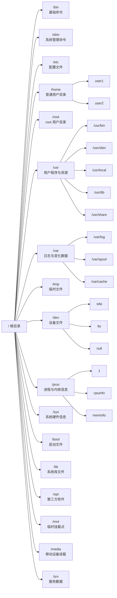

  **5. 对比 Windows 系统**

| 对比       | Linux         | Windows    |
| ---------- | ------------- | ---------- |
| 是否开源   | 是            | 否         |
| 使用成本   | 免费          | 多数收费   |
| 稳定性     | 高            | 较高       |
| 安全性     | 高            | 较高       |
| 软件生态   | 开发/服务器强 | 桌面软件强 |
| 命令行能力 | 强            | 一般       |
| 游戏支持   | 较弱          | 强         |

总结：Linux 上手难度高（需要掌握命令的使用），更适合工作。Windows 图形界面较强，几乎没有上手难度，更适合娱乐。

---

### 1.2 常用快捷键

Linux 终端中大量操作都可以通过快捷键完成。
 熟练使用快捷键能够显著提升命令行效率。

---

**`Tab` 自动补全命令、文件名、目录名、参数（部分 Shell 支持）**

`pw<Tab>` → `pwd`

`cat te<Tab>` → `cat test.txt`（当前目录存在 test.txt）

`system<Tab><Tab>` → 会显示所有以 `system` 开头的命令。

**Ctrl + 类快捷键**

**Ctrl + C**：强制终止当前命令。

**Ctrl + Z**：暂停当前进程（挂起）。

**`fg`**：恢复暂停。

**Ctrl + D**：退出终端 / 结束输入。（等价于 `exit`）

**Ctrl + L**：清屏。（等价于 `clear`）

**Ctrl + A**：光标移动到行首。

**Ctrl + E**：光标移动到行尾。

**Ctrl + U**：删除光标前所有内容。

**Ctrl + K**：删除光标后所有内容。

**Ctrl + W**：删除光标前一个单词。

**Ctrl + Y**：粘贴最近删除内容。

**Ctrl + R**：搜索历史命令。

**Ctrl + S**：暂停终端输出。

**Ctrl + Q**：恢复终端输出。

**历史类命令**

`history`：查看历史命令（曾经使用过的命令）

上下方向键：↑ 上一条命令；↓ 下一条命令。

`!编号`：执行历史命令。`!100` → 执行 history 中编号 100 的命令。

`!!`：执行上一条命令。

`!字符串`：执行最近以该字符串开头的命令。`!vim` → 执行最近的 `vim` 命令。

历史命令保存位置通常在：`~/.bash_history`

---

### 1.3 命令帮助

Linux 提供了多种命令帮助工具，用于**查看命令说明、查询参数、查找命令位置、获取系统文档**。

- `man` 

- `--help`

- `whatis`

- `help`

- `info` 

- `which`

- `whereis`

熟练使用帮助命令是学习 Linux 的核心能力之一。

---

  **1. `man`**（manual）是 Linux 最重要的帮助命令，用于查看命令官方手册。

示例：

```bash
man ls
```

解释通常包含命令名称、语法、说明，以及参数说明、示例和相关命令。

`man` 一般操作

| 按键            | 功能       |
| --------------- | ---------- |
| ↑ ↓             | 上下移动   |
| PageUp/PageDown | 翻页       |
| /关键字         | 搜索       |
| n               | 下一个匹配 |
| q               | 退出       |

`man` 章节

| 编号 | 内容       |
| ---- | ---------- |
| 1    | 用户命令   |
| 2    | 系统调用   |
| 3    | 库函数     |
| 4    | 设备文件   |
| 5    | 配置文件   |
| 8    | 管理员命令 |

例子🌰：

```bash
man 5 passwd    # 查看 /etc/passwd 文件格式。
```

查看命令简介

```bash
man -f ls    # 查找 ls 简介
whatis ls
```

搜索相关命令

```bash
man -k copy    # 搜索包含 copy 的命令
apropos copy
```

  **2. `--help`** 是 `man` 的简洁版。适合速查。

```bash
ls --help
```

  **3. `whatis`** —— 查看命令一句话简介。

```bash
whatis ls
ls (1) - list directory contents
```

  **4. `help`**是 bash 的内置命令。

或者说当 `man` 查找不到时用 `help`。

```bash
help cd
help if
help for
help echo
```

  **5. `info`** —— 更详细的帮助文档

`info` 是 GNU 风格帮助系统，内容更详细且支持超链接。

```bash
info ls
```

常用操作

| 按键  | 功能     |
| ----- | -------- |
| ↑ ↓   | 移动     |
| Enter | 进入链接 |
| n     | 下一节点 |
| p     | 上一节点 |
| u     | 返回上级 |
| q     | 退出     |

  **6. `which`** 是查找命令路径（查找可执行文件）

```bash
which ls
/usr/bin/ls # 输出
```

原理：在环境变量指定目录中查找命令。`echo $PATH`

  **7. `whereis`** 用于查找命令、源码、man 文档位置（查找命令相关文件）

```bash
whereis ls
ls: /usr/bin/ls /usr/share/man/man1/ls.1.gz # 输出
```

  **8. `apropos`** —— 搜索相关命令。

```bash
apropos password
```

---

## 第二部分：文件与目录操作

### 2.1 目录操作

本节介绍最常用的目录操作命令：

- `pwd`
- `cd`
- `ls`
- `tree`

---

  **1. `pwd`** —— 查看当前目录

`pwd` 的全称：`Print Working Directory`

```bash
pwd
/home/user # 输出（表示当前位于/home/user）
```

  **1. `cd`** —— 切换目录

`cd` 的全称：`Change Directory`

```bash
cd /home # cd <目录路径>
cd home # 当前在 `/` 目录时有效
cd .. # 返回上一级目录
cd # 返回主目录 或者输入 cd ~
cd ~
cd - # 返回上一次目录
```

*其中1行和2行涉及相对路径与绝对路径。具体介绍在我的另一篇文章《计算机扫盲》的 “文件与路径”。*😊

  **2. `ls`** —— 查看目录内容

```bash
ls
```

参数：-l  -a  -h

(1) `ls -l` —— 显示详细信息

输出示例：

```bash
-rw-r--r-- 1 root root 1024 May 1 test.txt
```

| 字段         | 含义     |
| ------------ | -------- |
| `-rw-r--r--` | 文件权限 |
| `1`          | 硬链接数 |
| `root`       | 所有者   |
| `root`       | 所属组   |
| `1024`       | 文件大小 |
| `May 1`      | 修改时间 |
| `test.txt`   | 文件名   |

(2) `ls -a` —— 显示隐藏文件（`.`开头的文件）

```bash
.bashrc
.gitignore
```

(3) `ls -lh` —— 显示文件大小（一定要配合 `-l`）

(4) `ls -lt` —— 按时间排序（一定要配合 `-l`）

(5) `ls -lr` —— 反向排序（一定要配合 `-l`）

(6) `ls -R` —— 递归显示子目录

  **4. `tree`** —— 树状显示目录（部分系统默认没有，需要安装）

```bash
tree
```

输出示例

```text
.
├── file1.txt
├── test
│   ├── a.txt
│   └── b.txt
└── demo.py
```

(1) `tree -a` —— 显示隐藏文件（`.`开头的文件）

(2) `tree -d` —— 仅显示目录

(2) `tree -L 2` —— 只显示两层目录

(3) `tree -h` —— 显示文件大小

---

### 2.2 文件操作

本节介绍以下核心命令：

- `touch`
- `cp`
- `mv`
- `rm`
- `mkdir`
- `rmdir`

---

  **1. `touch`** —— 创建文件

`touch` 用于**创建空文件或修改文件时间戳**

```bash
touch test.txt # touch 文件名  创建名为 test.txt 的空文件
```

可以同时创建多个文件

```bash
touch a.txt b.txt c.txt
```

如果**文件已存在**，则会**修改文件时间**。

  **2. `cp`** —— 复制文件与目录

`cp` 的全称：`Copy`

```bash
cp a.txt b.txt # cp 源文件 目标文件  复制 a.txt 为 b.txt
cp test.txt /home/user/ # 复制 test.txt 到 home/user/ 目录
```

(1) `cp -r` —— 递归复制目录（文件夹）

```bash
cp -r dir1 dir2
```

(2) `cp -i` —— 覆盖前询问

```bash
cp -i a.txt b.txt
```

(3) `cp -v` —— 显示复制过程

```bash
cp -v a.txt backup/
```

(4) `cp -a` —— 保留文件属性（权限、时间、链接、所有者。常用于备份）

```bash
cp -i a.txt b.txt
```

  **3. `mv`** —— 移动/重命名文件

`mv` 的全称：`Move`

重命名文件

```bash
mv old.txt new.txt # mv 源文件 目标
```

移动文件

```bash
mv test.txt /home/user/
```

移动目录

```bash
mv dir1 /tmp/
```

(1) `mv -i` —— 覆盖前询问

```bash
mv -i a.txt b.txt
```

(2) `cp -v` —— 显示移动过程

```bash
mv -v file.txt backup/
```

 ⚠️ 注意：如果目标文件存在，默认会直接覆盖。这就是 `mv -i` 存在的意义。

  **4. `rm`** —— 删除文件与目录

`rm` 的全称：`Remove`

```bash
rm test.txt # rm 文件名
rm a.txt b.txt # 删除多个文件
```

(1) `rm -r` —— 递归删除目录

```bash
rm -r testdir
```

(2) `rm -f` —— 强制删除

```bash
rm -f test.txt
```

特点：

- 不询问
- 忽略不存在文件

(3) `rm -rf` —— 删除前询问

```bash
rm -i test.txt
```

 ⚠️ 高危操作警告

```bash
sudo rm -rf /
```

含义：root 权限删除包括系统的所有文件。执行完后系统就没了。

  **5. `mkdir`** —— 创建目录

`mkdir` 的全称：`Make Directory`

创建目录

```bash
mkdir test # mkdir 目录名
mkdir dir1 dir2 dir3 # 创建多个目录
```

`mkdir -p` —— 创建多级目录

```bash
mkdir -p large/middle/small
```

  **6. `rmdir`** —— 删除空目录

```bash
rmdir text # rmdir 目录名
```

只能删除空目录，否则报错 `Directory not empty`（该目录不为空）。

删除非空目录用 `rm -r`。

---

### 2.3 文件查看

本节介绍常用文件查看命令：

- `cat`

- `tac`

- `more`

- `less`

- `head`

- `tail`

- `nl`

---

  **1. `cat`** —— 查看文件内容

`cat` 的全称：`concatenate`

```bash
cat test.txt # cat 文件名
cat a.txt b.txt # 同时查看多个文件
```

(1) `cat -n` —— 显示行号

```bash
cat -n test.txt
# ↓ 输出 ↓
1 hello
2 world
```

(2) `cat -b` —— 给非空行编号

```bash
cat -b test.txt
```

(3) `cat -A` —— 显示特殊字符

```bash
cat -A test.txt
```

可显示：

- Tab
- 换行
- 隐藏字符

不适合对超大文件使用。

  **2. `tac`** —— 倒序查看文件

`tac` 是 `cat` 的反写

```bash
tac test.txt # tac 文件名
# 原文件
line1
line2
line3
# 实际输出
line3
line2
line1
```

适用于查看日志和逆向分析。

  **3. `more`** —— 分页查看文件

```bash
more test.txt # more 文件名
```

| 按键  | 功能   |
| ----- | ------ |
| Space | 下一页 |
| Enter | 下一行 |
| q     | 退出   |

缺点是只能向下翻。因此现在更多使用 `less`。

  **4. `less`** —— 更强大的分页查看

```bash
less test.txt # less 文件名
```

| 按键    | 功能       |
| ------- | ---------- |
| ↑ ↓     | 上下移动   |
| Space   | 下一页     |
| b       | 上一页     |
| /关键字 | 搜索       |
| n       | 下一个匹配 |
| q       | 退出       |

  **5. `head`** —— 查看文件开头

```bash
head test.txt # head 文件名
```

默认输出前 10 行

```bash
head -n 5 test.txt # 前 5 行
```

  **6. `tail`** —— 查看文件结尾

```bash
tail test.txt # tail 文件名
```

默认输出后 10 行

```bash
tail -n 20 test.txt # 后 5 行
```

`tail -f` —— 实时查看日志

```bash
tail -f /var/log/syslog # 新日志会实时输出
```

退出实时监控按 `Ctrl + C`。

  **7. `nl`** —— 显示行号

```bash
nl test.txt # nl 文件名
```

`nl` 比 `cat` 更灵活。

(1) `nl -b a` —— 给所有行编号

```bash
nl -b a test.txt
```

(2) `nl -s` —— 自定义分隔符：

```bash
nl -s ":" test.txt
# 输出
1:hello
2:world
```

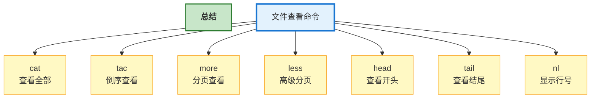

---

### 2.4 文件查找

常见场景：

- 找不到文件
- 查找日志
- 搜索配置文件
- 查找命令位置
- 查找程序安装路径

本节介绍：

- `find`

- `locate`

- `which`

- `whereis`

---

  **1. `find`** —— 强大的文件查找命令

```bash
find /home -name test.txt # find 查找路径 条件
```

(1) `find . -name` —— 按文件名查找

```bash
find . -name hello.txt # 精确查找
find . -iname hello.txt # 忽略大小写
find . -name "*.txt" # 配合通配符查找
find /var/log -name "*.log" # 查找日志文件
```

(2) `find . -type` —— 按类型查找

```bash
find . -type d # 查找目录
find . -type f # 查找普通文件
find . -type l # 查找链接文件
```

(3) `find . -size` —— 按大小查找

```bash
find / -size +100M # 大于 100MB 文件
find . -size -10k # 小于 10KB 文件
```

(4) `find . -mtime` —— 按时间查找

```bash
find . -mtime -7 # 7 天内修改文件
find . -mtime +30 # 30 天前修改文件
```

(4) `find . -user` —— 按用户查找

```bash
find / -user root # 查找 root 用户文件
```

(5) `find . -empty` —— 查找空文件

```bash
find . -empty
```

**find 执行操作**

```bash
find . -name "*.tmp" -delete # 查找后删除
find . -name "*.log" -exec rm {} \; # 查找后执行命令
```

`{}` → 当前查找到文件	`\;` → 命令结束

  **2. `locate`** —— 快速文件查找

```bash
locate test.txt # locate 文件名
```

`locate` 不实时扫描磁盘，它查询文件索引数据库。因此速度极快。缺点是不实时。

如果新文件找不到，先 `sudo updatedb` 再 `locate test.txt`

  **3. `which`** —— 查找命令位置

```bash
which ls # which 命令名
which python gcc bash # 查看多个命令
```

原理是 `which` 在环境变量中查找然后 `echo $PATH`。

`which` 通常由于验证某些系统变量如 `python3` 是否安装。

  **3. `whereis`** —— 查找命令相关文件

由于查找命令、源码、man 手册位置

```bash
whereis ls # which 命令名
```

比 `which` 多个相关文件

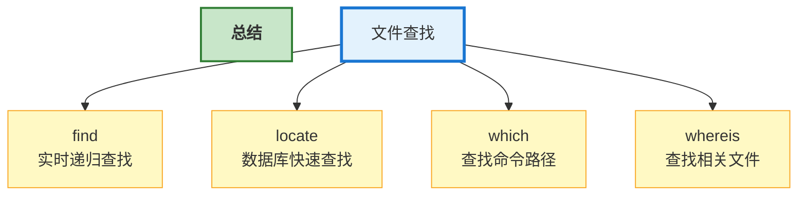

---

### 2.5 文件比较

Linux 中常用文件比较命令：

- `diff`
- `cmp`
- `comm`

它们用于：

- 比较文件差异
- 查找修改内容
- 分析配置变化
- 代码版本对比
- 文本行比较

---

  **1. `diff`** —— 文本差异比较

```bash
diff a.txt b.txt # diff 文件1 文件2
# 输出举例（a 相较于 b）
2c2
< linux
---
> unix
```

输出说明

| 符号 | 含义            |
| ---- | --------------- |
| `<`  | 文件1内容       |
| `>`  | 文件2内容       |
| `c`  | changed（修改） |
| `a`  | added（新增）   |
| `d`  | deleted（删除） |

(1) `diff -u` —— 输出更清晰

```bash
diff -u a.txt b.txt
# 输出举例（a 相较于 b）
- linux
+ unix
```

(2) `diff -y` —— 并排显示

```bash
diff -y a.txt b.txt
# 输出举例（a 相较于 b）
linux | unix
```

(3) `diff -r` —— 递归比较目录

```bash
diff -r dir1 dir2
```

(4) `diff -i` —— 忽略大小写

```bash
diff -i a.txt b.txt
```

(5) `diff -w` —— 忽略空白

```bash
diff -w a.txt b.txt
```

  **2. `cmp`** —— 字节级比较

常用于二进制文件，更底层，更精确。

```bash
cmp a.txt b.txt # cmp 文件1 文件2
# 输出
a.txt b.txt differ: byte 7, line 2
# 第 2 行，第 7 个字节不同
```

(1) `cmp -l` —— 显示所有不同字节

```bash
cmp -l a.txt b.txt
```

(2) `cmp -s` —— 静默模式（通常用于 Shell 脚本）

```bash
cmp -s a.txt b.txt
```

  **3. `comm`** —— 行比较工具

`comm` 必须排序

错误示例：

```bash
comm a.txt b.txt
# 输出
comm: file is not in sorted order
```

正确方式：先排序处理，后比较。

```bash
sort a.txt -o a.txt
sort b.txt -o b.txt
comm a.txt b.txt
```

一共会输出三列：

- 第一列：`a.txt` 独有。
- 第二列：`b.txt` 独有。
- 第三列：两文件共有。

(1) `comm -1` —— 不显示第一列

(2) `comm -2` —— 不显示第二列

(3) `comm -3` —— 不显示第三列

```bash
comm -1 a.txt b.txt
comm -2 a.txt b.txt
comm -3 a.txt b.txt
```

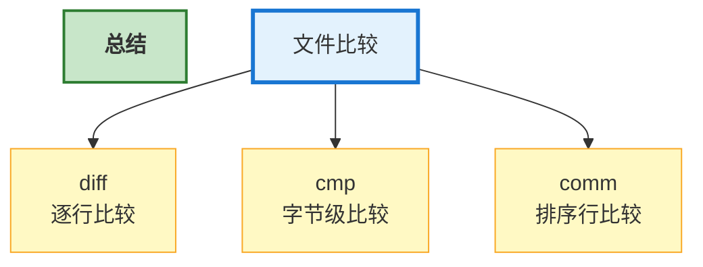

---

## 第三部分：文本处理

文本处理是 Linux 强大的能力之一。

Linux 的设计理念：“一切皆文本”。

---

### 3.1 文本统计

本节介绍：

- `wc`
- `sort`
- `uniq`

---

  **1. `wc`** —— 文本统计

`wc` 的全称：`Word Count`

```bash
wc test.txt # wc 文件名
```

输出：行数	单词数	字节数

(1) `wc -l` —— 统计行数

```bash
wc -l test.txt
```

(2) `wc -w` —— 统计单词数

```bash
wc -w test.txt
```

(3) `wc -c` —— 统计字节数

```bash
wc -c test.txt
```

(4) `wc -m` —— 统计字符数

```bash
wc -m test.txt
```

`wc` 还可以统计命令输出

```bash
ls | wc -l # 统计当前文件数
wc -l app.log # 统计日志行数
```

管道符 `|`：命令1 的结果 → 交给 命令2	*第十部分会讲*

  **2. `sort`** —— 文本排序

```bash
sort fruits.txt # sort 文件名
```

排序示例：

```text
banana		apple
apple	→	banana
orange		orange
```

(1) `sort -r` —— 倒序排序

```bash
sort -r fruits.txt
```

(2) `sort -n` —— 数字排序（非首字符排序）

```bash
sort -n num.txt
```

(3) `sort -u` —— 排序并去重

```bash
sort -u test.txt
```

(4) `sort -k` —— 按指定列排序

```bash
sort -k2 -n score.txt # 按第二列排序
```

(5) `sort -t` —— 指定分隔符

```bash
sort -t ":" -k3 /etc/passwd
```

  **3. `uniq`** —— 文本去重

```bash
uniq text.txt # uniq 文件名
```

 ⚠️ 重要注意：只能处理连续重复行

正确执行方式

```bash
sort | uniq # 通常
# 示例
sort text.txt | uniq
```

(1) `uniq -c` —— 统计重复次数

```bash
uniq -c text.txt
```

(2) `uniq -d` —— 只显示重复行

```bash
uniq -d text.txt
```

(3) `uniq -u` —— 只显示唯一行

```bash
uniq -u text.txt
```

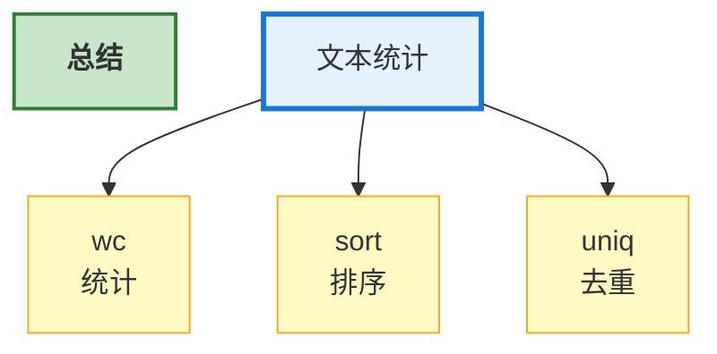

---

### 3.2 文本搜索

Linux 中核心文本搜索工具

- `grep`
- `egrep`
- `fgrep`

它们广泛用于：

- 日志分析
- 配置文件搜索
- 代码搜索
- 运维排障
- 安全分析

---

  **1. `grep`** —— 文本搜索核心命令

```bash
grep "hello" test.txt # grep "关键字" 文件名
```

匹配成功的整行会被输出

(1) `grep -i` —— 忽略大小写

```bash
grep -i "hello" test.txt
```

(2) `grep -n` —— 显示行号

```bash
grep -n "hello" test.txt
```

(3) `grep -v` —— 反向匹配

```bash
grep -v "hello" test.txt
```

输出不包含 hello 的行

(4) `grep -r` —— 递归搜索目录

```bash
grep -r "password" /etc
```

(5) `grep -l` —— 只显示文件名

```bash
grep -l "hello" *.txt
```

(6) `grep -c` —— 统计匹配行数

```bash
grep -c "ERROR" app.log # 查看日志
```

(7) `grep --color` —— 高亮显示

```bash
grep --color "root" /etc/passwd
```

(8) `grep -w` —— 精确匹配单词

```bash
grep -w "root" file.txt
```

(9) `grep -o` —— 精确匹配单词

```bash
grep -o "root" file.txt
```

**正则表达式**，全称：`Regular Expression`

用“规则”描述字符串匹配方式。

```bash
grep "hello" test.txt # 普通搜索
grep "[0-9]" test.txt # 正则搜索
```

正则不是固定文本，而是一种模式。

| 正则    | 含义         |
| ------- | ------------ |
| `[0-9]` | 任意数字     |
| `[a-z]` | 任意小写字母 |
| `^abc`  | abc 开头     |
| `abc$`  | xyz 结尾     |
| `a.c`   | a任意字符b  |
| `a*c`   | a前字符重复b |
| `[abc]` | 匹配集合    |
| `[^abc]`| 非集合     |

  **2. `egrep`** —— 扩展正则搜索

`egrep` 的全称：`Extended grep`

支持扩展正则表达式。

现在通常等价于：`grep -E`

**扩展正则**

| 符号 | 含义       |
| ---- | ---------- |
| `+`  | 一次或多次 |
| `?`  | 零次或一次 |
| `    | `          |
| `()` | 分组       |

  **3. `fgrep`** —— 固定字符串搜索

`fgrep` 的全称：`Fixed grep`

按普通字符串搜索，不解析正则表达式。

现在通常等价于：`grep -F`

```bash
grep "a+b" test.txt # 可能被当作正则
```

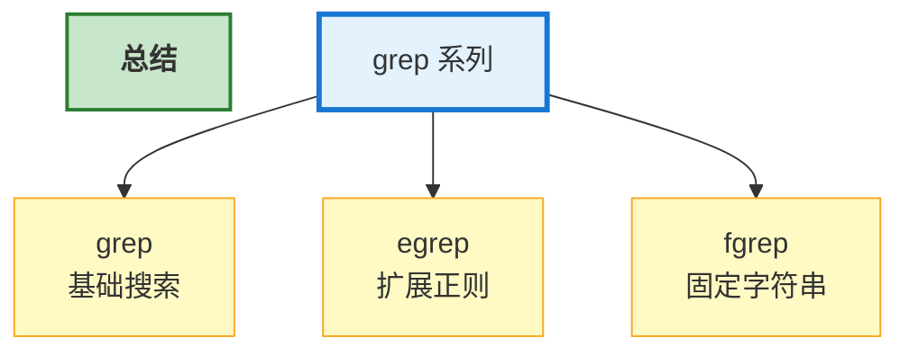

---

### 3.3 文本截取与处理

Linux 强大的能力之一 —— 文本处理

本节介绍：

- `cut`
- `awk`
- `sed`
- `tr`
- `paste`

这些命令广泛用于：

- 日志分析
- 数据处理
- Shell 脚本
- 运维自动化
- CSV/文本处理

---

  **1. `cut`** —— 文本截取

按列截取文本。适合：CSV、配置文件、日志字段提取。

示例文件：`text.txt`

```text
Tom:20:male
Jack:18:male
Lucy:22:female
```

`-d` 指定分隔符

`-f` 指定字段

获取第一列

```bash
cut -d ":" -f1 test.txt
# 输出
Tom
Jack
Lucy
```

获取第一、三列

```bash
cut -d ":" -f1,3 test.txt
```

按字符截取

```bash
cut -c 1-5 test.txt # 截取第 1~5 个字符
```

  **2. `awk`** —— Linux 文本处理之王

按列分析和处理文本，会自动按空格切分列。

例如

```text
Tom 80
Jack 90
Lucy 70
```

awk 会认为：`$1` → Tom	`$2` → 80

```bash
awk '{print $1}' score.txt # awk '{print $1}' 文件
# 输出
Tom
Jack
Lucy
```

输出多列

```bash
awk '{print $1,$2}' score.txt
```

输出最后一列

```bash
awk '{print $NF}' score.txt # NF = 最后一列
```

输出大于 80 分

```bash
awk '$2 > 80 {print $1}' score.txt
```

awk 内置变量

| 变量 | 含义   |
| ---- | ------ |
| `$1` | 第一列 |
| `$2` | 第二列 |
| `$0` | 整行   |
| `NF` | 列数   |
| `NR` | 行号   |

  **3. `sed`** —— 流编辑器

对文本进行编辑、替换、修改

替换字符串（仅修改输出不修改原文件）

```bash
sed 's/hello/Hi/' test.txt # sed '命令' 文件
```

替换字符串（修改原文件）

```bash
sed -i 's/hello/Hi/' test.txt # 此时的文件被改了
```

全局替换（后加 `g`）

```bash
sed -i 's/hello/Hi/g' test.txt # 所有的"hello"都会被改
```

删除行

```bash
sed '2d' test.txt
```

删除空行

```bash
sed '/^$/d' test.txt
```

输出指定行

```bash
sed -n '3p' test.txt # 输出第 3 行
```

  **4. `tr`** —— 字符转换

输出小写转大写转换

```bash
echo "hello" | tr 'a-z' 'A-Z' # tr '旧字符' '新字符'
HELLO
```

删除

```bash
echo "abc123" | tr -d '0-9' # tr -d "旧字符串"
abc
```

压缩重复字符

```bash
echo "aaabbb" | tr -s 'a-z' # tr -s "旧字符串"
```

  **5. `paste`** —— 合并文本

按列合并文件

file1

```text
Tom
Jack
```

file2

```text
80
90
```

```bash
paste file1 file2 # paste 文件1 文件2
# 输出
Tom    80
Jack   90
```

指定分隔符

```bash
paste -d ":" file1 file2
# 输出
Tom:80
Jack:90
```

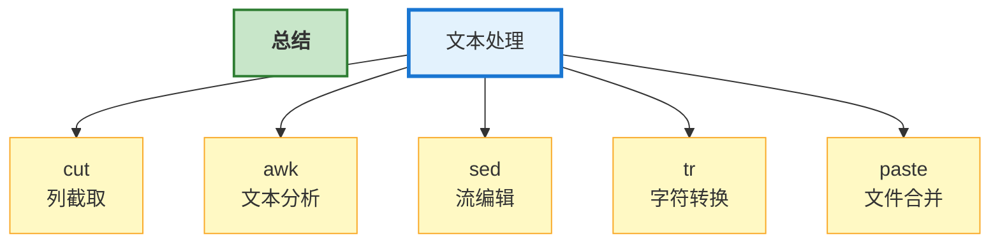

---

### 3.4 文本编码与转换

Linux 中经常需要处理：

- 中文乱码
- Windows/Linux 换行问题
- 文本编码转换
- 数据加密编码

本节介绍：

- `iconv`

- `dos2unix`

- `base64`

---

  **1. `iconv`** —— 字符编码转换

`iconv` 的作用：转换文本编码格式

| 编码       | 常见场景     |
| ---------- | ------------ |
| UTF-8      | Linux / Web  |
| GBK        | Windows 中文 |
| ISO-8859-1 | 老系统       |
| UTF-16     | Windows      |

如果编码不一致会出现乱码

```bash
iconv -f GBK -t UTF-8 test.txt # iconv -f 原编码 -t 新编码 文件
iconv -f GBK -t UTF-8 test.txt > new.txt # 输出到新文件
```

`>` 是重定向	*第十部分会讲*

| 符号 | 功能       |
| ---- | ---------- |
| `    | `          |
| `>`  | 输出到文件 |
| `>>` | 追加到文件 |

  **2. `dos2unix`** —— Windows/Linux 换行转换

Windows 的换行：`\r\n`

Linux 的换行：`\n`

Windows 文件在 Linux 可能出现：`^M`

导致 Shell 脚本、配置文件、Python 等文件报错无法运行。

```bash
dos2unix test.sh # Windows 换行 → Linux 换行
unix2dos test.txt # Linux 换行 → Windows 换行
```

  **3. `base64`** —— Base64 编码

某些系统不能直接传输二进制文件，因此通过变成 `base64` 编码把数据编码成文本。（邮件附件、JWT、图片传输、API、Kubernetes Secret）

编码

```bash
echo "hello" | base64
```

解码

```bash
echo "aGVsbG8K" | base64 -d
```

编码文件

```bash
base64 test.txt
```

解码文件

```bash
base64 -d test.txt
```

Base64 不是加密。它只是便于传输文件的一种编码，并不安全。

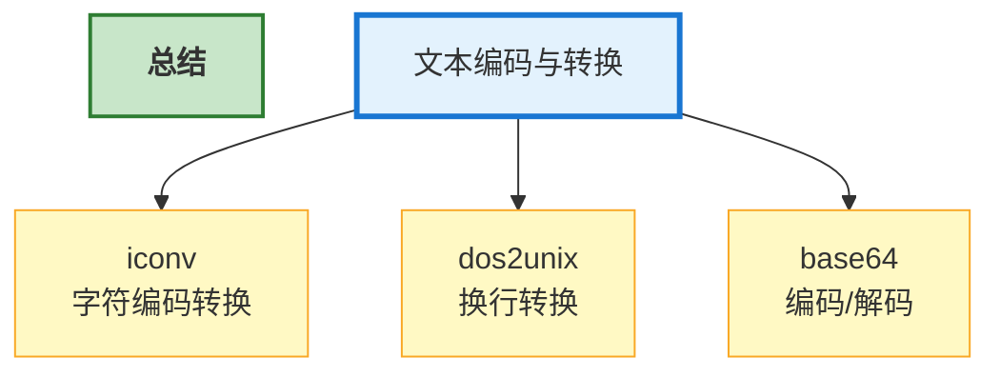

---

## 第四部分：压缩与归档

在 Linux 中：打包 ≠ 压缩

**打包（Archive）**

把多个文件合并成一个文件。

例如：

```text
a.txt
b.txt
c.txt
```

打包后：

```text
files.tar
```

文件数量变少了，但大小基本不变。

**压缩（Compress）**

通过算法减小文件体积。

例如：

```text
files.tar
  ↓
files.tar.gz
```

文件体积会明显减小。

**Linux 常见流程**

```text
多个文件
  ↓
tar 打包
  ↓
gzip 压缩
  ↓
.tar.gz
```

---

### 4.1 打包归档

本节介绍：

- `tar`

- `cpio`

其中 `tar` 必须掌握。`cpio` 作为了解。

---

  **1. `tar`** —— Linux 最常用归档工具

`tar` 全称：`Tape Archive`

最初用于磁带备份。现在主要用于：文件打包、文件压缩、系统备份、软件发布

**基本使用：**

```text
tar [选项] 文件名
```

**常用参数**

| 参数 | 含义         |
| ---- | ------------ |
| `-c` | 创建归档     |
| `-x` | 解包         |
| `-v` | 显示过程     |
| `-f` | 指定文件     |
| `-t` | 查看归档内容 |
| `-z` | gzip 压缩    |
| `-j` | bzip2 压缩   |
| `-J` | xz 压缩      |

**举例：**

```text
test/
├── a.txt
├── b.txt
└── c.txt
```

打包：

```bash
tar -cvf test.tar test/
```

生成：`test.tar`

查看归档内容：

```bash
tar -tvf test.tar
# 输出
a.txt
b.txt
c.txt
```

解包（到 `/tmp` 目录下）：

```bash
tar -xvf test.tar -C /tmp
```

**tar + gzip**

Linux 最常见格式：`.tar.gz` 又称 `tgz`

打包并压缩（压缩是下节的）

```bash
tar -czvf backup.tar.gz test/ # 压缩
tar -czvf backup.tar.gz # 解压
```

**tar + bzip2**

后缀：`.tar.bz2`

```bash
tar -cjvf backup.tar.bz2 test/ # 压缩
tar -xjvf backup.tar.bz2 # 解压
```

**tar + xz**

压缩率更高。

后缀：`.tar.xz`

```bash
tar -cJvf backup.tar.xz test/ # 压缩
tar -xJvf backup.tar.xz # 解压
```

  **2. `cpio`** —— 归档工具

`cpio` 全称：`Copy In / Copy Out`

创建归档：

```bash
find . -name "*.txt" | cpio -ov > test.cpio
```

参数说明

| 参数 | 含义     |
| ---- | -------- |
| `-o` | 输出归档 |
| `-i` | 提取归档 |
| `-v` | 显示过程 |

解包

```bash
cpio -idv < test.cpio
```

查看归档

```bbash
cpio -it < test.cpio
```

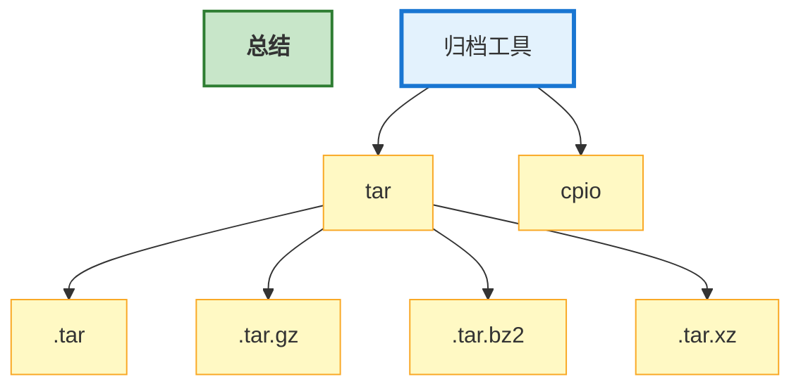

---

### 4.2 压缩解压

本节学习：

- `gzip`

- `zip`

- `bzip2`

- `xz`

---

  **1. `gzip`** —— Linux 最常用压缩工具

`gzip` 全称：`GNU Zip`

特点：Linux 默认支持，压缩速度快，使用广泛。

```bash
gzip test.txt # gzip 文件名 # 压缩
```

 ⚠️ 注意：压缩后原文件会消失。

(1) `gzip -d` —— 解压

```bash
gzip -d test.txt.gz # 解压
```

(2) `gzip -k` —— 保留原文件

```bash
gzip -k test.txt
```

(3) `gzip -l` —— 查看压缩率

```bash
gzip -l test.txt.gz
```

(4) `gzip -1` —— 压缩率 / 压缩速度

1最快，9最高

```bash
gzip -1 test.txt
gzip -4 test.txt
gzip -9 test.txt
```

**`gunzip`** —— gzip 解压工具

```bash
gunzip test.txt.gz # gunzip 文件名 # 解压
```

等价于：`gzip -d test.txt.gz`

  **2. `zip`** —— Windows/Linux 通用压缩

这是一个跨平台最常见的压缩方式

```bash
zip test.zip test.txt # zip 压缩到 文件名 # 压缩
zip files.zip a.txt b.txt c.txt # 压缩多个文件
```

`zip -r` —— 递归压缩目录

```bash
zip -r project.zip project/ # 压缩目录
```

**`unzip`** —— zip 解压工具

```bash
unzip project.zip # unzip 文件名 # 解压
```

(1) `unzip -d` —— 解压到指定目录

```bash
unzip project.zip -d /tmp # 解压到 /tmp 目录下
```

(2) `unzip -l` —— 查看压缩包

```bash
unzip -l project.zip # 查看压缩包内容
```

(3) `unzip -t` —— 测试压缩包完整性

```bash
unzip -t project.zip
```

  **3. `bzip2`** —— 高压缩率工具

特点：压缩率高于 gzip，压缩速度较慢。

```bash
bzip2 test.txt # bzip2 文件名 # 压缩
```

(1) `unzip -d` —— 解压

```bash
bzip2 -d test.txt.bz2 # 解压
```

(2) `bzip2 -k` —— 保留原文件

```bash
bzip2 -k test.txt
```

**`bunzip2`** —— bzip2 解压工具

```bash
bunzip2 test.txt.bz2
```

等价于：`bzip2 -d test.txt.bz2`

  **4. `xz`** —— 超高压缩率工具

特点：压缩率非常高，压缩速度最慢，Linux 发行版常用。

```bash
xz test.txt # xz 文件名 # 压缩
```

(1) `xz -d` —— 解压

```bash
xz -d test.txt.bz2 # 解压
```

(2) `xz -k` —— 保留原文件

```bash
xz -k test.txt
```

**`unxz`** —— bzip2 解压工具

```bash
unxz test.txt.bz2
```

等价于：`xz -d test.txt.bz2`

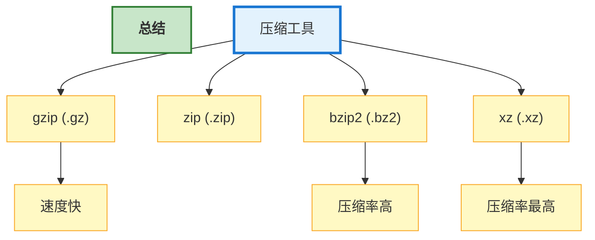

---

## 第五部分：权限与用户管理

Linux 是一个**多用户操作系统**。

为了保证：

- 用户之间互不影响
- 文件安全
- 系统安全

Linux 引入了：用户(User)、组(Group)、权限(Permission)

------

### 5.1 权限管理

**Linux 权限模型**

查看文件：

```bash
ls -l
-rwxr-xr-- 1 root root 2026 Jun 6 test.sh
```

```
- rwx r-x r-- 1 root root 2026 Jun 6 text.sh
│ │   │   │     用户 用户组  年   月 日 文件名
│ │   │   └── 其他用户(others)
│ │   └────── 用户组(group)
│ └────────── 文件所有者(owner)
└──────────── 文件类型
```

文件类型

| 标志 | 含义     |
| ---- | -------- |
| `-`  | 普通文件 |
| `d`  | 目录     |
| `l`  | 软链接   |
| `c`  | 字符设备 |
| `b`  | 块设备   |

本节学习：

- `chmod`

- `chown`

- `chgrp`

- `umask`

------

  **1. `chmod`** —— 修改文件或目录权限

```bash
ls -l
-rwxr-xr-- 1 root root 2026 Jun 6 test.sh
```


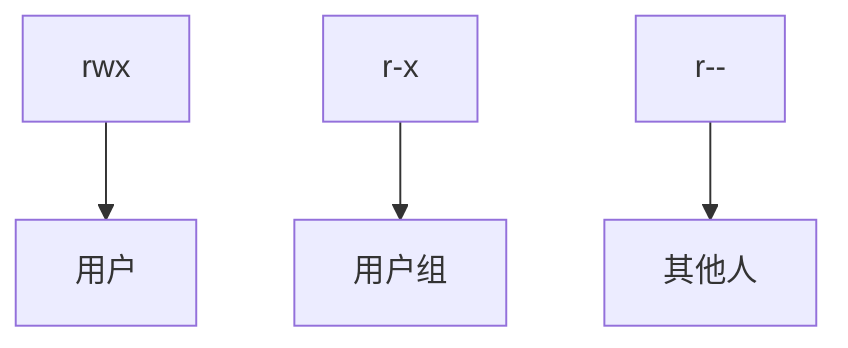

权限字符

| 字符 | 含义          |
| ---- | ------------- |
| `r`  | 读(Read)      |
| `w`  | 写(Write)     |
| `x`  | 执行(Execute) |
| `-`  | 无权限        |

方法一：数字法（最常用）

```bash
chmod 权限 文件
```

r = 4; w = 2; x = 1;

```text
rwx = 4+2+1 = 7
rw- = 4+2   = 6
r-- = 4     = 4
--- = 0
```

```bash
chmod 755 test.sh # rwxr-xr-x
```

常见权限

| 权限 | 字母      | 含义           |
| ---- | --------- | -------------- |
| 777  | rwxrwxrwx | 所有人全部权限 |
| 755  | rwxr-xr-x | 常见脚本       |
| 644  | rw-r--r-- | 常见文件       |
| 600  | rw------- | 私密文件       |
| 700  | rwx------ | 私有脚本       |

方法二：符号法

```bash
chmod 对象±=权限 文件
```

`+`, `-` 号加减权限，`=` 强制覆盖。

| 字母 | 单词  | 含义                         |
| ---- | ----- | ---------------------------- |
| u    | user  | 文件的**所有者**             |
| g    | group | 文件所属的**用户组**         |
| o    | other | 除了所有者和用户组以外的用户 |
| a    | all   | 所有用户                     |

给文件添加执行权限（逆向和 PWN 常用）

```bash
chmod +x test.sh
```

等价：

```bash
chmod a+x test.sh
```

`chmod -R` —— 递归修改目录

```bash
chmod -R 755 dir/
```

*注意：`chmod 777 *`虽然方便，但极不安全。*

  **2. `chown`** —— 修改所有者

```bash
ls -l
-rwxr-xr-- 1 root root 2026 Jun 6 test.sh
```

第一个 root 就是所有者。

修改所有者

```bash
sudo chown user1 test.sh # chown 组名 文件
```

修改用户和组

```bash
sudo chown user1:dev test.sh
```

`chown -R` —— 递归修改

```bash
sudo chown -R www-data:www-data /var/www/html
```

这条命令是很有必要这么写的。如果 `/var/www/html` 下没给 www-data 权限，Web 服务可能无权限读取。（网站打不开）

  **3. `chgrp`** —— 修改文件所属组

```bash
ls -l
-rwxr-xr-- 1 root root 2026 Jun 6 test.sh
```

第一个 root 就是所属用户组

```bash
sudo chgrp dev test.sh # chgrp 组名 文件
```

`chgrp -R` —— 递归修改

```bash
sudo chgrp -R dev project/
```

  **4. `umask`** —— 控制文件默认权限

文件默认：666;		目录默认：777

查看当前 umask

```bash
umask
# 输出
023
```

计算方式如下，其底层逻辑是逻辑二，逻辑一是为了方便理解和计算

**计算逻辑一**

公式：$\text{最终权限} = \text{默认权限} \ - \ (\sim\text{umask})$

- 第一位 `0`：不抹去任何权限 $\rightarrow$ 保持 `rw-` (6)

- 第二位 `2`：抹去写(w)权限 $\rightarrow$ `rw-` 变成 `r--` (4)

- 第三位 `3`：抹去写(w)和执行(x)权限 $\rightarrow$ `rw-` 本来就没有 `x`，把 `w` 抹去后，剩下 `r--` (4)

**最终结果**：`rw- r-- r--`，也就是 **`644`**。

**计算逻辑二**

公式：$\text{最终权限} = \text{默认权限} \ \& \ (\sim\text{umask})$

- **文件默认** `666` $\rightarrow$ 二进制：`110 110 110`

- **umask** `023` $\rightarrow$ 二进制：`000 010 011`

- **将 umask 取反** $\rightarrow$ 变成：`111 101 100`

- **两者做“与（AND）”运算**（同为 1 才得 1）

修改 umask（临时，同一终端下）

```bash
umask 002
```

永久修改

```bash
~/.bashrc # 编辑
umask 022 # 加入这个
source ~/.bashrc # 结束
```

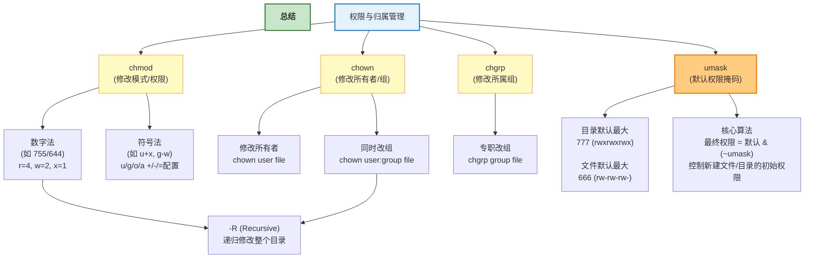

------

### 5.2 用户管理

Linux 是多用户操作系统，所以除了**文件权限**，还要管理系统用户。

**查看当前用户**

```bash
whoami
```

**查看当前登录用户**

```bash
who
```

**查看系统所有用户**

```bash
cat /etc/passwd
# 输出示例
root:x:0:0:root:/root:/bin/bash
pdevil:x:1000:1000:PurgationDevil:/home/pdevil:/bin/bash
```

第 1 列：用户名。

第 2 列：密码占位（x 表示密码在 /etc/shadow）。

第 3 列：用户 ID（UID）。

第 4 列：组 ID（GID）。

第 5 列：描述信息。

第 6 列：主目录。

第 7 列：默认 shell。

Linux 核心的用户信息由四个文件共同支撑：

- **`/etc/passwd`**：用户基本信息（UID、GID、主目录、Shell）。

- **`/etc/shadow`**：用户**密码暗号及有效期**（只有 root 可读，防暴力破解）。

- **`/etc/group`**：系统所有**用户组**的信息。

- **`/etc/gshadow`**：用户组的密码文件（较少使用）。

本节主要介绍：

- `useradd`

- `usermod`

- `userdel`

- `passwd`

------

  **1. `useradd`** —— 添加用户

```bash
sudo useradd [选项] 用户名
```

| 选项 | 说明           |
| ---- | -------------- |
| `-m` | 创建用户主目录 |
| `-d` | 指定主目录路径 |
| `-s` | 指定 shell     |
| `-G` | 指定附加组     |

```bash
sudo useradd -m -s /bin/bash alice
# 创建 alice 用户
# 创建 /home/alice 主目录
# 使用 Bash 作为默认 shell
```

设置密码

```bash
sudo passwd alice
```

  **2. `usermod`** —— 修改用户

```bash
sudo usermod -l newname oldname				# 修改用户名
sudo usermod -d /home/newdir -m username	# 修改主目录
sudo usermod -aG groupname username			# 添加到组
sudo usermod -s /bin/zsh username			# 修改 shell
```

  **3. `userdel`** —— 删除用户

```bash
sudo userdel [选项] 用户名
```

普通删除（删除用户 `pdevil`）

```bash
sudo userdel pdevil
```

删除 `/home/pdevil` 目录

```bash
sudo userdel -r pdevil
```

  **4. `passwd`** —— 修改密码

修改当前目录密码

```bash
passwd
```

修改其他用户密码

```bash
sudo passwd username
```

(1) `passwd -e` —— 强制用户下次登录修改密码

```bash
sudo passwd -e username
```

(2) `passwd -l` —— 锁定用户密码（禁止登录）

```bash
sudo passwd -l username
```

(3) `passwd -u` —— 解锁用户密码（允许登录）

```bash
sudo passwd -u username
```

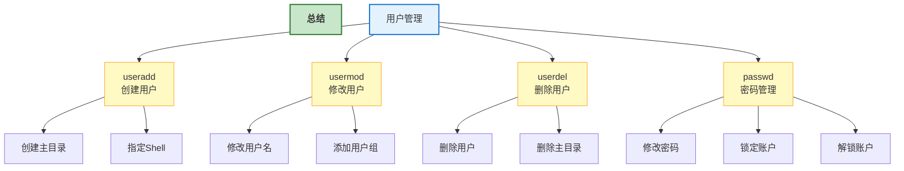

------

### 5.3 用户组管理

Linux 中除了 User 之外，还有：Group（用户组）

用户组的作用：

- 方便权限管理
- 多用户共享资源
- 批量授权

查看当前用户所属组：

```bash
groups
```

输出示例：

```text
user1 sudo docker dev
```

说明当前用户 user1 属于：sudo、docker、dev 三个用户组。

查看系统所有组：

```bash
cat /etc/group
```

输出示例：

```text
root:x:0:
sudo:x:27:
docker:x:999:
dev:x:1001:
```

本节主要介绍：

- `groupadd`
- `groupmod`
- `groupdel`

------

  **1. `groupadd`** —— 创建用户组

```bash
sudo groupadd dev # sudo groupadd 组名
```

`groupadd -g` —— 指定 GID

```bash
sudo groupadd -g 2000 dev
```

  **2. `groupmod`** —— 修改用户组

```bash
sudo groupmod -n develop dev # sudo groupmod -n 新名 旧名
```

表示：dev $→$ develop

`groupadd -g` —— 修改 GID

```bash
sudo groupmod -g 3000 develop
```

  **3. `groupdel`** —— 删除用户组

```bash
sudo groupdel develop # sudo groupdel 组名
```

⚠️ 注意：如果组中仍有成员，可能会删除失败。需要先移除用户。

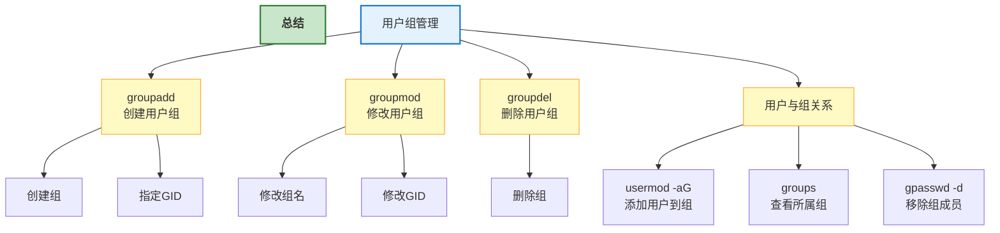

------

### 5.4 sudo 与权限提升

在 Linux 中，普通用户默认只能操作自己拥有权限的资源。

当需要执行管理员操作时，可以使用：

- `sudo`

- `visudo`

- `/etc/sudoers`

------

  **1. `sudo`** —— 以其他用户身份执行命令

`sudo` 的全称为：`Superuser Do`

最常见的用途是：普通用户 → sudo 命令 → 临时以 root 权限执行

基本语法：

```bash
sudo 命令
```

例如：

```bash
sudo apt update
```

普通用户可能没有权限更新系统软件包，而加上 `sudo` 后，可以临时使用管理员权限执行。

**sudo 与 root 的区别**

sudo 是临时执行一条管理员命令，而 root 是一直用管理员命令。sudo 命令权限使用范围更小，也更安全。

**谁可以使用 sudo**

并不是所有用户都能使用 `sudo`，在 Ubuntu 等系统中，通常属于 sudo 组的用户可以执行管理员命令。

可以执行 `sudo -l` 命令显示当前用户允许执行那些 sudo 命令。

  **2. `visudo`** —— 安全编辑 sudo 配置

sudo 的配置文件是 `/etc/sudoers`

理论上可以直接编辑

```bash
sudo nano /etc/sudoers
```

但是**不推荐**。

因为如果配置文件语法写错，可能导致 sudo 无法使用。

因此应该使用：

```bash
sudo visudo
```

`visudo` 会在保存时检查语法。

基本流程：

```text
修改 sudoers
 ↓
保存
 ↓
语法检查
 ↓
正确 → 生效
错误 → 提示修改
```

  **3. `/etc/sudoers`** —— sudo 权限配置文件

查看配置：

```bash
sudo visudo
```

大概率会看到

```text
root ALL=(ALL:ALL) ALL # 用户名 主机=(可切换用户:可切换组) 允许执行的命令
```

ALL 是所有的意思。例如只允许 `user` 重启 Nginx：

```
user ALL=(root) /usr/bin/systemctl restart nginx
```

这样 `user` 不能随意执行其他管理员命令，只能执行：

```bash
sudo systemctl restart nginx
```

这体现了 Linux 权限管理中的 **最小权限原则**。

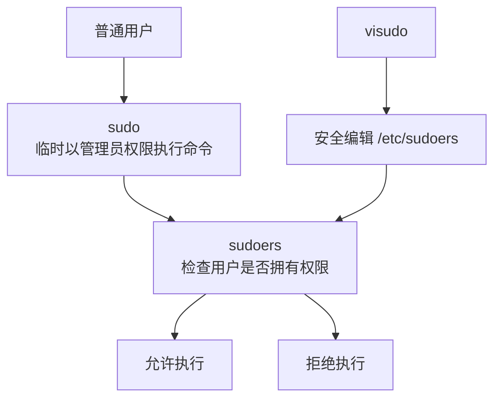

**使用 sudo 时需要注意**：例如类似这样的命令：`sudo rm -rf /`

虽然说 sudo 避免了频繁使用高权限，但是使用时依然需要注意某些错误的命令造成的严重的后果。

尤其需要谨慎使用：

```bash
sudo rm
sudo chmod
sudo chown
sudo dd
```

例如递归修改权限：

```bash
sudo chmod -R 777 /
```

这种操作可能严重破坏系统的权限结构，不应该随意执行。

------

## 第六部分：进程与作业管理

### 6.1 进程查看

- `ps`
- `top`
- `htop`
- `pstree`

### 6.2 进程控制

- `kill`
- `killall`
- `pkill`
- `nohup`

### 6.3 前后台作业

- `jobs`
- `bg`
- `fg`

### 6.4 系统负载

- `uptime`
- `vmstat`
- `iostat`
- `sar`

## 第七部分：磁盘与文件系统

### 7.1 磁盘查看

- `df`
- `du`
- `lsblk`
- `fdisk`

### 7.2 文件系统管理

- `mkfs`
- `fsck`
- `mount`
- `umount`

### 7.3 分区管理

- `fdisk`
- `parted`

## 第八部分：网络命令

### 8.1 网络配置

- `ip`
- `ifconfig`
- `hostname`

### 8.2 网络测试

- `ping`
- `traceroute`
- `mtr`
- `netstat`
- `ss`

### 8.3 DNS 与路由

- `nslookup`
- `dig`
- `route`

### 8.4 网络传输

- `curl`
- `wget`
- `scp`
- `rsync`
- `sftp`

### 8.5 远程连接

- `ssh`
- `telnet`

## 第九部分：软件包管理

### 9.1 Debian/Ubuntu

- `apt`
- `dpkg`

### 9.2 CentOS/RHEL

- `yum`
- `dnf`
- `rpm`

### 9.3 通用包管理

- `snap`
- `flatpak`

## 第十部分：Shell 与脚本

### 10.1 Shell 基础

- 变量
- 输入输出
- 条件判断
- 循环

### 10.2 Bash 常用语法

- `$()`
- 重定向
- 管道
- 数组

### 10.3 Shell 脚本实战

- 自动备份
- 日志分析
- 批量处理

## 第十一部分：系统管理

### 11.1 系统信息

- `uname`
- `hostnamectl`
- `lscpu`
- `free`

### 11.2 时间管理

- `date`
- `timedatectl`
- `cal`

### 11.3 服务管理

- `systemctl`
- `service`
- `journalctl`

### 11.4 日志管理

- `/var/log`
- `dmesg`
- `journalctl`

## 第十二部分：开发与调试工具

### 12.1 编译工具

- `gcc`
- `make`
- `cmake`

### 12.2 调试工具

- `gdb`
- `strace`
- `ltrace`

### 12.3 性能分析

- `perf`
- `valgrind`

## 第十三部分：Vim / Nano 编辑器

### 13.1 Vim 基础

- 模式
- 保存退出
- 查找替换

### 13.2 Vim 高级

- 宏
- 多窗口
- 插件

### 13.3 Nano

- 基础编辑

## *第十四部分：Docker 与容器

### 14.1 Docker 基础

- `docker ps`
- `docker images`
- `docker run`

### 14.2 Docker Compose

- `docker compose`

### 14.3 容器排障

- 日志
- 网络
- 存储

------

如果你在阅读时发现了任何错误，请评论或发邮件告诉我，因为错误是学习和发展的一部分！
