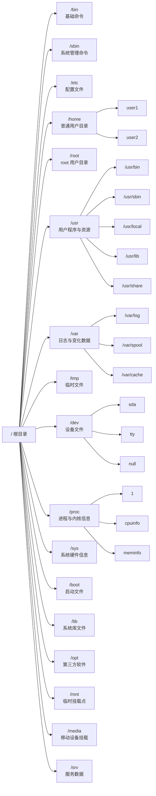

# Linux 命令

## 第一部分：基础命令

### 1.1 Linux 简介

  **1. 什么是 Linux**

Linux 是一种**类 Unix 操作系统**，最初由 Linus Torvalds 于 1991 年开发。

严格来说，**Linux** 指的是“Linux 内核（Kernel）”。常说的 “Linux 操作系统” 一般是：Linux 内核 + GNU 工具 + 软件生态。因此完整系统通常称为：**GNU/Linux**

  **2. Linux 的特点**

开源免费、稳定性高、多用户、多任务、安全性高以及可移植性强。

  **3. Linux 发行版**

Linux 内核本身不能直接使用。需要：软件包，图形界面，包管理器，系统工具。组合后形成**Linux 发行版**（Distribution）。

常见发行版有：**Ubuntu**（最接近成熟的 Windows 系统）、Debian（软件仓库大）、CentOS（与 Ubuntu 差不多但停更）、Rocky Linux / AlmaLinux（CentOS 停更后的替代方案）、Kali Linux（渗透工具集合）、Arch Linux（渗透防御系统）

  **4. Linux 目录结构**

Linux 呈树状目录结构



  **5. 对比 Windows 系统**

| 对比       | Linux         | Windows    |
| ---------- | ------------- | ---------- |
| 是否开源   | 是            | 否         |
| 使用成本   | 免费          | 多数收费   |
| 稳定性     | 高            | 较高       |
| 安全性     | 高            | 较高       |
| 软件生态   | 开发/服务器强 | 桌面软件强 |
| 命令行能力 | 强            | 一般       |
| 游戏支持   | 较弱          | 强         |

总结：Linux 上手难度高（需要掌握命令的使用），更适合工作。Windows 图形界面较强，几乎没有上手难度，更适合娱乐。

### 1.2 常用快捷键

Linux 终端中大量操作都可以通过快捷键完成。
 熟练使用快捷键能够显著提升命令行效率。

**`Tab` 自动补全命令、文件名、目录名、参数（部分 Shell 支持）**

`pw<Tab>` → `pwd`

`cat te<Tab>` → `cat test.txt`（当前目录存在 test.txt）

`system<Tab><Tab>` → 会显示所有以 `system` 开头的命令。

**Ctrl + 类快捷键**

**Ctrl + C**：强制终止当前命令。

**Ctrl + Z**：暂停当前进程（挂起）。

**`fg`**：恢复暂停。

**Ctrl + D**：退出终端 / 结束输入。（等价于 `exit`）

**Ctrl + L**：清屏。（等价于 `clear`）

**Ctrl + A**：光标移动到行首。

**Ctrl + E**：光标移动到行尾。

**Ctrl + U**：删除光标前所有内容。

**Ctrl + K**：删除光标后所有内容。

**Ctrl + W**：删除光标前一个单词。

**Ctrl + Y**：粘贴最近删除内容。

**Ctrl + R**：搜索历史命令。

**Ctrl + S**：暂停终端输出。

**Ctrl + Q**：恢复终端输出。

**历史类命令**

`history`：查看历史命令（曾经使用过的命令）

上下方向键：↑ 上一条命令；↓ 下一条命令。

`!编号`：执行历史命令。`!100` → 执行 history 中编号 100 的命令。

`!!`：执行上一条命令。

`!字符串`：执行最近以该字符串开头的命令。`!vim` → 执行最近的 `vim` 命令。

历史命令保存位置通常在：`~/.bash_history`

### 1.3 命令帮助

Linux 提供了多种命令帮助工具，用于**查看命令说明、查询参数、查找命令位置、获取系统文档**。

熟练使用帮助命令是学习 Linux 的核心能力之一。

  **1. `man`**（manual）是 Linux 最重要的帮助命令，用于查看命令官方手册。

示例：

```bash
man ls
```

解释通常包含命令名称、语法、说明，以及参数说明、示例和相关命令。

`man` 一般操作

| 按键            | 功能       |
| --------------- | ---------- |
| ↑ ↓             | 上下移动   |
| PageUp/PageDown | 翻页       |
| /关键字         | 搜索       |
| n               | 下一个匹配 |
| q               | 退出       |

`man` 章节

| 编号 | 内容       |
| ---- | ---------- |
| 1    | 用户命令   |
| 2    | 系统调用   |
| 3    | 库函数     |
| 4    | 设备文件   |
| 5    | 配置文件   |
| 8    | 管理员命令 |

例子🌰：

```bash
man 5 passwd    # 查看 /etc/passwd 文件格式。
```

查看命令简介

```bash
man -f ls    # 查找 ls 简介
whatis ls
```

搜索相关命令

```bash
man -k copy    # 搜索包含 copy 的命令
apropos copy
```

  **2. `--help`** 是 `man` 的简洁版。适合速查。

```bash
ls --help
```

  **3. `whatis`** 查看命令一句话简介。

```bash
whatis ls
ls (1) - list directory contents
```

  **4. `help`**是 bash 的内置命令。

或者说当 `man` 查找不到时用 `help`。

```bash
help cd
help if
help for
help echo
```

  **5. `info`** —— 更详细的帮助文档

`info` 是 GNU 风格帮助系统，内容更详细且支持超链接。

```bash
info ls
```

常用操作

| 按键  | 功能     |
| ----- | -------- |
| ↑ ↓   | 移动     |
| Enter | 进入链接 |
| n     | 下一节点 |
| p     | 上一节点 |
| u     | 返回上级 |
| q     | 退出     |

  **6. `which`** 是查找命令路径（查找可执行文件）

```bash
which ls
/usr/bin/ls # 输出
```

原理：在环境变量指定目录中查找命令。`echo $PATH`

  **7. `whereis`** 用于查找命令、源码、man 文档位置（查找命令相关文件）

```bash
whereis ls
ls: /usr/bin/ls /usr/share/man/man1/ls.1.gz # 输出
```

  **8. `apropos`** 搜索相关命令。

```bash
apropos password
```
