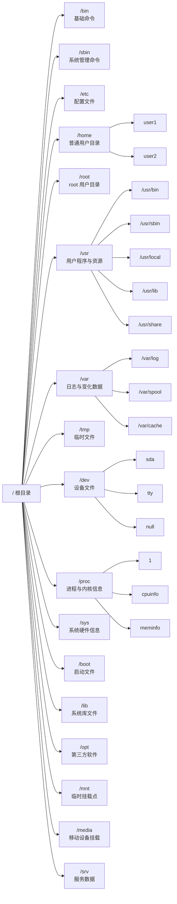
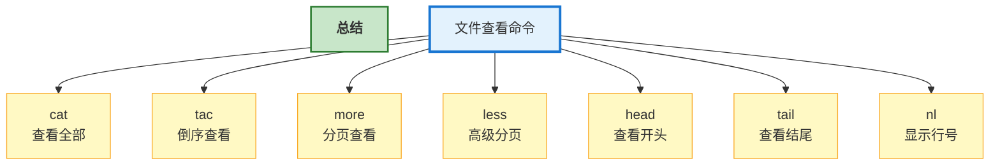
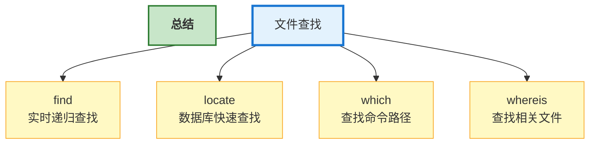
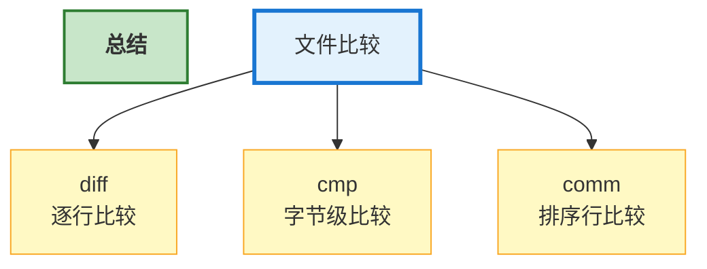
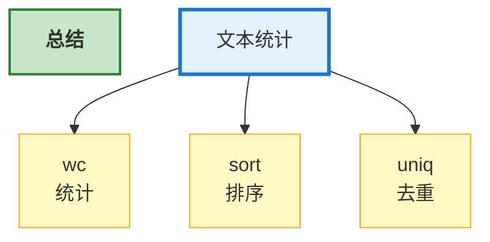

# Linux 命令

## 第一部分：基础命令

### 1.1 Linux 简介

  **1. 什么是 Linux**

Linux 是一种**类 Unix 操作系统**，最初由 Linus Torvalds 于 1991 年开发。

严格来说，**Linux** 指的是“Linux 内核（Kernel）”。常说的 “Linux 操作系统” 一般是：Linux 内核 + GNU 工具 + 软件生态。因此完整系统通常称为：**GNU/Linux**

  **2. Linux 的特点**

开源免费、稳定性高、多用户、多任务、安全性高以及可移植性强。

  **3. Linux 发行版**

Linux 内核本身不能直接使用。需要：软件包，图形界面，包管理器，系统工具。组合后形成**Linux 发行版**（Distribution）。

常见发行版有：**Ubuntu**（最接近成熟的 Windows 系统）、Debian（软件仓库大）、CentOS（与 Ubuntu 差不多但停更）、Rocky Linux / AlmaLinux（CentOS 停更后的替代方案）、Kali Linux（渗透工具集合）、Arch Linux（渗透防御系统）

  **4. Linux 目录结构**

Linux 呈树状目录结构



  **5. 对比 Windows 系统**

| 对比       | Linux         | Windows    |
| ---------- | ------------- | ---------- |
| 是否开源   | 是            | 否         |
| 使用成本   | 免费          | 多数收费   |
| 稳定性     | 高            | 较高       |
| 安全性     | 高            | 较高       |
| 软件生态   | 开发/服务器强 | 桌面软件强 |
| 命令行能力 | 强            | 一般       |
| 游戏支持   | 较弱          | 强         |

总结：Linux 上手难度高（需要掌握命令的使用），更适合工作。Windows 图形界面较强，几乎没有上手难度，更适合娱乐。

---

### 1.2 常用快捷键

Linux 终端中大量操作都可以通过快捷键完成。
 熟练使用快捷键能够显著提升命令行效率。

---

**`Tab` 自动补全命令、文件名、目录名、参数（部分 Shell 支持）**

`pw<Tab>` → `pwd`

`cat te<Tab>` → `cat test.txt`（当前目录存在 test.txt）

`system<Tab><Tab>` → 会显示所有以 `system` 开头的命令。

**Ctrl + 类快捷键**

**Ctrl + C**：强制终止当前命令。

**Ctrl + Z**：暂停当前进程（挂起）。

**`fg`**：恢复暂停。

**Ctrl + D**：退出终端 / 结束输入。（等价于 `exit`）

**Ctrl + L**：清屏。（等价于 `clear`）

**Ctrl + A**：光标移动到行首。

**Ctrl + E**：光标移动到行尾。

**Ctrl + U**：删除光标前所有内容。

**Ctrl + K**：删除光标后所有内容。

**Ctrl + W**：删除光标前一个单词。

**Ctrl + Y**：粘贴最近删除内容。

**Ctrl + R**：搜索历史命令。

**Ctrl + S**：暂停终端输出。

**Ctrl + Q**：恢复终端输出。

**历史类命令**

`history`：查看历史命令（曾经使用过的命令）

上下方向键：↑ 上一条命令；↓ 下一条命令。

`!编号`：执行历史命令。`!100` → 执行 history 中编号 100 的命令。

`!!`：执行上一条命令。

`!字符串`：执行最近以该字符串开头的命令。`!vim` → 执行最近的 `vim` 命令。

历史命令保存位置通常在：`~/.bash_history`

---

### 1.3 命令帮助

Linux 提供了多种命令帮助工具，用于**查看命令说明、查询参数、查找命令位置、获取系统文档**。

- `man` 

- `--help`

- `whatis`

- `help`

- `info` 

- `which`

- `whereis`

熟练使用帮助命令是学习 Linux 的核心能力之一。

---

  **1. `man`**（manual）是 Linux 最重要的帮助命令，用于查看命令官方手册。

示例：

```bash
man ls
```

解释通常包含命令名称、语法、说明，以及参数说明、示例和相关命令。

`man` 一般操作

| 按键            | 功能       |
| --------------- | ---------- |
| ↑ ↓             | 上下移动   |
| PageUp/PageDown | 翻页       |
| /关键字         | 搜索       |
| n               | 下一个匹配 |
| q               | 退出       |

`man` 章节

| 编号 | 内容       |
| ---- | ---------- |
| 1    | 用户命令   |
| 2    | 系统调用   |
| 3    | 库函数     |
| 4    | 设备文件   |
| 5    | 配置文件   |
| 8    | 管理员命令 |

例子🌰：

```bash
man 5 passwd    # 查看 /etc/passwd 文件格式。
```

查看命令简介

```bash
man -f ls    # 查找 ls 简介
whatis ls
```

搜索相关命令

```bash
man -k copy    # 搜索包含 copy 的命令
apropos copy
```

  **2. `--help`** 是 `man` 的简洁版。适合速查。

```bash
ls --help
```

  **3. `whatis`** —— 查看命令一句话简介。

```bash
whatis ls
ls (1) - list directory contents
```

  **4. `help`**是 bash 的内置命令。

或者说当 `man` 查找不到时用 `help`。

```bash
help cd
help if
help for
help echo
```

  **5. `info`** —— 更详细的帮助文档

`info` 是 GNU 风格帮助系统，内容更详细且支持超链接。

```bash
info ls
```

常用操作

| 按键  | 功能     |
| ----- | -------- |
| ↑ ↓   | 移动     |
| Enter | 进入链接 |
| n     | 下一节点 |
| p     | 上一节点 |
| u     | 返回上级 |
| q     | 退出     |

  **6. `which`** 是查找命令路径（查找可执行文件）

```bash
which ls
/usr/bin/ls # 输出
```

原理：在环境变量指定目录中查找命令。`echo $PATH`

  **7. `whereis`** 用于查找命令、源码、man 文档位置（查找命令相关文件）

```bash
whereis ls
ls: /usr/bin/ls /usr/share/man/man1/ls.1.gz # 输出
```

  **8. `apropos`** —— 搜索相关命令。

```bash
apropos password
```

---

## 第二部分：文件与目录操作

### 2.1 目录操作

本节介绍最常用的目录操作命令：

- `pwd`
- `cd`
- `ls`
- `tree`

---

  **1. `pwd`** —— 查看当前目录

`pwd` 的全称：`Print Working Directory`

```bash
pwd
/home/user # 输出（表示当前位于/home/user）
```

  **1. `cd`** —— 切换目录

`cd` 的全称：`Change Directory`

```bash
cd /home # cd <目录路径>
cd home # 当前在 `/` 目录时有效
cd .. # 返回上一级目录
cd # 返回主目录 或者输入 cd ~
cd ~
cd - # 返回上一次目录
```

*其中1行和2行涉及相对路径与绝对路径。具体介绍在我的另一篇文章《计算机扫盲》的 “文件与路径”。*😊

  **2. `ls`** —— 查看目录内容

```bash
ls
```

参数：-l  -a  -h

(1) `ls -l` —— 显示详细信息

输出示例：

```bash
-rw-r--r-- 1 root root 1024 May 1 test.txt
```

| 字段         | 含义     |
| ------------ | -------- |
| `-rw-r--r--` | 文件权限 |
| `1`          | 硬链接数 |
| `root`       | 所有者   |
| `root`       | 所属组   |
| `1024`       | 文件大小 |
| `May 1`      | 修改时间 |
| `test.txt`   | 文件名   |

(2) `ls -a` —— 显示隐藏文件（`.`开头的文件）

```bash
.bashrc
.gitignore
```

(3) `ls -lh` —— 显示文件大小（一定要配合 `-l`）

(4) `ls -lt` —— 按时间排序（一定要配合 `-l`）

(5) `ls -lr` —— 反向排序（一定要配合 `-l`）

(6) `ls -R` —— 递归显示子目录

  **4. `tree`** —— 树状显示目录（部分系统默认没有，需要安装）

```bash
tree
```

输出示例

```text
.
├── file1.txt
├── test
│   ├── a.txt
│   └── b.txt
└── demo.py
```

(1) `tree -a` —— 显示隐藏文件（`.`开头的文件）

(2) `tree -d` —— 仅显示目录

(2) `tree -L 2` —— 只显示两层目录

(3) `tree -h` —— 显示文件大小

---

### 2.2 文件操作

本节介绍以下核心命令：

- `touch`
- `cp`
- `mv`
- `rm`
- `mkdir`
- `rmdir`

---

  **1. `touch`** —— 创建文件

`touch` 用于**创建空文件或修改文件时间戳**

```bash
touch test.txt # touch 文件名  创建名为 test.txt 的空文件
```

可以同时创建多个文件

```bash
touch a.txt b.txt c.txt
```

如果**文件已存在**，则会**修改文件时间**。

  **2. `cp`** —— 复制文件与目录

`cp` 的全称：`Copy`

```bash
cp a.txt b.txt # cp 源文件 目标文件  复制 a.txt 为 b.txt
cp test.txt /home/user/ # 复制 test.txt 到 home/user/ 目录
```

(1) `cp -r` —— 递归复制目录（文件夹）

```bash
cp -r dir1 dir2
```

(2) `cp -i` —— 覆盖前询问

```bash
cp -i a.txt b.txt
```

(3) `cp -v` —— 显示复制过程

```bash
cp -v a.txt backup/
```

(4) `cp -a` —— 保留文件属性（权限、时间、链接、所有者。常用于备份）

```bash
cp -i a.txt b.txt
```

  **3. `mv`** —— 移动/重命名文件

`mv` 的全称：`Move`

重命名文件

```bash
mv old.txt new.txt # mv 源文件 目标
```

移动文件

```bash
mv test.txt /home/user/
```

移动目录

```bash
mv dir1 /tmp/
```

(1) `mv -i` —— 覆盖前询问

```bash
mv -i a.txt b.txt
```

(2) `cp -v` —— 显示移动过程

```bash
mv -v file.txt backup/
```

 ⚠️ 注意：如果目标文件存在，默认会直接覆盖。这就是 `mv -i` 存在的意义。

  **4. `rm`** —— 删除文件与目录

`rm` 的全称：`Remove`

```bash
rm test.txt # rm 文件名
rm a.txt b.txt # 删除多个文件
```

(1) `rm -r` —— 递归删除目录

```bash
rm -r testdir
```

(2) `rm -f` —— 强制删除

```bash
rm -f test.txt
```

特点：

- 不询问
- 忽略不存在文件

(3) `rm -rf` —— 删除前询问

```bash
rm -i test.txt
```

 ⚠️ 高危操作警告

```bash
sudo rm -rf /
```

含义：root 权限删除包括系统的所有文件。执行完后系统就没了。

  **5. `mkdir`** —— 创建目录

`mkdir` 的全称：`Make Directory`

创建目录

```bash
mkdir test # mkdir 目录名
mkdir dir1 dir2 dir3 # 创建多个目录
```

`mkdir -p` —— 创建多级目录

```bash
mkdir -p large/middle/small
```

  **6. `rmdir`** —— 删除空目录

```bash
rmdir text # rmdir 目录名
```

只能删除空目录，否则报错 `Directory not empty`（该目录不为空）。

删除非空目录用 `rm -r`。

---

### 2.3 文件查看

本节介绍常用文件查看命令：

- `cat`

- `tac`

- `more`

- `less`

- `head`

- `tail`

- `nl`

---

  **1. `cat`** —— 查看文件内容

`cat` 的全称：`concatenate`

```bash
cat test.txt # cat 文件名
cat a.txt b.txt # 同时查看多个文件
```

(1) `cat -n` —— 显示行号

```bash
cat -n test.txt
# ↓ 输出 ↓
1 hello
2 world
```

(2) `cat -b` —— 给非空行编号

```bash
cat -b test.txt
```

(3) `cat -A` —— 显示特殊字符

```bash
cat -A test.txt
```

可显示：

- Tab
- 换行
- 隐藏字符

不适合对超大文件使用。

  **2. `tac`** —— 倒序查看文件

`tac` 是 `cat` 的反写

```bash
tac test.txt # tac 文件名
# 原文件
line1
line2
line3
# 实际输出
line3
line2
line1
```

适用于查看日志和逆向分析。

  **3. `more`** —— 分页查看文件

```bash
more test.txt # more 文件名
```

| 按键  | 功能   |
| ----- | ------ |
| Space | 下一页 |
| Enter | 下一行 |
| q     | 退出   |

缺点是只能向下翻。因此现在更多使用 `less`。

  **4. `less`** —— 更强大的分页查看

```bash
less test.txt # less 文件名
```

| 按键    | 功能       |
| ------- | ---------- |
| ↑ ↓     | 上下移动   |
| Space   | 下一页     |
| b       | 上一页     |
| /关键字 | 搜索       |
| n       | 下一个匹配 |
| q       | 退出       |

  **5. `head`** —— 查看文件开头

```bash
head test.txt # head 文件名
```

默认输出前 10 行

```bash
head -n 5 test.txt # 前 5 行
```

  **6. `tail`** —— 查看文件结尾

```bash
tail test.txt # tail 文件名
```

默认输出后 10 行

```bash
tail -n 20 test.txt # 后 5 行
```

`tail -f` —— 实时查看日志

```bash
tail -f /var/log/syslog # 新日志会实时输出
```

退出实时监控按 `Ctrl + C`。

  **7. `nl`** —— 显示行号

```bash
nl test.txt # nl 文件名
```

`nl` 比 `cat` 更灵活。

(1) `nl -b a` —— 给所有行编号

```bash
nl -b a test.txt
```

(2) `nl -s` —— 自定义分隔符：

```bash
nl -s ":" test.txt
# 输出
1:hello
2:world
```



---

### 2.4 文件查找

常见场景：

- 找不到文件
- 查找日志
- 搜索配置文件
- 查找命令位置
- 查找程序安装路径

本节介绍：

- `find`

- `locate`

- `which`

- `whereis`

---

  **1. `find`** —— 强大的文件查找命令

```bash
find /home -name test.txt # find 查找路径 条件
```

(1) `find . -name` —— 按文件名查找

```bash
find . -name hello.txt # 精确查找
find . -iname hello.txt # 忽略大小写
find . -name "*.txt" # 配合通配符查找
find /var/log -name "*.log" # 查找日志文件
```

(2) `find . -type` —— 按类型查找

```bash
find . -type d # 查找目录
find . -type f # 查找普通文件
find . -type l # 查找链接文件
```

(3) `find . -size` —— 按大小查找

```bash
find / -size +100M # 大于 100MB 文件
find . -size -10k # 小于 10KB 文件
```

(4) `find . -mtime` —— 按时间查找

```bash
find . -mtime -7 # 7 天内修改文件
find . -mtime +30 # 30 天前修改文件
```

(4) `find . -user` —— 按用户查找

```bash
find / -user root # 查找 root 用户文件
```

(5) `find . -empty` —— 查找空文件

```bash
find . -empty
```

**find 执行操作**

```bash
find . -name "*.tmp" -delete # 查找后删除
find . -name "*.log" -exec rm {} \; # 查找后执行命令
```

`{}` → 当前查找到文件	`\;` → 命令结束

  **2. `locate`** —— 快速文件查找

```bash
locate test.txt # locate 文件名
```

`locate` 不实时扫描磁盘，它查询文件索引数据库。因此速度极快。缺点是不实时。

如果新文件找不到，先 `sudo updatedb` 再 `locate test.txt`

  **3. `which`** —— 查找命令位置

```bash
which ls # which 命令名
which python gcc bash # 查看多个命令
```

原理是 `which` 在环境变量中查找然后 `echo $PATH`。

`which` 通常由于验证某些系统变量如 `python3` 是否安装。

  **3. `whereis`** —— 查找命令相关文件

由于查找命令、源码、man 手册位置

```bash
whereis ls # which 命令名
```

比 `which` 多个相关文件



---

### 2.5 文件比较

Linux 中常用文件比较命令：

- `diff`
- `cmp`
- `comm`

它们用于：

- 比较文件差异
- 查找修改内容
- 分析配置变化
- 代码版本对比
- 文本行比较

---

  **1. `diff`** —— 文本差异比较

```bash
diff a.txt b.txt # diff 文件1 文件2
# 输出举例（a 相较于 b）
2c2
< linux
---
> unix
```

输出说明

| 符号 | 含义            |
| ---- | --------------- |
| `<`  | 文件1内容       |
| `>`  | 文件2内容       |
| `c`  | changed（修改） |
| `a`  | added（新增）   |
| `d`  | deleted（删除） |

(1) `diff -u` —— 输出更清晰

```bash
diff -u a.txt b.txt
# 输出举例（a 相较于 b）
- linux
+ unix
```

(2) `diff -y` —— 并排显示

```bash
diff -y a.txt b.txt
# 输出举例（a 相较于 b）
linux | unix
```

(3) `diff -r` —— 递归比较目录

```bash
diff -r dir1 dir2
```

(4) `diff -i` —— 忽略大小写

```bash
diff -i a.txt b.txt
```

(5) `diff -w` —— 忽略空白

```bash
diff -w a.txt b.txt
```

  **2. `cmp`** —— 字节级比较

常用于二进制文件，更底层，更精确。

```bash
cmp a.txt b.txt # cmp 文件1 文件2
# 输出
a.txt b.txt differ: byte 7, line 2
# 第 2 行，第 7 个字节不同
```

(1) `cmp -l` —— 显示所有不同字节

```bash
cmp -l a.txt b.txt
```

(2) `cmp -s` —— 静默模式（通常用于 Shell 脚本）

```bash
cmp -s a.txt b.txt
```

  **3. `comm`** —— 行比较工具

`comm` 必须排序

错误示例：

```bash
comm a.txt b.txt
# 输出
comm: file is not in sorted order
```

正确方式：先排序处理，后比较。

```bash
sort a.txt -o a.txt
sort b.txt -o b.txt
comm a.txt b.txt
```

一共会输出三列：

- 第一列：`a.txt` 独有。
- 第二列：`b.txt` 独有。
- 第三列：两文件共有。

(1) `comm -1` —— 不显示第一列

(2) `comm -2` —— 不显示第二列

(3) `comm -3` —— 不显示第三列

```bash
comm -1 a.txt b.txt
comm -2 a.txt b.txt
comm -3 a.txt b.txt
```



---

## 第三部分：文本处理

文本处理是 Linux 最强大的能力之一。

Linux 的设计理念：“一切皆文本”

### 3.1 文本统计

本节介绍：

- `wc`
- `sort`
- `uniq`

---

  **1. `wc`** —— 文本统计

`wc` 的全称：`Word Count`

```bash
wc test.txt # wc 文件名
```

输出：行数	单词数	字节数

(1) `wc -l` —— 统计行数

```bash
wc -l test.txt
```

(2) `wc -w` —— 统计单词数

```bash
wc -w test.txt
```

(3) `wc -c` —— 统计字节数

```bash
wc -c test.txt
```

(4) `wc -m` —— 统计字符数

```bash
wc -m test.txt
```

`wc` 还可以统计命令输出

```bash
ls | wc -l # 统计当前文件数
wc -l app.log # 统计日志行数
```

  **2. `sort`** —— 文本排序

```bash
sort fruits.txt # sort 文件名
```

排序示例：

```text
banana		apple
apple	→	banana
orange		orange
```

(1) `sort -r` —— 倒序排序

```bash
sort -r fruits.txt
```

(2) `sort -n` —— 数字排序（非首字符排序）

```bash
sort -n num.txt
```

(3) `sort -u` —— 排序并去重

```bash
sort -u test.txt
```

(4) `sort -k` —— 按指定列排序

```bash
sort -k2 -n score.txt # 按第二列排序
```

(5) `sort -t` —— 指定分隔符

```bash
sort -t ":" -k3 /etc/passwd
```

  **3. `uniq`** —— 文本去重

```bash
uniq text.txt # uniq 文件名
```

 ⚠️ 重要注意：只能处理连续重复行

正确执行方式

```bash
sort | uniq # 通常
# 示例
sort text.txt | uniq
```

(1) `uniq -c` —— 统计重复次数

```bash
uniq -c text.txt
```

(2) `uniq -d` —— 只显示重复行

```bash
uniq -d text.txt
```

(3) `uniq -u` —— 只显示唯一行

```bash
uniq -u text.txt
```



---

### 3.2 文本搜索

Linux 中核心文本搜索工具

- `grep`
- `egrep`
- `fgrep`

它们广泛用于：

- 日志分析
- 配置文件搜索
- 代码搜索
- 运维排障
- 安全分析

---

  **1. `grep`** —— 文本搜索核心命令

```bash
grep "hello" test.txt # grep "关键字" 文件名
```

匹配成功的整行会被输出

(1) `grep -i` —— 忽略大小写

```bash
grep -i "hello" test.txt
```

(2) `grep -n` —— 显示行号

```bash
grep -n "hello" test.txt
```

(3) `grep -v` —— 反向匹配

```bash
grep -v "hello" test.txt
```

输出不包含 hello 的行

(4) `grep -r` —— 递归搜索目录

```bash
grep -r "password" /etc
```

(5) `grep -l` —— 只显示文件名

```bash
grep -l "hello" *.txt
```

(6) `grep -c` —— 统计匹配行数

```bash
grep -c "ERROR" app.log # 查看日志
```

(7) `grep --color` —— 高亮显示

```bash
grep --color "root" /etc/passwd
```

(8) `grep -w` —— 精确匹配单词

```bash
grep -w "root" file.txt
```

(8) `grep -o` —— 精确匹配单词

```bash
grep -o "root" file.txt
```
