# 网络应用基础：客户端与服务器如何通信

 ⚠️ *声明：黑客技术文章，请不要在现实环境中实验*

安全一共分两层：

第一层（程序安全）：

```text
有没有SQL注入？
有没有RCE？
有没有XSS？
```

第二层（业务安全）：

```text
流程是不是合理？
状态机会不会绕？
有没有重复领奖？
有没有重复支付？
有没有竞争条件？
权限是不是设计错了？
```

------

## 第一章：浏览器输入一个网址，到底发生了什么？

首先需要理解一套逻辑链：客户端到服务器都究竟发生了什么。

假设打开浏览器，输入：

```http
https://www.baidu.com
```

按下 Enter。

这时，全世界有几十台机器开始一起工作。

------

  **第一步：浏览器**

浏览器其实就是一个普通程序。

例如：Chrome.exe

它什么都不知道。

它只知道：**"老板让我访问这个网址。"**

于是它开始问第一个问题：

```text
www.baidu.com

是谁？
```

注意：这里它不知道 IP，也不知道 服务器。

甚至不知道百度在哪。

------

  **第二步：DNS（互联网电话簿）**

于是浏览器去问：**DNS**

DNS 就像电话簿。

例如：

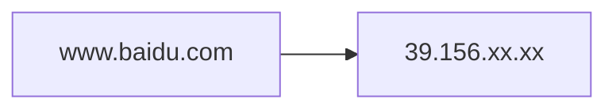

浏览器：哦，原来百度在：39.156.xx.xx

**域名 ≠ 服务器**

域名只是名字，真正通信的是 IP。

------

  **第三步：TCP（打电话）**

知道 IP 以后，浏览器开始建立 TCP。

TCP 就是一种协议。

可以直接理解成：**打电话时需要询问对面是谁，然后对面再问自己是谁**

TCP 最重要的不是传输，而是**建立可靠连接。**

------

  **第四步：HTTPS（加密）**

这里浏览器说：我要说的话不能让别人偷听。

于是 TLS 登场。

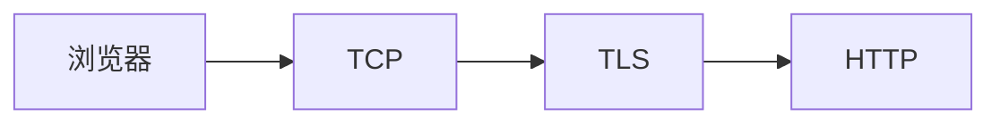

HTTP 就不再裸奔了。

------

  **第五步：HTTP 请求**

现在，浏览器终于可以说：

```http
GET /
Host: www.baidu.com
```

翻译成人话就是：

```text
你好。

我要首页。
```

没有 HTML，也没有 CSS，什么都没有，只是一句请求。

------

  **第六步：服务器收到**

服务器真正收到的请求，一般是：Apache 或者 Nginx，而非浏览器 $→$ Linux。

Linux 根本就不知道网页。

------

  **第七步：Apache 怎么知道该干嘛？**

假设请求：

```http
GET /
Host:www.baidu.com
```

Apache：查看配置。

例如：

```
DocumentRoot

/var/www/html
```

于是发现：index.php

它不会执行 PHP，它只是会说：PHP！有人找你！

------

  **第八步：PHP 开始工作**

PHP 拿到 index.php

例如：

```php
<?php

echo "Hello";

?>
```

就直接输出：

```text
Hello
```

如果里面有：

```php
mysql_query(...)
```

那么 PHP 就会去找数据库。

------

  **第九步：MySQL**

数据库收到：

```mysql
SELECT * FROM news
```

开始查并返回：

```text
新闻1
新闻2
新闻3
```

给 PHP。

------

  **第十步：PHP 拼网页**

PHP 不返回数据库，而是生成 HTML。

例如：

```php
<html>

新闻1

新闻2

</html>
```

然后传给 Apache。

------

  **第十一步：Apache 回复浏览器**

Apache 把 HTML 再发送给浏览器。浏览器开始解析。

于是就会看到百度的网页。

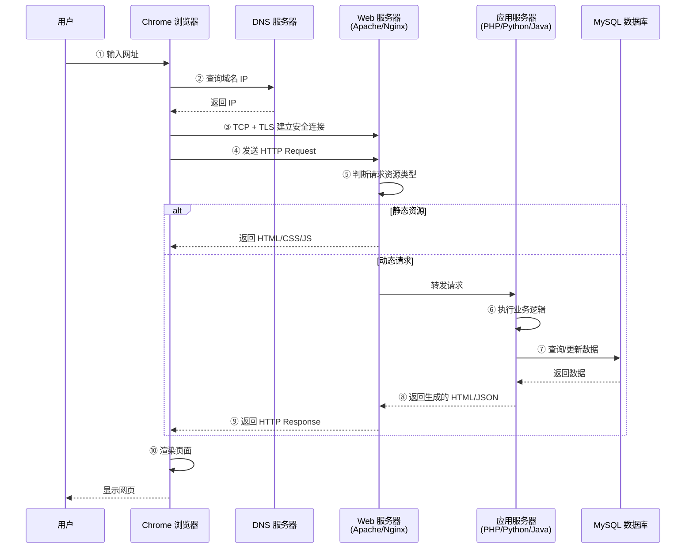

从浏览器搜索百度到返回百度页面的过程，**浏览器没有碰数据库**。因为数据库属于是敏感信息不能暴露给全世界。所以浏览器只能让 PHP 代码帮它查找数据库。而如果此时如果没有对数据库进行校验就出现了 **SQL 注入**。

再比如：WebShell 其实就是浏览器通过 PHP 代码的 `system()` 直接访问 Linux。

其实整个 Web 世界只有两条路：要么爆数据库，要么连接对面的系统

------

## 第二章：为什么 PHP 能控制 Linux？

首先需要明确一点：WebShell 不是 Shell，它只是**远程调用 Linux 命令**。其内部并不存在

假如上传了 PHP 文件：

```php
<?php
system($_GET['cmd']);
?>
```

然后浏览器访问

```
http://xxx/shell.php?cmd=whoami
```

然后：

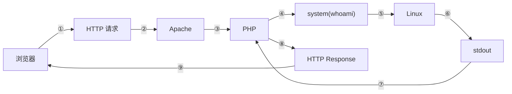

`system()` 其实就是借助 PHP 代码使操作系统帮执行一个程序，执行者不是攻击者，而是 PHP 代码。

而 WebShell 的形式询问 `whoami` 的身份是 www-data。因为浏览器不能登录 Linux，所以浏览器只能找 Apache。而 Apache 是 www-data 运行的，所以返回 www-data。

在 WebShell 后需要上传一个更强的 Reverse Shell （反弹木马）目的是获取真正终端（临时终端只能用少量命令）。真正从通过 Apache 到 Linux **主动**建立 TCP 连接攻击者的质变。

*真终端（TTY）："告诉 Linux：现在坐在终端前的是一个真用户（www-data 是假用户）。"*

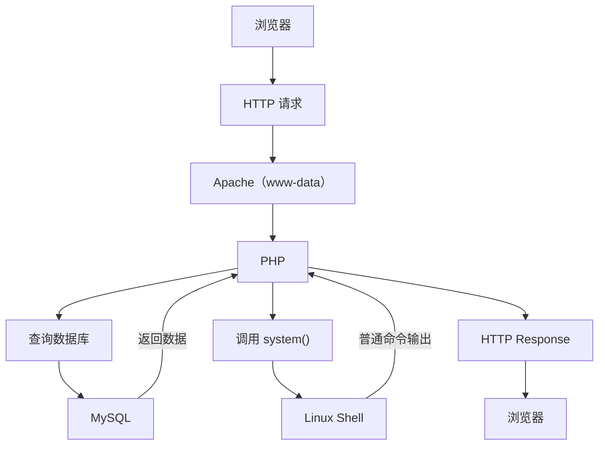

这章的最后，请思考：

>  通过 WebShell 传输 `system("whoami")` 返回的是 `www-data`，如果 Apache 是 root 身份运行，会发生什么？

这不是一个坑，而是 Linux 服务安全设计的核心。为什么几乎所有 Web 服务都会尽量以 `www-data`、`nginx` 这类低权限用户运行，而不是一直用 root？

这就是**Principle of Least Privilege（最小权限原则）**，以及为什么一台服务器即使 Web 被攻破，也不一定意味着整台机器都失守。

------

## 第三章：到底是谁在执行程序？

Linux、Web、安全、内网其实都围绕着 "进程" 转。这也是**整个计算机最重要的概念之一**。

日常打开电脑，双击 Weixin.exe 或 QQ.exe 程序	*再或者是快捷方式，别当杠精* 😤

是谁在运行？

并非是 QQ 运行，而是一个进程（Process）。

而 Apache 就几乎等于 Windows 系统的程序，启动后就是一个进程。等待浏览器访问，一个一直等待请求的进程。

浏览器访问网站的时，Apache 进程 $→$ `accept()` $→$ 收到连接 $→$ 处理请求 $→$ 继续等待

所以 Apache 一直活着。

PHP 怎么执行？

假设有：index.php，浏览器访问 Apache 发现 PHP 于是它启动 PHP（PHP 代码也属于是一个程序，所以相当于是又开启了一个进程）

system() 又发生了什么？

PHP 执行 `system("whoami");`

于是 Linux 又创建了一个新的进程：sh（运行 `whoami` 命令）

所以一次 WebSell 形式执行 whoami 需要 Chrome + Apache + PHP + sh + whoami 这5个进程。

Linux 管理的不是程序，也不是文件，而是**进程。**

所以，看 `ps aux` 其实就是在看：现在谁在运行？

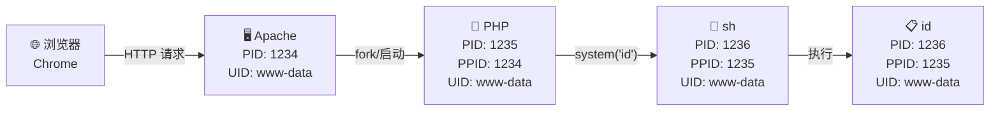

------

## 第四章：Linux 进程是怎么诞生的？

WebShell 能执行命令；Reverse Shell 能拿到真 Shell；木马启动后能干事情；SUID 能变 root。这一切都建立在这三个东西上：**`fork()、execve()、wait()`**

Linux 几乎不会凭空创建一个新程序。它的思想非常简单：首先复制一个已有进程，然后修改它，最后运行新的程序

### fork：复制自己

假设现在有：

```text
bash
PID=1000
用户=kevin
```

当在 bash 中输入 `ls`

它并不会直接加载 `ls`，而是先调用 `fork()`，并出现两个系统进程

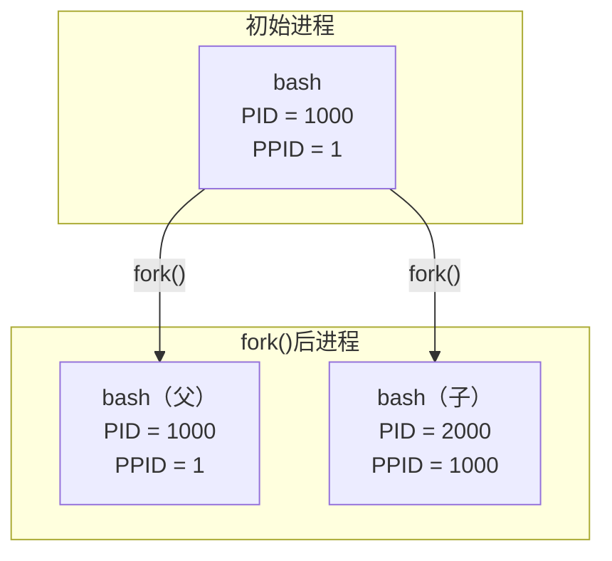

这两个 bash 几乎一模一样。它们拥有：

- 相同代码
- 相同环境变量
- 相同权限
- 相同当前目录

这就是 fork = 复制当前进程

### execve：换成另一个程序

但是问题来了：现在两个 bash，我要运行 `ls` 怎么办？

于是，子进程执行 `execve()` $→$ PID=2000 的 bash 被替换，变成：

```text
ls
PID=2000
```

注意：`execve()` 只是改变进程内容，并非创建进程

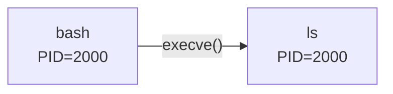

### wait：父亲等待孩子

那么原来的 bash 干嘛？

它等待 `ls` 结束。

------

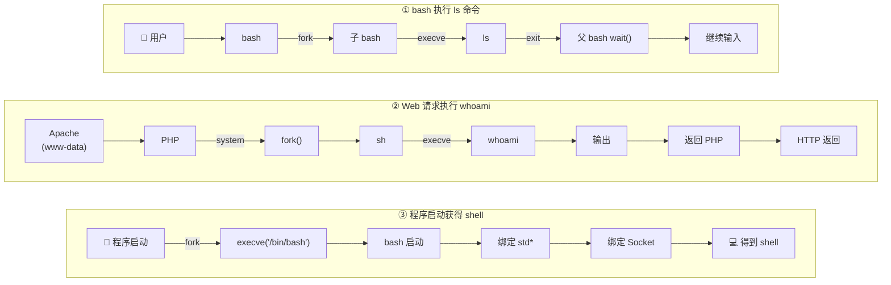

| 维度            | 流程一           | 流程二            | 流程三            |
| :-------------- | :--------------- | :---------------- | :---------------- |
| **场景**        | 交互式 Shell     | Web 后端执行命令  | 反弹 Shell / 后门 |
| **父进程**      | bash（用户终端） | Apache/PHP        | 程序本身          |
| **子进程**      | bash → ls        | sh → whoami       | bash              |
| **execve 目标** | `/usr/bin/ls`    | `/usr/bin/whoami` | `/bin/bash`       |
| **IO 绑定**     | 终端 TTY         | 返回 PHP 输出     | 网络 Socket       |
| **结果**        | 显示在当前终端   | HTTP 响应返回     | 远程控制 Shell    |

为什么攻击者喜欢拿到 Shell？因为它就是一个命令解释器进程，提权后改变进程身份，之后所有操作继承 root。

*这章有点扯偏了*

------

## 第五章：客户端—服务器架构

先建立一个最重要的世界观。现在互联网绝大多数东西都是：

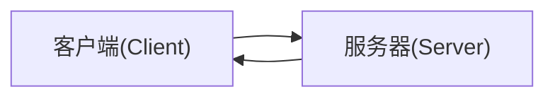

> 什么是客户端？

发起请求的一端就叫客户端。

例如：

- 网页：浏览器 Chrome。请求：我要百度首页。
- 游戏客户端：LOL.exe，原神.exe。请求：我要登录！我要移动！我要攻击！
- 手机 App：微信。请求：发送消息；查看朋友圈；上传图片。

> 什么是服务器？

等待请求，并提供服务的一方。

例如：

- Web：Nginx、Apache、Tomcat
- 游戏：Game Server
- 数据库：MySQL、Redis

服务器负责保存 用户数据、账号、好友关系、消息、图片 等信息。客户端仅显示信息。

------

## 第六章：客户端是不可信的

为什么？

这是一个非常重要的概念，也是很多漏洞的核心。

客户端在用户手里。拿游戏外挂举例。

*此处再次声明：不要在现实环境尝试加外挂！单机的但连接服务器端的也不可以，别问我为什么知道的。* 😭

*如果真的想试试就请拿本地单机游戏或荒废的网络游戏练习。内存修改：CE。抓包注入：WPE。*

假设客户端打一下怪，向服务器发送 attack monster 的包，然后服务器收到并计算 攻击力 + 装备 + 技能 + 暴击，得到伤害500。然后服务器修改：Boss HP -500，最后返回 Boss 掉血。

这是一个正常的流程。

但是如果客户端打一下怪，但是向服务器瞬间发送了100个 attack monster 的包，这时如果后端服务器没有做校验，那最终计算的结果就是 Boss 的血量 -50000 了。（每一个包都 -500，直接算的总和）

这就是业务漏洞。

------

Web 本质也是客户端服务器，只是 Web 客户端比较固定，服务器比较复杂。比如说：Apache、PHP、MySQL。

Web 客户端服务器最核心的问题：谁保存状态？

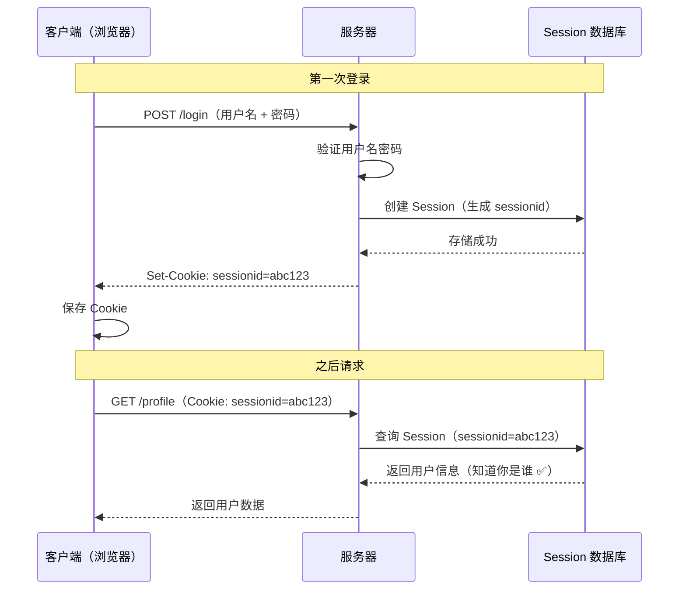

| 步骤             | 第一次登录              | 之后请求            |
| :--------------- | :---------------------- | :------------------ |
| **客户端发送**   | 用户名 + 密码           | Cookie（sessionid） |
| **服务器操作**   | 验证身份 → 创建 Session | 查询 Session        |
| **存储操作**     | 写入 Session 数据库     | 读取 Session 数据库 |
| **返回给客户端** | Set-Cookie 指令         | 业务数据            |
| **客户端状态**   | 保存 Cookie             | 携带 Cookie 访问    |

那安全问题在哪里？

就在客户端和服务器之间。

例如：

**1. 身份认证问题**

服务器完全相信 Cookie，会出现 Cookie 伪造。

**2. 权限问题**

服务器只判断登录用户但忘记判断是不是管理员，于是就会出现越权。

**3. 数据问题**

服务器直接相信客户端传来的 price=-1 （某商品价格为-1）的业务漏洞。

**这就是为什么 Web 安全其实研究：**

从 **客户端** 到 **通信** 再到 **服务器** 及 **数据库** 之间的信任问题。

------

再回到内网，内网渗透也是客户端服务器。

因为公司内部也是 员工电脑 $→$ 服务器

攻击者进入一台机器后，想做的事情不是 "黑所有电脑"，而是从文件中寻找：

- 谁信任谁
- 谁能访问谁
- 谁有更高权限

------

## 第七章：网络通信到底是怎么发生的？

在此之前先回答一个最基本的问题：两台电脑为什么能互相通信？

同一局域网下，`ping 192.168.1.100` ping 另一台设备为什么可以直接 ping 通？

### 第一层：MAC 地址

MAC 是网卡的身份证。

启动电脑设备时，电脑会连接路由器知道自己的 IP 是192.168.1.100，但它不知道路由器的 MAC 是多少。

于是电脑广播询问 MAC。

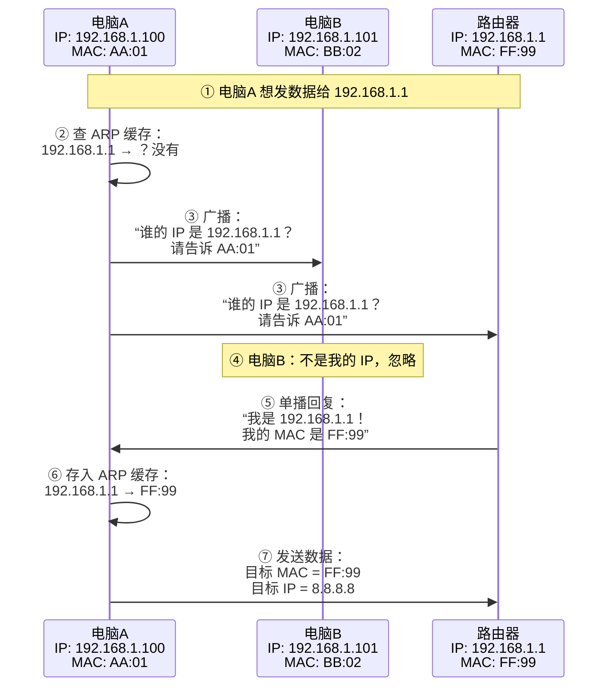

这就是 ARP。

### 第二层：IP

现在知道目标是谁了。

开始封装数据。

比如发送 hello

实际上是：以太网帧 $→$ IP包 $→$ 数据

IP 负责找到哪台机器。类似于邮寄地址。

例如：北京市-朝阳区-某某街-某某号

IP 像这一栋楼的门牌，端口像楼里的门牌号，MAC 像是身份证件。

所以简单理解就是 IP 负责跨网络找机器，而 MAC 负责局域网找网卡。

### 第三层：端口 Port

Nmap 扫描时经常会有什么端口开放服务。

```text
22 ssh
80 apache
3306 mysql
8080 tomcat
```

当访问 web 时输入：

```http
http://192.168.1.3
```

其实是省略了后面的端口，完整输入：

```http
http://192.168.1.3:80
```

### 第四层：TCP

TCP 的三次握手可以确认对话双方是否可以进行下文对话。

Nmap 用的就是 TCP 协议扫描的。

------

## 第八章：TCP/IP 分层是什么？

> 先想一个问题：一根网线为什么能跑 Web、SSH、MySQL 等这么多东西？

在同一网络下，网卡只有一个：eth0，但是上面运行了 Apache、SSH、MySQL、FTP、Samba 而没有任何冲突。

这是因为**不同协议在不同层次处理不同问题。**

理解起来相对复杂，这里借用 wireshark 工具辅助讲解。

**TCP/IP 有四层模型：网络接口层、网络层、传输层、应用层**

还记得第一章吗？从第一章的浏览器，DNS、TCP 开始。

在 wireshark 的捕获开启后，立刻进入 `https://www.baidu.com`，并立即关闭 wireshark 的捕获。

------

先拿 DNS 举例（为了方便看这里只是捕获了部分并非全部请求）：

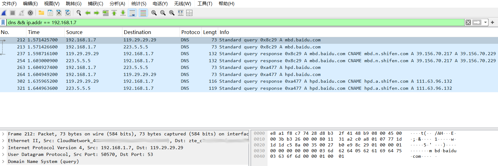

| 字段                     | 含义                                     | 截图里的体现                                                 |
| :----------------------- | :--------------------------------------- | :----------------------------------------------------------- |
| **No.**                  | 包的编号（捕获顺序）                     | 212、213、237... 是按时间先后排列的                          |
| **Time**                 | 捕获时刻                                 | `1.57`秒 左右，说明是抓包开始后 1.57 秒发生的                |
| **Source / Destination** | **源IP**（谁发的）和**目标IP**（发给谁） | `192.168.1.7` 是电脑；`119.29.29.29` 和 `223.5.5.5` 是两个公共 DNS 服务器 |
| **Protocol**             | 协议类型                                 | 全是 **DNS**（域名系统协议）                                 |
| **Info**                 | 简略信息                                 | 记录了**查询类型**（A记录=IPv4地址）和**域名**               |

我们以 212 号包为例，详细拆解。

**第一层：网络接口层 —— 以太网（Ethernet II）**

这是数据在**局域网**里传输时用的“信封”

```text
Ethernet II, Src: CloudNetwork_41:00:00 (00:00:00:00:00:01), 
Dst: zte_c7:00:00 (00:00:00:00:00:02)
```

- **Src（源MAC）**：`00:00:00:00:00:01` 是电脑的**网卡 MAC 地址**。前面的 `CloudNetwork` 是厂商识别名。
- **Dst（目标MAC）**：`00:00:00:00:00:02` 是**路由器（或网关）的 MAC 地址**（`zte` 说明是中兴的路由器）。

**结论**：虽然目的地是互联网上的 `119.29.29.29`，但**数据包第一跳是先发给路由器**（MAC 地址是路由器的）。

**第二层：网络层 —— IP 层（Internet Protocol Version 4）**

这决定了数据最终要从哪寄到哪。

```text
Internet Protocol Version 4, Src: 192.168.1.7, Dst: 119.29.29.29
```

- **Src IP（电脑）**：`192.168.1.7`。这是电脑在局域网里的内网 IP。
- **Dst IP（DNS 服务器）**：`119.29.29.29`。这是腾讯（DNSPod）提供的公共 DNS。

**结论**：电脑想找 `119.29.29.29` 要答案。

**第三层：传输层 —— UDP 层（User Datagram Protocol）**

DNS 查询通常使用 UDP 协议，因为速度快（不用建立连接）。

```text
User Datagram Protocol, Src Port: 50570, Dst Port: 53
```

- **Src Port（源端口）**：`50570`（随机生成的高位端口，用来标识是电脑上哪个程序发的）。
- **Dst Port（目标端口）**：`53`（**DNS 服务器的专用端口**，就像 80 是网页、443 是加密网页一样）。

**结论**：这封信是送往 `119.29.29.29` 的 **53 号窗口（DNS服务）** 的。

**第四层：应用层 —— DNS 层（Domain Name System）**

这是真正要问的内容。

```text
Domain Name System (query)
... 03 6d 62 64 05 62 61 69 64 75 03 63 6f 6d ...
```

- 这部分十六进制翻译过来就是：`3`（长度）`mbd` `.` `5`（长度）`baidu` `.` `3`（长度）`com`
- 翻译成人话就是：**“请问 `mbd.baidu.com` 的 IP 地址（A记录）是多少？”**

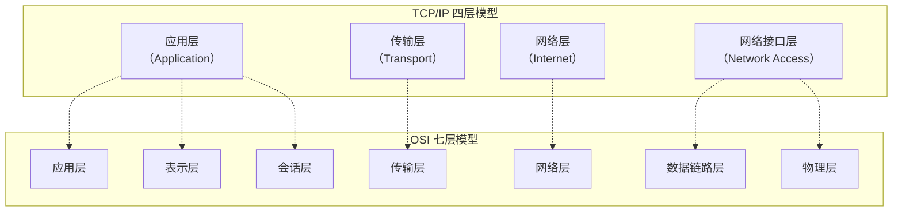

| TCP/IP 四层    | OSI 七层                 | 核心协议/设备                           |
| :------------- | :----------------------- | :-------------------------------------- |
| **应用层**     | 应用层 + 表示层 + 会话层 | HTTP、HTTPS、DNS、FTP、SSH、SMTP、MySQL |
| **传输层**     | 传输层                   | TCP、UDP                                |
| **网络层**     | 网络层                   | IP、ICMP、ARP（部分）                   |
| **网络接口层** | 数据链路层 + 物理层      | 以太网、Wi-Fi、交换机、网卡             |

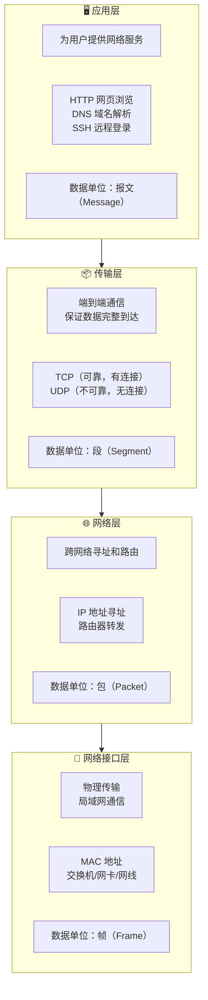

不过，这些包是都发了两份，既发给了 `119.29.29.29`（腾讯）又发给 `223.5.5.5`（阿里）

- **原因**：电脑的网卡或浏览器配置了**多个 DNS 服务器**（通常是主备）。
- **机制**：系统会同时发问（或先问第一个没反应再问第二个），谁先回复就用谁的。
- **结果**：
  - 发给 `119.29.29.29` 的包（No.212）收到了回复（No.237）。
  - 发给 `223.5.5.5` 的包（No.213）收到了回复（No.254）。

随后，在 **237 号包**（响应包）里，`119.29.29.29` 回复了：

```text
Standard query response ... A mbd.baidu.com
```

这个是百度页面。（注意，这个只有页面。后面会再提到）

然后电脑再次询问 `hpd.baidu.com`

随后，在 **302 号包** 回复地址。

而其中的每一层都曾出现过漏洞（举例）：

- **网络层问题**：IP 欺骗。主要关注：IP。
- **传输层问题**：端口暴露。主要关注：TCP/UDP。
- **应用层问题**：Web 漏洞。很多关注点

------

首先，往返一共是8个包，每个请求包发两个服务器。询问了两个地址。其中，第一个问的（询问 `www.baidu.com` 没捕获到但是原理都一样）是百度首页里面会有：

```html


<script src="https://xxx.baidu.com/a.js">

<link href="xxx.css">
```

类似的代码，然后第二个就会问 `hpd.baidu.com`，这里才有百度的功能。

如果是直接访问 39.156.70.217 会显示百度但是页面不存在（是400而并非404）

访问：`http://39.156.70.217/` 等价于访问了某台百度服务器，请求确实到了百度的服务器。

但是，服务器收到请求时，不只看 IP，它还看访问的是哪个网站（Host）。

```http
GET / HTTP/1.1
Host: www.baidu.com
```

而且，39.156.70.217 只是访问到了部分并非全部的百度。想要访问全部百度只能 `https://www.baidu.com`。

如果是输入 `https://39.156.70.217/` 反而会提示 “不安全”。HTTPS = HTTP + 加密。由于是直接访问的 IP 而不是正常途径，所以客户端根本没有什么证书，与服务器的证书相比较肯定不匹配，就导致浏览器显示出了 “不安全”。

------

如果你在阅读时发现了任何错误，请评论或发邮件告诉我，因为错误是学习和发展的一部分！
